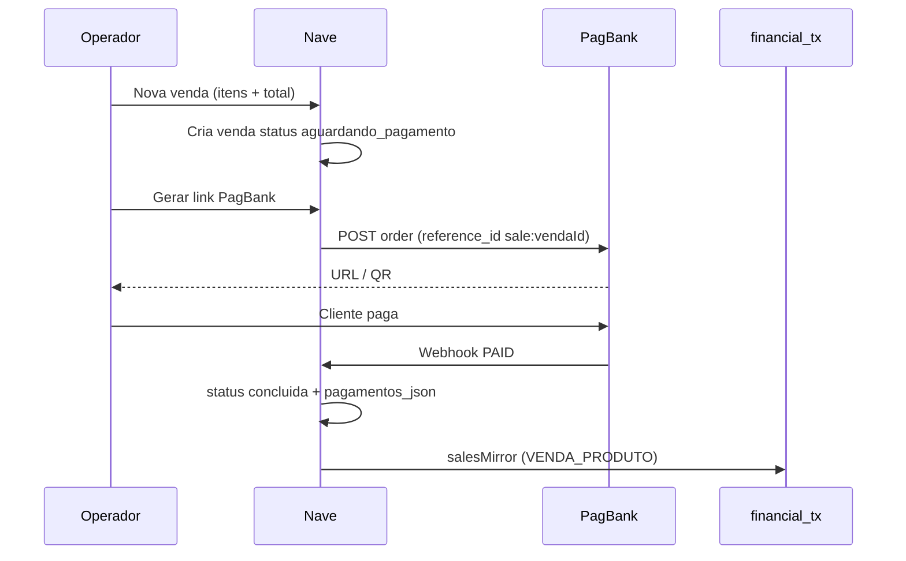

# Integração PagBank — mensalidades, links e conciliação

**Data:** 2026-06-16  
**Status:** Aprovado para implementação (faseada)  
**TECH:** [2026-06-16-pagbank-conciliacao-integracao-TECH.md](./2026-06-16-pagbank-conciliacao-integracao-TECH.md)

**Fluxos relacionados:**

- [financeiro/a-receber-mensalidades.md](../../flows/financeiro/a-receber-mensalidades.md)
- [financeiro/conciliacao-bancaria.md](../../flows/financeiro/conciliacao-bancaria.md)
- [2026-06-15-cobranca-inadimplencia-PRODUCT.md](./2026-06-15-cobranca-inadimplencia-PRODUCT.md)
- [2026-06-15-conciliacao-multi-formato-PRODUCT.md](./2026-06-15-conciliacao-multi-formato-PRODUCT.md)
- [2026-06-16-conciliacao-deduplicacao-extratos-PRODUCT.md](./2026-06-16-conciliacao-deduplicacao-extratos-PRODUCT.md)

---

## Decisões de produto (confirmadas)

| # | Decisão | Implicação |
|---|---------|------------|
| **D1** | Conta PagBank é **Pessoa Jurídica (PJ)** | API de Assinaturas, Checkout e Pedidos em produção são **escopo v1** (após liberação comercial PagBank). Restrição PF não se aplica ao público-alvo. |
| **D2** | Links avulsos incluem **venda de produto** além de mensalidade | `entityType=sale` é **P0** na Fase 2 (links); webhook PAID conclui venda + espelho Caixa via `salesMirror`. |
| **D3** | Assinaturas: plano por valor do aluno/plano Nave (pendente Q2) | Ver §14 — modelo de plano PagBank ainda a definir com operação. |

---

## 1. Problem Statement

Academias usam o **PagBank** em três modalidades operacionais hoje:

| Modalidade | Uso típico na academia | Como entra no Nave hoje |
|------------|------------------------|-------------------------|
| **Maquininha** | Pagamento presencial (crédito/débito/PIX na máquina) | Operador registra manualmente em Mensalidades com método cartão/PIX |
| **Link de pagamento** | Cobrança avulsa enviada por WhatsApp (mensalidade atrasada, taxa, venda) | Operador registra manualmente após confirmar no app PagBank |
| **Assinatura** | Mensalidade recorrente automática no cartão | Operador registra manualmente a cada cobrança bem-sucedida |

O Nave já espelha pagamentos de alunos em **Caixa** (`student_payments` → `financial_tx`) e concilia extratos bancários por **valor + data + conta**. Porém:

1. Não há **ID externo** do PagBank nos lançamentos — o match é frágil quando há taxas, parcelas ou vários recebimentos no mesmo dia.
2. O operador faz **trabalho duplicado**: cobrar no PagBank **e** registrar no Nave.
3. A **liquidação** na conta PagBank (D+N, desconto de taxa) não está ligada à **venda** (D+0) nem à mensalidade do aluno.
4. PagBank aparece só como rótulo de conta bancária (`Pagbank`), sem integração.

**Quem sofre:** owner e recepção que conciliam o caixa; gestores que perdem tempo e cometem erro ao registrar cobranças que já aconteceram no PagBank.

**Custo de não resolver:** horas mensais de conciliação manual, inadimplência fantasma (pago no PagBank, pendente no Nave) ou receita duplicada, e baixa confiança nos relatórios financeiros.

---

## 2. Goals

| # | Objetivo | Como medir |
|---|----------|------------|
| G1 | **Assinatura:** cobrança confirmada no PagBank cria/atualiza mensalidade paga automaticamente | Webhook `subscription.recurrence` (ou equivalente) → `student_payments.status=paid` em ≤60s |
| G2 | **Link:** pagamento avulso confirmado cria mensalidade ou venda conforme intenção | Webhook de pedido/checkout PAID com `reference_id` válido |
| G3 | **Maquininha:** vendas na máquina aparecem no Nave sem digitação manual | Import EDI transacional D+1 associa ≥80% das vendas com `reference_id` ou heurística documentada |
| G4 | **Conciliação determinística** | Lançamento com `gateway_charge_id` faz match score 100 no extrato (fase EDI) |
| G5 | **Multi-tenant seguro** | Credenciais e eventos isolados por `academy_id`; zero vazamento cross-tenant |
| G6 | **Operação híbrida** | Academia pode continuar registrando manualmente; integração não bloqueia fluxo atual |
| G7 | **Zero nova Serverless Function** | Endpoints via `webhooks.js`, `finance.js`, `cron/reset-usage.js?action=` |
| G8 | **Inadimplência coerente** | Pagamento automático remove mês da fila Cobrança após refresh |

---

## 3. Non-Goals (v1)

| Item | Motivo |
|------|--------|
| Substituir o painel PagBank para gestão completa de assinaturas | Escopo alto; v1 foca conciliação e registro automático |
| SDK Android SmartPOS / app de maquininha nativo | Fora do produto web Nave |
| PagBank Connect (OAuth em nome de terceiros) | Complexidade marketplace; cada academia usa token próprio |
| Conciliação 100% sem confirmação humana na liquidação bancária | Liquidação EDI pode exigir revisão de taxa/antecipação |
| Migrar histórico de pagamentos já registrados manualmente | Sem backfill obrigatório |
| Onboarding PagBank para contas **Pessoa Física** | Público-alvo é PJ (D1); PF fora de escopo v1 |
| Split de recebíveis entre múltiplos CNPJs | Caso edge; documentar como manual |
| Novo arquivo em `/api/` | Limite Vercel Hobby 12/12 |

---

## 4. Modelo de negócio (inalterado onde possível)

1. **Valor cobrado do aluno** continua vindo do plano + taxas configuradas na academia (`applyCardFee`, parcelas).
2. PagBank pode cobrar **taxa diferente** da configurada na academia — o Nave registra:
   - **Bruto** = valor pago pelo aluno (charge PagBank).
   - **Taxa gateway** = diferença bruto − líquido (quando EDI financeiro disponível) **ou** estimativa da config até liquidação.
3. **Conta bancária** padrão PagBank na academia (`financeConfig.bankAccounts` com `bankName` contendo Pagbank) é usada no espelho Caixa.
4. Pagamentos automáticos têm `registered_by` = sistema (`PagBank`) e são **editáveis** pelo owner com auditoria (não read-only total).

---

## 5. Convenção `reference_id` (contrato entre Nave e PagBank)

Toda cobrança criada **pelo Nave** (link ou assinatura API) deve levar:

```
nave:{academyId}:{entityType}:{entityId}:{referenceMonth}:{nonce}
```

| Campo | Valores | Exemplo |
|-------|---------|---------|
| `entityType` | `student` \| `sale` \| `lead` | `student` |
| `entityId` | `$id` Appwrite | `67abc…` |
| `referenceMonth` | `YYYY-MM` ou `none` | `2026-06` |
| `nonce` | 8 chars opcional anti-colisão | `a1b2c3d4` |

**Cobranças criadas no painel PagBank (sem Nave):** na v1, associar por EDI + valor/data/aluno sugerido; operador confirma em fila **“Pagamentos PagBank sem vínculo”**.

**Tamanho:** respeitar limite PagBank (tipicamente 64–128 chars); truncar `nonce` se necessário.

---

## 6. User Stories

### Recepção / owner

- **US1:** Quando a assinatura do aluno cobrar no PagBank, quero que a mensalidade do mês apareça como **paga** no Nave sem eu registrar.
- **US2:** Ao enviar **link de pagamento** da mensalidade atrasada, quero gerar o link no Nave e, ao pagar, o status atualizar sozinho.
- **US2b:** Na **Nova venda**, quero gerar link PagBank do total (ou saldo) e, ao pagar, a venda concluir e o Caixa registrar automaticamente — sem reabrir a venda para liquidar.
- **US3:** Vendas na **maquininha** devem entrar na fila de conciliação no dia seguinte para eu só confirmar o vínculo com o aluno.
- **US4:** Na aba Conciliação, quero ver sugestão **“match por PagBank ID”** com score 100 antes de valor/data.
- **US5:** Se o PagBank cobrar e o Nave falhar, quero ver banner **“Pagamentos PagBank pendentes de registro”** com ação de reprocessar.

### Owner (configuração)

- **US6:** Em Minha Academia → Financeiro → PagBank, quero conectar token/API e testar conexão.
- **US7:** Quero escolher se links/assinaturas são criados no Nave ou só conciliados via EDI (modo **híbrido** vs **integrado**).

### Cobrança (inadimplência)

- **US8:** Aluno que pagou via link PagBank deve sair da fila **Cobrança** no mês correspondente.

### Edge cases

- **US9:** Webhook duplicado não cria segundo pagamento (idempotência por `gateway_charge_id`).
- **US10:** Estorno no PagBank marca mensalidade como cancelada/ajustada e estorna espelho Caixa.
- **US11:** Parcela 3x na maquininha → uma venda transacional; Nave registra `installments=3` e taxa coerente.
- **US12:** Assinatura **suspensa/cancelada** no PagBank reflete badge no perfil do aluno (informativo v1).
- **US13:** Academia sem módulo financeiro ignora webhooks (ack 200, no-op).

---

## 7. Comportamento por modalidade

### 7.1 Assinatura (recorrente)

> **Pré-requisito (D1):** conta PJ com API de recorrência liberada pelo PagBank.

| Origem | v1 suportado | Fluxo |
|--------|--------------|-------|
| API Assinaturas (PJ) | Sim (Fase 1–2) | Nave cria plano/assinante/assinatura com `reference_id` |
| Checkout Recorrente | Sim (Fase 2) | Mesmo pipeline de webhook |
| Link Recorrente (painel, sem Nave) | Parcial (Fase 2b) | Webhook/EDI sem `reference_id` → fila de vínculo manual |

**Eventos PagBank relevantes:**

- `subscription.recurrence` — cobrança bem-sucedida → criar `student_payments` pago.
- `subscription` overdue / payment denied — manter pendente; opcional notificação Cobrança.
- `subscription.canceled` / `suspended` — atualizar metadado no aluno.

**Mês de referência:** derivado da data de cobrança + `due_day` do aluno; se ambíguo, usar mês civil da `paid_at`.

### 7.2 Link de pagamento (avulso)

Links avulsos cobrem **mensalidade** e **venda de produto** (D2).

| Origem | v1 suportado | Fluxo |
|--------|--------------|-------|
| Link criado no Nave (Checkout/Orders API) | Sim (Fase 2) | `reference_id` com `entityType=student` ou `sale` |
| Link criado no painel PagBank | Parcial | EDI + fila de vínculo |
| Link recorrente (primeira cobrança) | Tratado como assinatura | Ver §7.1 |

**Intenções (`entityType`):**

| `entityType` | Contexto | Webhook PAID → Nave |
|--------------|----------|---------------------|
| `student` + `referenceMonth` | Mensalidade / Cobrança | `student_payments` pago + espelho mensalidade |
| `sale` | Nova venda ou venda a receber | Venda `concluida` + `pagamentos_json` com forma PagBank + `mirrorMixedPaymentsForCategory` |

**Fluxo venda com link (D2):**



- Venda criada para link fica em **`aguardando_pagamento`** (novo status ou equivalente a rascunho com flag `gateway_pending`) até webhook ou expiração.
- **Não** duplicar estoque/caixa: movimentação de estoque segue regra atual da venda (no commit ou no pagamento — alinhar à implementação existente em `salesCreateHandler`).
- Venda **a receber** existente: link pelo saldo restante; `reference_id` aponta para o mesmo `saleId`.

**UI (Fase 2):**

| Tela | Ação |
|------|------|
| Mensalidades / Cobrança | **Gerar link PagBank** no modal de pagamento |
| Nova venda (`SalesNewSaleTab`) | **Receber via link PagBank** (alternativa a pagamento manual) |
| Detalhe venda a receber | **Gerar link** do saldo |
| Todas | URL + copiar + WhatsApp + status pendente/pago/expirado |

### 7.3 Maquininha (presencial)

| Realidade PagBank | Implicação no Nave |
|-------------------|-------------------|
| Venda na máquina **não** envia webhook customizado para URL da academia (fluxo tradicional) | v1 depende de **API EDI transacional** (D+1) |
| TID / código de venda no comprovante | Armazenar em `gateway_transaction_id` após match |
| PIX na máquina | Método `pix`; crédito parcelado → `installments` |

**Fluxo v1:**

1. Cron noturno importa movimentos **transactional** do dia D-1.
2. Para cada venda sem `reference_id`, criar item na fila **“Vendas maquininha — revisar”** com sugestão de **aluno** (mensalidade) ou **venda aberta** (produto) por valor ± taxa e data.
3. Operador confirma vínculo → cria `student_payments` **ou** conclui venda + espelho produto.
4. Quando EDI **financial** liquidar, conciliação bancária usa `gateway_charge_id` para match determinístico.

**Fase futura (P2):** se academia usar SmartPOS com integração, reavaliar webhook dedicado.

---

## 8. Requisitos por fase

### Fase 0 — Fundação (P0)

| ID | Requisito | Aceite |
|----|-----------|--------|
| R0.1 | Seção **PagBank** em Minha Academia → Financeiro | Token pedidos, token EDI (opcional), ambiente sandbox/prod |
| R0.2 | Teste de conexão | Botão “Testar” chama API PagBank e mostra sucesso/erro |
| R0.3 | Schema gateway em `student_payments` e `financial_tx` | Campos §9 TECH |
| R0.4 | Tabela/collection `gateway_events` (idempotência) | Evento duplicado ignorado |
| R0.5 | Roteamento webhook `POST /api/webhooks?provider=pagbank` | Sem novo arquivo `/api/` |
| R0.6 | Feature flag por academia `financeConfig.pagbank.enabled` | Desligado = no-op |

### Fase 1 — Webhook assinatura + mensalidade automática (P0)

| ID | Requisito | Aceite |
|----|-----------|--------|
| R1.1 | Processar `subscription.recurrence` (pago) | Cria ou atualiza pagamento `paid` |
| R1.2 | Idempotência `gateway_charge_id` | Segundo webhook não duplica |
| R1.3 | Espelho Caixa automático | `financial_tx` com `gateway_*` preenchido |
| R1.4 | Método de pagamento inferido | Cartão → `cartão_crédito`; PIX → `pix` |
| R1.5 | Banner fila pendentes | Contador na aba A receber se eventos falharam |
| R1.6 | Reprocessar manual | Owner clica “Reprocessar” no evento |

### Fase 2 — Link de pagamento pelo Nave (P0)

| ID | Requisito | Aceite |
|----|-----------|--------|
| R2.1 | Criar checkout/pedido com `reference_id` e `notification_urls` | URL retornada ao operador |
| R2.2a | Webhook PAID + `entityType=student` | Mensalidade paga + espelho |
| R2.2b | Webhook PAID + `entityType=sale` (D2) | Venda `concluida` + `pagamentos_json` + `salesMirror` |
| R2.3 | Status do link na UI | Pendente até webhook ou polling de fallback |
| R2.4 | Expiração / cancelamento | Link expirado não cria pagamento; venda aguardando volta a editável |
| R2.5 | Cobrança + Nova venda: botão link PagBank | WhatsApp com URL (opcional) |
| R2.6 | Venda aguardando pagamento | Status intermediário documentado; não aparece como concluída no fechamento |
| R2.7 | Idempotência venda | Segundo webhook não duplica `financial_tx` (padrão `salesMirror` already-check) |

### Fase 3 — EDI maquininha + conciliação (P1)

| ID | Requisito | Aceite |
|----|-----------|--------|
| R3.1 | Cron `pagbank-edi-sync` diário | Importa transactional D-1 por academia habilitada |
| R3.2 | Fila “Maquininha — revisar” | Lista vendas sem vínculo |
| R3.3 | Match determinístico na Conciliação | `gateway_charge_id` = score 100 |
| R3.4 | Import EDI financial para liquidação | Linha bancária ↔ TX já registrada |
| R3.5 | Deduplicação com extrato manual | Mesma regra [deduplicação extratos](./2026-06-16-conciliacao-deduplicacao-extratos-PRODUCT.md) |

### Fase 4 — Criar assinatura pelo Nave (P1)

| ID | Requisito | Aceite |
|----|-----------|--------|
| R4.1 | Wizard “Ativar débito automático PagBank” no perfil do aluno | Conta PJ (D1) + API liberada |
| R4.2 | Plano Nave ↔ plano PagBank (valor, intervalo mensal) | Criação na matrícula opcional |
| R4.3 | Cancelar/suspender do perfil | Chama API PagBank + atualiza metadado |

### Fase 5 — Polish (P2)

| ID | Requisito |
|----|-----------|
| R5.1 | Dashboard KPI “Recebido via PagBank (mês)” |
| R5.2 | Export CSV eventos gateway |
| R5.3 | Homologação EDI como conciliador (processo PagBank) |

---

## 9. UX — telas e estados

### Minha Academia → Financeiro → PagBank

```
┌─ PagBank ─────────────────────────────────────────┐
│ [x] Ativar integração PagBank                      │
│ Ambiente: ( ) Sandbox  (•) Produção               │
│ Token API Pedidos: [••••••••] [Testar]            │
│ Token API EDI:     [••••••••] [Testar] (opcional) │
│ Conta padrão:      [Pagbank · ••••]               │
│ Modo: (•) Híbrido  ( ) Links/assinaturas pelo Nave │
│ Webhook URL (copiar): https://…/webhooks?provider=pagbank │
└───────────────────────────────────────────────────┘
```

### Mensalidades — modal de pagamento (extensão)

- Novo método visual: **“Link PagBank”** (não substitui PIX/cartão manual).
- Ao escolher: botão **Gerar link** → exibe URL + copiar + WhatsApp.
- Status: aguardando / pago (auto) / expirado.

### Nova sub-seção: Financeiro → PagBank (owner)

Rota proposta: `/financeiro?tab=pagbank` ou seção em Conciliação.

| Aba | Conteúdo |
|-----|----------|
| **Pendentes** | Eventos webhook falhos + vendas maquininha sem vínculo |
| **Histórico** | Últimos 90 dias de eventos processados |
| **Links ativos** | Links aguardando pagamento |

### Badges

- Mensalidade paga via PagBank: ícone/badge **“PagBank”** na grade.
- Perfil aluno: **“Assinatura PagBank ativa”** / **“Suspensa”**.

---

## 10. Permissões

| Papel | Config PagBank | Gerar link | Confirmar maquininha | Reprocessar webhook |
|-------|----------------|------------|----------------------|---------------------|
| **owner** | Sim | Sim | Sim | Sim |
| **admin** | Não | Sim | Sim | Não |
| **member** | Não | Sim (Mensalidades) | Não | Não |

---

## 11. Success Metrics

| Métrica | Meta 90 dias pós Fase 2 |
|---------|-------------------------|
| % mensalidades PagBank registradas automaticamente | ≥ 70% (assinatura + link Nave) |
| Tempo médio owner na conciliação PagBank | −50% vs baseline manual |
| Duplicatas pagamento (mesmo `gateway_charge_id`) | 0 |
| Eventos webhook falhos não reprocessados >24h | < 5% |

---

## 12. Riscos e mitigação

| Risco | Mitigação |
|-------|-----------|
| Liberação comercial API PagBank (PJ) | Iniciar sandbox cedo; checklist onboarding PagBank no setup |
| Token EDI exige homologação | Fase 3 bloqueada até token; Fases 1–2 não dependem de EDI |
| Venda aguardando link vs estoque | Alinhar ao `salesCreateHandler` (estoque no commit ou no pagamento) |
| Webhook atrasado | Polling fallback 15 min (cron) consulta status do pedido/assinatura |
| Valor com taxa divergente da academia | Registrar bruto real; `fee` do gateway sobrescreve estimativa quando EDI chegar |
| Limite 12 functions Vercel | Rotas consolidadas documentadas na TECH |

---

## 13. Validação / harness

Comandos alvo pós-implementação:

```bash
npm test -- pagbankGateway pagbankWebhook pagbankEdi bankReconciliationMatcher
```

Checklist manual:

1. [ ] Academia com PagBank sandbox conectado
2. [ ] Assinatura de teste dispara webhook → mensalidade paga
3. [ ] Link mensalidade sandbox → mensalidade paga
3b. [ ] Link venda produto sandbox → venda concluída + lançamento Caixa
4. [ ] Webhook duplicado não duplica pagamento
5. [ ] Maquininha simulada via fixture EDI → fila revisão → confirmar vínculo
6. [ ] Conciliação: match por `gateway_charge_id` score 100
7. [ ] Academia B não vê eventos da academia A

---

## 14. Perguntas abertas

| # | Pergunta | Status |
|---|----------|--------|
| Q1 | Conta PagBank PF ou PJ? | **Resolvido: PJ (D1)** |
| Q2 | Assinaturas: um plano PagBank por academia ou plano por valor/aluno? | Aberto — Operação |
| Q3 | Maquininha: Moderninha/Smart com código na tela ou só comprovante? | Aberto — Operação |
| Q4 | Links avulsos incluem venda de produto? | **Resolvido: sim (D2)** |

---

## 15. Rollout

1. **Alpha:** 1–2 academias PJ, sandbox, Fase 0–1 (webhook assinatura).
2. **Beta:** Fase 2 (links mensalidade + **venda produto**).
3. **GA:** Fase 3 EDI (maquininha) + Fase 4 assinatura pelo perfil; changelog + ajuda na Conciliação.
