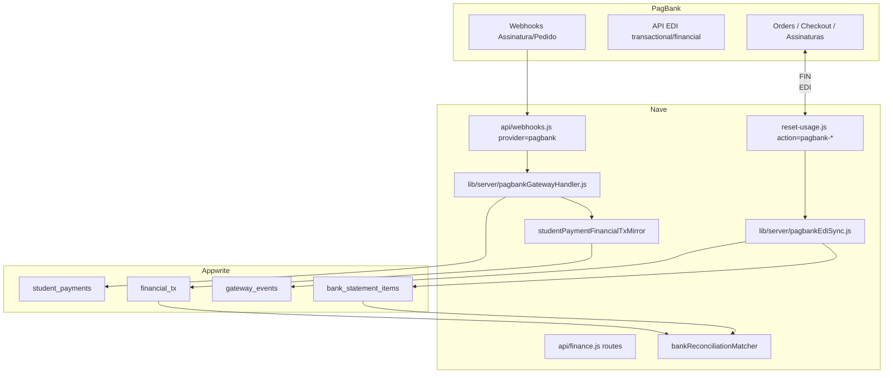

# Integração PagBank — TECH Spec

**Data:** 2026-06-16  
**PRODUCT:** [2026-06-16-pagbank-conciliacao-integracao-PRODUCT.md](./2026-06-16-pagbank-conciliacao-integracao-PRODUCT.md)

**Decisões incorporadas:** conta **PJ** (API recorrência + pedidos em v1); links avulsos incluem **`entityType=sale`** (venda de produto).

---

## 1. Visão de arquitetura



**Princípios:**

- Reutilizar padrões do billing Asaas (`webhookHandlers.js`, `webhookQueue.js`, idempotência).
- **Não** misturar billing Nave (Asaas) com PagBank academias — stores/collections distintos.
- Credenciais PagBank em `academy.financeConfig.pagbank` (nunca `NEXT_PUBLIC_*`).
- Mensalidades continuam em `student_payments`; PagBank é **origem**, não substituto do modelo.

---

## 2. APIs PagBank utilizadas

| API | Uso no Nave | Auth |
|-----|-------------|------|
| **Assinaturas** (`api.assinaturas.pagseguro.com`) | Webhooks recorrência; Fase 4 criar assinatura | Bearer token recorrência |
| **Pedidos** (`api.pagseguro.com/orders`) | Links avulsos; `notification_urls` | Bearer token pedidos |
| **Checkout** (alternativa a Orders) | Link de pagamento simplificado | Mesmo token |
| **EDI** (`edi.api.pagbank.com.br`) | Maquininha D+1; liquidação | Token EDI separado |
| **Notificações legadas v3** | Fallback se conta antiga | `notificationCode` + consulta GET |

**Restrição documentada:** API Assinaturas produção exige liberação comercial PagBank + conta PJ.

---

## 3. Novos módulos

| Arquivo | Responsabilidade |
|---------|------------------|
| `lib/pagbank/pagbankClient.js` | HTTP client pedidos + assinaturas (sandbox/prod base URL) |
| `lib/pagbank/pagbankEdiClient.js` | Client EDI paginado por dia |
| `lib/pagbank/referenceId.js` | `buildNaveReferenceId`, `parseNaveReferenceId` |
| `lib/pagbank/chargeStatus.js` | Map status PagBank → `paid` \| `pending` \| `failed` \| `refunded` |
| `lib/server/pagbankGatewayHandler.js` | Orquestra webhook → pagamento mensalidade **ou** venda |
| `lib/server/pagbankSaleFromGateway.js` | Conclui venda + `pagamentos_json` + `mirrorMixedPaymentsForCategory` |
| `lib/server/pagbankWebhookHandlers.js` | Handlers por `event` / tipo notificação |
| `lib/server/pagbankCreateLink.js` | Cria order/checkout com `reference_id` |
| `lib/server/pagbankEdiSync.js` | Cron: import transactional/financial |
| `lib/server/pagbankGatewayStore.js` | CRUD `gateway_events`, idempotência |
| `lib/server/pagbankReconcileQueue.js` | Fila vendas maquininha sem vínculo |
| `src/lib/pagbankApi.js` | Client browser → `finance.js` routes |
| `src/components/finance/PagbankIntegrationSection.jsx` | Config em Minha Academia |
| `src/components/finance/PagbankPendingTab.jsx` | Fila pendentes (owner) |
| `src/components/finance/PagbankLinkPanel.jsx` | UI link em Mensalidades / Cobrança |
| `src/components/sales/PagbankSaleLinkPanel.jsx` | UI link em Nova venda / detalhe venda |
| `scripts/provision-pagbank-gateway-schema.mjs` | Atributos Appwrite + `sales.gateway_*` opcionais |

---

## 4. Alterações em arquivos existentes

| Arquivo | Mudança |
|---------|---------|
| `api/webhooks.js` | `provider=pagbank` → `handlePagbank` |
| `api/finance.js` | Rotas `pagbank-test`, `pagbank-create-link`, `pagbank-pending`, `pagbank-reprocess` |
| `api/cron/reset-usage.js` | `action=pagbank-edi-sync`, `action=pagbank-poll-pending` |
| `vercel.json` | Cron entries + rewrites se necessário |
| `lib/server/studentPaymentsHandler.js` | Aceitar `gateway_*` read-only em updates manuais |
| `lib/server/studentPaymentFinancialTxMirror.js` | Persistir `gateway_charge_id`, `gateway_fee` |
| `lib/server/bankReconciliationMatcher.js` | `scoreByGatewayId` prioridade sobre fuzzy |
| `src/hooks/useFinanceConfigState.js` | Estado `pagbank` |
| `src/lib/financeConfigValidation.js` | Validar tokens quando enabled |
| `lib/server/salesCreateHandler.js` | Status `aguardando_pagamento`; criar venda rascunho para link |
| `lib/server/salesMirror.js` | Reutilizar `mirrorMixedPaymentsForCategory` no webhook venda |
| `src/components/sales/SalesNewSaleTab.jsx` | Ação “Receber via link PagBank” |
| `src/components/sales/SaleDetailModal.jsx` | Link do saldo em venda a receber |
| `src/components/finance/MensalidadesPanel.jsx` | Botão gerar link |
| `src/components/finance/FinanceiroConfigTab.jsx` | Seção PagBank |
| `src/lib/paymentMethods.js` | Canônico `link_pagbank` em vendas; storage `outro` + metadata `via_pagbank` |
| `docs/flows/financeiro/conciliacao-bancaria.md` | Atualizar no mesmo PR (governança) |
| `docs/flows/financeiro/a-receber-mensalidades.md` | Link PagBank no mapa de telas |

**Proibido:** novo arquivo em `/api/*.js` (raiz).

---

## 5. Schema Appwrite

### 5.1 `student_payments` (novos atributos opcionais)

| Campo | Tipo | Descrição |
|-------|------|-----------|
| `gateway_provider` | string(16) | `pagbank` |
| `gateway_charge_id` | string(64) | ID cobrança/charge (único por provider) |
| `gateway_order_id` | string(64) | Order/checkout id |
| `gateway_subscription_id` | string(64) | Assinatura PagBank |
| `gateway_channel` | string(16) | `subscription` \| `link` \| `pos` |
| `gateway_fee` | float | Taxa PagBank (líquido conhecido) |
| `gateway_paid_gross` | float | Valor bruto charge |
| `gateway_synced_at` | datetime | Última sync webhook/EDI |

Índice único composto (lógica app): `(academy_id, gateway_provider, gateway_charge_id)`.

Padrão **strip unknown attribute** se schema não provisionado (igual `installments`).

### 5.2 `financial_tx` (novos atributos opcionais)

| Campo | Tipo |
|-------|------|
| `gateway_provider` | string(16) |
| `gateway_charge_id` | string(64) |
| `gateway_settlement_id` | string(64) | ID liquidação EDI financial |

### 5.3 Collection `gateway_events` (nova)

| Campo | Tipo |
|-------|------|
| `academy_id` | string |
| `provider` | string | `pagbank` |
| `event_id` | string | Idempotência (webhook id ou hash payload) |
| `event_type` | string |
| `channel` | subscription \| link \| pos \| edi |
| `payload_json` | string(10000) |
| `status` | pending \| processed \| failed \| ignored |
| `error` | string(2000) |
| `payment_id` | string? |
| `financial_tx_id` | string? |
| `gateway_charge_id` | string? |
| `processed_at` | datetime |

Permissões: server-only write; owner read via API.

### 5.4 `academy.financeConfig.pagbank` (JSON embutido)

```json
{
  "enabled": false,
  "environment": "sandbox",
  "ordersTokenEnc": "...",
  "subscriptionsTokenEnc": "...",
  "ediTokenEnc": "...",
  "webhookSecret": "...",
  "defaultBankAccountLabel": "Pagbank",
  "mode": "hybrid",
  "ediLastSyncedDate": "2026-06-15",
  "pollPendingLinks": true
}
```

Tokens criptografados server-side (`encryptFinanceSecret` / padrão existente se houver; senão AES-GCM com `FINANCE_SECRETS_KEY`).

### 5.5 `sales` (novos atributos opcionais)

| Campo | Tipo | Descrição |
|-------|------|-----------|
| `gateway_provider` | string(16) | `pagbank` |
| `gateway_order_id` | string(64) | Order/checkout ativo |
| `gateway_charge_id` | string(64) | Última charge paga |
| `gateway_link_url` | string(512) | URL pendente (UX) |
| `gateway_link_expires_at` | datetime | |

Status de venda: adicionar **`aguardando_pagamento`** (ou `status` + `payment_pending: true` se migrar status for caro).

---

## 6. `reference_id` — implementação

```javascript
// lib/pagbank/referenceId.js

const PREFIX = 'nave';
const VERSION = '1';

export function buildNaveReferenceId({
  academyId,
  entityType, // student | sale | lead
  entityId,
  referenceMonth, // YYYY-MM | null
  nonce,
}) {
  const month = referenceMonth || 'none';
  const n = nonce || randomBytes(4).toString('hex');
  return [PREFIX, VERSION, academyId, entityType, entityId, month, n].join(':');
}

export function parseNaveReferenceId(ref) {
  const parts = String(ref || '').split(':');
  if (parts[0] !== PREFIX) return null;
  const [, ver, academyId, entityType, entityId, referenceMonth, nonce] = parts;
  if (!academyId || !entityType || !entityId) return null;
  return {
    version: ver,
    academyId,
    entityType,
    entityId,
    referenceMonth: referenceMonth === 'none' ? null : referenceMonth,
    nonce,
  };
}
```

**Limite PagBank:** se `reference_id` > 64 chars, usar hash curto + lookup em `gateway_events.pending_context`.

---

## 7. Webhooks

### 7.1 Roteamento

```
POST /api/webhooks?provider=pagbank
Header: x-pagbank-signature (ou validação documentada PagBank)
```

Implementar em `api/webhooks.js` espelhando `handleAsaas`:

- Rate limit por IP.
- Secret por academia **ou** secret global + `academy_id` no payload/reference.
- `runWebhookJobWithRetry('pagbank', payload, processPagbankWebhook)`.

### 7.2 Assinaturas — eventos

| Evento PagBank | Ação Nave |
|----------------|-----------|
| `subscription.recurrence` (pago) | `upsertStudentPaymentFromGateway` |
| `subscription` payment denied | manter/criar `pending`; opcional evento Cobrança |
| `subscription.canceled` | `student.pagbank_subscription_status=canceled` |
| `subscription.suspended` | `suspended` |
| Estorno webhook | `reversePaymentFromGateway` |

### 7.3 Pedidos / Checkout

| Status charge | Ação |
|---------------|------|
| `PAID` / `CONFIRMED` | registrar pagamento |
| `DECLINED` / `CANCELED` | ignorar ou marcar falha |
| `REFUNDED` | estornar |

**Notificação legada v3:** se body tiver `notificationCode`, GET na API de notificação e normalizar para o mesmo pipeline.

### 7.4 Despacho por `entityType`

```javascript
export async function processPagbankPaidCharge({ academyId, parsedRef, charge, channel }) {
  if (!parsedRef) return enqueueUnlinked({ academyId, charge, channel });

  if (parsedRef.entityType === 'student') {
    return upsertStudentPaymentFromGateway({ academyId, parsedRef, charge, channel });
  }
  if (parsedRef.entityType === 'sale') {
    return completeSaleFromGateway({ academyId, parsedRef, charge, channel });
  }
  return enqueueUnlinked({ academyId, charge, channel });
}
```

### 7.5 Venda (`entityType=sale`) — `completeSaleFromGateway`

Arquivo: `lib/server/pagbankSaleFromGateway.js`

1. Carregar venda por `parsedRef.entityId`; validar `academy_id`.
2. Idempotência: se `gateway_charge_id` já espelhado em `financial_tx` para `origin_id=vendaId`, return.
3. Montar `pagamentosNorm`:

```javascript
[{
  forma: 'link_pagbank', // canônico vendas; exibir "Link PagBank"
  valor: charge.amountBrl,
  troco: 0,
}]
```

4. Atualizar venda: `status: 'concluida'`, `forma_pagamento`, `pagamentos_json`, `gateway_*`.
5. Chamar `mirrorMixedPaymentsForCategory` de `salesMirror.js` com `categoryKey: 'VENDA_PRODUTO'`, `bankAccount` = conta PagBank default.
6. Gravar `gateway_charge_id` / `gateway_fee` no `financial_tx` criado (patch pós-mirror).
7. Auditoria: mesmo evento de venda concluída que fluxo manual.

**Venda criada só para link:** `salesCreateHandler` aceita `payment_mode: 'pagbank_link'` → persiste itens + total, **não** exige `pagamentos` no POST; retorna `saleId` para `pagbank-create-link`.

**Estorno:** `reverseSaleFromGateway` — status `cancelada` ou estorno parcial conforme regra `sales` existente; estornar TX espelho.

### 7.6 Pipeline mensalidade (inalterado)

```javascript
// lib/server/pagbankGatewayHandler.js (pseudocódigo)

export async function upsertStudentPaymentFromGateway({
  academyId,
  parsedRef,
  charge,
  channel,
}) {
  await assertIdempotent(academyId, charge.id);

  const existing = await findPaymentByGatewayCharge(academyId, charge.id);
  if (existing?.status === 'paid') return existing;

  const payload = buildStudentPaymentFromCharge({ parsedRef, charge, channel });
  const doc = existing
    ? await updatePayment(existing.$id, payload)
    : await createPayment(payload);

  await mirrorStudentPaymentToFinancialTx(doc, { financeConfig });
  await markGatewayEventProcessed(charge.id, doc.$id);
  return doc;
}
```

`buildStudentPaymentFromCharge`:

- `method` ← map `charge.payment_method` (CREDIT_CARD → `cartão_crédito`, PIX → `pix`, DEBIT → `cartão_débito`).
- `installments` ← `charge.installments` ou 1.
- `paid_at` ← charge paid date ISO.
- `account` ← `financeConfig.pagbank.defaultBankAccountLabel`.
- `registered_by_name` ← `PagBank`.
- `amount` / `paid_amount` ← centavos → reais.
- `reference_month` ← `parsedRef.referenceMonth` ou derivado de `paid_at` + `due_day`.

---

## 8. API interna (`finance.js` routes)

Todas exigem auth + `ensureAcademyAccess`; mutações PagBank config só **owner**.

| Route | Método | Função |
|-------|--------|--------|
| `?route=pagbank-config` | GET/PATCH | Ler/salvar config (tokens mascarados no GET) |
| `?route=pagbank-test` | POST | Ping orders + opcional EDI |
| `?route=pagbank-create-link` | POST | Body: `{ intent, studentId?, referenceMonth?, saleId?, amountCents? }` — `intent`: `mensalidade` \| `sale` |
| `?route=pagbank-link-status` | GET | `?charge_id=` polling fallback |
| `?route=pagbank-pending` | GET | Lista `gateway_events` failed + fila POS |
| `?route=pagbank-reprocess` | POST | `{ event_id }` |
| `?route=pagbank-confirm-pos` | POST | Vincula venda EDI → student payment |

### Criar link — mensalidade

```javascript
reference_id: buildNaveReferenceId({
  academyId, entityType: 'student', entityId: studentId, referenceMonth,
}),
items: [{ name: `Mensalidade ${referenceMonth}`, unit_amount: cents }],
```

### Criar link — venda produto

```javascript
reference_id: buildNaveReferenceId({
  academyId, entityType: 'sale', entityId: saleId, referenceMonth: null,
}),
items: saleItems.map((i) => ({ name: i.descricao, quantity: i.qty, unit_amount: i.cents })),
// amount total deve bater com venda.aguardando_pagamento
```

Payload comum Orders API:

```javascript
{
  reference_id,
  customer: { name, email, tax_id },
  items: [...],
  charges: [{
    reference_id,
    amount: { value: cents, currency: 'BRL' },
    payment_method: { type: 'CREDIT_CARD' }, // ou PIX na UI
  }],
  notification_urls: [`${APP_URL}/api/webhooks?provider=pagbank&academy=${academyId}`],
}
```

Retorno: `{ pay_url, order_id, charge_id, expires_at }`. Persistir em venda ou `gateway_events.pending_context`.

---

## 9. EDI — maquininha e liquidação

### 9.1 Cron

```
GET /api/cron/reset-usage?action=pagbank-edi-sync
Schedule: 0 6 * * * (UTC) — após D+1 VALIDADO
```

`pagbankEdiSync.js`:

1. Listar academias com `pagbank.enabled && ediToken`.
2. Para cada academia, dia = `ediLastSyncedDate + 1` até ontem.
3. `GET .../movement/v3.00/transactional/{date}` — paginar até esgotar.
4. Header `VALIDADO` — se false, pular dia (retry amanhã).
5. Upsert em `gateway_events` channel=`pos`.
6. Se `reference_id` parseável:
   - `student` → `upsertStudentPaymentFromGateway`
   - `sale` → `completeSaleFromGateway` (se venda ainda aberta) ou skip se já concluída
7. Senão → `pagbankReconcileQueue` (status `needs_review`).
8. Repetir para `financial` → atualizar `gateway_settlement_id` + `gateway_fee` + sugerir match conciliação.

### 9.2 Mapeamento EDI → item conciliação

| Campo EDI | `bank_statement_items` |
|-----------|------------------------|
| data liquidação | `date` |
| valor líquido | `amount` |
| tipo crédito | `direction: credit` |
| TID / transaction_code | `description` + `gateway_charge_id` metadata |
| conta | `bank_account` = Pagbank label |

Import EDI pode **criar statement sintético** `source_format=pagbank_edi` reutilizando `bankReconciliationHandler` import path (server-side), evitando upload manual.

---

## 10. Conciliação — matcher estendido

Em `bankReconciliationMatcher.js`:

```javascript
export function scoreBankItemToTx(item, tx) {
  // Novo: match determinístico
  const itemGw = item.gateway_charge_id || item.metadata?.gateway_charge_id;
  const txGw = tx.gateway_charge_id;
  if (itemGw && txGw && itemGw === txGw) return 100;

  // fallback existente: direção, conta, valor, data
  // ...
}
```

Prioridade na UI: badge **“Match PagBank ID”** antes de sugestão por valor.

`reconcileStudentPaymentMirrors` permanece para espelhos órfãos.

---

## 11. Idempotência e falhas

| Cenário | Comportamento |
|---------|---------------|
| Webhook duplicado | `gateway_events.event_id` unique → 200 OK, skip |
| Pagamento já `paid` manual | Webhook atualiza `gateway_*` sem mudar valor (log warn) |
| `reference_id` inválido | `gateway_events.status=failed`; fila pendentes |
| Aluno não encontrado | failed + notificação owner |
| Appwrite down | webhook 500 → PagBank retenta |
| Mirror falha | payment criado; cron `student-payment-reconcile` repara |

---

## 12. Segurança multi-tenant

1. Webhook URL inclui `academy` query **apenas** como hint; validação primária via `reference_id.academyId` ou assinatura com secret da academia.
2. Handlers sempre `ensureAcademyAccess` antes de ler/escrever documentos.
3. Nunca logar tokens completos.
4. `gateway_events` filtrado por `academy_id` em todas as queries.
5. Testes IDOR: academia A não processa evento com `reference_id` da academia B.

---

## 13. Estornos

`reversePaymentFromGateway`:

1. Localizar `student_payments` por `gateway_charge_id`.
2. Se `paid` → status `canceled` ou novo registro negativo conforme padrão `reverseFinanceTx`.
3. Estornar `financial_tx` espelho.
4. Registrar `gateway_events` tipo `refund`.

---

## 14. Feature flags e rollout

```javascript
export function isPagbankEnabledForAcademy(academyDoc) {
  return academyDoc?.financeConfig?.pagbank?.enabled === true;
}
```

Desligado → webhooks ack 200 no-op (evitar retry storm desnecessário após desconexão — configurável).

---

## 15. Testes

| Arquivo | Cobertura |
|---------|-----------|
| `src/test/pagbankReferenceId.test.js` | build/parse, truncamento |
| `src/test/pagbankChargeStatus.test.js` | map status |
| `tests/unit/pagbank/pagbankSaleFromGateway.test.js` | complete sale, idempotent mirror |
| `tests/unit/pagbank/pagbankWebhookHandlers.test.js` | recurrence paid, sale paid, duplicate, refund |
| `tests/unit/pagbank/pagbankEdiSync.test.js` | paginação, VALIDADO false, pos queue |
| `tests/unit/finance/bankReconciliationMatcher.test.js` | + gateway id score 100 |
| `tests/integration/pagbankGatewayHandler.test.js` | payment + mirror |

Fixtures: payloads webhook anonimizados em `tests/fixtures/pagbank/`.

Comando:

```bash
npm test -- pagbank bankReconciliationMatcher
```

---

## 16. Sequência de implementação sugerida

| Sprint | Entregável |
|--------|------------|
| S1 | Schema + config UI + `referenceId` + webhook router stub |
| S2 | Handler `subscription.recurrence` + espelho + idempotência |
| S3 | `pagbank-create-link` (mensalidade + **venda**) + webhooks PAID + UI vendas |
| S4 | EDI sync + fila maquininha + matcher gateway id |
| S5 | Assinatura create/cancel UI (PJ) + polish |

---

## 17. Dependências externas

| Dependência | Responsável | Bloqueante para |
|-------------|-------------|-----------------|
| Conta **PJ** aprovada PagBank | Academia | Todas as fases produção |
| Token API Pedidos produção | Academia | Fase 2 (links) |
| Liberação API Assinaturas | PagBank + academia PJ | Fase 1 / 4 |
| Token EDI | Academia + homologação Nave | Fase 3 |
| URL webhook pública | Deploy Vercel | Fase 1 |
| `FINANCE_SECRETS_KEY` env | Infra Nave | Fase 0 |

---

## 18. Monitoramento

Logs estruturados:

```json
{ "event": "pagbank_webhook", "academy_id", "event_type", "charge_id", "ms", "ok" }
{ "event": "pagbank_edi_sync", "academy_id", "date", "transactional_count", "auto_matched", "needs_review" }
```

Alertas: taxa `gateway_events.failed` > 10/hora por academia.
