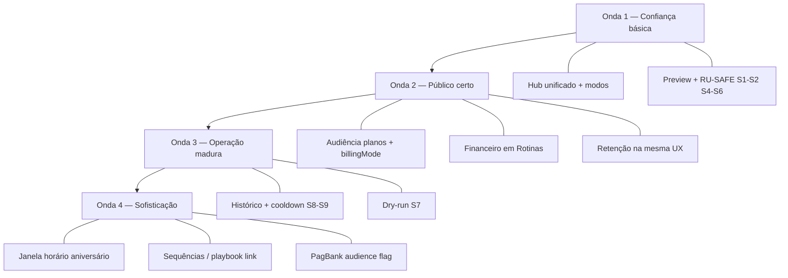

# Comunicação automática WhatsApp — Evolução (spec mestre)

**Data:** 2026-06-17  
**Status:** proposta (aguardando aprovação)  
**Escopo:** hub `/automacoes`, planos de mensalidade, crons de envio, Inbox (templates manuais).

**Detalhamento UI hub (Ondas 1–2):** [2026-06-17-automacoes-hub-unificado-PRODUCT.md](./2026-06-17-automacoes-hub-unificado-PRODUCT.md)

**Specs relacionadas:**

- [2026-06-17-automacoes-ia-restructure-PRODUCT.md](./2026-06-17-automacoes-ia-restructure-PRODUCT.md) — estado atual P4.1
- [2026-06-16-pagbank-conciliacao-integracao-PRODUCT.md](./2026-06-16-pagbank-conciliacao-integracao-PRODUCT.md) — `billingMode` + assinatura aluno
- [2026-06-17-retencao-frequencia-ux-evolucao-PRODUCT.md](./2026-06-17-retencao-frequencia-ux-evolucao-PRODUCT.md) — `absent_student` / `newcomer_at_risk`

**Fluxos:** [automacoes-funil.md](../../flows/atendimento/automacoes-funil.md) · [config-inicial-financeiro.md](../../flows/financeiro/config-inicial-financeiro.md)

**Harness:** `npm test -- automacoesHub automacoesSettingsSections automacoesSetupWizard automationUx financeWhatsappReminders`

---

## 1. Problema e oportunidade

Academias precisam **personalizar ao máximo** a comunicação WhatsApp automática (funil, rotinas, cobrança, retenção) **sem risco** de:

- texto inadequado ou com variável errada;
- público errado (ex.: lembrete de vencimento para quem já paga no cartão recorrente);
- timing surpresa;
- “liguei sem saber” por UI fragmentada (Modelos vs Gatilhos vs Financeiro).

**Estado atual:** gatilhos desligados por default (bom), mas **sem audiência configurável**, **texto e ativação em telas separadas**, gate WhatsApp 30 dias pouco explicado, financeiro isolado.

---

## 2. Norte do produto

> **Comunicação automática só quando a academia controla o quê, para quem, quando e em que modo** — com caminho seguro para testar antes de armar o envio.

**Modelo mental:** **uma mensagem = um card** com quatro decisões:

| # | Decisão | Controle |
|---|---------|----------|
| 1 | **O quê** | Texto, variáveis, preview, testar no WhatsApp |
| 2 | **Para quem** | Planos, excluir cartão automático, (futuro) turma/status |
| 3 | **Quando** | Regra do gatilho + opções fechadas de antecedência/atraso |
| 4 | **Como** | Desligado · Só manual · Automático |

**Postura:** opt-in por mensagem; default **Desligado** ou **Só manual** até confiança.

**Abordagem estratégica (rejeitadas):**

| Abordagem | Veredicto |
|-----------|-----------|
| Construtor Zapier (SE/ENTÃO livre) | Futuro distante — alto risco de erro |
| Pacotes prontos só | Complemento no wizard, não substitui cards |
| **Card completo + ondas incrementais** | **Adotada** |

---

## 3. Inventário de mensagens (catálogo)

Todas passam a ser configuráveis no hub **Mensagens automáticas** (`/automacoes`).

| ID | Nome (UI) | Seção | Tipo card | Disparo | Audiência configurável |
|----|-----------|-------|-----------|---------|------------------------|
| `schedule_confirm` | Agendamento confirmado | Captação | A | Evento funil | Não (lead do evento) |
| `presence_confirmed` | Presença confirmada | Captação | A | Evento funil | Não |
| `missed` | Não compareceu | Captação | A | Evento funil | Não |
| `waiting_decision` | Aguardando decisão | Captação | A | Etapa + delay | Não |
| `followup_d1_attended` | Retorno D+1 (compareceu) | Captação | A | Cron diário | Não |
| `schedule_reminder` | Lembrete de aula | Captação | A | Antes da aula | Não |
| `converted` | Matrícula realizada | Pós-matrícula | A | Matrícula | Não |
| `birthday` | Aniversário | Rotinas | B | Cron ~9h BRT | **Sim** (Onda 2) |
| `absent_student` | Aluno sumido | Rotinas | A | Cron frequência | **Sim** (Onda 2) |
| `newcomer_at_risk` | Novato em risco | Rotinas | A | Cron frequência | **Sim** (Onda 2) |
| `finance_due_soon` | Lembrete de vencimento | Rotinas › Cobrança | D | Cron financeiro | **Sim** (Onda 2) |
| `finance_overdue` | Lembrete de atraso | Rotinas › Cobrança | D | Cron financeiro | **Sim** (Onda 2) |

**Persistência hoje:**

| Domínio | Campos |
|---------|--------|
| Funil / rotinas | `academy.whatsappTemplates` + `academy.automations_config` |
| Cobrança WhatsApp | `academy.financeConfig.whatsappReminders` |

Unificação de **UI** na Onda 1; unificação de **schema** não é objetivo até Onda 4+.

---

## 4. Arquitetura de informação (estado alvo)

### Menu e rota

| Antes | Depois |
|-------|--------|
| Menu: Mensagens Automáticas | Mantém label |
| Header: Mensagens do funil | **Mensagens automáticas** |
| `?tab=modelos\|gatilhos` | `?section=resumo\|captacao\|pos-matricula\|rotinas` |

### Sidebar

1. **Resumo** — conexão WA, mensagens armadas, wizard, pânico (desligar tudo)  
2. **Captação** — 6 cards funil  
3. **Pós-matrícula** — 1 card  
4. **Rotinas** — aniversário, retenção, cobrança (se financeiro ativo)

### Redirects legados

| Origem | Destino |
|--------|---------|
| `?tab=modelos\|gatilhos&section=*` | `?section=*` |
| `/empresa?…&section=lembretes-whatsapp` | `/automacoes?section=rotinas#financeiro` |

---

## 5. Camadas de segurança (RU-SAFE)

Aplicam-se a **todas** as ondas onde o requisito estiver marcado.

| ID | Camada | Comportamento | Onda |
|----|--------|---------------|------|
| S1 | Opt-in explícito | Automático exige texto válido + confirmação 1ª ativação com alcance | 1 |
| S2 | Preview visível | Preview renderizado antes de armar; “Testar no WhatsApp” destacado | 1 |
| S3 | Audiência visível | “~N alunos · M excluídos” no card | 2 |
| S4 | Modo Só manual | Texto no Inbox sem cron; recomendado no wizard | 1 |
| S5 | Gate WA explicado | Aviso se sem conversa 30 dias — não falha silenciosa | 1 |
| S6 | Resumo armado + pânico | Lista automáticas ativas; desligar todas | 1 |
| S7 | Dry-run | Log “teria enviado” sem enviar (opt-in por academia) | 3 |
| S8 | Cooldown global | Máx. 1 WhatsApp automático / aluno / 7 dias (configurável) | 3 |
| S9 | Histórico de envios | Quem recebeu o quê e quando; skip reason | 3 |

---

## 6. Audiência (RU-AUD)

### 6.1 Atributos de filtro (alinhado a `docs/flows/atendimento/automacoes-funil.md` v3)

| Filtro UI | Campo aluno (código) | Notas |
|-----------|---------------------|--------|
| Tipo | `type` | Adulto · Criança · Juniores — **não** `category` |
| Plano | `plan` (nome) | Match `financeConfig.plans[].name` — **não** `plan_id` até existir ID estável |
| Turma | `turma` (nome) | `academy.settings.turmas[]` — **não** `class_id` |
| Tempo de casa | `enrollmentDateYmd()` | **não** `enrolled_at` |
| Cobrança recorrente | `plan` + `billingMode` | Onda 2 — ver RU-AUD |

**Regra v3:** campo nulo no aluno → **incluído** (nunca excluir por dado ausente).

**Onde aplica audiência:** crons de aluno (`birthday`, `absent_student`, `newcomer_at_risk`, lembretes financeiros). Gatilhos de **evento funil** → lead do evento, sem filtro UI.

### 6.2 Modo de cobrança no plano

Em **Financeiro → Planos**, cada plano ganha:

```ts
billingMode?: 'manual' | 'recurring_card'; // default 'manual'
```

| Valor | Significado |
|-------|-------------|
| `manual` | PIX, balcão, link avulso, registro manual |
| `recurring_card` | Débito/crédito automático (assinatura gateway) |

### 6.3 Bloco “Para quem” no card

```ts
type AutomationAudience = {
  types?: string[];       // student.type — Adulto | Criança | Juniores
  planNames?: string[];   // student.plan
  turmas?: string[];      // student.turma
  tenure?: null | 'novato' | 'veterano';
  excludeRecurringCard?: boolean; // lembretes financeiros (Onda 2)
};
// automationsConfig[key].audience — merge com active/templateKey existentes
```

- Funil (evento): sem seletor — lead do evento.  
- Rotinas e cobrança: configurável; preview «N alunos» antes de salvar (v3).  
- **Default lembretes financeiros:** `excludeRecurringCard: true`.  
- Campo nulo no aluno → **incluído** (v3).

### 6.4 Engine

`passesAudienceFilter(student, audience, ctx)` / `matchesAutomationAudience(...)` — usada por:

- `runBirthdayCron` (`api/leads.js`)
- `runAttendanceRetentionCron`
- `runFinanceWhatsappAlerts`
- (futuro) fila `pending_automations` onde aplicável

### 6.5 PagBank (Onda 4)

Aluno com assinatura ativa no gateway → tratar como `recurring_card` mesmo se plano mal marcado ([pagbank spec](./2026-06-16-pagbank-conciliacao-integracao-PRODUCT.md)).

---

## 7. Roadmap por ondas



### Onda 1 — Confiança básica (MVP)

**Objetivo:** configurar e testar no mesmo lugar; nada arma sem querer.

| Epic | Requisitos | Entregável |
|------|------------|------------|
| E1.1 Hub unificado | RU-1…RU-9 do [hub spec](./2026-06-17-automacoes-hub-unificado-PRODUCT.md) | Sidebar 4 seções; cards Captação + Pós + Aniversário |
| E1.2 Modos de envio | RU-1, S4 | Desligado / Só manual / Automático |
| E1.3 Segurança UI | S1, S2, S5, S6 | Confirmação, preview, gate explicado, resumo armado |
| E1.4 Redirects | RU-7, RU-8 | URLs legadas |

**Fora da Onda 1:** audiência por plano, financeiro em Rotinas, dry-run.

**Critério de saída:** dono configura aniversário + 1 gatilho de captação em Só manual, testa no WA, passa 1 para Automático vendo preview — sem trocar de aba.

**TECH:** `2026-06-17-comunicacao-automatica-onda1-TECH.md` (a escrever pós-aprovação).

---

### Onda 2 — Público certo

**Objetivo:** não mandar mensagem errada para quem não deve receber (especialmente recorrente cartão).

| Epic | Requisitos | Entregável |
|------|------------|------------|
| E2.1 Planos billingMode | RU-AUD-2 | Campo em Financeiro → Planos |
| E2.2 Seletor audiência | RU-AUD-1, S3 | Multi-select planos + preset excluir cartão auto |
| E2.3 Engine audiência | RU-AUD-3, RU-AUD-4 | Crons respeitam `audience` |
| E2.4 Cobrança em Rotinas | RU-17 | Cards Tipo D + redirect Financeiro |
| E2.5 Retenção unificada | Cards `absent_student`, `newcomer_at_risk` na mesma UX | Threshold days no card |

**Defaults de produto:**

| Card | `excludeRecurringCard` default |
|------|-------------------------------|
| Lembrete vencimento | `true` |
| Lembrete atraso | `true` |
| Aniversário | `false` (usuário escolhe) |
| Aluno sumido / Novato | `false` |

**Critério de saída:** academia com plano “Premium” `recurring_card` não recebe lembrete de vencimento; plano “Manual” sim.

**TECH:** `2026-06-17-comunicacao-automatica-onda2-TECH.md`

---

### Onda 3 — Operação madura

**Objetivo:** visibilidade pós-envio e teto anti-spam.

| Epic | Requisitos | Entregável |
|------|------------|------------|
| E3.1 Histórico | S9 | Tela ou drawer “Últimos envios automáticos” por academia |
| E3.2 Cooldown global | S8 | Config em Resumo: dias entre automáticas / mesmo aluno |
| E3.3 Dry-run | S7 | Modo simulação por academia (7 dias) |
| E3.4 Perfil aluno | — | “Por que recebeu / não recebeu” no perfil |
| E3.5 Wizard 2 passos | RU-12 | Revisar mensagens + WA |

**Critério de saída:** após 1 semana dry-run, log mostra destinatários que seriam atingidos; cooldown impede 2 automações na mesma semana.

**TECH:** `2026-06-17-comunicacao-automatica-onda3-TECH.md`

---

### Onda 4 — Sofisticação (backlog priorizado)

| Item | Valor | Dependência |
|------|-------|-------------|
| Hora configurável aniversário | Personalização | Baixa urgência |
| Janela de envio (9h–18h) | Não acordar aluno | Média |
| Sequências multi-passo | Jornada coerente | Playbook spec P4.2 |
| Variante de texto por plano | Copy específica | Audiência Onda 2 |
| PagBank `subscription` no aluno | Audiência precisa | PagBank Fase 2 |
| Pausa global (férias academia) | Operacional | Baixa |
| Aprovação por envio (fila) | Máximo controle | Só se dry-run insuficiente |

**Não planejar:** construtor Zapier, multi-canal e-mail, marketplace de jornadas.

---

## 8. Goals e métricas

| # | Meta |
|---|------|
| G1 | Configurar texto + modo sem trocar de aba |
| G2 | Audiência por plano + excluir cartão automático |
| G3 | Um hub para funil + rotinas + cobrança WhatsApp |
| G4 | Zero aumento de tickets “mensagem indevida” pós Onda 2 |
| G5 | ≥60% das academias que ativam automação passam primeiro por Só manual (Onda 1) |

| Métrica | Alvo 90d pós Onda 2 |
|---------|---------------------|
| Tempo até 1º gatilho Automático | −30% |
| Tickets “onde ativo / público errado” | −50% |
| Taxa skip `no_recent_interaction` explicada na UI | 100% cards com hint |
| Desativação em 7 dias (medo spam) | não subir >5% |

---

## 9. Non-goals (programa inteiro)

- Nova Serverless Function em `/api/` (consolidar em handlers existentes).
- Unificar `financeConfig` e `automations_config` em um JSON só (Onda 4+ apenas se necessário).
- Lembretes financeiros alterarem régua de tarefas de cobrança.
- Processos da equipe (`/tarefas?tab=processos`).
- Assinatura comercial do **Nave** (Asaas academia) — domínio `/conta`.

---

## 10. Permissões

| Papel | Ver | Editar texto/modo/audiência |
|-------|-----|----------------------------|
| owner | Sim | Sim |
| admin | Sim | Sim |
| member | Sim | Não (leitura + ver o que está armado) |

---

## 11. Dependências entre times / specs

| Dependência | Impacto |
|-------------|---------|
| [hub unificado](./2026-06-17-automacoes-hub-unificado-PRODUCT.md) | Onda 1 = implementação direta |
| [PagBank](./2026-06-16-pagbank-conciliacao-integracao-PRODUCT.md) | Onda 4 reforça `recurring_card` no aluno |
| [Retenção UX](./2026-06-17-retencao-frequencia-ux-evolucao-PRODUCT.md) | Copy cards sumido/novato |
| `docs/flows/atendimento/automacoes-funil.md` | Atualizar por onda no mesmo PR |
| `docs/flows/financeiro/config-inicial-financeiro.md` | Redirect lembretes WhatsApp Onda 2 |

---

## 12. Riscos

| Risco | Mitigação |
|-------|-----------|
| Cards longos em mobile | Accordion; resumo com toggles |
| Placeholders `{nome}` vs `{{nome}}` | Manter ambos; unificar Onda 4+ |
| Estimativa de público lenta | Cache por academia TTL 5 min |
| Academia esquece `billingMode` | Default manual; preset excluir recorrente em cobrança |
| 12/12 functions Vercel | Audiência só em crons existentes |

---

## 13. Open questions (decisão antes de Onda 1 TECH)

| # | Pergunta | Proposta | Dono |
|---|----------|----------|------|
| OQ-1 | Auto-save vs Salvar por seção? | Auto-save debounced 400ms | Eng |
| OQ-2 | Segmented control vs select para modo? | Segmented no desktop, select mobile | Design |
| OQ-3 | Financeiro em Rotinas na Onda 1 ou 2? | **Onda 2** (após modos estáveis) | Produto |
| OQ-4 | Cooldown global default? | 7 dias; configurável 0–14 | Produto |
| OQ-5 | Dry-run default no wizard? | Oferecer, não forçar | Produto |
| OQ-6 | `billingMode` só no plano até PagBank? | **Sim** | Produto |

---

## 14. Critérios de aceite por onda

### Onda 1
1. `/automacoes?section=rotinas` — aniversário: texto + modo no mesmo card.  
2. Modo Só manual: Inbox lista template; cron não dispara.  
3. Resumo mostra contagem de mensagens Automático + “Desligar todas”.  
4. Redirects `?tab=gatilhos` funcionam.  
5. `npm test -- automacoesHub automacoesSettingsSections` verde.

### Onda 2
1. Plano com `recurring_card` excluído de lembrete vencimento quando preset ativo.  
2. Multi-select de planos altera estimativa no card.  
3. Financeiro `lembretes-whatsapp` redireciona para Rotinas.  
4. `npm test -- financeWhatsappReminders` + testes `matchesAutomationAudience` verde.

### Onda 3
1. Dry-run: 0 envios Zapster; log consultável.  
2. Cooldown: 2ª automação na semana para mesmo aluno bloqueada.  
3. Histórico: últimos 30 dias por `automationKey`.

---

## 15. Próximos artefatos (após aprovação desta spec)

| Artefato | Quando |
|----------|--------|
| `2026-06-17-comunicacao-automatica-onda1-TECH.md` | Aprovação Onda 1 |
| `docs/superpowers/plans/2026-06-17-comunicacao-automatica-onda1.md` | Após TECH Onda 1 |
| Atualizar [hub unificado](./2026-06-17-automacoes-hub-unificado-PRODUCT.md) status → “detalhe Onda 1–2” | Com este PR |
| `VALIDATION.md` + fluxos | Cada onda no PR de implementação |

---

## Histórico

| Data | Mudança |
|------|---------|
| 2026-06-17 | Spec mestre — consolida brainstorm, hub unificado, audiência, ondas 1–4 |
