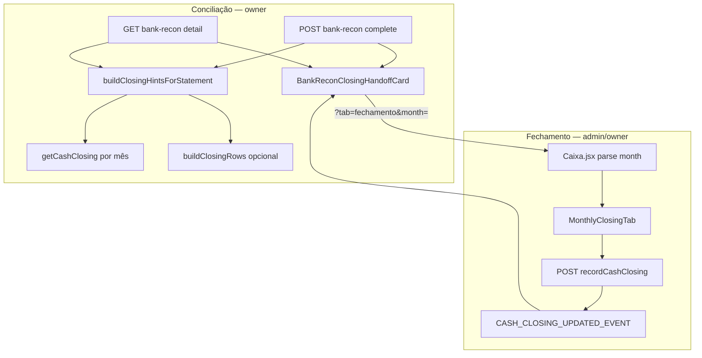

# Conciliação → Fechamento mensal (TECH)

**Data:** 2026-06-17  
**Status:** rascunho — aguardando implementação  
**PRODUCT:** [2026-06-17-conciliacao-fechamento-mensal-PRODUCT.md](./2026-06-17-conciliacao-fechamento-mensal-PRODUCT.md)

---

## Escopo

Conectar o fluxo de **conciliação bancária** ao **fechamento mensal** (`cash_closing`) via handoff na UI (owner), deep link `?month=` no hub Financeiro e payload `closingHints` no backend — **sem** bloquear `recordCashClosing` por status de extrato.

**Fases:** P0 (handoff + query param + copy) → P1 (lista/detalhe persistente) → P2 (overview alert, opcional).

**Limite Vercel:** nenhum arquivo novo em `/api/`; estender `bankReconciliationHandler.js` e `Caixa.jsx`.

---

## Decisões

| # | Decisão | Escolha | Motivo |
|---|---------|---------|--------|
| D1 | Onde montar `closingHints` | Server em `handleComplete` + `handleDetail` | Evita N+1 no cliente; reutiliza `getCashClosing` |
| D2 | Mapeamento período → meses | Helper puro `civilMonthsOverlappingPeriod` em `src/lib/` | Testável; compartilhado client/server |
| D3 | Gate conciliação → fechamento | **Nenhum** | Admin não concilia; academias sem extrato |
| D4 | Cache | Sem cache dedicado | Volume baixo; `getCashClosing` já é query única por mês |
| D5 | Totais no card | Reutilizar `buildClosingRows` + `computeClosingTotals` só se dados já carregados no detail | Complete path pode usar payload enxuto (só status); detail pode incluir totais |

---

## Arquitetura



---

## Modelo de dados (sem schema novo)

Reutilizar coleção existente `cash_closing` (env `APPWRITE_CASH_CLOSING_COLLECTION_ID`).

### Payload `closingHints`

```ts
type ClosingHintMonth = {
  reference_month: string;       // YYYY-MM
  month_label: string;           // "Março de 2026" (server ou client fmt)
  is_conferred: boolean;
  closed_at?: string;            // ISO
  // P0 opcional — P1 se performance ok:
  totals?: {
    received: number;
    expected: number;
    pending_count: number;       // linhas pendente+parcial
  };
};

type ClosingHintsPayload = {
  months: ClosingHintMonth[];
  all_conferred: boolean;
  any_conferred: boolean;
};
```

Anexar em:

- `POST /api/bank-reconciliation?route=complete` → response `{ ok, status, ..., closingHints }`
- `GET /api/bank-reconciliation?route=detail&statement_id=` → `statement.closingHints` ou campo irmão no root

---

## Helpers novos

### `src/lib/closingPeriodMonths.js`

```js
/**
 * @param {string} periodStart YYYY-MM-DD
 * @param {string} periodEnd YYYY-MM-DD
 * @returns {string[]} YYYY-MM civis ordenados, únicos
 */
export function civilMonthsOverlappingPeriod(periodStart, periodEnd) { ... }
```

**Regras:**

- Normalizar `start <= end`; inválido → `[]`.
- Iterar meses civis de `start.slice(0,7)` até `end.slice(0,7)` inclusive.
- Incluir mês se intervalo `[start,end]` intersecta `[monthFirst, monthLast]`.

**Testes:** `src/test/closingPeriodMonths.test.js`

- um mês só
- dois meses (extrato atravessando virada)
- mesmo dia início/fim
- strings inválidas → `[]`

### `lib/server/bankReconClosingHints.js` (server-only)

```js
export async function buildClosingHintsForStatement({
  academyId,
  periodStart,
  periodEnd,
  regime,
  includeTotals = false,
}) { ... }
```

**Passos:**

1. `months = civilMonthsOverlappingPeriod(periodStart, periodEnd)`
2. Para cada `ym`: `cashClosing = await getCashClosing(academyId, ym)` (de `financeClosingData.js`)
3. Se `includeTotals`: carregar payments/transactions **uma vez** por academy+regime (batch) — ver otimização abaixo
4. Montar `ClosingHintsPayload`

**Otimização P0:** `includeTotals: false` — só `is_conferred` + `closed_at`.  
**P1:** `includeTotals: true` no detail quando `statement.completed_at` setado; usar `loadClosingGetPayload` ou subset já usado em `financeOverviewHandler`.

---

## Alterações backend

### `lib/server/bankReconciliationHandler.js`

| Handler | Mudança |
|---------|---------|
| `handleComplete` | Após `updateDocument` do statement, chamar `buildClosingHintsForStatement` com `period_start/end` do doc |
| `handleDetail` (ou mapper do statement) | Incluir `closingHints` quando `completed_at` presente |

**Auth:** inalterado — owner only (handler já exige).

**Erros:** falha em `buildClosingHintsForStatement` → log `bank_recon_closing_hints_error`; response de complete **ainda** `200` com `closingHints: null` (não falhar complete).

### `lib/server/financeClosingData.js`

Exportar `getCashClosing` se ainda não exportado (já usado internamente).

### P2 — `lib/server/financeOverviewHandler.js` (opcional)

Adicionar ao body:

```js
previousMonthConferred: Boolean(await getCashClosing(academyId, previousMonthYm(month))),
previousMonth: previousMonthYm(month),
```

Cliente: uma linha em `VisaoGeralTab` Alertas (PRODUCT R2-1).

---

## Alterações frontend

### `src/components/finance/BankReconClosingHandoffCard.jsx` (novo)

Props:

```ts
{
  closingHints: ClosingHintsPayload | null;
  statementStatus: 'reconciled' | 'partial';
  onDismiss: () => void;
  dismissed: boolean;
}
```

- Renderiza lista de meses com CTA `Link` para `/financeiro?tab=fechamento&month=${ym}`
- `partial` → `StatusBanner variant="warning"` no topo do card
- `all_conferred` → variant success, links secundários
- Escuta `CASH_CLOSING_UPDATED_EVENT` → callback `onClosingUpdated` para refetch detail ou patch local

**CSS:** `src/components/finance/styles/bank-recon.css` (ou `closing-handoff.css` parcial).

### `src/components/finance/ReconciliationTab.jsx`

| Área | Mudança |
|------|---------|
| Após `completeBankReconciliation` success | Guardar `closingHints` em state; mostrar `BankReconClosingHandoffCard` |
| Detalhe extrato finalizado | Card persistente (P1) |
| Lista extratos (P1) | Badge derivado de `closingHints` no list item se API list enriquecida |
| Manual reconcile button ~L829 | Label → **Conciliar manualmente** + hint |

**Dismiss:** `sessionStorage` key `navi_recon_closing_handoff_dismiss_${statementId}`.

### `src/pages/Caixa.jsx`

```js
// Ler ?month=YYYY-MM na montagem e quando searchParams mudar
const monthParam = searchParams.get('month');
useEffect(() => {
  const parsed = parseReferenceMonth(monthParam);
  if (parsed) setReferenceMonth(parsed);
}, [monthParam]);
```

Validar com `parseReferenceMonth` de `monthlyClosing.js`.

### `src/lib/bankReconciliationApi.js`

Tipos JSDoc opcionais; sem mudança de contrato além de campos novos na response.

### List API enrichment (P1)

`handleList` em `bankReconciliationHandler`: para cada statement com `completed_at`, computar `closing_summary: 'ok' | 'pending' | 'mixed'` sem totais completos:

- `ok` ⇔ todos meses conferidos
- `pending` ⇔ nenhum conferido
- `mixed` ⇔ algum sim, algum não

Para performance: batch `getCashClosing` por pares únicos `(academyId, ym)` na página (máx ~20 statements × 2 meses).

---

## API surface (resumo)

| Método | Rota | Campo novo |
|--------|------|------------|
| POST | `/api/bank-reconciliation?route=complete` | `closingHints` |
| GET | `/api/bank-reconciliation?route=detail` | `closingHints` |
| GET | `/api/bank-reconciliation?route=list` | `closing_summary` por item (P1) |
| GET | `/api/finance?route=overview` | `previousMonthConferred` (P2) |

Fechamento existente inalterado:

- `GET /api/finance?route=monthly-closing&month=`
- `POST /api/finance?route=record-cash-closing` (ou equivalente em `financeClosingHandler`)

---

## Testes

| Arquivo | Casos |
|---------|-------|
| `src/test/closingPeriodMonths.test.js` | Mapeamento período → meses |
| `src/test/bankReconClosingHints.test.js` | Mock `getCashClosing`; 0/1/N meses; all_conferred |
| `src/test/financeiroHubMonthParam.test.js` | `Caixa` ou helper parse `?month=` |
| `src/test/bankReconClosingHandoffCard.test.jsx` | Render CTA, dismissed, conferido |
| Integração handler | `complete` inclui `closingHints` quando `CASH_CLOSING_COL` set |

Atualizar se existir: `bankReconciliationValidation.test.js` — sem regressão em complete.

---

## Performance e limites

- `getCashClosing`: 1 query/mês; máx ~3 meses por extrato típico.
- `includeTotals` no detail: reutilizar dados já carregados para matching no detail quando possível; evitar terceira varredura full de TX se `listTxForMatching` já trouxe o período.
- List enrichment P1: se >50 statements, calcular `closing_summary` só para `completed_at` nos últimos 90 dias (filtro server).

---

## Segurança / multi-tenant

- `buildClosingHintsForStatement` sempre recebe `academyId` validado pelo handler.
- `getCashClosing` já filtra por `academy_id` + `reference_month`.
- Links de fechamento não expõem IDs cross-tenant.

---

## Rollout

1. Deploy backend (hints opcionais — cliente antigo ignora).
2. Deploy frontend P0.
3. Monitorar logs `bank_recon_closing_hints_error`.
4. P1 lista/detalhe; P2 overview se métricas P0 forem positivas.

**Feature flag:** não obrigatório; se necessário, `localStorage` / env `NAVI_RECON_CLOSING_HANDOFF=0` só em dev.

---

## Docs (mesmo PR P0)

| Arquivo | Mudança |
|---------|---------|
| `docs/flows/financeiro/conciliacao-bancaria.md` | Passo handoff pós-complete |
| `docs/flows/financeiro/fechamento-mensal.md` | Entrada recomendada via Conciliação |
| `docs/flows/VALIDATION.md` | Checklist R0-1–R0-3 |

---

## Ordem de implementação sugerida

1. `closingPeriodMonths.js` + testes
2. `bankReconClosingHints.js` + testes
3. `handleComplete` + `handleDetail` enrichment
4. `BankReconClosingHandoffCard` + wire em `ReconciliationTab`
5. `Caixa.jsx` `?month=` param
6. Rename botão manual conciliação
7. P1 list `closing_summary`
8. P2 overview (opcional)

---

## Fora de escopo técnico explícito

- Bloqueio em `financeClosingHandler` se extrato não reconciliado
- Merge de coleções Appwrite
- Notificação push para admin quando owner completa extrato
- Renomear slug `fechamento` → `fechamento-mensal`
