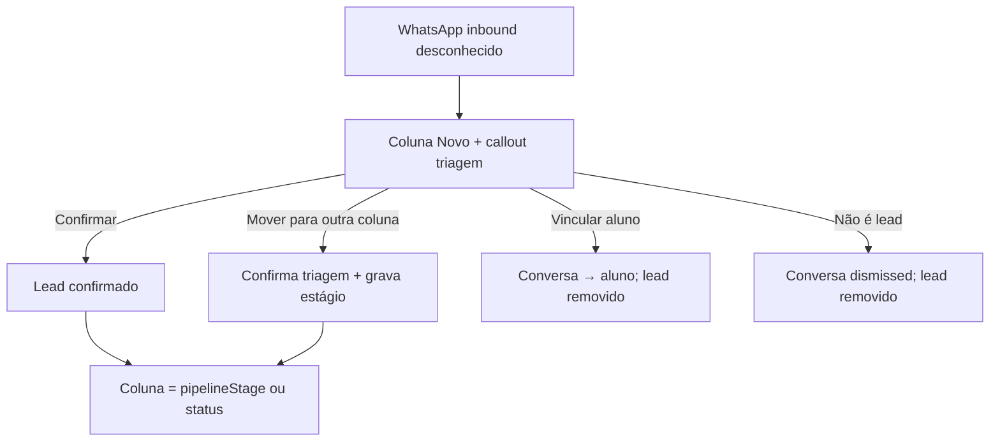

# Funil — Correção definitiva (triagem, colunas e movimentação)

**Data:** 2026-06-17  
**Status:** implementado (F1–F3)  
**TECH:** [2026-06-17-funil-correcao-definitiva-TECH.md](./2026-06-17-funil-correcao-definitiva-TECH.md)

**Fluxos afetados:**

- [funil-lead-matricula.md](../../flows/crm/funil-lead-matricula.md)
- [conversas-inbox.md](../../flows/crm/conversas-inbox.md)
- [VALIDATION.md](../../flows/VALIDATION.md) — seção `funil-lead-matricula`

**Specs relacionadas:**

- [2026-06-11-conversa-cadastro-lead-ia-design.md](./2026-06-11-conversa-cadastro-lead-ia-design.md) — criação automática de lead inbound
- [2026-06-10-followup-experimental-design.md](./2026-06-10-followup-experimental-design.md) — colunas pós-experimental
- [2026-06-16-lead-profile-whatsapp-offline-states-PRODUCT.md](./2026-06-16-lead-profile-whatsapp-offline-states-PRODUCT.md) — perfil do lead

**Arquivos-chave:** `src/pages/Pipeline.jsx`, `src/lib/leadStageRules.js`, `src/lib/leadTriage.js`, `src/components/inbox/InboxTriageCard.jsx`, `src/lib/resolvePipelineLeadToStudent.js`

---

## 1. Inventário — bugs confirmados (auditoria 2026-06-17)

| # | Sintoma | Causa raiz | Hotfix parcial |
|---|---------|------------|----------------|
| B1 | Botões **Confirmar / Vincular aluno / Não é lead** no card do funil abrem o perfil ou cancelam modais | Clique propaga para `onClick` do card (`/lead/:id`) | `InboxTriageCard` com `stopPropagation` |
| B2 | Card **some** ao mover para etapa custom (ex.: **Primeiro contato**) | Lead em triagem pendente é sempre mapeado para coluna **Novo**, ignorando `pipelineStage` salvo | `buildPipelineMovePayload` confirma triagem ao sair de Novo |
| B3 | Estado inconsistente após mover card | `patchLeadLocal` atualizava `leads` mas não `leadsById` | Sincronização via `buildLeadsById` |
| B4 | Etapa **Primeiro contato** sem status canônico | Ausente em `STAGE_TO_STATUS` | Mapeamento adicionado (`NEW`) |
| B5 | Triagem confirmada não persiste após reload (algumas academias) | Atributo `triage_status` pode não existir no schema Appwrite | `stripUnknownLeadPatch` remove campo silenciosamente |
| B6 | Vincular aluno no funil: API `link_lead` recebe ID do aluno no campo `lead_id` | Nome legado do endpoint; funciona (busca `STUDENTS_COL` primeiro) mas confunde manutenção | Nenhum |
| B7 | Lista mobile do funil sem triagem | Escopo deliberado desta spec | Ver non-goals |

---

## 2. Problema

O funil é a **superfície principal** para operar leads WhatsApp inbound. Hoje o operador encontra comportamentos que parecem “bug de UI”: ações de triagem que navegam para outra tela, cards que desaparecem ao arrastar, e leads que voltam para **Novo** depois de movidos.

Isso quebra confiança no kanban, atrasa a triagem de contatos novos e gera retrabalho (reabrir Inbox ou perfil para concluir o que deveria ser um clique no card).

**Quem é afetado:** recepcionista e owner que operam `/pipeline` no desktop.

**Custo de não resolver definitivamente:** hotfixes pontuais continuam divergindo entre Funil, Inbox e regras de estágio; regressões a cada refator do `Pipeline.jsx`.

---

## 3. Visão — comportamento canônico do funil

### 3.1 Triagem WhatsApp (desktop kanban)

Leads **inbound automáticos** (`inbound_auto` / `triage_status: pending`) entram na coluna **Novo** com callout compacto de triagem (`InboxTriageCard`).

| Ação | Efeito no lead | Efeito na conversa | Card no funil |
|------|----------------|-------------------|---------------|
| **Confirmar** | `triage_status: confirmed` (+ tipo derivado da classificação IA, se houver) | Mantém vínculo | Permanece na coluna resolvida por `pipelineStage` / status |
| **Vincular aluno** | Lead removido; conversa associada ao aluno | `link_lead` com ID do aluno | Some do funil |
| **Não é lead** | Lead excluído | `mark_not_lead` — não recria inbound | Some do funil |

**Regra de ouro:** cliques na área de triagem **nunca** disparam navegação para `/lead/:id`.

### 3.2 Movimentação entre colunas

1. **Resolução de coluna** = `resolveLeadPipelineStageId(lead, { stages, isPendingTriage })`.
2. Enquanto **triagem pendente**, coluna efetiva = **Novo** (callout visível).
3. Ao mover para **qualquer etapa ≠ Novo** (drag ou menu):
   - Confirmar triagem implicitamente (`triage_status: confirmed`).
   - Persistir `pipeline_stage` + `status` canônico quando mapeado.
4. Após confirmar (explícito ou implícito), coluna segue `pipelineStage` customizado ou status operacional.

### 3.3 Mobile (`≤1023px`)

- Vista **lista agrupada por etapa** (já existente).
- **Sem** callout de triagem no card mobile.
- Operador tria pelo **Inbox** (`/inbox`) ou abre o **perfil** do lead.
- Movimentação entre etapas continua disponível (select + botão).

---

## 4. Goals

| # | Meta |
|---|------|
| G1 | Triagem no kanban desktop concluível **sem navegação acidental** |
| G2 | Mover lead para etapa custom (ex.: Primeiro contato) **mantém o card na coluna de destino** |
| G3 | Uma **única regra** de resolução de coluna compartilhada por kanban, contadores, filtros e drag-and-drop |
| G4 | Confirmação de triagem **persiste** após reload (schema + fallback documentado) |
| G5 | Paridade Inbox ↔ Funil nas **mesmas três ações** de triagem (com UX adaptada à superfície) |
| G6 | Regressões cobertas por testes automatizados (`leadStageRules`, `leadTriage`, interação triagem) |

---

## 5. Non-Goals

| Item | Motivo |
|------|--------|
| Callout de triagem na **lista mobile** do funil | Escopo explícito: triagem no funil = **desktop kanban only**; mobile usa Inbox |
| Novo arquivo em `/api/` | Limite Vercel Hobby 12/12 |
| Redesign visual completo do kanban | Correção de comportamento + polish mínimo |
| Bloquear movimento de triagem pendente (em vez de auto-confirmar) | Auto-confirm reduz fricção; bloqueio frustraria operação |
| Renomear endpoint `link_lead` | Compatibilidade; documentar no TECH |
| Mutex entre crons de automação | Spec futura (já nota em AGENTS.md) |

---

## 6. Personas e user stories

### Recepcionista (desktop)

**US-F1** — Como recepcionista no kanban, quero **confirmar, vincular ou descartar** um contato WhatsApp novo **no próprio card**, sem ser levada ao perfil.

**US-F2** — Como recepcionista, quero **arrastar** um lead confirmado (ou inbound que movi) para **Primeiro contato** e vê-lo **permanecer** nessa coluna.

**US-F3** — Como recepcionista, ao mover um lead ainda em triagem para outra coluna, quero que o sistema **trate como lead válido** (confirmação implícita), sem badge de triagem preso em Novo.

**US-F4** — Como recepcionista, quero **feedback claro** (toast) quando a triagem for confirmada — explicitamente ou ao mover de etapa.

### Recepcionista (mobile)

**US-F5** — Como recepcionista no celular, quero **mover etapas** na lista do funil e **triar pelo Inbox**, sem callout extra no card.

### Owner

**US-F6** — Como owner, quero **contadores de coluna** coerentes com os cards visíveis após triagem e movimentação.

**US-F7** — Como owner com etapa custom **Primeiro contato**, quero que leads nessa etapa **não reapareçam em Novo** após F5.

---

## 7. Requisitos

### P0 — Must-have

| ID | Requisito | Critérios de aceite |
|----|-----------|---------------------|
| R-01 | Isolamento de clique na triagem (desktop) | Clicar Confirmar / Vincular / Não é lead **não** navega para `/lead/:id`; modais permanecem abertos |
| R-02 | Payload unificado de movimentação | Drag e menu “Mover para…” usam `buildPipelineMovePayload`; inclui confirmação de triagem ao sair de Novo |
| R-03 | Coluna após movimento custom | Lead com `pipelineStage: Primeiro contato` e triagem confirmada aparece **somente** na coluna Primeiro contato (não em Novo) |
| R-04 | Store consistente | Atualização otimista do lead sincroniza `leads` **e** `leadsById` |
| R-05 | Mapeamento de etapas comuns | `STAGE_TO_STATUS` inclui rótulos/ids usados no mercado: `Primeiro contato`, `Em contato`, `Novo lead` → status `NEW` |
| R-06 | Persistência de triagem | `triage_status: confirmed` sobrevive a reload; se atributo ausente no schema, TECH provisiona ou documenta fallback |
| R-07 | Testes de regressão | Suites `leadStageRules.test.js`, `leadTriage.test.js` + casos B1–B3; CI verde |
| R-08 | Mobile sem triagem no funil | Lista mobile **não** renderiza `InboxTriageCard`; checklist de fluxo documenta Inbox como canal mobile |

### P1 — Nice-to-have

| ID | Requisito | Critérios de aceite |
|----|-----------|---------------------|
| R-09 | Toast ao auto-confirmar | Ao mover triagem pendente para etapa ≠ Novo: toast “Lead confirmado ao mudar de etapa” |
| R-10 | Estado `busy` na triagem | Botões desabilitados durante API; evita duplo clique |
| R-11 | Menu ⋮ — triagem | Mesmas três ações do callout, com `stopPropagation` |
| R-12 | Link “Triar no Inbox” (mobile) | Na coluna Novo mobile, hint opcional: “Contato WhatsApp novo? Abra Conversas para triar.” |

### P2 — Futuro

| ID | Requisito | Notas |
|----|-----------|-------|
| R-13 | Renomear ação API `link_student` | Clarificar semântica vs `link_lead` |
| R-14 | Bloquear drag de triagem pendente com tooltip | Alternativa à auto-confirmação — só se usuários pedirem |
| R-15 | Badge “Triagem” na lista mobile | Fora de escopo atual |

---

## 8. Cenários de teste manual (desktop)

### Triagem no card

1. Lead inbound em **Novo** com callout.
2. **Confirmar** → toast; callout some; card **não** abre perfil.
3. **Vincular aluno** → modal abre; escolher aluno → card some; conversa linkada.
4. **Não é lead** → modal confirma → card some; novo inbound do mesmo número não recria lead.

### Movimentação

5. Lead inbound em triagem → arrastar para **Primeiro contato** → card fica na coluna; triagem confirmada.
6. Lead confirmado em Novo → menu mover para **Primeiro contato** → card permanece visível.
7. F5 → card continua em Primeiro contato.

### Filtros

8. Filtro de período ativo → leads em captação (`NEW` / `SCHEDULED`) e triagem pendente **permanecem visíveis** (`passesBoardDateFilter`).

### Mobile

9. Viewport ≤1023px → lista sem callout; triagem funciona em `/inbox?phone=…`.

---

## 9. Métricas de sucesso

| Tipo | Indicador | Meta |
|------|-----------|------|
| Leading | Zero reports “botão de triagem não funciona” / “card sumiu” em 2 semanas pós-deploy | 0 tickets |
| Leading | Testes `leadStageRules` + `leadTriage` verdes no CI | 100% |
| Lagging | Tempo médio triagem inbound (criação → `triage_status: confirmed`) | Redução ≥20% vs baseline informal |
| Lagging | Leads com `pipeline_stage` custom ≠ coluna renderizada | 0 inconsistências em amostra de 50 leads |

---

## 10. Governança de documentação

Atualizar **no mesmo PR** da implementação definitiva:

| Documento | Mudança |
|-----------|---------|
| `docs/flows/crm/funil-lead-matricula.md` | Passos de triagem desktop; mobile → Inbox |
| `docs/flows/VALIDATION.md` | Itens B1–B3; checklist triagem + movimento custom |
| `docs/flows/crm/conversas-inbox.md` | Nota de paridade triagem mobile |

---

## 11. Fases de entrega

| Fase | Escopo | Depende de |
|------|--------|------------|
| **F1 — Hotfix** (parcial ✅) | R-01, R-02, R-04, R-05 | — |
| **F2 — Consolidação** | R-03, R-06, R-07, testes E2E leves | F1 |
| **F3 — Polish** | R-09–R-12, docs | F2 |

---

## 12. Open questions

| # | Pergunta | Responsável |
|---|----------|-------------|
| Q1 | Provisionar `triage_status` / `inbound_auto` em todas as academias legadas via script? | Engenharia |
| Q2 | Toast de auto-confirmação ao mover — copy final com recepção? | Produto |
| Q3 | Hint mobile “Triar no Inbox” — link direto com `?phone=` do lead? | UX (P1) |

---

## 13. Histórico

| Data | Autor | Mudança |
|------|-------|---------|
| 2026-06-17 | — | Spec inicial pós-auditoria de triagem e movimentação |
