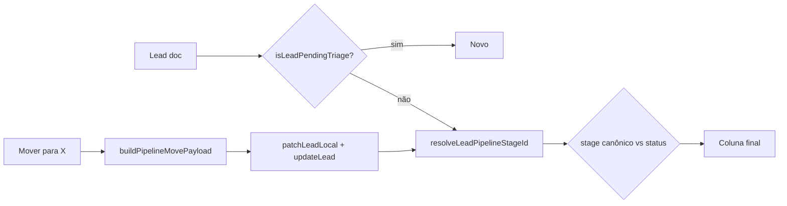

# Funil — Correção definitiva (TECH)

**Data:** 2026-06-17  
**Status:** implementado (F1–F3)  
**PRODUCT:** [2026-06-17-funil-correcao-definitiva-PRODUCT.md](./2026-06-17-funil-correcao-definitiva-PRODUCT.md)

---

## Escopo

Implementar requisitos **R-01 a R-08** (P0) e polish **R-09 a R-12** (P1). Consolidar regras hoje espalhadas entre `Pipeline.jsx`, `leadStageRules.js`, `leadTriage.js` e Inbox.

**Superfície de triagem no funil:** kanban desktop (`viewport > 1023px`) **somente**. Mobile lista (`MobileLeadList`) **não** recebe `InboxTriageCard`.

---

## Estado atual (pós-hotfix F1 parcial)

| Arquivo | Mudança já aplicada |
|---------|---------------------|
| `src/components/inbox/InboxTriageCard.jsx` | `stopPropagation` em container + botões |
| `src/lib/leadStageRules.js` | `buildPipelineMovePayload`; `Primeiro contato` em `STAGE_TO_STATUS` |
| `src/pages/Pipeline.jsx` | Usa `buildPipelineMovePayload`; `patchLeadLocal` + `buildLeadsById`; `triageBusyLeadId` |

---

## Decisões técnicas

| # | Decisão | Escolha | Motivo |
|---|---------|---------|--------|
| D1 | Confirmação ao mover | Auto-confirm via `buildPipelineMovePayload` | Evita card preso em Novo; menos cliques |
| D2 | Triagem pendente → coluna | `resolveLeadPipelineStageId` retorna `Novo` até confirmado | Callout só faz sentido em Novo |
| D3 | Fonte única de payload de movimento | `buildPipelineMovePayload(lead, toStage)` | Drag + menu + futuro NL command |
| D4 | Índice de leads | Toda mutação local usa `buildLeadsById` | `getLeadById` lê `leadsById` primeiro |
| D5 | Triagem funil mobile | **Não implementar** callout | PRODUCT non-goal; Inbox cobre |
| D6 | API vincular aluno | Manter `action: link_lead` + `lead_id: studentId` | Compatível; `getPersonDocument` busca students primeiro |
| D7 | Schema Appwrite | Garantir attrs opcionais em provisionamento | Evita B5 silencioso |

---

## Arquitetura — resolução de coluna



### Funções canônicas (não duplicar lógica no JSX)

| Função | Módulo | Responsabilidade |
|--------|--------|------------------|
| `isLeadPendingTriage` | `src/lib/leadTriage.js` | Gate de UI triagem |
| `resolveLeadPipelineStageId` | `src/lib/leadStageRules.js` | Coluna do card |
| `leadBelongsInPipelineColumn` | `Pipeline.jsx` (migrar → `leadStageRules.js` F2) | Filtro por coluna |
| `buildPipelineMovePayload` | `src/lib/leadStageRules.js` | Patch ao mover |
| `buildTriageConfirmClientPatch` | `lib/agentClassificationFields.js` | Confirmar triagem |
| `resolvePipelineLeadToStudent` | `src/lib/resolvePipelineLeadToStudent.js` | Vincular + delete lead |

---

## Fase F2 — Consolidação (P0)

### R-03 — Extrair `leadBelongsInPipelineColumn`

**Novo:** export em `src/lib/leadStageRules.js`:

```javascript
export function leadBelongsInPipelineColumn(lead, columnId, mapLeadToStageId, displayStageIds) {
  const colId = normalizePipelineStageId(columnId);
  const stageId = normalizePipelineStageId(mapLeadToStageId(lead));
  if (stageId === colId) return true;
  if (colId === 'Novo' && isLeadPendingTriage(lead)) return true;
  if (colId === 'Novo' && stageId && !displayStageIds.has(stageId)) return true;
  return false;
}
```

**Testes:** lead pending em Novo; lead em Primeiro contato só na coluna correta; orphan stage cai em Novo.

### R-06 — Persistência `triage_status`

1. Confirmar attrs em lista de provisionamento (`OPTIONAL_LEAD_PATCH_ATTRS` já inclui `triage_status`, `inbound_auto`).
2. Script ou doc de migração: academias criadas antes de 2026-06 devem ter attrs no collection leads.
3. **Fallback defensivo** em `isLeadPendingTriage`: se `triage_status` vazio mas `inbound_auto` e lead movido manualmente para stage ≠ Novo com `pipeline_stage_changed_at` recente — **não** re-triar (P2 opcional; evitar over-engineering na F2).

**Mínimo F2:** teste de integração `updateLead` com patch `{ triageStatus: 'confirmed' }` persiste em mock Appwrite.

### R-07 — Matriz de testes

| Arquivo | Casos novos |
|---------|-------------|
| `src/test/leadStageRules.test.js` | `buildPipelineMovePayload` pending → Primeiro contato; `leadBelongsInPipelineColumn` |
| `src/test/leadTriage.test.js` | confirmed + inboundAuto → not pending |
| `src/test/inboxTriageCard.test.jsx` *(novo)* | click Confirmar não chama handler do pai |
| `src/test/pipelineLeadDisplay.test.js` | expandir se existir cenário custom stage |

**Harness sugerido:**

```bash
npm test -- --run src/test/leadStageRules.test.js src/test/leadTriage.test.js src/test/inboxTriageCard.test.jsx
```

### R-01 — Hardening triagem desktop

**Arquivos:** `InboxTriageCard.jsx`, `Pipeline.jsx` (`LeadCard`)

- Manter `onMouseDown` + `onClick` stopPropagation no callout.
- Menu ⋮ triagem: já usa `e.stopPropagation()` — adicionar teste RTL no menu se regressão recorrente.
- `LeadCard` root `onClick`: não alterar; isolamento fica no callout.

### R-02 — Unificar pontos de movimento

Garantir **todos** os caminhos usam `buildPipelineMovePayload`:

| Caminho | Arquivo | Status |
|---------|---------|--------|
| Drag end | `Pipeline.jsx` `handleDragEnd` | ✅ |
| Menu mover | `Pipeline.jsx` `moveToStatus` | ✅ |
| Mobile lista mover | `MobileLeadList` → `moveToStatus` | ✅ (herda) |
| NL command bar | Verificar `NlCommandBar` / pipeline actions | ⚠️ auditar F2 |

### R-04 — Mutaciones locais do store

Padronizar em `useLeadStore`:

```javascript
// Opcional F2: export helper
export function patchLeadInStore(leadId, patch) {
  useLeadStore.setState((state) => {
    const nextLeads = state.leads.map((l) =>
      l.id === leadId ? { ...l, ...patch } : l
    );
    return { leads: nextLeads, leadsById: buildLeadsById(nextLeads) };
  });
}
```

Substituir `patchLeadLocal` inline em `Pipeline.jsx` por helper do store (único lugar).

### R-08 — Mobile: sem triagem no funil

**Arquivo:** `src/pages/Pipeline.jsx` — `MobileLeadList`

- **Não** importar/renderizar `InboxTriageCard`.
- Documentar em comentário: `// Triagem WhatsApp: desktop kanban only — mobile usa /inbox`.

**P1 R-12:** em item da coluna Novo com `isLeadPendingTriage(lead)`, linha auxiliar:

```jsx
{isLeadPendingTriage(lead) && lead.phone ? (
  <Link to={`/inbox?phone=${encodeURIComponent(normalizePhone(lead.phone))}`} className="pipeline-mobile-triage-hint">
    Triar no Inbox
  </Link>
) : null}
```

---

## Fase F3 — Polish (P1)

### R-09 — Toast auto-confirm

Em `moveToStatus` / `handleDragEnd`, após payload com `triageStatus: 'confirmed'` quando lead era pending:

```javascript
if (isLeadPendingTriage(lead) && normalizePipelineStageId(toStage) !== 'Novo') {
  toast.success('Lead confirmado ao mudar de etapa');
}
```

Usar lead **antes** do patch para detectar transição.

### R-10 — Busy state

- `triageBusyLeadId` no Pipeline (parcial ✅).
- Propagar `busy` ao `InboxTriageCard` no kanban.
- Inbox: já usa `triageBusy` via `linkingLead`.

### R-11 — Menu ⋮

Verificar paridade com callout em `LeadCard` menu seção “Triagem WhatsApp” — mesmos handlers, mesma ordem.

---

## Mapa de arquivos

| Arquivo | Ação F2/F3 |
|---------|------------|
| `src/lib/leadStageRules.js` | Export `leadBelongsInPipelineColumn`; testes |
| `src/lib/leadTriage.js` | Sem mudança de contrato |
| `src/components/inbox/InboxTriageCard.jsx` | Teste RTL |
| `src/pages/Pipeline.jsx` | Helper store; hint mobile P1; toast P1 |
| `src/store/useLeadStore.js` | `patchLeadInStore` export |
| `src/lib/resolvePipelineLeadToStudent.js` | Comentário D6 |
| `lib/server/ensureWhatsAppInboundLead.js` | Referência triage defaults |
| `docs/flows/crm/funil-lead-matricula.md` | Mapa telas triagem |
| `docs/flows/VALIDATION.md` | Checklist |

---

## API / server (sem novo endpoint)

| Ação | Rota | Body | Notas |
|------|------|------|-------|
| Confirmar triagem | Client `updateLead` | `{ triageStatus: 'confirmed' }` | Patch Appwrite |
| Não é lead | `deleteLead` + `unlinkInboxConversationLead` | `markNotLead: true` | `api/conversations.js` `mark_not_lead` |
| Vincular aluno | `postInboxConversation` | `{ action: 'link_lead', lead_id: studentId }` | ID é do **aluno**; nome legado |

**Documentar** em comentário de `resolvePipelineLeadToStudent.js`:

```javascript
// lead_id aqui é o ID do documento em STUDENTS_COL (API tenta students antes de leads).
```

---

## Checklist de implementação

### F2 (P0)

- [ ] Extrair + testar `leadBelongsInPipelineColumn`
- [ ] Auditar NL pipeline move → `buildPipelineMovePayload`
- [ ] `patchLeadInStore` no store; Pipeline usa helper
- [ ] Teste RTL `InboxTriageCard` stopPropagation
- [ ] Validar schema `triage_status` em staging
- [ ] Atualizar `funil-lead-matricula.md` + `VALIDATION.md`

### F3 (P1)

- [ ] Toast auto-confirm
- [ ] Hint “Triar no Inbox” mobile
- [ ] Revisão copy com produto

---

## Riscos

| Risco | Mitigação |
|-------|-----------|
| Auto-confirm ao mover confunde operador | Toast R-09; copy no fluxo |
| Etapa custom com id = status operacional (`Agendado`) | Regra existente em `resolveLeadPipelineStageId` — manter teste |
| Regressão DnD dnd-kit | `data-no-dnd` + testes manuais drag |
| Attr desconhecido no Appwrite | `stripUnknownLeadPatch` + provisionamento |

---

## Fora de escopo (confirmado)

- Renderizar `InboxTriageCard` em `MobileLeadList`
- Novo arquivo `/api/*`

---

## Histórico

| Data | Autor | Mudança |
|------|-------|---------|
| 2026-06-17 | — | TECH spec inicial |
