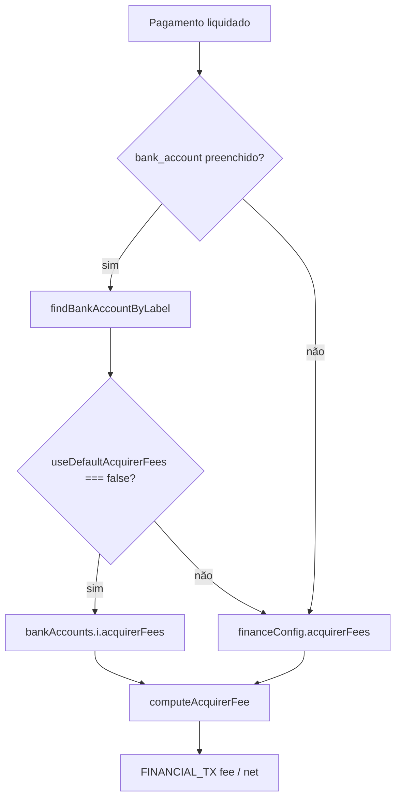

# Taxas da maquininha por conta — TECH Spec

**Data:** 2026-06-17  
**PRODUCT:** [2026-06-17-mdr-por-conta-bancaria-PRODUCT.md](./2026-06-17-mdr-por-conta-bancaria-PRODUCT.md)  
**Status:** Proposta — aguardando aprovação  

**Nota:** MDR permanece apenas em nomes internos (`acquirerFees`, comentários, esta spec). A UI segue PRODUCT §4.

---

## 1. Estado atual

| Peça | Comportamento |
|------|---------------|
| `financeConfig.acquirerFees` | MDR global por método/parcela |
| `financeConfig.bankAccounts[]` | Dados bancários + saldo inicial; **sem** taxas |
| `resolveInitialBankAccountForPayment` | Conta por método / preferência |
| `computeAcquirerFee({ acquirerFees, ... })` | Sempre recebe fees globais |
| Call sites | `studentPayments.js`, `salesMirror.js`, `studentPaymentFinancialTxMirror.js`, `installmentSchedule.js`, `financeForecastInflows.js`, `financeAnticipationHandler.js` |

Rótulo de conta: `formatBankAccountLabel(acc)` — ex. `Sicoob · 12345`, `Pagbank`.

---

## 2. Schema

### 2.1 Conta bancária estendida

```ts
// financeConfig.bankAccounts[i]
{
  bankName: string;
  branch?: string;
  account?: string;
  accountName?: string;
  pixKey?: string;
  openingBalance?: number;
  openingBalanceDate?: string;

  // NOVO — opcional
  useDefaultAcquirerFees?: boolean; // default true quando ausente
  acquirerFees?: AcquirerFees;      // presente quando useDefaultAcquirerFees === false
}
```

`AcquirerFees` = mesmo shape de `defaultAcquirerFees()` em `src/lib/acquirerFees.js`.

### 2.2 Sem mudança

- `financeConfig.acquirerFees` — fallback global
- `financeConfig.acquirerFeePolicy` — inalterado
- `financeConfig.cardFees` — inalterado
- `defaultAccountByMethod` — inalterado (já direciona conta)

### 2.3 Normalização

Em `normalizeBankAccountEntry` (`src/lib/bankAccounts.js`) ou wrapper dedicado:

```js
function normalizeBankAccountWithFees(raw) {
  const base = normalizeBankAccountEntry(raw);
  const useDefault = raw?.useDefaultAcquirerFees !== false;
  const fees = useDefault ? null : normalizeAcquirerFees(raw?.acquirerFees);
  return {
    ...base,
    useDefaultAcquirerFees: useDefault,
    ...(useDefault ? {} : { acquirerFees: fees }),
  };
}
```

Persistência: em `mergeFinanceConfigFromAcademyDoc` / `compactFinanceConfigForSave`, aplicar normalização em cada conta.

**Strip on save:** se `useDefaultAcquirerFees === true`, omitir `acquirerFees` do JSON para economizar bytes.

---

## 3. Resolver central

**Novo arquivo:** `src/lib/resolveAcquirerFees.js`

```js
import { normalizeAcquirerFees, defaultAcquirerFees } from './acquirerFees.js';
import { formatBankAccountLabel, filterBankAccountsWithBank } from './bankAccounts.js';

/** Encontra conta por rótulo exato (bank_account do TX/pagamento). */
export function findBankAccountByLabel(financeConfig, label) {
  const target = String(label || '').trim();
  if (!target) return null;
  const list = filterBankAccountsWithBank(financeConfig?.bankAccounts);
  return list.find((acc) => formatBankAccountLabel(acc) === target) || null;
}

/**
 * MDR efetivo para um pagamento.
 * @param {object} financeConfig
 * @param {string} [bankAccountLabel] — rótulo da conta (FINANCIAL_TX.bank_account)
 * @returns {import('./acquirerFees.js').AcquirerFeesNormalized}
 */
export function resolveAcquirerFeesForAccount(financeConfig, bankAccountLabel = '') {
  const global = normalizeAcquirerFees(financeConfig?.acquirerFees || defaultAcquirerFees());
  const acc = findBankAccountByLabel(financeConfig, bankAccountLabel);
  if (!acc || acc.useDefaultAcquirerFees !== false) return global;
  return normalizeAcquirerFees(acc.acquirerFees || defaultAcquirerFees());
}

/**
 * Para previsão quando ainda não há bank_account no lançamento.
 */
export function resolveAcquirerFeesForMethod(financeConfig, method) {
  const { resolveInitialBankAccountForPayment } = require('./paymentMethodBankDefaults.js');
  const label = resolveInitialBankAccountForPayment(financeConfig, '', method);
  return resolveAcquirerFeesForAccount(financeConfig, label);
}
```

**Regra:** `computeAcquirerFee` **não muda** — callers passam `acquirerFees: resolveAcquirerFeesForAccount(cfg, bankAccount)`.

---

## 4. Call sites (Fase 2)

| Arquivo | Mudança |
|---------|---------|
| `lib/server/studentPaymentFinancialTxMirror.js` | `bank_account` do payload → resolver antes de `mirrorAmountsForPayment` |
| `lib/server/salesMirror.js` | `bank_account` / conta da venda |
| `src/lib/studentPayments.js` | espelho client-side |
| `lib/server/studentPaymentsHandler.js` | `enrichInstallmentScheduleWithAcquirerFees` com conta do pagamento |
| `src/lib/installmentSchedule.js` | forecast por parcela: conta padrão do método |
| `src/lib/financeForecastInflows.js` | `resolveAcquirerFeesForMethod` |
| `lib/server/financeForecastHandler.js` | se montar fees no servidor |
| `lib/server/financeAnticipationHandler.js` | fees da conta do TX pai |

### Assinatura sugerida (wrapper)

```js
export function computeAcquirerFeeForPayment({
  financeConfig,
  bankAccount,
  gross,
  planBase,
  method,
  installments,
}) {
  const acquirerFees = resolveAcquirerFeesForAccount(financeConfig, bankAccount);
  return computeAcquirerFee({
    gross,
    planBase,
    policy: financeConfig?.acquirerFeePolicy,
    method,
    installments,
    acquirerFees,
  });
}
```

Colocar em `src/lib/acquirerFees.js` ou `resolveAcquirerFees.js`.

---

## 5. UI e copy

### 5.1 `financeTermHints.js` — chaves a reescrever

| Chave | Texto novo (sem MDR) |
|-------|----------------------|
| `previsaoLiquidoEstimado` | Entrada líquida estimada no banco após as taxas da maquininha (quando configuradas). |
| `previsaoSaldoAcumulado` | Saldo projetado com entradas líquidas estimadas (após taxa da maquininha) menos saídas previstas. |
| `previsaoMdrOpcional` | Opcional: configure as taxas da maquininha em Configurações → Taxas para estimar o líquido no banco. Sem taxas, bruto e líquido coincidem. |
| `taxaCaixaMdr` | Taxa da maquininha registrada no Caixa — não é o repasse ao aluno dos planos. |

Renomear chave `taxaCaixaMdr` → `taxaCaixaMaquininha` **somente** se todos os imports forem atualizados no mesmo PR (evitar alias morto).

### 5.2 Componentes — strings visíveis

| Arquivo | Mudança |
|---------|---------|
| `FinanceSettingsAcquirerFeesSection.jsx` | Título → “Taxas padrão da maquininha”; labels `— taxa (%)`; política §4.2 PRODUCT |
| `FinanceSettingsFeesSection.jsx` | Lead repasse: “…não é a taxa da maquininha no extrato.” |
| `FinanceSettingsBanksSection.jsx` | Modal: bloco §6.1 PRODUCT; badge “Taxas próprias” |
| `financeSettingsSections.test.js` / `financeTermHints.test.js` | Assert ausência de `/MDR/i` no HTML renderizado das seções Taxas/Recebimento |

Props internas (`acquirerFees`, `patchAcquirer`) **mantêm** nomes técnicos.

### 5.3 Componente reutilizável

Extrair campos de `FinanceSettingsAcquirerFeesSection.jsx` para:

`FinanceSettingsAcquirerFeesFields.jsx` — props: `fees`, `onChange`, `idPrefix`, `showAnticipation?`

Usado por:

- Seção Taxas (global)
- Modal de conta bancária (override)

### 5.4 `FinanceSettingsBanksSection.jsx`

No modal de edição, após saldo inicial:

```jsx
<fieldset>
  <label>
    <input type="checkbox" checked={draft.useDefaultAcquirerFees !== false}
      onChange={(e) => patchDraft({ useDefaultAcquirerFees: e.target.checked })} />
    Usar taxas padrão da academia
  </label>
  {draft.useDefaultAcquirerFees === false ? (
    <FinanceSettingsAcquirerFeesFields ... />
  ) : null}
</fieldset>
```

Card da lista: se `useDefaultAcquirerFees === false` → badge `Taxas próprias`.

### 5.5 `FinanceSettingsAcquirerFeesSection.jsx`

- H3 → “Taxas padrão da maquininha”
- Lead atualizado (ver PRODUCT §4.3)
- `title` prop opcional para reuso no modal (“Taxas desta conta / maquininha”)

### 5.6 Pagamento — preview (P1)

Onde já existir breakdown gross/fee/net no modal (`MatriculaModal`, venda, etc.):

```js
const fees = resolveAcquirerFeesForAccount(financeConfig, bankAccount);
const { fee, net } = computeAcquirerFee({ gross, method, installments, acquirerFees: fees, ... });
```

Re-render ao mudar `bankAccount` no `BankAccountSelect`.

---

## 6. Persistência e limites

| Risco | Mitigação |
|-------|-----------|
| `financeConfig` > `FINANCE_CONFIG_LEGACY_MAX_CHARS` | Omitir `acquirerFees` em contas com `useDefaultAcquirerFees: true`; já existe offload de `bankAccounts` para `settings` |
| Conta duplicada mesmo rótulo | `formatBankAccountLabel` deve ser único na prática; validação soft na UI (warning) — não bloquear v1 |

`digestBankAccounts` em `useFinanceConfigState` deve incluir campos de fees no digest para dirty tracking.

---

## 7. Testes

**Novo:** `src/test/resolveAcquirerFees.test.js`

| Caso | Esperado |
|------|----------|
| Sem label | global |
| Label desconhecido | global |
| Conta `useDefaultAcquirerFees: true` | global |
| Conta override débito 1.5% | `acquirerFeePercent(..., 'cartao_debito') === 1.5` |
| `computeAcquirerFeeForPayment` Sicoob vs PagBank | fees distintas mesmo método |

**Estender:** `acquirerFees.test.js` — wrapper não quebra casos atuais.

**Integração (opcional):** espelho mensalidade com `bank_account` + override.

---

## 8. Migração

- **Read path:** ausência de `useDefaultAcquirerFees` → `true`
- **Write path:** normalizar contas ao salvar `persistAll`
- **Sem backfill** de histórico `FINANCIAL_TX`

---

## 9. Ordem de implementação

```
Fase 1 (1–2 dias)
  resolveAcquirerFees.js + normalize bank account fees
  financeConfigStorage merge
  copy refactor (AcquirerFeesSection, FeesSection, financeTermHints)
  FinanceSettingsAcquirerFeesFields extract
  BanksSection modal + badge
  resolveAcquirerFees.test.js + financeTermHints / settings tests (no MDR in UI)

Fase 2 (2–3 dias)
  studentPaymentFinancialTxMirror + salesMirror + studentPaymentsHandler
  studentPayments.js client mirror
  Tests espelho

Fase 3 (1–2 dias)
  financeForecastInflows + installmentSchedule
  financeAnticipationHandler
  Payment modal preview (P1)
  docs/flows/financeiro/config-inicial-financeiro.md checklist
```

**Estimativa total:** 4–7 dias úteis.

---

## 10. Fora do escopo técnico imediato

- `bankAccounts[].id` UUID — só se renomeações frequentes quebrarem relatórios (não necessário v1 com Abordagem A)
- API route nova — zero; lógica em lib compartilhada server/client
- Persistir `acquirer_fees_source: 'account' | 'global'` no TX — útil debug v2; v1 inferível pela conta

---

## 11. Diagrama de resolução



---

## 12. Histórico

| Data | Mudança |
|------|---------|
| 2026-06-17 | Spec técnica inicial |
| 2026-06-17 | §5 copy: zero MDR na UI; financeTermHints + testes de string |
| 2026-06-17 | Termo canônico UI: **taxa da maquininha** (owner) |
