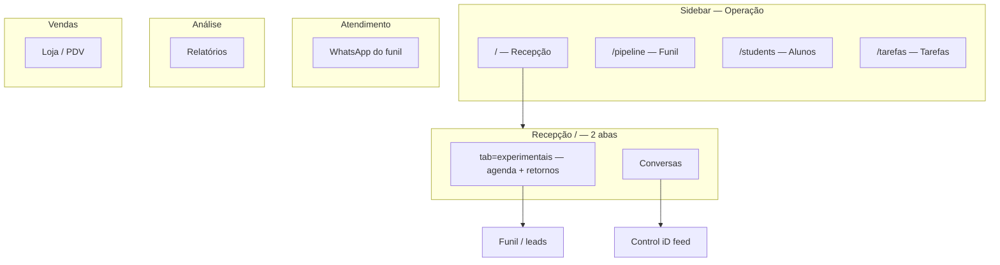

# Recepção + correção da navegação (sidebar e mobile)

**Data:** 2026-06-17  
**Status:** rascunho — aguardando aprovação  
**TECH:** _(a criar após aprovação)_ `2026-06-17-recepcao-navegacao-TECH.md`  
**IMPLEMENTATION:** _(a criar após TECH)_ `2026-06-17-recepcao-navegacao-IMPLEMENTATION.md`

**Specs relacionadas:**

- [2026-06-17-automacoes-ia-restructure-PRODUCT.md](./2026-06-17-automacoes-ia-restructure-PRODUCT.md) — Processos da equipe em Tarefas; Mensagens do funil
- [2026-06-10-dashboard-retornos-row-design.md](./2026-06-10-dashboard-retornos-row-design.md) — retornos no dashboard

**Fluxos afetados** (atualizar no mesmo PR da implementação):

- [hoje-dashboard.md](../../flows/crm/hoje-dashboard.md) → renomear/reescrever como recepção
- [recepcao-controlid.md](../../flows/crm/recepcao-controlid.md) — absorvido em `/`
- [aluno-perfil-presenca.md](../../flows/crm/aluno-perfil-presenca.md) — redirects de presença
- [VALIDATION.md](../../flows/VALIDATION.md) — gaps de presença

**Mock Figma:** não disponível — wire ASCII e mapa de rotas abaixo.

---

## Problema

### 1. “Hoje” não nomeia o produto

A rota `/` já é operacionalmente uma **mesa de recepção**: experimentais, retornos, liberar catraca, novo lead, ligação com funil e alunos. O subtítulo da página diz *“Recepção e retornos do dia”*, mas o menu diz **Hoje** — desalinhamento de IA.

### 2. Catraca e experimentais na mesma densidade visual

Dois fluxos com ritmos diferentes estão (ou estariam) na mesma tela:

| Fluxo | Ritmo | Público típico na catraca |
|-------|--------|----------------------------|
| **Experimentais** | Agendado — “quem vem às 18h” | Lead (muitas vezes **sem** rosto na catraca) |
| **Catraca (Control iD)** | Reativo — feed ao vivo, poll ~6s | Aluno matriculado sincronizado |

Empilhar **feed da catraca** (tempo real, poll) com agenda e retornos na mesma view gera **duas atenções competindo** na hora de pico. Retornos e experimentais são o mesmo fluxo de funil (leads) — ficam juntos; só a **catraca** merece aba separada.

### 3. `/recepcao` duplica a mesa

Existe página separada (`/recepcao`) só para catraca, **fora do menu**, enquanto `/` já tem botão “Liberar catraca”. Duas “recepções” conceituais.

### 4. Sidebar e mobile desalinhados

| Issue | Estado atual | Alvo |
|-------|----------------|------|
| Processos da equipe na sidebar | Removido em sessão recente ✓ | Manter só em `/tarefas?tab=processos` |
| Ícones A receber / A pagar | Corrigidos (`aReceber`, `aPagar`) ✓ | Manter |
| Relatórios sob **Vendas** | Ainda assim | Seção **Análise** |
| “Mensagens do funil” vs Conversas | Nome longo e próximo de inbox | **WhatsApp do funil** |
| Mobile **Mais** — Financeiro | Um link genérico → hub | Atalhos: A receber, Lançamentos, A pagar* |
| `/presenca` → hub quebrado | Redirect para `?view=presenca` inativo em Alunos embutido | Redirect canônico para recepção |
| Drawer + sheet mobile | Duas listas com comportamentos diferentes | Uma superfície secundária |

---

## Princípios

1. **Recepção = um lugar** — rota canônica `/`; catraca não é módulo irmão no menu.
2. **Operar ≠ configurar ≠ analisar** — sidebar = rotina; hubs = profundidade; avatar = config.
3. **Dois modos de atenção na recepção** — **Experimentais** (agenda + retornos, mesmo funil) e **Catraca** em abas distintas — não misturar feed ao vivo com CRM de leads.
4. **Funil e Alunos são cadastro** — recepção consulta e alimenta; não duplica listas completas.
5. **URLs estáveis** — redirects `replace` para bookmarks legados.
6. **Paridade mobile** — mesmas intenções do desktop, não cópia pixel da árvore.

---

## Abordagens consideradas

### A — Recepção em `/` com abas + sidebar corrigida (recomendada)

- Renomear **Hoje → Recepção** no menu; rota permanece `/`.
- Abas internas: **Experimentais** | **Catraca** — retornos permanecem **dentro** de Experimentais (abaixo da agenda).
- `/recepcao` e `/presenca` redirecionam para `/` com `?tab=`.
- Sidebar: seções Operação · Atendimento · Financeiro · Análise; mobile alinhado.

### B — Manter label “Hoje”, só abas

- Menor mudança de hábito; conceito “recepção” continua só no subtítulo.

### C — `/recepcao` como rota principal da mesa

- Menu “Recepção” → `/recepcao`; `/` vira redirect.

| Prós | Contras |
|------|---------|
| URL semântica | Quebra bookmark de `/`; bottom bar “home” deixa de ser `/` |
| | Mais redirects em onboarding e e-mails |

**Recomendação:** **Abordagem A** — `/` continua home autenticada; label e conteúdo passam a ser Recepção.

---

## Estado alvo

### Mapa mental



### Nomenclatura canônica

| Antes | Depois |
|-------|--------|
| Menu / título **Hoje** | **Recepção** |
| Subtítulo página | *Retornos e aulas do dia* (ou data formatada em linha secundária) |
| `/recepcao` (página) | Absorvida — redirect |
| Accordion **Mensagens do funil** | **WhatsApp do funil** |
| Seção sidebar **Vendas** contendo Relatórios | **Análise** → Relatórios; **Vendas** → só loja |

**Bottom bar mobile:** 1º slot continua apontando para `/`; label **Recepção** (não manter “Hoje” só no mobile).

---

## Recepção — estrutura da página (`/`)

### Abas (`HubTabBar`, `?tab=`)

| Tab id | Label UI | Conteúdo | Visibilidade |
|--------|----------|----------|--------------|
| `experimentais` | **Experimentais** | Default. Hero + agenda + **retornos** + aniversários | Todos |
| `catraca` | **Catraca** | `RecepcaoLivePanel` + liberar catraca + status leitor | Control iD ativo ou empty state → Integrações |

**Ordem das abas:** Experimentais · Catraca (apenas duas).

**Badge opcional na aba Experimentais:** contagem de retornos pendentes (ex.: `Experimentais (3)`), sem aba separada.

**Aliases legados de `?tab=`:** `porta` → normalizar para `catraca` (`replace` na URL).

**Default tab:**

| Condição | Abre em |
|----------|---------|
| Sem `?tab=` | `experimentais` |
| `?tab=catraca` / `?tab=porta` / legado `/recepcao` | `catraca` |
| `?retornos=1` | `experimentais` + scroll para `#follow-ups` |
| Fallback | `experimentais` |

### Aba Experimentais (detalhe)

Ordem vertical **fixa** (agenda antes de retornos):

```
Hero enxuto
→ Agenda (hoje em destaque; semana colapsável)
→ Retornos pendentes (#follow-ups)
→ FollowupHealthPanel (desktop, ao lado ou abaixo conforme layout)
```

**Hero reduzido** (não gestão):

- Data + linha de resumo (`buildDaySummaryLine`)
- Banner de prioridade (`getDayPriority`) — preferir agenda quando há aula hoje
- **KPIs: no máximo 2** — `{trial} hoje` + `Tarefas hoje`
- **Remover** KPI “Matrículas no mês” (owner: Relatórios → Funil)

**Agenda** (acima dos retornos):

- **Hoje em destaque** — coluna/dia atual ou painel “só hoje”
- Semana completa: colapsada (“Ver semana”) por default
- Ações: Veio / Não veio; abrir perfil do lead

**Retornos** (abaixo da agenda, mesma aba):

- Bloco atual `#follow-ups` — copilot, WhatsApp, outcome dialog, “+ N no Kanban”
- `FollowupHealthPanel` quando aplicável
- Mobile: seção retornos pode permanecer colapsável; chip de atalho opcional após scroll da agenda

**Aniversários:** banner compacto no hero ou entre agenda e retornos.

### Aba Catraca (detalhe)

- Reutilizar `RecepcaoLivePanel` (feed, poll, liberar catraca) — montar só com `tab=catraca` (lazy)
- **Histórico** → `/?tab=catraca&section=historico` reutilizando `ControlIdAttendancePanel`
- Empty state: integração inativa → CTA `/integracoes?tab=catraca`

### Header da página

- Título: **Recepção**
- Ações globais: **Novo lead** (primário); **Liberar catraca** (secundário) se Control iD ativo — visível em Experimentais e Catraca
- Remover back link “← Alunos” de `Recepcao.jsx` ao absorver conteúdo

---

## Rotas e redirects

| Origem | Destino | Notas |
|--------|---------|-------|
| `/` | `Dashboard` renomeado conceitualmente | Sem mudar path |
| `/recepcao` | `/?tab=catraca` | `replace` |
| `/recepcao?tab=historico` | `/?tab=catraca&section=historico` | preservar query |
| `/presenca` | `/?tab=catraca&section=historico` | corrige hub Alunos quebrado |
| `/students?view=presenca` | `/?tab=catraca&section=historico` | `replace` |
| `/?tab=porta` | `/?tab=catraca` | alias legado |
| `/?retornos=1` | `/?tab=experimentais` + scroll `#follow-ups` | compat legado |
| `/?tab=retornos` | `/?tab=experimentais` + scroll `#follow-ups` | alias legado |

Registrar em `legacyRoutes.js` + componentes em `LegacyRedirects.jsx` / `App.jsx` conforme padrão existente.

**Rota `/recepcao`:** manter arquivo `Recepcao.jsx` como thin redirect ou deprecar após redirects (preferir redirect em rota para não duplicar UI).

---

## Sidebar desktop (`naviMenu.js`)

### Seção **Operação** (links diretos, ordem)

1. **Recepção** → `/` (`iconKey`: `recepcao` ou manter `inicio` até ter ícone DoorOpen/reception)
2. **Funil** → `/pipeline`
3. **Alunos** → `/students`
4. **Tarefas** → `/tarefas`

### Seção **Atendimento**

- **Conversas** → `/inbox`
- Accordion **WhatsApp do funil** (rename) — filhos inalterados: Modelos, Gatilhos, Agente IA*

### Seção **Financeiro** (inalterado na estrutura recente)

Ordem sugerida: Novo lançamento · A receber · Lançamentos · A pagar* · Visão geral*

\* owner/admin

### Seção **Análise** (nova — título de grupo)

- **Relatórios** → `/reports?tab=funil` — **sair** do grupo Vendas

### Seção **Vendas**

- Nova venda · Vendas · Produtos · Estoque — **sem** Relatórios

### Fora da sidebar (menu usuário)

Minha academia · Equipe · Integrações · Conta — sem mudança de princípio.

### Itens que **não** entram na sidebar

- Processos da equipe (`/tarefas?tab=processos`) — só hub Tarefas
- Catraca — só aba dentro de Recepção; config em Integrações → Catraca
- Config Control iD — Integrações

---

## Mobile

### Bottom bar

| Slot | Label | Destino |
|------|-------|---------|
| 1 | **Recepção** | `/` |
| 2 | Conversas | `/inbox` |
| 3 | FAB | Novo lead |
| 4 | Alunos | `/students` |
| 5 | Menu | Sheet único |

### Sheet “Menu” (substituir duplicação drawer + mais)

Seções espelhando desktop:

- **Operação:** Funil · Tarefas
- **Financeiro:** A receber · Lançamentos · A pagar* · Visão geral*
- **Vendas:** Nova venda · … · Estoque
- **Atendimento:** WhatsApp do funil · Agente IA*
- **Análise:** Relatórios
- **Configuração:** Minha academia · Integrações · Equipe* · Conta

**Fase 2 opcional:** remover `NaviMobileDrawer` se sheet cobrir 100% dos itens.

---

## Papéis e módulos

| Item | member | admin/owner |
|------|--------|-------------|
| Recepção (Experimentais + Catraca) | ✓ | ✓ |
| Aba Catraca (se integração off) | empty state | empty state |
| KPI / health retornos | ✓ | ✓ |
| Financeiro sidebar atalhos | subset | completo |
| WhatsApp do funil / Agente | conforme hoje | conforme hoje |

---

## Fora de escopo (v1)

- Cruzar feed catraca com card experimental (“mesma pessoa”) — fase 2
- Renomear rota física `/` → `/recepcao`
- TV / fullscreen modo catraca
- Nova Serverless Function em `/api/`
- Tradução EN da UI

---

## Critérios de aceite

### Recepção

- [ ] Menu e título exibem **Recepção**; rota canônica continua `/`
- [ ] Duas abas: **Experimentais** · **Catraca**
- [ ] Aba Experimentais: agenda **acima** de retornos; hoje visível sem scroll excessivo; retornos na mesma aba; badge opcional na tab; sem KPI “Matrículas no mês”
- [ ] Aba Catraca: feed ao vivo + liberar catraca; histórico acessível
- [ ] `/recepcao` e `/presenca` redirecionam corretamente
- [ ] `npm test` — harness dashboard + redirects + `naviMenu`

### Sidebar / mobile

- [ ] Relatórios na seção **Análise**, não em Vendas
- [ ] Accordion renomeado **WhatsApp do funil**
- [ ] Mobile sheet lista atalhos financeiros granulares
- [ ] Processos da equipe **ausente** da sidebar
- [ ] Ícones financeiros distintos (A receber / A pagar / Lançamentos)

### Documentação

- [ ] Fluxo `hoje-dashboard` atualizado (ou `recepcao-mesa.md` + índice README)
- [ ] `recepcao-controlid.md` aponta para `/?tab=catraca`
- [ ] `VALIDATION.md` — fechar gap `?view=presenca`

---

## Plano de entrega (fases)

### P1 — Recepção hub (PR principal)

- `src/lib/recepcaoHubTabs.js` (novo) — tabs, resolve, defaults
- Refatorar `Dashboard.jsx` → extrair `RecepcaoExperimentaisTab` (agenda + retornos), `RecepcaoCatracaTab`
- Redirects `/recepcao`, `/presenca`
- Copy: Recepção no menu, header, bottom bar
- Testes + fluxos

### P2 — Sidebar e mobile (pode ser mesmo PR se couber)

- `naviMenu.js` — seção Análise, rename WhatsApp, label Recepção
- `mobileMoreNav.js` + sheet/drawer
- `NaviSidebarNav.jsx` — `NAV_SECTION_ANALISE`, ícone recepção

### P3 — Polish

- Hero `getDayPriority` — priorizar agenda vs retornos conforme spec default tab
- Semana colapsável
- Remover drawer duplicado
- Onboarding checklist paths

---

## Arquivos-chave (implementação)

| Arquivo | Ação |
|---------|------|
| `src/pages/Dashboard.jsx` | Hub abas; extrair tabs |
| `src/lib/recepcaoHubTabs.js` | **Criar** |
| `src/pages/Recepcao.jsx` | Redirect ou remover UI duplicada |
| `src/pages/Attendance.jsx` | Redirect → `/?tab=catraca&section=historico` |
| `src/lib/naviMenu.js` | Sidebar + flatten mobile |
| `src/lib/mobileMoreNav.js` | Atalhos financeiros |
| `src/lib/legacyRoutes.js` | Novos redirects |
| `src/App.jsx` | Labels bottom bar; rotas redirect |
| `src/components/layout/NaviSidebarNav.jsx` | Seção Análise |
| `src/test/naviMenu.test.js` | Asserções novas |
| `src/test/recepcaoHubTabs.test.js` | **Criar** |
| `docs/flows/crm/hoje-dashboard.md` | Renomear/atualizar |

---

## Riscos

| Risco | Mitigação |
|-------|-----------|
| `Dashboard.jsx` já grande | Extrair tabs em arquivos dedicados no P1 |
| Usuários habituados a “Hoje” | Release note; subtítulo com data; um ciclo com alias tooltip opcional |
| Poll catraca com aba inativa | Montar `RecepcaoLivePanel` só quando `tab=catraca` (lazy) |
| Regressão NL command / `resolveNlContext` | Manter contexto `dashboard` ou alias `recepcao` nos testes |

---

## Histórico

| Data | Nota |
|------|------|
| 2026-06-17 | Rascunho inicial — conversa IA: IA recepção, abas experimental/catraca, sidebar |
| 2026-06-17 | Retornos dentro de Experimentais (2 abas); agenda acima de retornos |
| 2026-06-17 | Aba renomeada Porta → **Catraca** (`?tab=catraca`; alias `?tab=porta`) |
