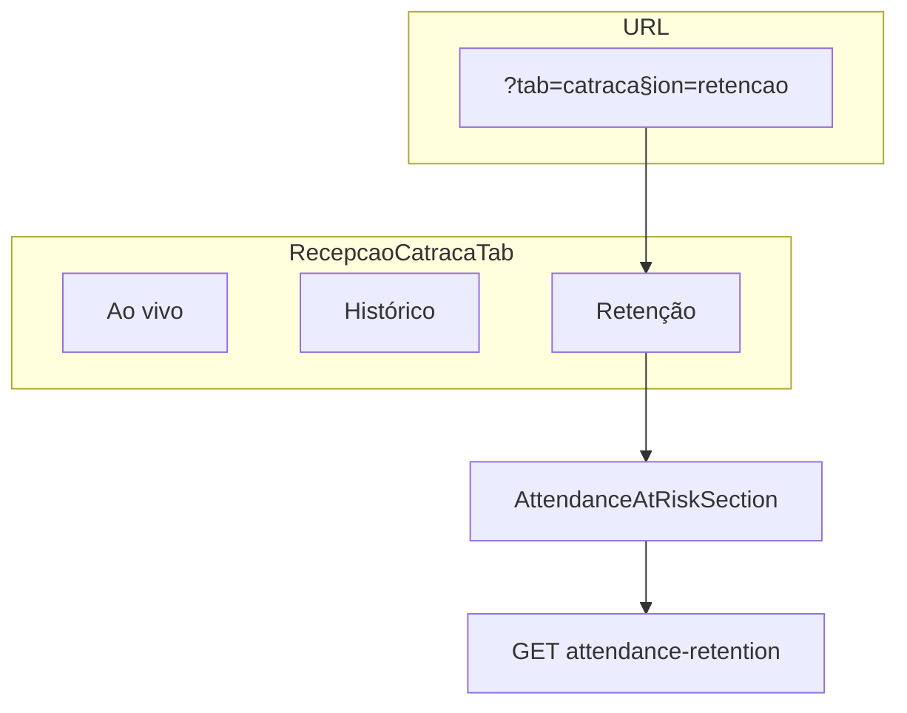

# Retenção por frequência — Evolução UX/UI (TECH)

**Data:** 2026-06-17  
**Status:** rascunho — aguardando aprovação  
**PRODUCT:** [2026-06-17-retencao-frequencia-ux-evolucao-PRODUCT.md](./2026-06-17-retencao-frequencia-ux-evolucao-PRODUCT.md)

---

## Escopo

Implementar requisitos **R-01 a R-19** da spec de produto sobre as superfícies já existentes do módulo de retenção. Sem novas Serverless Functions; reutilizar `GET /api/reports/attendance-retention`, `POST /api/students/retention-action` e bundle de perfil.

**Dependências no código (já entregues):**

| Área | Arquivos |
|------|----------|
| Core | `lib/attendanceRetentionCore.js` |
| API fila | `lib/server/attendanceRetentionHandler.js` |
| Ações aluno | `lib/server/studentsHandler.js` (`handleAttendanceRetentionAction`) |
| Check-in limpa flags | `lib/server/studentRetentionContact.js` |
| UI fila | `src/components/attendance/AttendanceAtRiskSection.jsx`, `AttendanceAtRiskRowActions.jsx` |
| UI catraca | `src/components/recepcao/RecepcaoCatracaTab.jsx` |
| Perfil | `src/pages/StudentProfile.jsx`, `lib/server/attendanceRetentionServer.js` |
| Relatórios | `src/components/reports/ReportsFrequenciaPanel.jsx` |
| Automações | `src/components/academy/AutomacoesSection.jsx`, `src/lib/useAutomations.js` |
| Mesa | `src/pages/Dashboard.jsx`, `src/lib/recepcaoHubTabs.js` |

---

## Decisões técnicas

| # | Decisão | Escolha | Motivo |
|---|---------|---------|--------|
| D1 | Navegação fila (R-05) | Sub-aba `retencao` em `RecepcaoCatracaTab` + query `section=retencao` | Evita scroll infinito com feed ao vivo; alinha com `section=historico` existente |
| D2 | URL canônica fila | `/?tab=catraca&section=retencao` | `recepcaoHubTabs.js` já governa `/`; `/recepcao` permanece redirect |
| D3 | Mini-KPI mesa (R-06) | Fetch leve `attendance-retention` com `include_at_risk` default; cache SWR 5 min | Evita bloquear render da mesa; só `summary` + contagem |
| D4 | Filtros fila (R-07) | Reusar query params API `turma` / `belt`; URL `ret_turma` / `ret_belt` | Paridade com Relatórios (`freq_*`) sem colidir |
| D5 | Limpar em contato (R-03) | `action: 'clear_contact'` já existe no handler | Verificar branch completa; expor na UI |
| D6 | Snooze rápido (R-19) | Novo `action: 'snooze'` ou reutilizar `absence_reason` com `reason: 'snooze'` | Preferir **`action: 'snooze'`** + `snooze_days` sem motivo obrigatório — evento `attendance_snooze` |
| D7 | Badge CSS (R-13) | Mover variantes para `attendance-at-risk.css` | Componente já tem classes parciais |
| D8 | Preview automação (R-09) | Fixture local + picker filtra `status=active` students | Sem API nova |

---

## Arquitetura (E2 — navegação)



---

## Fase E1 — Loop operacional (R-01–R-04)

### R-01 — Sem telefone

**Arquivo:** `AttendanceAtRiskRowActions.jsx`

- Quando `!row.phone`, renderizar `<span class="attendance-at-risk-no-phone">Sem telefone</span>` ao lado do botão WA desabilitado (desktop e mobile).
- CSS: `font-size: 11px`, `color: var(--text-muted)`.

### R-02 — Hint “Em contato”

**Arquivo:** `AttendanceAtRiskSection.jsx` — `handleMarkContact`

- Toast success: `"${name} marcado como em contato. Sai da fila até novo check-in."`

### R-03 — Limpar em contato

**Servidor:** confirmar `clear_contact` em `studentsHandler.js` zera `retention_in_contact`.

**Cliente:**

- `StudentProfile.jsx` — na aba Frequência, se `student.retention_in_contact`, mostrar `StatusBanner` + botão “Voltar para a fila”.
- `AttendanceAtRiskRowActions.jsx` — item de menu “Limpar em contato” **somente** se API passar flag `inContact` (estender payload `at_risk[]` com `retentionInContact` **ou** endpoint separado — preferir campo no row para alunos fora da fila não aparecem; para perfil usar doc do aluno).

**Nota:** alunos `in_contact` não estão na fila; ação “limpar” é só no **perfil** (e futuro histórico de retenção). Menu da fila não precisa do item.

**Teste:** unit em handler se `clear_contact` ainda não coberto.

### R-04 — Trancado / inativo no perfil

**Arquivo:** `StudentProfile.jsx` — aba Frequência

```jsx
{isFreezeActive(student) ? (
  <StatusBanner variant="info">Trancado — frequência não avaliada enquanto o plano estiver congelado.</StatusBanner>
) : !isActiveStudent(student) ? (
  <StatusBanner variant="info">Matrícula encerrada — histórico de frequência abaixo.</StatusBanner>
) : ( /* conteúdo atual */ )}
```

Reusar `isFreezeActive` de `planFreezeCore` / helpers existentes no perfil.

---

## Fase E2 — Descoberta e filtros (R-05–R-07)

### R-05 — Sub-aba Retenção

**Arquivos:**

- `src/lib/recepcaoHubTabs.js` — constante `CATRACA_SECTIONS = ['live', 'historico', 'retencao']`; parse `section` query.
- `RecepcaoCatracaTab.jsx` — terceiro tab “Retenção”; quando `section=retencao`, renderizar só `AttendanceAtRiskSection` (sem live/hist).
- Quando Control iD **desligado** mas attendance OK: única view = retenção (sem sub-tabs live/hist).
- `id="retencao"` no `<section>` para deep link.

**Redirect:** `/recepcao` → manter rewrite; garantir que `section=retencao` sobrevive se aplicável.

### R-06 — Mini-KPI na mesa

**Arquivos:**

- `src/components/dashboard/RecepcaoRetentionHint.jsx` (novo, pequeno)
- `Dashboard.jsx` — render na aba Experimentais se `isAttendanceConfigured()` && `(summary.at_risk + summary.absent + summary.newcomer_at_risk) > 0`
- Hook: `useAttendanceRetentionSummary()` com `fetchAttendanceRetention` + memo por `academyId`

**Link:** `to="/?tab=catraca&section=retencao"`

### R-07 — Filtros na fila

**Arquivos:**

- `AttendanceAtRiskSection.jsx` — toolbar turma/faixa (opções de `data.filters` ou lista derivada dos rows — preferir estender resposta API com `filters: { turmas, belts }` como em `attendance-frequency`)
- `attendanceRetentionHandler.js` — incluir `filters.turmas` / `filters.belts` na resposta (scan único dos elegíveis)
- URL: `ret_turma`, `ret_belt` via `useSearchParams` em `RecepcaoCatracaTab` ou section local

---

## Fase E3 — Automações (R-08–R-10)

**Arquivo:** `AutomacoesSection.jsx`

| Req | Implementação |
|-----|----------------|
| R-08 | `AUTOMATION_GROUP_HINTS` ou hint inline para `absent_student` / `newcomer_at_risk`: “Envia no máximo 1 WhatsApp por ciclo de ausência (cron diário).” |
| R-09 | Em `AutomationRow`, se `isRetentionCron`, passar `previewLeadData` com fixture `{ name: 'Aluno Exemplo', ... }` ou picker restrito a matriculados |
| R-10 | `Link` “Ver fila na recepção” visível quando `cfg.enabled` — `to="/?tab=catraca&section=retencao"` |

**Arquivo:** `src/lib/useAutomations.js` — textos de meta/descrição se necessário.

---

## Fase E4 — Polish (R-11–R-19)

### CSS / design system

**`attendance-at-risk.css`:**

```css
.attendance-risk-badge { font-size: 10px; font-weight: 700; ... }
.attendance-risk-badge--active { background: var(--color-accent-surface); ... }
/* demais variantes */
.attendance-absence-modal__lead { ... }
.attendance-at-risk-actions__btn { min-height: 44px; } /* mobile only */
```

**`AttendanceRiskBadge.jsx`:** remover objeto `style` inline; só `className`.

**`AttendanceAbsenceReasonModal.jsx`:** classes `attendance-absence-*`.

### Relatórios (R-11, R-12)

- `ReportsFrequenciaPanel.jsx` — subtitle na seção KPI: “Panorama do período — para agir hoje, use a fila na recepção.”
- Remover `reports-freq-refresh` se `ReportsPanelShell` já propaga refresh global; senão renomear label.

### Heatmap (R-15, R-16)

**`ReportsFrequenciaPanel.jsx` — `HeatmapGrid`:**

- Calcular `totalCheckins`, `peakDow` no render.
- `<p class="reports-freq-heat-summary">` abaixo do grid.
- Legenda horizontal: 4 amostras de célula com rótulos “Baixa” … “Alta”.
- `aria-describedby` apontando para o resumo.

### Perfil dedup (R-18)

- Se `showAttendanceRiskBadge` no header, aba Frequência omite `AttendanceRiskBadge` no resumo; mantém métricas textuais.

### Snooze rápido (R-19)

**Core:** `ATTENDANCE_RETENTION_EVENT_TYPES.SNOOZE = 'attendance_snooze'`

**Handler:**

```javascript
if (actionType === 'snooze') {
  const snoozedUntil = retentionSnoozeUntilYmd(snoozeDays);
  await databases.updateDocument(..., { retention_snoozed_until: snoozedUntil });
  // evento timeline sem reason obrigatório
}
```

**UI:** submenu no `DropdownMenu` — “Ocultar 7/14/30 dias”.

---

## API — alterações permitidas

| Rota | Mudança |
|------|---------|
| `GET attendance-retention` | Resposta + `filters: { turmas, belts }` |
| `POST retention-action` | Novo `action: 'snooze'`; garantir `clear_contact` documentado |
| Perfil bundle | Opcional: `retentionInContact: boolean` no `attendanceRisk` payload |

**Proibido:** novo `api/*.js`.

---

## Testes

| Fase | Arquivo | Caso |
|------|---------|------|
| E1 | `studentsHandler` ou retention handler test | `clear_contact`, `snooze` |
| E1 | `attendanceRetentionCore.test.js` | — (sem mudança de limiar) |
| E2 | `recepcaoHubTabs.test.js` (criar se não existir) | parse `section=retencao` |
| E4 | snapshot CSS opcional — skip | — |

Rodar: `npm test -- tests/unit/attendance/`

---

## Checklist de implementação

### E1
- [ ] R-01 texto Sem telefone
- [ ] R-02 toast em contato
- [ ] R-03 limpar em contato no perfil
- [ ] R-04 banners trancado/inativo
- [ ] Atualizar `aluno-perfil-presenca.md`

### E2
- [ ] R-05 sub-aba Retenção + query
- [ ] R-06 mini-KPI Dashboard
- [ ] R-07 filtros fila + API filters
- [ ] Atualizar `recepcao-controlid.md`, `hoje-dashboard.md`

### E3
- [ ] R-08–R-10 automações copy + links + preview

### E4
- [ ] R-11–R-19 polish CSS, heatmap, snooze rápido, dedup perfil

---

## Riscos

| Risco | Mitigação |
|-------|-----------|
| Fetch extra na mesa (E2) | SWR + só summary; não carregar `at_risk[]` |
| Duplicar query params `freq_*` vs `ret_*` | Namespaces distintos documentados |
| Sub-aba quebra deep link antigo `#retencao` | Manter id HTML + redirect query |
| Snooze rápido sem motivo reduz qualidade de dados | Evento timeline + métrica separada de `absence_reason` |

---

## Fora de escopo técnico imediato

- Índice Appwrite adicional (filtros turma já em memória após fetch students)
- Cron changes
- Novos campos schema além de event types em `lead_events` (payload JSON basta)
