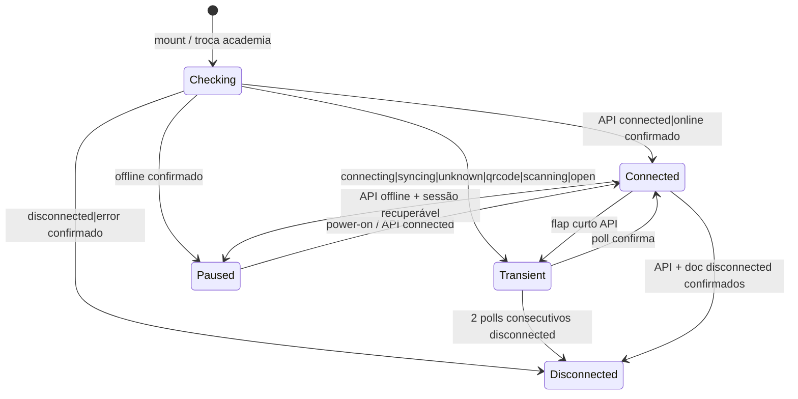

# WhatsApp — Precisão do status de conexão (falsos “desconectado”)

**Data:** 2026-06-17  
**Status:** rascunho — aguardando implementação  
**TECH:** [2026-06-17-whatsapp-connection-status-accuracy-TECH.md](./2026-06-17-whatsapp-connection-status-accuracy-TECH.md)

**Fluxos relacionados:**

- [agente-ia-whatsapp.md](../../flows/atendimento/agente-ia-whatsapp.md) — pareamento e gestão da instância
- [conversas-inbox.md](../../flows/crm/conversas-inbox.md) — banner global e envio
- [funil-lead-matricula.md](../../flows/crm/funil-lead-matricula.md) — perfil do lead / aba Conversa

**Specs relacionadas:**

- [2026-06-16-lead-profile-whatsapp-offline-states-PRODUCT.md](./2026-06-16-lead-profile-whatsapp-offline-states-PRODUCT.md) — estados offline no perfil (não alterar copy dos empty states; corrigir **quando** exibir)
- [2026-06-16-automacoes-ux-onboarding-PRODUCT.md](./2026-06-16-automacoes-ux-onboarding-PRODUCT.md) — readiness Zapster em automações

**Arquivos-chave (hoje):** `src/hooks/useZapsterWhatsAppConnection.js`, `src/lib/whatsappIntegrationState.js`, `lib/server/zapsterInstances.js`, `lib/server/zapsterWebhook.js`

---

## 1. Problem Statement

Operadores e owners veem avisos de **“WhatsApp desconectado”** (banner no Inbox, perfil do lead, notificações e automações) **enquanto o dispositivo continua conectado e recebendo/enviando mensagens**. O problema não é falta de feedback offline — a spec [2026-06-16-lead-profile-whatsapp-offline-states](./2026-06-16-lead-profile-whatsapp-offline-states-PRODUCT.md) já definiu UX correta para desconexão real — e sim **falsos positivos** na detecção de status.

**Quem sofre:** recepcionista no Inbox, owner em Agente IA, equipe que confia no sino de notificações.

**Custo de não resolver:** perda de confiança no produto (“o app mente sobre o WhatsApp”), tentativas desnecessárias de reconexão, interrupção de atendimento, e suporte manual repetitivo.

**Causa raiz (resumo técnico):** múltiplas fontes de status (API Zapster, doc Appwrite, cache local, probe de QR) com regras de precedência e estados transitórios inconsistentes entre telas; várias instâncias do mesmo hook na mesma página; notificações de webhook sem confirmação.

---

## 2. Goals

| # | Objetivo | Métrica |
|---|----------|---------|
| G1 | Banner “WhatsApp desconectado” só aparece quando a desconexão está **confirmada** | ≤ 1 falso positivo em 24 h de uso normal por academia (owner valida) |
| G2 | Mesmo status percebido em Inbox, perfil do lead, widget de chat e Agente IA | 4/4 superfícies concordam em teste manual com WA conectado |
| G3 | Estado `offline` (pausado) distinto de `disconnected` (sem sessão) | Copy e bloqueio de envio alinhados; sem banner “desconectado” para pausa recuperável |
| G4 | Falha temporária de rede/Zapster não confirma desconexão | Timeout ou 500 na primeira carga → UI “verificando…”, não banner offline |
| G5 | Notificação `whatsapp_disconnected` só após confirmação | Flap de webhook &lt; 60 s não gera notificação persistente |

---

## 3. Non-Goals

- Substituir Zapster ou mudar modelo de instância/conta.
- Novo arquivo em `/api/` (permanece hub `api/whatsapp.js?route=instances`).
- Redesign visual dos cards de Agente IA ou empty states offline (copy existente preservada).
- Sincronização histórica de mensagens (`reconcile`) — fora do escopo.
- Multi-instância por academia (continua 1 instância por academia).
- Garantir entrega de mensagem em tempo real (webhook) — escopo é **status na UI**.

---

## 4. Princípios de produto

| Princípio | Implicação |
|-----------|------------|
| **Conservador para desconectar, rápido para conectar** | UI pode mostrar “conectado” ou “verificando” antes de confirmar offline; nunca o inverso |
| **Uma fonte por academia na UI** | Um estado compartilhado evita Inbox “offline” e Agente IA “online” ao mesmo tempo |
| **Estados transitórios não alarmam** | `connecting`, `syncing`, `unknown`, `offline`, QR → sem banner “desconectado” |
| **Offline ≠ desconectado** | `offline` = pausa operacional (power-off Zapster); CTA “Retomar conexão”, não “Configurar do zero” |
| **Webhook avisa, API confirma** | Evento `instance.disconnected` agenda verificação; banner e notificação só após confirmação |

---

## 5. Matriz de estados (alvo)

Fonte canônica: `resolveWhatsAppIntegrationStatus()` (ver TECH) → consumida por `isWhatsAppIntegrationConnected` / `isWhatsAppIntegrationDisconnected` e Agente IA.

### 5.1 Superfícies e comportamento

| Superfície | Conectado | Pausado (`offline`) | Desconectado confirmado | Verificando (`!checked`) |
|------------|-----------|-------------------|-------------------------|-------------------------|
| Inbox banner global | oculto | **novo:** “Conexão pausada — retome em Agente IA” (warning) | “WhatsApp desconectado…” (atual) | oculto |
| Lead Profile banner | oculto | “Conexão pausada…” | “WhatsApp desconectado…” (atual) | oculto |
| Aba Conversa empty | chat normal | empty “Conexão pausada” + CTA retomar | empty offline atual | skeleton |
| Composer envio | habilitado | desabilitado, placeholder pausa | desabilitado, placeholder offline | desabilitado ou skeleton |
| Agente IA card | “Conectado” | “Conexão pausada” (já existe) | “Desvinculado…” | spinner / “Verificando…” |
| Automações readiness | ok | aviso pausa (não “desconectado”) | passo Zapster desconectado | passo pendente verificação |
| Sino notificações | — | sem notificação nova | `whatsapp_disconnected` | — |

### 5.2 Copy (novos / alterados)

| Contexto | Copy |
|----------|------|
| Banner pausa (Inbox / perfil) | **Conexão pausada** — o WhatsApp está em modo pausa. Retome em Agente IA para enviar mensagens pelo app. |
| CTA banner pausa | **Retomar conexão →** (`/agente-ia`) |
| Estado verificando (opcional P1) | **Verificando WhatsApp…** (info, sem ícone de erro) |

Copy de desconexão real permanece conforme [2026-06-16-lead-profile-whatsapp-offline-states](./2026-06-16-lead-profile-whatsapp-offline-states-PRODUCT.md).

---

## 6. User stories

### Recepcionista

- Abrir `/conversas` com WhatsApp conectado e **não** ver banner de desconexão após poll de 60 s ou troca de aba.
- Se a Zapster pausar a instância (`offline`), ver aviso de **pausa** (não “desconectado”) e saber que basta retomar no Agente IA.
- Enviar mensagem no perfil do lead sem banner contraditório na coluna esquerda vs painel de chat.

### Owner

- Conectar QR no Agente IA e ver passo 1 conectado sem flip para “desconectado” segundos depois.
- Não receber notificação “WhatsApp desconectado” por flap de rede de 10–30 s.
- Após timeout Zapster na carga, ver “verificando” ou último estado conhecido — não alarme falso.

### Sistema / automações

- Readiness de automações não marca Zapster “desconectado” em `unknown` ou `offline` — apenas em desconexão confirmada.

---

## 7. Requisitos

### P0 — Must-have

| ID | Requisito | Critério de aceite |
|----|-----------|-------------------|
| R1 | Remover falso `disconnected` por probe de QR | Com API `status: connected` e WA operacional, `fetchWaInfo` **não** rebaixa para `disconnected` só porque QR PNG está disponível ou probe falhou com erro não-406 |
| R2 | `offline` deixa de disparar banner “desconectado” | `isWhatsAppIntegrationDisconnected('offline') === false`; nova função ou flag `isWhatsAppIntegrationPaused` para UI de pausa |
| R3 | Estado compartilhado por `academyId` | LeadProfile + ProfileConversationTab + NaviChatWidget na mesma sessão leem o **mesmo** `waStatus` / `waStatusChecked` (context ou store); um poll por academia |
| R4 | Erro de fetch não confirma offline | `fetchWaInfo` com `silent: true` em falha de rede/timeout: mantém estado anterior; `waStatusChecked` só vira `true` com resposta HTTP parseável ou após N tentativas com estado estável |
| R5 | Precedência API para **conectar** preservada | Se API retorna `connected`/`online`, UI = conectado mesmo com `zapster_status: disconnected` no doc (regressão coberta por teste existente) |
| R6 | Webhook `instance.disconnected` com confirmação | Notificação `whatsapp_disconnected` e gravação `zapster_status: disconnected` no doc só após GET live na Zapster confirmar ≠ connected (ou após grace period 45 s sem mensagens — ver TECH) |
| R7 | Paridade Agente IA ↔ Inbox | Com WA conectado, `zap.waConnected` e banner Inbox oculto simultaneamente |

### P1 — Should-have

| ID | Requisito | Critério de aceite |
|----|-----------|-------------------|
| R8 | Banner distinto para pausa | Inbox e perfil exibem copy §5.2 quando `waStatus === 'offline'` |
| R9 | Debounce de desconexão na UI | Dois polls consecutivos (≥ 15 s apart) com status não-conectado antes de `waOfflineUi = true` quando estado anterior era `connected` |
| R10 | Cache invalidação ao conectar | `invalidateWaConnectionCache` chamado em `syncConnectedUiState` e webhook `connected` |
| R11 | Debug operacional | Log estruturado `[WA status]` em dev com `academyId`, `apiStatus`, `docStatus`, `resolved`, `source` |

### P2 — Future

| ID | Requisito | Nota |
|----|-----------|------|
| R12 | Heartbeat por mensagem recebida | Se webhook `message.received` nos últimos 5 min, suprimir banner disconnected |
| R13 | Métrica Vercel Analytics | Evento `wa_status_false_positive` reportado manualmente pelo usuário |

---

## 8. Cenários de teste manual (checklist)

1. [ ] WA conectado → abrir Inbox, perfil lead, Agente IA → zero banners de desconexão por 5 min (inclui poll 60 s).
2. [ ] WA conectado → recarregar página → sem flash de banner antes de `waStatusChecked`.
3. [ ] Simular timeout Zapster (dev: mock 500) → banner **não** aparece; opcional toast “Não foi possível verificar agora”.
4. [ ] Power-off no Agente IA → banner **pausa** no Inbox (P1), não “desconectado”.
5. [ ] Disconnect real (logout WA no celular) → em ≤ 90 s banner desconectado + notificação (após confirmação).
6. [ ] Reconectar QR → banner some em ≤ 15 s sem recarregar página.
7. [ ] Trocar academia A→B → status de B correto; sem herdar desconectado de A.
8. [ ] Automações: com `offline`, readiness não diz “desconectado”.

---

## 9. Success metrics

| Tipo | Indicador | Meta (30 dias pós-deploy) |
|------|-----------|---------------------------|
| Leading | Tickets suporte “WhatsApp desconectado mas funciona” | −80% vs baseline |
| Leading | Cliques “Reconectar” no Inbox com WA já conectado | −70% |
| Lagging | Academias com ≥1 notificação `whatsapp_disconnected` revertida em &lt; 5 min | &lt; 5% do total |
| Qualidade | Testes automatizados `whatsappIntegrationState` + hook | 100% verde em CI |

---

## 10. Riscos e mitigação

| Risco | Mitigação |
|-------|-----------|
| Suprimir demais → não avisar desconexão real | Debounce só ao **sair** de connected; desconexão confirmada por API ignora debounce |
| Context global quebra testes isolados | Provider opcional em testes; export `WaConnectionContext` mockável |
| Webhook atrasado | Poll 60 s continua como safety net |
| `offline` prolongado tratado como ok | Composer permanece desabilitado; copy deixa claro que envio pelo app não funciona |

---

## 11. Fases de entrega

| Fase | Escopo | Entrega |
|------|--------|---------|
| **F1** | R1, R2, R4, R5 + testes | Corrigir lógica de status sem mudar layout |
| **F2** | R3, R7 + testes integração | Context compartilhado; remover hooks duplicados |
| **F3** | R6, R8, R9 | Backend webhook + banners pausa |
| **F4** | R10, R11, docs flows | Polish, observabilidade, atualizar `docs/flows/` |

---

## 12. Open questions

| # | Pergunta | Dono | Default se sem resposta |
|---|----------|------|-------------------------|
| Q1 | Grace period webhook: 45 s ou confirmar só via API? | Eng | Confirmar via API (mais simples) |
| Q2 | `error` / `failed` da Zapster = desconectado ou transitório? | Produto | Transitório por 1 poll; desconectado no 2º |
| Q3 | Provider React Context vs Zustand slice? | Eng | Context fino em `src/contexts/WaConnectionContext.jsx` |

---

## 13. Governança de docs

Atualizar no mesmo PR da Fase correspondente:

- [agente-ia-whatsapp.md](../../flows/atendimento/agente-ia-whatsapp.md) — matriz de estados e checklist
- [conversas-inbox.md](../../flows/crm/conversas-inbox.md) — banner pausa vs desconectado
- [funil-lead-matricula.md](../../flows/crm/funil-lead-matricula.md) — seção WA offline
- [VALIDATION.md](../../flows/VALIDATION.md) — registrar data da correção

---

## Histórico

| Data | Autor | Mudança |
|------|-------|---------|
| 2026-06-17 | — | Spec inicial a partir de auditoria do fluxo Zapster |
