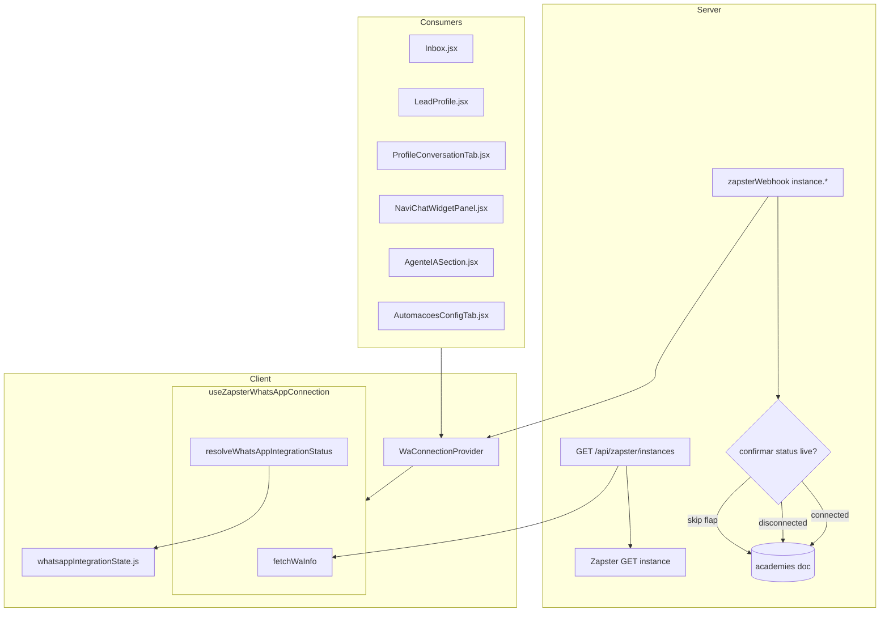

# WhatsApp — Precisão do status de conexão — TECH Spec

**Data:** 2026-06-17  
**Status:** rascunho — aguardando implementação  
**PRODUCT:** [2026-06-17-whatsapp-connection-status-accuracy-PRODUCT.md](./2026-06-17-whatsapp-connection-status-accuracy-PRODUCT.md)

---

## Escopo

Corrigir falsos positivos de “WhatsApp desconectado” unificando resolução de status, compartilhando estado entre componentes e endurecendo confirmação no webhook. **Sem** novo arquivo em `/api/` — alterações em `lib/server/zapsterWebhook.js`, `lib/server/zapsterInstances.js` e frontend.

---

## Diagnóstico (causas no código)

| ID | Sintoma | Causa no código | Severidade |
|----|---------|-----------------|------------|
| C1 | Desconectado com WA ativo | `shouldOverrideConnectedStatusAfterQrProbe` força `disconnected` se QR retorna PNG ou erro ≠ 406 | 🔴 |
| C2 | Banner “desconectado” com instância pausada | `offline ∉ WA_TRANSIENT_STATUSES` em `whatsappIntegrationState.js` | 🔴 |
| C3 | Inbox vs perfil divergem | Múltiplos `useZapsterWhatsAppConnection` na mesma árvore (LeadProfile + ProfileConversationTab + widget) | 🟠 |
| C4 | Banner após timeout | `fetchWaInfo` catch com `!silent` → `setWaStatusChecked(true)` mantendo `disconnected` inicial | 🟠 |
| C5 | Notificação fantasma | `zapsterWebhook.js` grava `disconnected` e notifica no primeiro evento sem confirmar API | 🟠 |
| C6 | `zapsterResolveQrPng` reinicia instância | Power-on/restart ao buscar QR pode flapping de status durante `fetchWaInfo` | 🟡 |
| C7 | Cache conectado stale | TTL 5 min + `deferInitialFetch` pode atrasar detecção de desconexão (inverso do bug, mas relacionado) | 🟡 |

---

## Arquitetura alvo



**Regra:** apenas **um** `WaConnectionProvider` por árvore autenticada (em `App.jsx` ou layout CRM), keyed por `academyId`. O hook existente vira consumidor do contexto; lógica pesada permanece no hook módulo, estado vive no provider.

---

## Módulo canônico de status

### Novo: `src/lib/resolveWhatsAppIntegrationStatus.js`

Centraliza constantes hoje duplicadas entre hook e `whatsappIntegrationState.js`.

```javascript
/** Estados que significam sessão WA ativa para envio pelo app */
export const WA_CONNECTED_STATUSES = new Set(['connected', 'online']);

/** Estados transitórios — UI não deve alarmar desconexão */
export const WA_TRANSIENT_STATUSES = new Set([
  'connecting', 'syncing', 'unknown', 'open', 'qrcode', 'scanning',
  'offline', // NOVO: pausa operacional, não desconexão de pareamento
]);

/** Estados que bloqueiam envio mas com copy de pausa */
export const WA_PAUSED_STATUSES = new Set(['offline']);

export function resolveWhatsAppIntegrationStatus(academyZapsterStatus, apiStatus, instanceId) {
  const docSt = String(academyZapsterStatus || '').trim().toLowerCase();
  const apiSt = String(apiStatus || '').trim().toLowerCase();
  const hasInstance = Boolean(String(instanceId || '').trim());

  if (WA_CONNECTED_STATUSES.has(apiSt)) return 'connected';
  if (WA_TRANSIENT_STATUSES.has(apiSt)) return apiSt;
  // Doc só prevalece se API não contradiz com connected (já coberto acima)
  if (docSt && WA_CONNECTED_STATUSES.has(docSt) && !hasInstance) return docSt;
  if (docSt && !WA_CONNECTED_STATUSES.has(apiSt) && WA_TRANSIENT_STATUSES.has(docSt)) return docSt;
  if (docSt && (apiSt === 'disconnected' || apiSt === 'error' || apiSt === 'failed')) {
    // API e semântica negativa: preferir API se mais específica
    return apiSt || docSt;
  }
  if (docSt) return docSt;
  if (!hasInstance) return 'disconnected';
  return apiSt || 'disconnected';
}
```

> **Nota:** migrar `resolveWaStatus` do hook para este módulo; hook importa e reexporta para compat.

### Alterar: `src/lib/whatsappIntegrationState.js`

```javascript
import { resolveWhatsAppIntegrationStatus, WA_CONNECTED_STATUSES, WA_TRANSIENT_STATUSES, WA_PAUSED_STATUSES } from './resolveWhatsAppIntegrationStatus.js';

export function isWhatsAppIntegrationPaused(waStatus, waStatusChecked) {
  if (!waStatusChecked) return false;
  return WA_PAUSED_STATUSES.has(String(waStatus || '').trim().toLowerCase());
}

export function isWhatsAppIntegrationDisconnected(waStatus, waStatusChecked) {
  if (!waStatusChecked) return false;
  const st = String(waStatus || '').trim().toLowerCase();
  if (WA_CONNECTED_STATUSES.has(st)) return false;
  if (WA_TRANSIENT_STATUSES.has(st)) return false; // inclui offline
  return true;
}
```

---

## F1 — Correções no hook e probe QR (R1, R2, R4, R5)

### C1 — Remover override agressivo de QR

**Arquivo:** `src/hooks/useZapsterWhatsAppConnection.js`

**Remover** bloco:

```javascript
if (incomingId && status === 'connected' && !waPhoneFromApi) {
  const stale = await shouldOverrideConnectedStatusAfterQrProbe(...);
  if (stale) { status = 'disconnected'; ... }
}
```

**Substituir por** (opcional, só quando status ≠ connected e usuário pediu QR):

- Probe de QR **não** roda em `fetchWaInfo` automático.
- `shouldOverrideConnectedStatusAfterQrProbe` → deletar ou restringir a `revealWaQrCode` / `fetchQrCode` quando status local é `qrcode|scanning|open`.

**Teste novo:** `fetchWaInfo` com `status: connected`, sem `wa_phone`, QR retorna PNG → `waStatus` permanece `connected`.

### C4 — Falha de fetch não confirma offline

**Arquivo:** `src/hooks/useZapsterWhatsAppConnection.js`

```javascript
// catch de fetchWaInfo
} catch (e) {
  const prevChecked = waStatusCheckedRef.current;
  const prevResolved = readResolvedWaStatus();
  if (!silent) {
    setConnectionError(friendlyError({ message: msg }, 'action'));
  }
  // Só marca checked se já tínhamos estado confirmado antes OU é erro definitivo (403, instance cleared)
  if (hookMountedRef.current && (prevChecked || instanceCleared)) {
    setWaStatusChecked(true);
  }
  // Não resetar waInfo para disconnected em erro de rede
}
```

Adicionar `waStatusCheckedRef` espelhando state.

**Comportamento:**

| Situação | `waStatusChecked` | `waStatus` |
|----------|-------------------|------------|
| Primeira carga, timeout | `false` | anterior ou `unknown` implícito |
| Poll silent falha, já connected | `true` | mantém `connected` |
| 404 instance cleared | `true` | `disconnected` |

### C2 — Testes `whatsappIntegrationState.test.js`

- `isWhatsAppIntegrationDisconnected('offline', true)` → `false`
- `isWhatsAppIntegrationPaused('offline', true)` → `true`
- `isWhatsAppIntegrationDisconnected('disconnected', true)` → `true`

---

## F2 — Provider compartilhado (R3, R7)

### Novo: `src/contexts/WaConnectionContext.jsx`

```javascript
const WaConnectionContext = createContext(null);

export function WaConnectionProvider({ academyId, children, options = {} }) {
  const value = useZapsterWhatsAppConnection(academyId, {
    statusPollWhileMounted: true,
    watchAcademyStatus: true,
    ...options,
  });
  return <WaConnectionContext.Provider value={value}>{children}</WaConnectionContext.Provider>;
}

export function useWaConnection() {
  const ctx = useContext(WaConnectionContext);
  if (!ctx) {
    throw new Error('useWaConnection requires WaConnectionProvider');
  }
  return ctx;
}

/** Fallback para testes ou rotas sem provider — delega ao hook direto */
export function useWaConnectionOptional(academyId, options) {
  const ctx = useContext(WaConnectionContext);
  if (ctx) return ctx;
  return useZapsterWhatsAppConnection(academyId, options);
}
```

### Montagem do provider

**Arquivo:** `src/App.jsx` (ou layout autenticado que já conhece `academyId`)

Envolver rotas que usam WA:

- `/conversas`, `/lead/:id`, `/aluno/:id`, `/agente-ia`, `/automacoes`

```jsx
<WaConnectionProvider academyId={academyId} options={{ deferInitialFetch: false }}>
  <Outlet />
</WaConnectionProvider>
```

**Inbox** pode manter `deferInitialFetch` via prop do provider por rota se necessário — preferir um único `deferInitialFetch: false` e skeleton no Inbox enquanto `!waStatusChecked`.

### Migrar consumidores

| Arquivo | Antes | Depois |
|---------|-------|--------|
| `Inbox.jsx` | `useZapsterWhatsAppConnection(...)` | `useWaConnection()` |
| `LeadProfile.jsx` | hook direto | `useWaConnection()` — **remover** hook duplicado se só usado para status |
| `ProfileConversationTab.jsx` | hook direto | `useWaConnection()` |
| `NaviChatWidgetPanel.jsx` | hook direto | `useWaConnection()` |
| `AgenteIASection.jsx` | hook direto | `useWaConnection()` |
| `AutomacoesConfigTab.jsx` | hook direto | `useWaConnection()` |
| `StudentProfile.jsx` | indireto via filhos | `useWaConnection()` no banner |

**Poll:** um intervalo 60 s por academia (não 3–4).

### Debounce UI (R9) — no provider/hook

```javascript
const DISCONNECT_DEBOUNCE_MS = 15000;
const disconnectConfirmRef = useRef({ lastConnectedAt: 0, pendingDisconnect: null });

// Após resolve status:
if (WA_CONNECTED_STATUSES.has(resolved)) {
  disconnectConfirmRef.current = { lastConnectedAt: Date.now(), pendingDisconnect: null };
  setWaStatusDebounced(resolved);
} else if (isDefiniteDisconnect(resolved)) {
  const wasConnected = WA_CONNECTED_STATUSES.has(waStatusDebouncedRef.current);
  if (wasConnected) {
    // agenda confirmação; só aplica após 2º poll ou timeout
    scheduleDisconnectConfirm(resolved);
  } else {
    setWaStatusDebounced(resolved);
  }
}
```

Exportar `waStatus` já debounced para banners; `waStatusImmediate` para Agente IA QR polling.

---

## F3 — Webhook e banners pausa (R6, R8, R9)

### C5 — Confirmação no webhook

**Arquivo:** `lib/server/zapsterWebhook.js`

Fluxo `isInstanceStatusEvent`:

```javascript
if (isDisconnected) {
  const live = await zapsterGetInstance(instanceId); // importar de zapsterInstances ou extrair helper
  const liveSt = String(live?.data?.status || '').trim().toLowerCase();
  if (live.ok && (liveSt === 'connected' || liveSt === 'online')) {
  console.log('[zapster][webhook] disconnect ignorado — API ainda connected', { instanceId });
    return res.status(200).json({ ok: true, ignored: true, reason: 'still_connected' });
  }
  // prosseguir: patch doc + notificação
}
```

**Alternativa sem round-trip síncrono (se latência for problema):** gravar `zapster_status: 'disconnecting'` no doc; cron/job existente não disponível no Hobby — **preferir** confirmação inline com timeout 8 s.

Notificação `whatsapp_disconnected` **somente** após patch confirmado.

### C5b — Promover doc para disconnected no GET

**Arquivo:** `lib/server/zapsterInstances.js` — após `zapsterGetInstance`:

```javascript
if (status !== 'connected' && docStatus === 'connected') {
  const st = status.toLowerCase();
  if (st === 'disconnected' || st === 'error' || st === 'failed') {
    try {
      await databases.updateDocument(..., { zapster_status: st, zapster_status_updated_at: ... });
      zapsterStatus = st;
    } catch { /* */ }
  }
}
```

Evita doc eternamente `connected` quando API já caiu (sem depender só de webhook).

### R8 — Banners pausa

**Novos componentes (ou props em existentes):**

| Arquivo | Mudança |
|---------|---------|
| `src/components/inbox/InboxGlobalBanners.jsx` | Prop `showWaPausedBanner`; copy PRODUCT §5.2 |
| `src/components/profile/ProfileWhatsAppOfflineBanner.jsx` | Renomear para `ProfileWhatsAppStatusBanner.jsx` com variant `offline\|paused\|disconnected` **ou** componente irmão `ProfileWhatsAppPausedBanner.jsx` |
| `Inbox.jsx` | `showWaPausedBanner = isWhatsAppIntegrationPaused(...)` |
| `LeadProfile.jsx` | idem |

---

## F4 — Cache, debug, docs (R10, R11)

### Cache

- `syncConnectedUiState` → `invalidateWaConnectionCache(academyId)` antes de `writeWaConnectionCache`
- Realtime `connected` → invalidar cache antes de write
- Ao confirmar `disconnected` debounced → `invalidateWaConnectionCache`

### Debug

```javascript
function logWaStatusDecision(payload) {
  if (!inboxDebugEnabled()) return;
  console.log('[WA status]', payload);
}
```

Payload: `{ academyId, apiStatus, docStatus, instanceId, resolved, debounced, fetchError }`.

### C6 — QR no servidor

**Arquivo:** `lib/server/zapsterInstances.js` — `zapsterResolveQrPng`

Adicionar parâmetro `opts = { allowRecovery: true }`. Quando chamado implicitamente (não ação usuário `action=qrcode`), `allowRecovery: false` — **não** executar restart em GET de status.

Na prática F1 remove probe em `fetchWaInfo`; F4 opcional restringe restart em `action=qrcode` apenas quando `req.query.intent=pairing` (query opcional do frontend ao exibir QR).

---

## Arquivos tocados (resumo)

| Arquivo | Fase |
|---------|------|
| `src/lib/resolveWhatsAppIntegrationStatus.js` | F1 | **novo** |
| `src/lib/whatsappIntegrationState.js` | F1 |
| `src/hooks/useZapsterWhatsAppConnection.js` | F1, F2 |
| `src/contexts/WaConnectionContext.jsx` | F2 | **novo** |
| `src/App.jsx` (ou layout) | F2 |
| `src/pages/Inbox.jsx` | F2, F3 |
| `src/pages/LeadProfile.jsx` | F2, F3 |
| `src/components/inbox/ProfileConversationTab.jsx` | F2 |
| `src/components/chat-widget/NaviChatWidgetPanel.jsx` | F2 |
| `src/components/academy/AgenteIASection.jsx` | F2 |
| `src/pages/AutomacoesConfigTab.jsx` | F2 |
| `src/lib/automationUx.js` | F2 | `computeAutomationReadiness` usa `waPaused` |
| `lib/server/zapsterWebhook.js` | F3 |
| `lib/server/zapsterInstances.js` | F3, F4 |
| `src/components/inbox/InboxGlobalBanners.jsx` | F3 |
| `src/components/profile/ProfileWhatsApp*.jsx` | F3 |
| `src/test/whatsappIntegrationState.test.js` | F1 |
| `src/test/useZapsterWhatsAppConnection.test.js` | F1, F2 |
| `src/test/WaConnectionContext.test.jsx` | F2 | **novo** |
| `docs/flows/atendimento/agente-ia-whatsapp.md` | F4 |
| `docs/flows/crm/conversas-inbox.md` | F4 |

**Limite Vercel:** nenhum arquivo novo em `/api/`.

---

## Testes automatizados

### F1

```javascript
describe('resolveWhatsAppIntegrationStatus', () => {
  it('API connected vence doc disconnected', () => { ... });
  it('offline é transitório', () => { ... });
});

describe('fetchWaInfo QR probe', () => {
  it('não rebaixa connected quando QR retorna PNG', () => { ... });
});

describe('fetchWaInfo errors', () => {
  it('timeout na primeira carga mantém waStatusChecked false', () => { ... });
  it('timeout em poll silent preserva connected', () => { ... });
});
```

### F2

```javascript
describe('WaConnectionProvider', () => {
  it('dois consumidores veem o mesmo waStatus', () => { ... });
  it('apenas um fetch por academyId no mount', () => { ... });
});
```

### F3

```javascript
// zapsterWebhook.test.js
it('instance.disconnected ignorado se API ainda connected', () => { ... });
it('instance.disconnected notifica só após confirmação', () => { ... });
```

### Regressão

- `src/test/NaviChatWidget.test.jsx` — offline empty ainda aparece para `disconnected`, não para `offline`
- `src/test/automationUx.test.js` — readiness com `offline` → passo pausa, não desconectado
- `src/test/useZapsterWhatsAppConnection.test.js` — teste `acad-stale-doc` intacto

---

## Decisões técnicas

| # | Decisão | Escolha | Motivo |
|---|---------|---------|--------|
| D1 | Onde vive estado compartilhado | React Context + hook interno | Menor diff que Zustand; academyId já no tree |
| D2 | Remover vs fixar QR probe | **Remover** de `fetchWaInfo` | Causa #1 de falso negativo |
| D3 | `offline` em TRANSIENT | Sim | Alinha com Agente IA; pausa via `isPaused` |
| D4 | Debounce desconexão | 2 polls / 15 s | Balanceia flap vs atraso aceitável |
| D5 | Webhook confirmação | GET live síncrono | Hobby sem cron; timeout 8 s ok |
| D6 | `useWaConnectionOptional` | Manter em testes legados | Evita quebrar todos os mocks de uma vez |

---

## Ordem de implementação recomendada

1. `resolveWhatsAppIntegrationStatus.js` + testes unitários
2. Atualizar `whatsappIntegrationState.js` + testes
3. Remover QR probe de `fetchWaInfo` + testes hook
4. Tratamento de erro em `fetchWaInfo`
5. `WaConnectionContext` + montar em App
6. Migrar consumidores (um PR ou commits atômicos por página)
7. Debounce disconnect
8. Webhook confirmação + teste server
9. Banners pausa
10. Docs flows + VALIDATION

---

## Rollback

Cada fase é independente:

- **F1** — revertível sem provider; maior impacto no bug
- **F2** — provider pode ficar atrás de feature flag `VITE_WA_SHARED_CONTEXT=1`
- **F3** — webhook: flag env `ZAPSTER_WEBHOOK_CONFIRM_DISCONNECT=0` restaura comportamento antigo

---

## Histórico

| Data | Autor | Mudança |
|------|-------|---------|
| 2026-06-17 | — | TECH spec inicial |
