# WhatsApp — Handoff Integrações ↔ Agente IA

**Data:** 2026-06-18  
**Status:** rascunho — aguardando implementação  
**TECH:** [2026-06-18-whatsapp-integracoes-agente-handoff-TECH.md](./2026-06-18-whatsapp-integracoes-agente-handoff-TECH.md)

**Contexto:** A conexão WhatsApp foi movida para `/integracoes?tab=whatsapp`; configuração e ativação do assistente permanecem em `/agente-ia`. Handoff via `?setup=1` já existe no código; esta spec fecha lacunas de **descoberta**, **continuidade narrativa** e **onboarding**.

**Fluxos relacionados:**

- [agente-ia-whatsapp.md](../../flows/atendimento/agente-ia-whatsapp.md)
- [agente-ia-automacoes.md](../../flows/atendimento/agente-ia-automacoes.md)
- [onboarding-academia.md](../../flows/config/onboarding-academia.md)
- [conversas-inbox.md](../../flows/crm/conversas-inbox.md)

**Specs relacionadas:**

- [2026-06-17-agente-ia-config-ux-evolucao-PRODUCT.md](./2026-06-17-agente-ia-config-ux-evolucao-PRODUCT.md) — card do assistente (ativar/pausar)
- [2026-06-17-whatsapp-connection-status-accuracy-PRODUCT.md](./2026-06-17-whatsapp-connection-status-accuracy-PRODUCT.md) — matriz connected / paused / disconnected

**Rotas canônicas (já no código):**

- `INTEGRACOES_WHATSAPP_PATH` → `/integracoes?tab=whatsapp`
- `AGENTE_IA_SETUP_PATH` → `/agente-ia?setup=1`

---

## 1. Problem Statement

Donos conectam o WhatsApp em **Integrações** (menu do usuário) mas não encontram o próximo passo (**Agente IA** na sidebar). Quem abre **Agente IA** primeiro vê bloqueio e precisa descobrir Integrações sozinho. O onboarding trata `connect_whatsapp` e `setup_ai` como passos independentes sem ordem enforced na UI.

**Quem sofre:** owner na primeira configuração; member que prepara o assistente enquanto aguarda o dono conectar.

**Custo de não resolver:** abandono após QR escaneado, assistente nunca configurado, tickets “conectei mas não responde”, percepção de fluxo quebrado entre duas telas.

---

## 2. Goals

| # | Objetivo | Métrica |
|---|----------|---------|
| G1 | Owner encontra **Conectar WhatsApp** sem abrir menu do usuário | Link visível na sidebar seção Atendimento quando WA não concluído |
| G2 | Após conectar, usuário sabe o próximo passo em ≤5 s | ≥80% dos testes moderados (5 owners) clicam CTA “Configurar assistente” sem hesitar |
| G3 | Jornada completa legível em qualquer tela | Stepper 3 passos (Conectar → Configurar → Ativar) visível na aba WhatsApp e no Agente IA |
| G4 | Onboarding não leva a dead-end | Clicar `setup_ai` sem WA redireciona ou bloqueia com mensagem clara |
| G5 | Docs e fluxos refletem arquitetura atual | Checklist Seção A de `agente-ia-whatsapp.md` e `onboarding-academia.md` atualizados no mesmo PR |

---

## 3. Non-Goals

- Mover Integrações para item principal da sidebar (fora do menu do usuário) — apenas link contextual **Conectar WhatsApp** na seção Atendimento.
- Auto-navegação forçada pós-QR (redirect automático para `/agente-ia`) — preferir CTA explícito; evita surpresa e perda de contexto na Integrações.
- Novo arquivo em `/api/` (limite Hobby 12/12).
- Redesign completo do wizard `AgenteChatSetup`.
- Unificar Integrações + Agente IA numa única rota.
- Alterar permissões Zapster ou contrato `useZapsterWhatsAppConnection`.

---

## 4. Jornada alvo (produto)

```mermaid
flowchart LR
  subgraph descoberta [Descoberta]
    N[Sidebar: Conectar WhatsApp]
    O[Onboarding passo connect_whatsapp]
    I[Inbox empty / Agente IA banner]
  end
  subgraph integracoes [Integrações · WhatsApp]
    S[Stepper 1/3 Conectar]
    Q[QR + status]
    H[Handoff CTA Configurar assistente]
  end
  subgraph agente [Agente IA]
    S2[Stepper 2/3 Configurar]
    W[Wizard ?setup=1]
    S3[Stepper 3/3 Ativar]
  end
  descoberta --> integracoes
  integracoes -->|AGENTE_IA_SETUP_PATH| agente
  agente --> Inbox[Conversas operacionais]
```

### 4.1 Papéis

| Papel | Conectar WA | Configurar assistente | Ver stepper |
|-------|-------------|----------------------|-------------|
| Owner | Sim | Sim (se `canEditAgentPrompt`) | Sim |
| Member admin | Não | Sim (se `canEditAgentPrompt`) | Sim; copy “peça ao dono para conectar” |
| Member sem edição | Não | Não | Banner readonly |

---

## 5. User stories

### Owner

- Ver **Conectar WhatsApp** na sidebar (Atendimento) enquanto o passo 1 não estiver concluído; link some ou vira neutro quando conectado.
- Na aba WhatsApp, ver **passo 1 de 3** destacado e, após conectar, CTA primário **Configurar assistente** (sem toast + banner duplicados).
- Ao clicar o CTA, cair em Agente IA com wizard aberto (`?setup=1`) e stepper **2 de 3** visível.
- Se voltar à Integrações depois de conectar, ver banner persistente **“Próximo: configure o assistente”** até `setup_ai` concluído no onboarding (ou prompt configurado — ver TECH).
- Status **pausado** não exibir “● Conectado”; copy alinhada à spec de status.

### Member

- Sem link **Conectar WhatsApp** na sidebar (owner-only).
- No Agente IA, preparar assistente com copy: *“Peça ao dono para conectar o WhatsApp em Integrações — você já pode preparar as instruções.”*
- Copiar link de Integrações para enviar ao dono.

### Onboarding (banner global)

- Passo **Conectar WhatsApp** → `/integracoes?tab=whatsapp`.
- Passo **Configurar assistente** → `/agente-ia?setup=1` **somente se** WA concluído; caso contrário → Integrações com toast *“Conecte o WhatsApp primeiro”*.
- Ordem visual: `connect_whatsapp` antes de `setup_ai`; passo 2 aparece disabled ou com ícone de cadeado até passo 1 done.

---

## 6. Requirements

### P0 — Must ship

#### R1 — Sidebar: link **Conectar WhatsApp**

| Item | Detalhe |
|------|---------|
| Onde | Seção **Atendimento**, imediatamente acima ou abaixo de **Agente IA** |
| Rota | `INTEGRACOES_WHATSAPP_PATH` |
| Visibilidade | Owner (ou quem pode conectar — hoje `role === 'owner'`) **e** `!waSetupDone` |
| Collapsed | Ícone + tooltip “Conectar WhatsApp” |
| Mobile more | Mesmo item em `flattenNavItemsForMobile` quando aplicável |
| Estilo | `SideNavLink` padrão; opcional badge/dot warning enquanto pendente |

**Aceite:**

- [ ] Owner sem WA vê o link; após `waSetupDone`, link some.
- [ ] Member não vê o link.
- [ ] Link ativo quando `pathname=/integracoes` e `tab=whatsapp`.

#### R2 — Onboarding: ordem e guard de `setup_ai`

**Aceite:**

- [ ] `onboardingStepPath('connect_whatsapp')` → Integrações (já implementado).
- [ ] Clique em `setup_ai` com WA pendente → navega Integrações + toast (não Agente IA bloqueado).
- [ ] Lista de passos no banner: `setup_ai` visualmente indisponível até `connect_whatsapp` done (disabled ou ordem fixa).

#### R3 — Stepper 3 passos na aba WhatsApp (Integrações)

Componente compacto acima do card de conexão:

| Passo | Label | Estado |
|-------|-------|--------|
| 1 | Conectar WhatsApp | current / done |
| 2 | Configurar assistente | locked até passo 1 done; link para `AGENTE_IA_SETUP_PATH` quando desbloqueado |
| 3 | Ativar atendimento | locked até passo 2 done; link para `/agente-ia` |

**Aceite:**

- [ ] Owner vê stepper em `/integracoes?tab=whatsapp`.
- [ ] Passo 2 clicável só após passo 1 done.
- [ ] Passo 3 clicável só após prompt configurado (mesma regra de `promptConfigurado` / onboarding `setup_ai`).

#### R4 — Handoff pós-conexão (Integrações)

**Aceite:**

- [ ] **Um** feedback de sucesso ao conectar: toast **ou** banner (não ambos).
- [ ] Banner persistente “Próximo: configure o assistente” enquanto passo 2 pendente (não só na transição `!connected → connected`).
- [ ] Botão primário no resumo conectado: **Configurar assistente** → `AGENTE_IA_SETUP_PATH`.
- [ ] Botão secundário: **Ver conversas** → `/inbox`.

#### R5 — Agente IA: contexto de entrada

**Aceite:**

- [ ] `?setup=1` continua abrindo wizard uma vez (já implementado).
- [ ] Prefix do header: se `location.state.fromIntegracoes` ou query `from=integracoes`, mostrar **← Voltar para Integrações** em vez de “Voltar para conversas”.
- [ ] Stepper 2 passos (Configurar / Ativar) só quando passo 1 WA done (já implementado).

#### R6 — Governança de fluxos

**Aceite (mesmo PR da implementação):**

- [ ] Atualizar `docs/flows/atendimento/agente-ia-whatsapp.md` — wizard 2 passos em Agente IA; WA em Integrações; checklist Seção A.
- [ ] Atualizar `docs/flows/config/onboarding-academia.md` — destinos e ordem dos passos.
- [ ] Registrar delta em `docs/flows/VALIDATION.md`.

---

### P1 — Should ship (mesmo PR se couber)

#### R7 — Copy de status na Integrações

| Status API | UI (Integrações) |
|------------|------------------|
| `connected` / `online` | **Conectado** |
| `offline` | **Conexão pausada** (não “Conectado”) |
| QR / `open` / `scanning` | **Aguardando leitura do QR** |
| `disconnected` | **Desvinculado** |

Chip verde “● Conectado” só quando `zap.waConnected === true`.

#### R8 — Member no Agente IA

Banner info quando `!waDone && canEditPrompt`: preparar instruções + copiar link Integrações para o dono (sem duplicar banner warning do owner).

#### R9 — CTAs externos consistentes

Revisar copy que ainda diz “Agente IA” para conectar WA (automacoes readiness já corrigido); alinhar banner pausa da spec de status para apontar **Integrações** em vez de Agente IA quando aplicável (coordenar com spec de status).

---

### P2 — Future

- Lembrar última aba em `/integracoes` (localStorage) — default catraca para quem só usa catraca.
- Redirect opcional “Continuar para configurar assistente” modal 5 s após QR (A/B).
- Métrica analytics: `wa_connected → agent_setup_started` funnel.

---

## 7. Success metrics

| Tipo | Métrica | Alvo (30 dias pós-ship) |
|------|---------|-------------------------|
| Leading | % academies com WA conectado que abrem Agente IA em 24 h | ≥ 60% |
| Leading | Tempo mediano conectar → salvar prompt (owner teste) | ≤ 15 min |
| Leading | Cliques sidebar “Conectar WhatsApp” / owners sem WA | baseline + uso > 0 |
| Lagging | Tickets “conectei WhatsApp mas IA não responde” | −30% vs mês anterior |
| Lagging | Onboarding `setup_ai` done / `connect_whatsapp` done | ≥ 85% ratio |

---

## 8. Open questions

| # | Pergunta | Dono | Bloqueante? |
|---|----------|------|-------------|
| Q1 | Banner persistente na Integrações usa flag `setup_ai` do onboarding ou fetch `promptConfigurado`? | Eng | Sim — ver TECH (recomendado: hook leve ou store compartilhado) |
| Q2 | Link sidebar some com `waSetupDone` (pareado pausado) ou só com `waConnected`? | Produto | Sim — recomendado: `waSetupDone` (instância pareada) |
| Q3 | Member com `canEditAgentPrompt` vê stepper completo ou versão reduzida? | Produto | Não — mesma UI, CTAs de conexão owner-only |

---

## 9. Timeline e fases

| Fase | Escopo | Entrega |
|------|--------|---------|
| **v1 (este PR)** | R1–R6 + R7 se trivial | Navegação, stepper, handoff, onboarding guard, docs |
| **v1.1** | R8–R9 | Copy member + alinhamento banners pausa |
| **v2** | P2 | Persistência aba Integrações, analytics |

**Dependências:** estado WA compartilhado (`useZapsterWhatsAppConnection` ou selector no store) para sidebar sem N+1 requests.

---

## 10. Checklist de demo (Seção B — narrativa)

1. Owner novo: sidebar **Conectar WhatsApp** → Integrações → stepper 1/3 → QR → banner + botão **Configurar assistente**.
2. CTA → Agente IA, wizard abre, stepper 2/3 → concluir config → passo 3 **Ativar**.
3. Voltar Integrações: stepper mostra 1✓ 2✓ 3 pendente ou done.
4. Onboarding: tentar **Configurar IA** antes do WA → redireciona Integrações.
5. Member: sem link sidebar; Agente IA com copy para dono.
