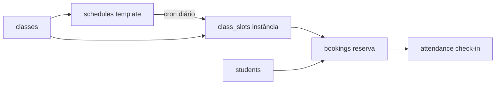

# Agendamento operacional — slots, reservas e presença — PRODUCT Spec

**Data:** 2026-06-19  
**Status:** rascunho — aguardando aprovação  
**TECH:** *(a escrever após aprovação)* → `2026-06-19-agendamento-reservas-TECH.md`

**Contexto:** Fases 0–6 entregaram **turmas** (`classes`) + **grade template** (`schedules`) + integração de labels. Schema de **`class_slots`**, **`bookings`** e patch em **`attendance`** já está provisionado (`npm run provision:booking-schema`), mas **não há código de aplicação**.

**Fluxos relacionados:**

- [empresa-horarios-turmas.md](../../flows/config/empresa-horarios-turmas.md) — catálogo turma + grade (✅ entregue)
- [recepcao-controlid.md](../../flows/crm/recepcao-controlid.md) — presença ao vivo / catraca
- [aluno-perfil-presenca.md](../../flows/crm/aluno-perfil-presenca.md) — perfil e check-in manual
- [hoje-dashboard.md](../../flows/crm/hoje-dashboard.md) — Recepção do dia

**Specs relacionadas:**

- [2026-06-17-catraca-gaps-prioridade-alta-PRODUCT.md](./2026-06-17-catraca-gaps-prioridade-alta-PRODUCT.md) — presença Control iD (complementar, não substituir)

**Mock Figma:** não disponível — wireframes ASCII na seção UX.

---

## 1. Inventário — o que já existe

| Camada | Estado | Evidência |
|--------|--------|-----------|
| `classes` + CRUD UI | ✅ | `ClassesSection`, `classesStore` |
| `schedules` + CRUD UI | ✅ | `SchedulesSection`, `schedulesStore` |
| Grade semanal na Recepção | ✅ | `RecepcaoSchedulesGrid` (template, não reservas) |
| Labels turma (selects) | ✅ | `useAcademyTurmas`, `resolveAcademyTurmaLabels` |
| Schema `class_slots` | ✅ Appwrite | `scripts/create-class-slots-collection.mjs` |
| Schema `bookings` | ✅ Appwrite | `scripts/create-bookings-collection.mjs` |
| `attendance.booking_id` / `slot_id` | ✅ Appwrite | `patch-attendance-booking-schema.mjs` |
| Env vars | ✅ | `.env.example` — `CLASS_SLOTS`, `BOOKINGS` |
| Geração de slots (cron) | ❌ | — |
| Reserva / cancelamento | ❌ | — |
| UI lista inscritos / lotação | ❌ | — |
| Presença ↔ booking | ❌ | Control iD grava `attendance` sem `slot_id` |

**Conclusão:** implementar **camada operacional** sobre schema existente; não recriar turmas/grade.

---

## 2. Problem Statement

Recepcionistas e gestores configuram a grade semanal, mas **não conseguem**:

1. Saber **quantos alunos estão inscritos** na aula de hoje (19h Adulto).
2. **Reservar vaga** antes da aula (walk-in, telefone, app futuro).
3. **Respeitar capacidade** (`max_capacity`) sem planilha paralela.
4. Ligar **check-in** (catraca ou manual) à **aula específica** do dia.

Sem isso, a grade é só referência visual; lotação e presença por aula ficam fora do Nave.

**Personas:** recepcionista (opera o dia), owner (configura regras), aluno *(fase futura — auto-reserva)*.

---

## 3. Goals

| # | Objetivo | Métrica de sucesso |
|---|----------|-------------------|
| G1 | Materializar aulas do dia a partir da grade | Cron gera `class_slots` para D..D+13 sem duplicar |
| G2 | Reservar e cancelar vaga na recepção | Recepcionista inscreve aluno em slot do dia em ≤3 cliques |
| G3 | Respeitar capacidade | Tentativa acima de `max_capacity` bloqueada com mensagem clara |
| G4 | Visibilidade operacional | Recepção mostra lotação `N/max` por aula do dia |
| G5 | Presença ligada ao slot *(v1 mínimo)* | Check-in manual ou catraca preenche `booking.checked_in_at` quando match |

---

## 4. Non-Goals (v1)

| Item | Motivo |
|------|--------|
| App aluno / portal self-service | v1 = recepcionista; API preparada com `source` |
| Lista de espera automática | Campo `waitlist_position` existe; UI v2 |
| Pagamento por aula avulsa | Domínio financeiro separado |
| Bloquear catraca sem reserva | Regra opcional v2; catraca continua independente |
| Novo arquivo em `/api/` | Limite Hobby 12/12 — rotas em handler existente + rewrite cron |
| Substituir `students.turma` por `class_id` | Mantém string; match por nome/turma do slot |
| Reagendamento em massa / feriados | v2 — cancelar slot (`status=cancelled`) manual |

---

## 5. Modelo de domínio (resumo)



| Entidade | Papel |
|----------|--------|
| `schedules` | Recorrência (seg/qua 19:00) — **já existe** |
| `class_slots` | Uma ocorrência concreta (`slot_date=2026-06-19`, `starts_at`, …) |
| `bookings` | Aluno X reservou slot Y (`status`: `booked` \| `cancelled` \| `checked_in` \| `no_show`) |
| `attendance` | Registro de presença; v1 preenche `slot_id` / `booking_id` quando houver match |

**Status sugeridos**

- `class_slots.status`: `scheduled` \| `cancelled` \| `completed`
- `bookings.status`: `booked` \| `cancelled` \| `checked_in` \| `no_show`

---

## 6. User stories

### Recepcionista

- **US1:** Ver **aulas de hoje** com horário, turma, professor e **vagas (3/20)**.
- **US2:** **Inscrever aluno** em uma aula do dia (busca por nome).
- **US3:** **Cancelar inscrição** com confirmação.
- **US4:** Ver **lista de inscritos** ao expandir a aula.

### Owner

- **US5:** Confiar que slots são gerados automaticamente (sem ação diária).
- **US6:** Cancelar aula do dia (ex.: feriado) — slot `cancelled`, reservas notificadas *(toast/log v1; WhatsApp v2)*.

### Edge cases

- **US7:** Aluno já inscrito no mesmo slot → erro amigável.
- **US8:** Slot lotado → bloqueio; opcional fila v2.
- **US9:** Horário inativo (`schedule.is_active=false`) → não gera slot futuro.
- **US10:** Check-in catraca sem reserva → presença normal *(sem booking)*; com reserva ativa no intervalo → link `booking_id`.

---

## 7. UX — Recepção (v1)

### Renomear aba `experimentais` → `agenda`

A aba atual (`RECEPCAO_TAB_EXPERIMENTAIS = 'experimentais'`) passa a se chamar **«Agenda»** (`tab=agenda`). Alias legado `experimentais` → `agenda` em `recepcaoHubTabs.js`.

### Layout da aba «Agenda»

```
/?tab=agenda
│
├── [seção] Aulas de hoje          ← NOVO (class_slots de hoje, ordenados por starts_at)
│     │
│     └── Card por slot (ex.: Adulto Noite 19:00–20:30)
│           ├── badge modalidade + instrutor + lotação N/max
│           ├── [expandir] lista de inscritos (bookings) + botão Cancelar por linha
│           ├── [expandir] experimentais do dia cujo scheduledTime cai dentro do horário da aula
│           └── botão «Inscrever aluno» → modal busca aluno
│
├── [seção] Experimentais sem aula associada   ← leads com scheduledDate=hoje sem slot próximo
│     └── (mesmo card atual de experimental)
│
└── [seção] Follow-ups / retornos  ← mantém idêntico ao atual
```

### Regras de match experimental ↔ slot (UI)

- Lead com `scheduledDate=hoje` + `scheduledTime` aparece dentro do slot se `time_start ≤ scheduledTime ≤ time_end`.
- Se nenhum slot cobre o horário → aparece na seção «Experimentais sem aula associada».
- Se múltiplos slots cobrirem (raro) → aparece no de início mais próximo.
- Lógica 100% client-side; sem gravar `slot_id` no lead em v1.

### Regras de match catraca ↔ slot

- Entrada da catraca (`checked_in_at`) é vinculada ao slot onde `starts_at ≤ checked_in_at ≤ ends_at`.
- Se nenhum slot cobre → presença gravada normalmente em `attendance`, sem `slot_id` (retrocompat).
- Se dois slots se sobrepõem (configuração do titular) → usa o de início mais próximo.

### Card de slot

| Elemento | Comportamento |
|----------|---------------|
| Header | `time_start – time_end · nome turma · instrutor` |
| Lotação | `booked_count / max_capacity` (verde/âmbar/vermelho) ou «Ilimitado» |
| Experimentais | badge com contagem; expandir mostra lista de leads |
| Inscrever | Modal: busca aluno por nome/telefone → confirma → `bookings.create` |
| Expandir inscritos | Lista com nome + badge status + botão Cancelar |
| Empty de slots | «Nenhuma aula hoje» + link owner → `/empresa?tab=horarios` |

### Grade semanal

`RecepcaoSchedulesGrid` (visão template semanal) permanece — pode ficar abaixo dos cards do dia ou em collapse.

---

## 8. Requisitos por prioridade

### P0 — Must have

| ID | Requisito | Aceite |
|----|-----------|--------|
| P0-1 | Cron gera slots | Idempotente; janela 14 dias; pula feriados não v1 |
| P0-2 | API/server booking create | Valida tenant, slot ativo, duplicata, capacidade |
| P0-3 | API/server booking cancel | `status=cancelled`; decrementa contador |
| P0-4 | UI Recepção — hoje | Lista slots + inscrever/cancelar |
| P0-5 | Contadores | `booked_count` consistente com bookings `booked` |
| P0-6 | Testes | lib pura + handler + store mocks |

### P1 — Should have

| ID | Requisito | Aceite |
|----|-----------|--------|
| P1-1 | Check-in manual liga booking | Perfil ou lista inscritos → `checked_in` |
| P1-2 | Match catraca → slot | Heurística: aluno + janela ±30min do `starts_at` |
| P1-3 | Cancelar slot (owner) | `class_slots.status=cancelled`; bookings em massa |
| P1-4 | Fluxo `docs/flows/` | Novo ou estender recepcao-controlid |
| P1-5 | `data-model.md` | Documentar `class_slots` + `bookings` |

### P2 — Future

| ID | Requisito |
|----|-----------|
| P2-1 | Lista de espera |
| P2-2 | Auto-reserva aluno (link/WhatsApp) |
| P2-3 | Feriados / exceções recorrentes |
| P2-4 | Relatório ocupação por turma |
| P2-5 | Exigir reserva para catraca |

---

## 9. Plano de implementação (fases)

### Fase 7 — Geração de slots (`class_slots`)

**Entrega:** aulas materializadas no banco; sem UI nova.

| Tarefa | Detalhe |
|--------|---------|
| `lib/server/classSlotGenerator.js` | Expandir `schedules` → slots; timezone academia |
| Cron | `vercel.json` rewrite → `reset-usage.js?action=generate-class-slots` (diário UTC) |
| Idempotência | Unique lógico `(schedule_id, slot_date)` via query antes de create |
| Backfill manual | Script `npm run backfill:class-slots` (14 dias, `DRY_RUN`) |
| Testes | Dias da semana, DST-safe, schedule inativo |

**DoD:** após cron, `class_slots` populado para academias com schedules ativos.

---

### Fase 8 — Reservas (`bookings`) + UI Recepção

**Entrega:** recepcionista gerencia inscrições; aba «Agenda» com aulas do dia + experimentais integrados.

| Tarefa | Detalhe |
|--------|---------|
| `lib/server/bookingsHandler.js` | create / cancel / list-by-slot; mutex otimista em capacidade |
| Rota | `api/agent.js?route=bookings` |
| `bookingsStore.js` + `classSlotsStore.js` | Fetch slots do dia + mutações via API |
| `RecepcaoTodaySlotsSection.jsx` | Cards por slot; fuzzy match leads experimentais |
| Renomear aba | `experimentais` → `agenda`; alias legado em `recepcaoHubTabs.js` |
| `Dashboard.jsx` | Substituir conteúdo da aba pelo novo layout |
| Testes | capacidade, duplicata, fuzzy match, tenant isolation |

**DoD:** inscrever/cancelar aluno; aulas do dia com experimentais integrados; lotação correta.

---

### Fase 9 — Presença ↔ booking

**Entrega:** check-in enriquece reserva.

| Tarefa | Detalhe |
|--------|---------|
| `lib/server/bookingAttendanceMatch.js` | Match aluno + horário → slot/booking |
| Control iD pipeline | Após gravar `attendance`, tentar match |
| Check-in manual perfil | Se slot do dia existir, oferecer «Marcar na aula das 19h» |
| Campos | `attendance.booking_id`, `slot_id`, `match_type` (`manual` \| `catraca` \| `auto`) |
| Testes | janela de tempo, múltiplos slots, sem booking |

**DoD:** check-in catraca ou manual preenche `booking.checked_in_at` quando aplicável.

---

### Fase 10 — Polish, docs e hardening

| Tarefa | Detalhe |
|--------|---------|
| Owner: cancelar aula do dia | UI mínima em slot card (owner) |
| Observabilidade | Log estruturado cron + booking errors |
| Docs | `data-model.md`, `appwrite-setup.md`, fluxo recepção |
| Remover legado | `AcademyTurmasSection.jsx` se ainda existir |
| QA manual | Checklist VALIDATION.md |

---

## 10. Restrições técnicas (pré-TECH)

| Restrição | Implicação |
|-----------|------------|
| Vercel Hobby 12/12 functions | Booking API dentro de handler existente |
| Cron UTC | Gerar slots considerando TZ da academia (default `America/Sao_Paulo`) |
| Appwrite sem FK | Capacidade validada no servidor, não só no client |
| Multi-tenant | Todo query/mutation filtra `academy_id` |
| Retrocompat | Presença sem booking continua funcionando |

---

## 11. Success metrics

| Métrica | Alvo (30 dias pós-release) |
|---------|----------------------------|
| Academias com ≥1 slot/dia gerado | 80% das que têm schedules ativos |
| Reservas via recepção vs planilha | Qualitativo — 3 academias piloto |
| Erros de overbooking | 0 em testes + nenhum report P0 |
| Tempo médio inscrever aluno | < 30s (observação UX) |

---

## 12. Open questions

| # | Pergunta | Decisão |
|---|----------|---------|
| OQ1 | Onde ficam as aulas do dia na navegação? | ✅ **Aba `experimentais` vira `agenda`** — aulas do dia agrupam inscritos (bookings) + experimentais (por horário próximo) + follow-ups existentes |
| OQ2 | Aluno precisa estar na mesma turma para reservar? | ✅ **Não** — sem restrição em v1; recepcionista decide; restrição opcional v2 (app aluno) |
| OQ3 | Janela catraca ↔ slot: 30 min fixo ou configurável? | ✅ **Entrada dentro do horário da aula** — `starts_at ≤ checked_in_at ≤ ends_at` |
| OQ4 | Handler canônico: `leads.js` vs `agent.js`? | TECH — preferir `agent.js?route=bookings` |
| OQ5 | Lead experimental usa slot ou continua `scheduledDate`? | ✅ **V1: funil separado** — lead mantém `scheduledDate`/`scheduledTime`; na UI é exibido junto ao slot mais próximo por hora (fuzzy match, sem gravar `slot_id` no lead) |

---

## 13. Critérios de aprovação desta spec

- [x] OQ1 — aba `experimentais` vira `agenda`; aulas do dia + experimentais + follow-ups na mesma aba
- [x] OQ2 — sem restrição de turma em v1
- [ ] OQ3 — confirmar janela fuzzy (30 min padrão)
- [ ] Owner alinha escopo v1 (sem self-service, sem waitlist)
- [ ] TECH escrito com rotas, cron e diagrama de sequência booking
- [ ] Piloto definido (1 academia com schedules reais)

---

*Próximo passo:* aprovar PRODUCT → escrever `2026-06-19-agendamento-reservas-TECH.md` → executar Fase 7.
