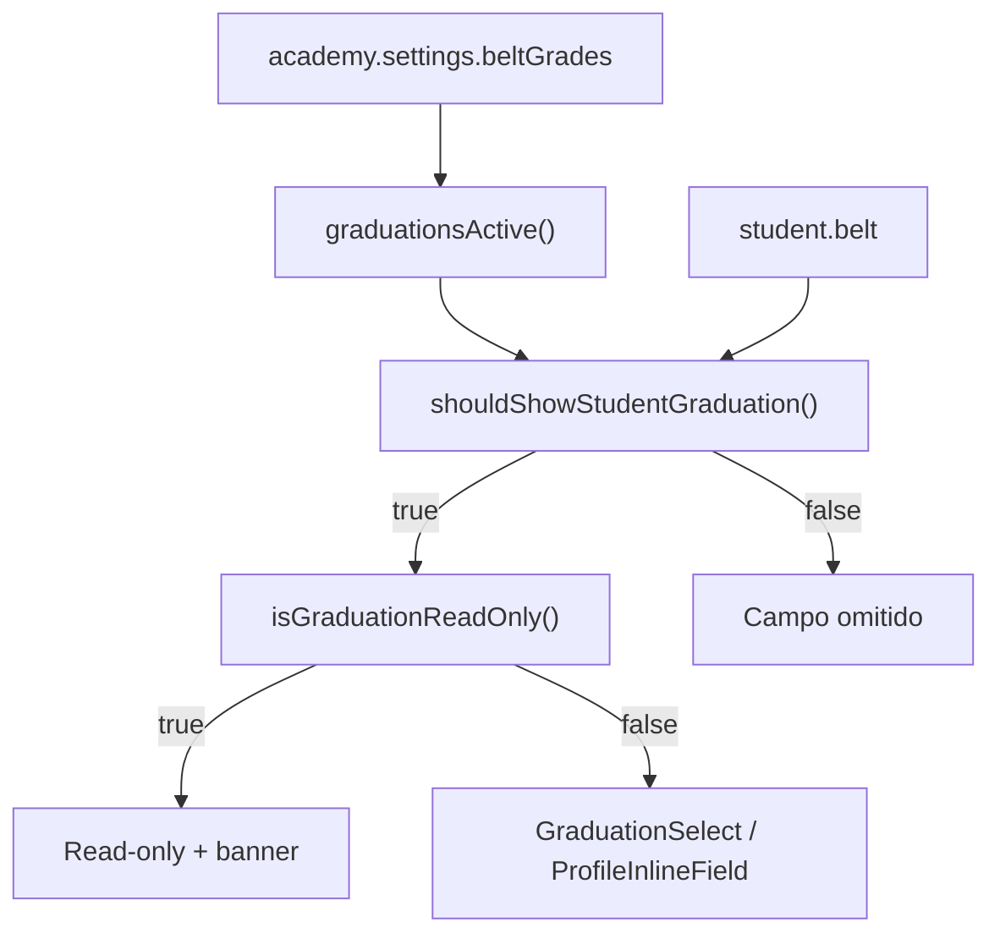

# Graduação do aluno — cadastro, perfil e opt-in multi-vertical (TECH)

**Data:** 2026-06-19  
**Status:** rascunho — aguardando aprovação  
**PRODUCT:** [2026-06-19-graduacao-aluno-opt-in-PRODUCT.md](./2026-06-19-graduacao-aluno-opt-in-PRODUCT.md)

---

## Escopo

Implementar requisitos **R-01 a R-14** da spec de produto sobre infraestrutura existente (`belt`, `settings.beltGrades`, filtros attendance). **Sem** novo atributo Appwrite, **sem** arquivo em `/api/` (matrícula online continua em `api/leads.js?route=public-enrollment`).

**Dependências no código (já entregues):**

| Área | Arquivos |
|------|----------|
| Config lista | `src/lib/beltGradesConfig.js`, `src/components/academy/BeltGradesSection.jsx` |
| Persistência aluno | `src/lib/mapAppwriteStudentDoc.js`, `src/lib/leadStudentPayload.js` (`belt` linha 84) |
| Store | `src/store/useStudentStore.js`, `src/store/useLeadStore.js` |
| NL patch | `lib/studentNlUpdates.js` |
| Terminologia | `src/lib/terminology.js` — `terms.belt` |
| Filtros analíticos | `lib/server/attendanceFrequencyHandler.js`, `lib/server/attendanceRetentionHandler.js` |
| UI filtros | `src/components/reports/ReportsFrequenciaPanel.jsx`, `src/components/attendance/AttendanceAtRiskSection.jsx` |
| Perfil (alvo E1) | `src/pages/StudentProfile.jsx`, `src/lib/profileStudentFieldSave.js` |
| Cadastro rápido (E2) | `src/hooks/useStudentsCreateForm.js`, `src/pages/Students.jsx` |
| Matrícula online (E3) | `src/pages/PublicStudentEnrollment.jsx`, `src/lib/publicEnrollmentSettings.js`, `lib/server/publicEnrollmentEnroll.js`, `lib/server/publicEnrollmentHandler.js` |

---

## Decisões técnicas

| # | Decisão | Escolha | Motivo |
|---|---------|---------|--------|
| D1 | Nome do campo persistido | Manter `belt` | Já no schema, stores, NL e handlers de attendance |
| D2 | “Graduações ativas” | `graduationsActive(settings)` = `parseBeltGradesFromSettings(settings).length > 0` | Opt-in explícito; `DEFAULT_BELT_GRADES` não conta até salvar |
| D3 | Visibilidade do campo | `shouldShowStudentGraduation(settings, belt)` = `graduationsActive(settings) \|\| String(belt).trim()` | PRODUCT R-02 + R-03 legado |
| D4 | Modo legado | `graduationsActive === false && belt` → read-only + `StatusBanner` | Evita editar valor órfão sem lista |
| D5 | Componente select | `GraduationSelect.jsx` compartilhado | Paridade turma/plano; opção vazia + órfão |
| D6 | Tipo no perfil | `type: 'graduation'` em field def (não mutar `STUDENT_DATA_FIELDS` estático global) | Campo injetado via `useMemo` condicional |
| D7 | Save inline | Novo `case 'belt'` em `profileStudentFieldSave.js` | Mesmo padrão de `sexo` / `plan` |
| D8 | Validação no save | Vazio OK; se preenchido e lista ativa, valor ∈ `beltGrades` **ou** igual ao valor anterior (órfão) | Permite limpar; não bloqueia legado até correção |
| D9 | Labels dinâmicos | `useTerms().belt` em todos os componentes React | PRODUCT G3 |
| D10 | Matrícula online (R-12) | `settings.publicEnrollment.askBelt` boolean, default `false` | Toggle independente de `graduationsActive`; UI só se ambos |
| D11 | GET público | Estender `buildPublicEnrollmentFormConfig` com `graduationsActive`, `beltOptions`, `askBelt` | Form renderiza sem Appwrite client-side |
| D12 | POST público | `buildFormOverrides` + validação server-side espelhando D8 | Não confiar só no client |
| D13 | Lista Alunos (R-13) | **Cortável** — implementar só se sobrar tempo em E3 | PRODUCT marca como opcional |
| D14 | Testes | Vitest em `src/test/beltGradesConfig.test.js` + smoke RTL opcional | Helpers puros são críticos |

---

## Helpers (`beltGradesConfig.js`)

Adicionar funções puras exportadas:

```js
/** Academia salvou ao menos uma graduação em settings.beltGrades */
export function graduationsActive(settingsRaw) {
  return parseBeltGradesFromSettings(settingsRaw).length > 0;
}

/**
 * Opções para <select>.
 * @param {unknown} settingsRaw
 * @param {string} [currentBelt] — valor atual do aluno (órfão entra na lista)
 */
export function resolveBeltOptions(settingsRaw, currentBelt = '') {
  const configured = parseBeltGradesFromSettings(settingsRaw);
  if (configured.length === 0) {
    const cur = String(currentBelt || '').trim();
    return cur ? [cur] : [];
  }
  const cur = String(currentBelt || '').trim();
  if (cur && !configured.some((g) => g.toLowerCase() === cur.toLowerCase())) {
    return [...configured, cur];
  }
  return configured;
}

/** Exibir campo graduação no cadastro/perfil */
export function shouldShowStudentGraduation(settingsRaw, currentBelt = '') {
  return graduationsActive(settingsRaw) || Boolean(String(currentBelt || '').trim());
}

/** Modo somente leitura (legado) */
export function isGraduationReadOnly(settingsRaw, currentBelt = '') {
  return !graduationsActive(settingsRaw) && Boolean(String(currentBelt || '').trim());
}

/** Sanitiza valor antes de persistir */
export function normalizeBeltValue(raw, settingsRaw, previousBelt = '') {
  const val = String(raw ?? '').trim().slice(0, 256);
  if (!val) return '';
  if (!graduationsActive(settingsRaw)) return String(previousBelt || '').trim().slice(0, 256);
  const options = resolveBeltOptions(settingsRaw, previousBelt);
  const lower = val.toLowerCase();
  const allowed = options.some((o) => o.toLowerCase() === lower);
  if (!allowed) throw new Error('invalid_belt'); // mapear para toast amigável na UI
  return val;
}
```

**Nota:** `normalizeBeltValue` usado no servidor (public enroll) e opcionalmente no client antes de save.

---

## Componente compartilhado

**Novo:** `src/components/students/GraduationSelect.jsx`

Props:

| Prop | Tipo | Descrição |
|------|------|-----------|
| `id` | string | `htmlFor` / a11y |
| `value` | string | Valor atual |
| `options` | string[] | De `resolveBeltOptions` |
| `onChange` | `(v: string) => void` | |
| `disabled` | boolean | Read-only legado |
| `className` | string | `form-input` / `student-profile-data-input` |
| `emptyLabel` | string | Default `"— opcional —"` |
| `terms` | object | Para `aria-label` com `terms.belt` |

Markup mínimo:

```jsx
<select value={value} onChange={...} disabled={disabled} aria-label={terms.belt}>
  <option value="">{emptyLabel}</option>
  {options.map((o) => <option key={o} value={o}>{o}</option>)}
</select>
```

Sem lógica de settings dentro do componente — caller passa `options`.

---

## Arquitetura de visibilidade



---

## Fase E1 — Perfil + config (R-01–R-06)

### R-05 / R-06 — Helpers

**Arquivo:** `src/lib/beltGradesConfig.js` — funções acima.

**Testes:** `src/test/beltGradesConfig.test.js`

- `graduationsActive`: vazio → false; após parse de array → true
- `resolveBeltOptions`: órfão incluído; sem config + órfão → `[órfão]`
- `shouldShowStudentGraduation` / `isGraduationReadOnly` matriz de casos
- `normalizeBeltValue`: vazio, válido, inválido, legado sem config

### R-04 — BeltGradesSection copy

**Arquivo:** `src/components/academy/BeltGradesSection.jsx`

- Substituir parágrafo intro por copy PRODUCT §5.2
- Na lista preview quando `grades.length === 0`, sufixo `(exemplo — salve para ativar)` em cada item DEFAULT
- Botão “Restaurar padrões” mantém comportamento; toast reforça “clique Salvar para ativar”

### R-01 / R-02 / R-03 — StudentProfile

**Arquivo:** `src/pages/StudentProfile.jsx`

1. Derivar `academySettingsRaw` de `academyDocForRole?.settings` (já existe `academySettingsDoc` — reutilizar fonte única).

2. Substituir `studentDataFields` useMemo:

```js
const studentDataFields = useMemo(() => {
  const base = STUDENT_DATA_FIELDS.map((f) =>
    f.key === 'plan' ? { ...f, label: terms.plan } : f
  );
  if (!shouldShowStudentGraduation(academySettingsRaw, student?.belt)) return base;
  const turmaIdx = base.findIndex((f) => f.key === 'turma');
  const gradField = { key: 'belt', label: terms.belt, type: 'graduation' };
  if (turmaIdx >= 0) {
    const out = [...base];
    out.splice(turmaIdx + 1, 0, gradField);
    return out;
  }
  return [...base, gradField];
}, [terms.plan, terms.belt, academySettingsRaw, student?.belt]);
```

3. Em `renderStudentInlineField`, novo branch `field.type === 'graduation'`:

- `options = resolveBeltOptions(academySettingsRaw, student.belt)`
- `readOnly = isGraduationReadOnly(academySettingsRaw, student.belt)`
- Se `readOnly`: `ProfileInlineField` com `editable={false}`; acima do bloco de dados, `StatusBanner` info: _“Reative graduações em Empresa → Alunos → Graduações para editar.”_
- Senão: `GraduationSelect` no `renderEditor`; `onChange` pode `commitEdit` imediato (padrão `sexo`)

4. `displayStudentFieldValue('belt', raw)` → string ou `'—'`

5. `studentFieldEditValue('belt')` → `student.belt || ''`

6. `dataForm` / bulk save: **não** incluir `belt` no form em massa nesta fase (inline-only, como `sexo`).

### R-01 — profileStudentFieldSave

**Arquivo:** `src/lib/profileStudentFieldSave.js`

```js
case 'belt': {
  const settingsRaw = /* passar via novo param academySettingsRaw */;
  const normalized = normalizeBeltValue(draftValue, settingsRaw, student.belt);
  patch = { belt: normalized };
  auditLabel = /* caller passa terms.belt ou fixo 'Graduação' */;
  break;
}
```

Estender assinatura de `saveStudentProfileField` com `academySettingsRaw` e `graduationLabel` (ou importar `useTerms` não — manter puro; passar label do caller).

**Arquivo:** `StudentProfile.jsx` — `saveStudentFieldInline` repassa `academySettingsRaw`.

---

## Fase E2 — Cadastro interno + labels (R-07–R-10)

### R-07 — Cadastro rápido

**Arquivos:** `src/hooks/useStudentsCreateForm.js`, `src/pages/Students.jsx`

- `INITIAL_STUDENT`: adicionar `belt: ''`
- Hook recebe `academySettingsRaw` (ou `academyDoc`) do parent
- `showGraduationField = graduationsActive(academySettingsRaw)`
- `addStudent({ ..., belt: normalizeBeltValue(newStudent.belt, ...) || undefined })` — omitir chave se vazio
- `Students.jsx`: render `GraduationSelect` após turma **somente se** `showGraduationField`

### R-08 — Conversão funil

**Verificar (sem código se já OK):**

- `buildStudentPayloadFromDoc` já inclui `belt` (linha 84)
- `leadCreatePayload.js` — `belt: lead?.belt || ''`
- Matrícula pipeline: se lead não tem UI de belt, nada muda; conversão preserva valor se existir (import/NL)

**Teste manual:** lead com `belt` pré-preenchido via import → matricular → aluno mantém valor.

### R-09 — Labels relatórios / retenção

**Arquivos:**

- `src/components/reports/ReportsFrequenciaPanel.jsx`
  - `const terms = useTerms()`
  - Coluna: `{ key: 'belt', label: terms.belt, ... }`
  - Filtro: `<span>{terms.belt}</span>` em vez de `Faixa`
  - Placeholder select: `Todas as ${terms.belt.toLowerCase()}s` ou `Todas`

- `src/components/attendance/AttendanceAtRiskSection.jsx`
  - Idem linha 415 `<span>Faixa</span>` → `terms.belt`

**Não alterar** query params `belt`, `freq_belt`, `ret_belt` (API estável).

### R-10 — Feedback

- Saves inline já usam toast do `ProfileInlineField` / padrão existente
- Erro `invalid_belt` → `friendlyError` ou mensagem: `Selecione uma ${terms.belt.toLowerCase()} válida.`

---

## Fase E3 — Matrícula online (R-11–R-14)

### R-12 — Config `askBelt`

**Arquivo:** `src/lib/publicEnrollmentSettings.js`

Estender tipo:

```js
/** @typedef {{ enabled?: boolean, salt?: string, askBelt?: boolean }} PublicEnrollmentConfig */
```

- `readPublicEnrollment`: `askBelt: raw.askBelt === true`
- `mergePublicEnrollmentIntoSettings`: preservar `askBelt`
- `buildPublicEnrollmentFormConfig`:

```js
const gradActive = graduationsActive(academyDoc?.settings);
return {
  // ...existente
  graduationsActive: gradActive,
  askBelt: enrollment.askBelt === true && gradActive,
  beltOptions: gradActive ? parseBeltGradesFromSettings(academyDoc?.settings) : [],
};
```

**Arquivo:** `src/components/academy/PublicEnrollmentSection.jsx`

- Checkbox “Pedir graduação no formulário” — visível só se `graduationsActive(academy.settings)`
- Disabled se matrícula online desligada
- Persist via `mergePublicEnrollmentIntoSettings` + `postEnrollmentConfig` **ou** save local Appwrite como turmas (preferir **mesmo padrão turmas**: update `settings` JSON no documento academia via `databases.updateDocument`, sem nova rota API)

**Decisão D10 refinada:** se `postEnrollmentConfig` hoje só mexe `enabled/salt`, estender body com `askBelt` no handler existente (`publicEnrollmentHandler.js` handleConfig) — **não** criar rota nova.

### R-11 — Formulário público

**Arquivo:** `src/pages/PublicStudentEnrollment.jsx`

- State `belt` string
- Se `config.askBelt && config.beltOptions?.length`, render card com `GraduationSelect` (`terms` via hook ou label fixo “Graduação” — preferir carregar vertical do config público)

**Vertical no GET público:** estender `buildPublicEnrollmentFormConfig` com `vertical: doc.vertical || 'fitness'` para label correto sem auth.

**POST body:** incluir `belt`

### Servidor — enroll

**Arquivo:** `lib/server/publicEnrollmentEnroll.js` — `buildFormOverrides`

```js
const beltRaw = String(form.belt || '').trim();
if (beltRaw) {
  const normalized = normalizeBeltValue(beltRaw, academyDoc.settings, '');
  if (normalized) overrides.belt = normalized;
}
```

**Arquivo:** `lib/server/publicEnrollmentHandler.js` — GET config retorna campos novos; POST config aceita `askBelt`.

**Regra:** rejeitar `belt` no POST se `!graduationsActive || !askBelt` (ignorar silenciosamente ou 400 — preferir **ignorar** para não quebrar client antigo).

### R-14 — Testes adicionais

- `src/test/publicEnrollment.test.js` — estender mocks com `askBelt`, `beltOptions`
- Handler unit se existir padrão para `buildFormOverrides` (extrair função pura testável se necessário)

### R-13 — Lista alunos (opcional)

**Arquivo:** `src/pages/Students.jsx`

- Só se `graduationsActive`: coluna secundária ou subtexto sob nome com `student.belt`
- Mobile: omitir coluna, manter subtexto

---

## Mapa arquivo → requisito

| Arquivo | R-ids |
|---------|-------|
| `src/lib/beltGradesConfig.js` | R-05, R-06 |
| `src/test/beltGradesConfig.test.js` | R-05, R-06, R-14 |
| `src/components/academy/BeltGradesSection.jsx` | R-04 |
| `src/components/students/GraduationSelect.jsx` | R-01, R-07, R-11 |
| `src/pages/StudentProfile.jsx` | R-01, R-02, R-03 |
| `src/lib/profileStudentFieldSave.js` | R-01 |
| `src/hooks/useStudentsCreateForm.js` | R-07 |
| `src/pages/Students.jsx` | R-07, R-13 |
| `ReportsFrequenciaPanel.jsx` | R-09 |
| `AttendanceAtRiskSection.jsx` | R-09 |
| `publicEnrollmentSettings.js` | R-11, R-12 |
| `PublicEnrollmentSection.jsx` | R-12 |
| `PublicStudentEnrollment.jsx` | R-11 |
| `publicEnrollmentEnroll.js` | R-11 |
| `publicEnrollmentHandler.js` | R-11, R-12 |

---

## Checklist por fase

### E1
- [ ] Helpers + testes unitários
- [ ] `GraduationSelect.jsx`
- [ ] `StudentProfile` campo condicional + legado read-only
- [ ] `profileStudentFieldSave` case `belt`
- [ ] Copy `BeltGradesSection`
- [ ] Atualizar `aluno-perfil-presenca.md`

### E2
- [ ] Cadastro rápido + persist `belt`
- [ ] Verificar conversão/import `belt`
- [ ] Labels dinâmicos Frequência + Retenção
- [ ] Atualizar `relatorios-indicadores.md`, `funil-lead-matricula.md`

### E3
- [ ] `askBelt` settings + UI config
- [ ] GET/POST matrícula online
- [ ] `PublicStudentEnrollment` select
- [ ] Testes enrollment
- [ ] (Opcional) coluna lista alunos
- [ ] Atualizar `onboarding-academia.md`

---

## Critérios técnicos globais

- [ ] Nenhum arquivo novo em `/api/` (apenas editar handlers em `api/leads.js` re-export)
- [ ] Imports diretos — sem barrel novo
- [ ] `normalizeBeltValue` espelhado client (save) e server (public enroll)
- [ ] Zero regressão: `npm test` / suite CI existente
- [ ] Multi-tenant: options sempre de `academy.settings` do `academyId` corrente

---

## Riscos

| Risco | Mitigação |
|-------|-----------|
| Academias com `belt` legado e lista vazia | Modo read-only + banner (R-03) |
| POST público envia faixa arbitrária | `normalizeBeltValue` server-side |
| Duplicar lógica de visibilidade | Single source `beltGradesConfig.js` |
| `STUDENT_DATA_FIELDS` estático quebra expectativa de ordem | Injeção via `useMemo`, não mutar constante |
| Label errado em página pública sem auth | Incluir `vertical` no GET config |

---

## Fora de escopo técnico imediato

- Migração renomear `belt` → `graduation` no Appwrite
- Índice Appwrite em `belt`
- Timeline event `belt_promoted`
- Campo graduação em `LeadProfile` / funil
- Export CSV coluna extra (já pode existir se export inclui todos os campos — verificar separadamente)
