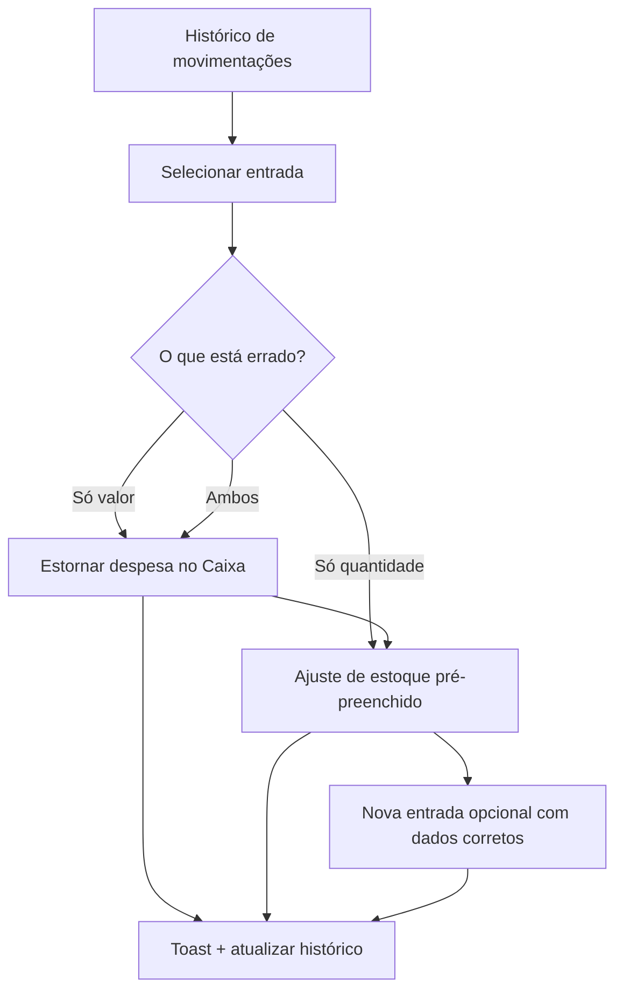

# Entrada de estoque — correção e vínculo com Caixa — PRODUCT Spec

**Data:** 2026-06-25  
**Status:** Spec para aprovação  
**TECH:** [2026-06-25-entrada-estoque-correcao-vinculo-caixa-TECH.md](./2026-06-25-entrada-estoque-correcao-vinculo-caixa-TECH.md)  
**Relacionado:** [estoque-movimentacoes.md](../../flows/vendas/estoque-movimentacoes.md), [2026-06-16-contas-a-pagar-PRODUCT.md](./2026-06-16-contas-a-pagar-PRODUCT.md), `InventoryEntryModal.jsx`, `inventoryMoveHandler.js`, `TransacoesTab.jsx`

---

## 1. Problem Statement

Ao registrar **entrada de estoque** com valor pago opcional, o Nave cria **dois registros independentes**: movimentação de estoque (quantidade + custo médio) e despesa liquidada no Caixa (`stock_purchase` / **Custo de estoque**). O operador percebe isso como **um único lançamento**, mas hoje:

- Não há vínculo persistente entre movimento e `financial_tx` (o `financial_tx_id` só aparece no toast).
- Não existe histórico de movimentações na UI — só formulário de **nova** movimentação.
- Corrigir erro exige navegar manualmente em **Estoque** e **Financeiro → Caixa**, sem orientação.
- Estornar a despesa **não** ajusta quantidade nem custo médio; ajustar estoque **não** toca o Caixa — risco de divergência.

**Quem sofre:** owner, admin e recepcionista que registram compras de uniformes, suplementos e material na entrada de estoque.

**Custo de não resolver:** lançamentos financeiros incorretos no DRE/CMV, saldo de estoque incoerente com o que foi pago, retrabalho e tickets de suporte do tipo “como altero a compra que lancei?”.

---

## 2. Goals

| # | Objetivo | Como medir |
|---|----------|------------|
| G1 | Rastreabilidade bidirecional estoque ↔ Caixa | 100% das entradas com `purchase_price` gravam `financial_tx_id` no movimento e `origin_type=stock_entry` na despesa |
| G2 | Operador encontra e entende o par estoque–financeiro | Histórico de movimentos com badge “No Caixa” e link para o lançamento |
| G3 | Correção guiada sem violar imutabilidade contábil | Wizard “Corrigir entrada” cobre os 3 cenários (valor, quantidade, ambos) com estorno + compensação |
| G4 | Manter boas práticas financeiras | Despesas liquidadas continuam **não editáveis**; correção via estorno + novo lançamento |
| G5 | Zero regressão em entrada simples (sem valor) | Entradas sem `purchase_price` comportam-se como hoje |
| G6 | Multi-tenant seguro | Movimentos e despesas vinculadas só dentro da `academy_id` atual |

---

## 3. Non-Goals (v1)

| Item | Motivo |
|------|--------|
| Editar despesa liquidada in-place | Viola trilha de auditoria; manter estorno |
| Compra a prazo / conta a pagar na entrada | Integrar com A pagar é iniciativa separada (P2) |
| Excluir movimento de estoque do log | Log append-only; correção por movimento compensatório |
| Recalcular CMV de vendas passadas após correção de custo | Complexidade contábil; documentar limitação em v1 |
| Novo arquivo em `/api/` | Limite Vercel Hobby 12/12 — rotas em `api/leads.js?route=inventory` e `api/finance.js` |
| Correção em lote (import) | Escopo futuro |
| Agente NL “corrigir entrada de estoque” | P2 |

---

## 4. Visão da solução

### Fase 1 — Vínculo e visibilidade (P0)

1. Gravar `financial_tx_id` em `stock_moves` e `origin_type` + `origin_id` em `financial_tx` ao criar entrada com valor.
2. Nova sub-aba ou seção **Histórico** em Loja → Estoque → Movimentações, listando movimentos recentes por item/academia.
3. Linha de **entrada com Caixa**: chip “Despesa no Caixa” → link `/financeiro?tab=movimentacoes&tx=<id>`.
4. No detalhe do lançamento no Caixa: link “Ver entrada de estoque” quando `origin_type=stock_entry`.

### Fase 2 — Wizard de correção (P0)

Fluxo **Corrigir entrada** (titular/admin; member vê instruções somente leitura):

### Fase 3 — Melhorias (P1/P2)

| Prioridade | Item |
|------------|------|
| P1 | Snapshot `quantity_before` / `average_cost_before` no movimento para rollback preciso de WAC |
| P1 | Backfill de vínculos em entradas históricas (script) |
| P1 | Hint contextual no modal de entrada: “Valor gera despesa liquidada; use Corrigir entrada se errar” |
| P2 | Opção “Registrar como conta a pagar” (despesa `pending`) em vez de liquidada na hora |
| P2 | Recomputar `average_cost` a partir do log de entradas após correção |

---

## 5. User Stories

### Owner / Admin

- **US1:** Como gestor, quero ver no histórico de estoque se uma entrada gerou despesa no Caixa, para não procurar à mão pela descrição “Compra de estoque”.
- **US2:** Como gestor, quero abrir o lançamento financeiro a partir da movimentação, para conferir valor e forma de pagamento.
- **US3:** Como gestor, quero **corrigir o valor** de uma entrada sem editar o liquidado — estornando e relançando com o valor certo.
- **US4:** Como gestor, quero **corrigir a quantidade** com um ajuste guiado (delta calculado), sem fazer conta manual.
- **US5:** Como gestor, quero corrigir **valor e quantidade** em um fluxo único que me diga cada passo.
- **US6:** Como gestor, quero que o sistema me avise se estornei o Caixa mas o estoque ainda reflete a entrada errada (e vice-versa).

### Recepcionista (member)

- **US7:** Como recepcionista, quero ver o histórico e o vínculo com o Caixa, mesmo sem poder estornar.
- **US8:** Como recepcionista, ao errar o valor, quero ver mensagem clara: “Peça ao administrador para corrigir” com o ID/data da entrada.

### Edge cases

- **US9:** Entrada **sem** valor pago → histórico normal; sem link Caixa; wizard oferece só correção de quantidade.
- **US10:** Despesa já estornada → histórico mostra “Despesa estornada”; wizard não permite estorno duplo.
- **US11:** Entrada antiga sem vínculo (pré-migração) → histórico sem link; wizard oferece “Vincular manualmente” ou correção parcial (P1 backfill reduz incidência).

---

## 6. Requirements

### Must-Have (P0)

#### R1 — Vínculo na criação

**Dado** módulos `inventory` + `finance` ativos e entrada com `purchase_price > 0`  
**Quando** `inventoryMove` tipo `entrada` concluir com sucesso  
**Então**:

- [ ] `stock_moves.financial_tx_id` = ID da despesa criada
- [ ] `financial_tx.origin_type` = `stock_entry`
- [ ] `financial_tx.origin_id` = `stock_moves.$id`
- [ ] Resposta API continua expondo `financial_tx_id` (compatível com clientes atuais)

#### R2 — Histórico de movimentações

**Dado** usuário em `/loja?tab=estoque&subtab=movimentos`  
**Quando** a tela carregar  
**Então**:

- [ ] Lista paginada dos últimos movimentos da academia (default 50, filtro por item)
- [ ] Colunas: data, item, tipo, quantidade, valor (se houver), status Caixa, ações
- [ ] Entrada com despesa: link para o Caixa
- [ ] Formulário de **nova** movimentação permanece abaixo ou em aba separada (não remover)

#### R3 — Link reverso no Caixa

**Dado** `financial_tx` com `origin_type=stock_entry`  
**Quando** usuário abrir detalhe da transação em Movimentações  
**Então**:

- [ ] Exibir bloco “Origem: entrada de estoque” com link para `/loja?tab=estoque&subtab=movimentos&move=<id>`
- [ ] Se movimento não existir (excluído): mensagem neutra, sem quebrar a tela

#### R4 — Wizard “Corrigir entrada”

**Dado** movimento tipo `entrada` da academia atual  
**Quando** titular/admin clicar **Corrigir**  
**Então**:

- [ ] Passo 1: escolher o que corrigir (valor / quantidade / ambos)
- [ ] **Só valor:** estornar `financial_tx` vinculada (se `settled` e não estornada); formulário para novo valor + método; criar nova despesa `stock_purchase` liquidada; atualizar `financial_tx_id` no movimento **ou** criar movimento filho `correcao_financeira` (ver TECH)
- [ ] **Só quantidade:** abrir ajuste com delta = `-(quantidade errada)` ou saldo alvo; motivo pré-preenchido “Correção de entrada ref. \<data\>”
- [ ] **Ambos:** sequência valor → quantidade → opcional nova entrada com dados corretos
- [ ] Member: botão desabilitado + `Hint` com texto de escalonamento

**Critérios de aceite negativos:**

- [ ] Não permitir “editar” despesa `settled` sem estorno
- [ ] Não apagar movimento do log
- [ ] Não estornar duas vezes a mesma despesa

#### R5 — Permissões

| Ação | owner | admin | member |
|------|-------|-------|--------|
| Ver histórico + links | Sim | Sim | Sim |
| Corrigir entrada (wizard) | Sim | Sim | Não |
| Estornar despesa vinculada | Sim | Sim | Não |

#### R6 — Fluxo e docs

- [ ] Atualizar `docs/flows/vendas/estoque-movimentacoes.md` (mapa de telas, checklist, diagrama)
- [ ] Registrar em `docs/flows/VALIDATION.md` após implementação

### Nice-to-Have (P1)

- [ ] **R7:** Atributos `quantity_before`, `average_cost_before` em novas entradas; rollback de WAC no wizard quando quantidade/valor da entrada original for desfeita
- [ ] **R8:** Script `scripts/backfill-stock-entry-financial-links.mjs` (`--dry-run`, `--academy-id=`)
- [ ] **R9:** Banner de inconsistência: despesa estornada mas movimento ainda mostra “Ativa no Caixa”
- [ ] **R10:** Hint no `InventoryEntryModal` sobre correção posterior

### Future (P2)

- [ ] **R11:** Checkbox “Pagar depois” → `financial_tx.status=pending`, fila em A pagar
- [ ] **R12:** Replay de entradas para recalcular `average_cost` global da variante

---

## 7. UX — comportamento esperado

### 7.1 Histórico (Movimentações)

| Elemento | Comportamento |
|----------|---------------|
| Filtro por item | `SearchableSelect` ou busca existente |
| Tipo `entrada` + `financial_tx_id` | Badge verde “No Caixa · R$ X” clicável |
| Tipo `entrada` sem valor | Badge cinza “Só estoque” |
| Despesa `cancelled` | Badge âmbar “Estornada” |
| Ações (admin) | **Corrigir** · **Ver no Caixa** |

### 7.2 Wizard de correção

| Passo | UI |
|-------|-----|
| Diagnóstico | Resumo: item, qtd, valor pago, data, link Caixa |
| Escolha | 3 cards: “Valor errado” · “Quantidade errada” · “Os dois” |
| Confirmação | `ConfirmDialog` antes de estorno |
| Resultado | Toast com resumo; histórico atualizado |

### 7.3 Mensagens (seguir `docs/ux-feedback.md`)

| Situação | Mensagem |
|----------|----------|
| Correção OK | “Entrada corrigida. Estoque e Caixa atualizados.” |
| Só estoque corrigido | “Quantidade ajustada. A despesa no Caixa não foi alterada.” |
| Member tenta corrigir | “Apenas titular ou administrador pode corrigir entradas com valor no Caixa.” |
| Despesa já estornada | “Esta despesa já foi estornada. Ajuste o estoque se ainda necessário.” |

---

## 8. Success Metrics

### Leading (1–2 semanas pós-release)

| Métrica | Meta | Método |
|---------|------|--------|
| % entradas com valor que gravam vínculo | 100% | Amostra API / script auditoria |
| Uso do link Caixa a partir do histórico | Baseline + adoção | Evento analytics (se disponível) ou proxy: GET com `move=` |
| Conclusão do wizard sem erro | ≥ 90% | Logs `stock_entry_correction_*` |

### Lagging (30–60 dias)

| Métrica | Meta |
|---------|------|
| Tickets “como alterar entrada/compra estoque” | Redução ≥ 50% |
| Divergências estoque × Caixa em auditoria manual | Tendência ↓ |

---

## 9. Open Questions

| # | Pergunta | Responsável | Bloqueante? |
|---|----------|-------------|-------------|
| Q1 | Correção financeira atualiza o mesmo `stock_moves` ou cria movimento filho `correcao_entrada`? | Engenharia | Sim — ver TECH §4 |
| Q2 | Após corrigir só valor, `purchase_price` no movimento original é atualizado ou imutável? | Produto + Eng | Sim |
| Q3 | Backfill obrigatório antes do release ou best-effort? | Produto | Não |
| Q4 | Wizard permite “nova entrada” automática após estorno ou só despesa manual? | Produto | Não — default: oferecer ambos |

**Decisão recomendada (para TECH):** movimento original **imutável**; correções geram movimentos/tx compensatórios + atualização de `financial_tx_id` apontando para a despesa vigente.

---

## 10. Timeline e fases

| Fase | Entrega | Estimativa |
|------|---------|------------|
| **1** | Vínculo + histórico + links | 1 sprint |
| **2** | Wizard de correção (admin) | 1 sprint |
| **3** | WAC snapshot + backfill + hints | 0,5 sprint |
| **4** (P2) | Conta a pagar na entrada | Spec separada |

**Dependências:** nenhuma nova function Vercel; provision schema `financial_tx_id` em `stock_moves`.

---

## 11. Critérios de fluxo saudável vs regressão

**Saudável:** Entrada com valor → par rastreável; correção de valor via estorno; correção de qtd via ajuste; member informado.

**Regressão:** Entrada sem valor quebra; venda baixa estoque; leak cross-tenant; despesa liquidada editável; histórico some após refresh.

---

## Histórico de revisão

| Data | Autor | Mudança |
|------|-------|---------|
| 2026-06-25 | — | Criação a partir de análise operacional entrada estoque + Caixa |
