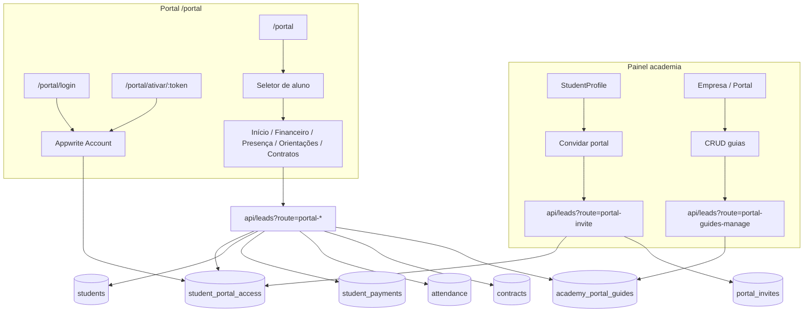
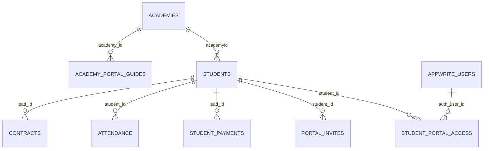
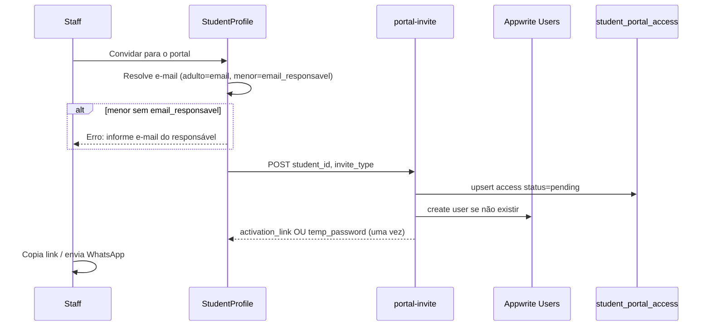
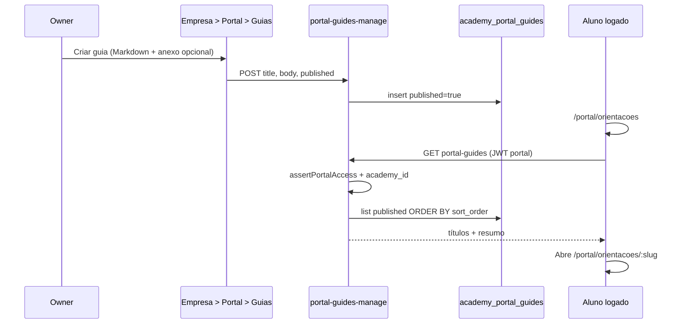

# Portal do aluno — login web, convite pela academia — PRODUCT Spec

**Data:** 2026-06-25  
**Status:** aprovado — TECH em `docs/superpowers/plans/2026-06-25-portal-aluno.md`  
**TECH:** [2026-06-25-portal-aluno-TECH.md](./2026-06-25-portal-aluno-TECH.md) · plano em [../plans/2026-06-25-portal-aluno.md](../plans/2026-06-25-portal-aluno.md)

**Contexto:** O Nave hoje é o **painel da academia** (owner, admin, recepcionista). Alunos existem na coleção `students` com dados operacionais (plano, mensalidades, presença, contratos), mas **não há conta de login** nem superfície self-service. O único fluxo público é matrícula em `/inscricao/:token`. Este spec define um **portal web** em `/portal/*` (sem app instalável), com convite disparado pela academia na matrícula.

**Fluxos relacionados:**

- [aluno-perfil-presenca.md](../../flows/crm/aluno-perfil-presenca.md) — perfil staff (fonte dos dados exibidos no portal)
- [empresa-horarios-turmas.md](../../flows/config/empresa-horarios-turmas.md) — turmas e grade (referência futura para aulas)
- [docs/contracts-autentique.md](../../contracts-autentique.md) — assinatura de contratos

**Specs relacionadas:**

- [2026-06-19-agendamento-reservas-PRODUCT.md](./2026-06-19-agendamento-reservas-PRODUCT.md) — reserva de aula pelo aluno fica **fora** deste MVP (previsto como evolução do portal)
- [2026-06-12-portal-assinatura-checkout-unificado.md](../plans/2026-06-12-portal-assinatura-checkout-unificado.md) — portal de **assinatura do Nave** (academia paga o software); **não** é portal do aluno

**Mock Figma:** não disponível — wireframes ASCII na seção UX.

---

## 1. Decisões de produto (validadas)

| Tema | Decisão |
|------|---------|
| Provisioning | Academia **cria/convida** na matrícula (não auto-cadastro aberto) |
| MVP | Perfil + financeiro **somente leitura** + presença + contratos pendentes + **orientações (guias)** |
| Orientações | **Guias da academia** (regras, etiqueta, FAQ, etc.) editados pelo staff; **somente aluno logado** |
| Tipo de conta | **Híbrido:** adulto = conta própria; menor = acesso via **responsável** vinculado |
| Vários filhos | **Uma conta** do responsável + **seletor de aluno** no portal |
| Ativação | **Link por padrão**; opção de **senha temporária** (troca obrigatória no 1º login) |
| Vínculo de irmãos | **Híbrido:** auto-vínculo por `email_responsavel` ou `cpfResponsavel`; staff confirma se não bater |
| URL | **`/portal/*`** no mesmo deploy (padrão `/inscricao`) |
| Auth técnica | **Appwrite Account** + coleção de vínculos `student_portal_access` |

---

## 2. Inventário — o que já existe

| Camada | Estado | Evidência |
|--------|--------|-----------|
| Cadastro aluno (`students`) | ✅ | `mapAppwriteStudentDoc.js` — nome, e-mail, plano, turma, faixa, `responsavel`, `cpfResponsavel` |
| E-mail do responsável | ❌ | Só `responsavel` (nome) e `cpfResponsavel`; precisa `email_responsavel` |
| Login staff (Appwrite) | ✅ | `src/lib/auth.js`, `Login.jsx`, bootstrap em `App.jsx` |
| Vínculo aluno ↔ usuário Appwrite | ❌ | Nenhum `auth_user_id` em `students` |
| Perfil staff com financeiro/presença/contratos | ✅ | `StudentProfile.jsx` |
| Mensalidades (`student_payments`) | ✅ | `api/finance.js?route=student-payments` (staff) |
| Presença (`attendance`) | ✅ | Perfil + Control iD |
| Contratos Autentique | ✅ | `contracts` + integração em `/integracoes` |
| Matrícula pública | ✅ | `/inscricao/:token` — shell isolado sem sidebar CRM |
| Guias / orientações para alunos | ❌ | Nenhum CMS ou conteúdo institucional voltado ao portal |
| Upload mídia (Vercel Blob) | ✅ | Padrão do projeto para arquivos; reutilizar para PDF/imagem em guias |
| Limite Vercel Hobby | ⚠️ | 12/12 functions — **sem** novo arquivo em `/api/` |

**Conclusão:** construir **shell portal** + **auth/vínculos** + **API read-scoped** reutilizando lógica server-side existente; não duplicar domínio financeiro/presença.

---

## 3. Problem Statement

Alunos e responsáveis dependem da recepção ou WhatsApp para saber:

1. Se a mensalidade está **em dia ou pendente**
2. **Histórico de presença** e dados do plano/turma
3. **Contratos pendentes** de assinatura
4. **Regras e orientações** da academia (etiqueta, o que levar, horários, FAQ) — hoje repetidas no WhatsApp ou verbalmente

A academia já registra tudo no Nave, mas o aluno **não tem login** nem um lugar único para consultar orientações. Isso gera retrabalho na recepção e atrasa assinatura de contratos.

**Personas:**

| Persona | Necessidade |
|---------|-------------|
| Aluno adulto | Ver seus dados e situação financeira sem ligar para a academia |
| Responsável (pai/mãe) | Gerenciar **um ou mais filhos** com **um login** |
| Recepcionista / owner | Convidar na matrícula, revogar ao desativar, vincular irmãos |
| Owner / admin | Publicar **guias de orientação** uma vez; todos os alunos com portal veem o mesmo conteúdo |

---

## 4. Goals

| # | Objetivo | Métrica de sucesso |
|---|----------|-------------------|
| G1 | Aluno/responsável acessa portal com e-mail e senha | Login em `/portal/login` com sessão Appwrite válida |
| G2 | Academia convida em ≤2 cliques no perfil do aluno | Botão **Convidar para o portal** em `StudentProfile` |
| G3 | Responsável com 2+ filhos usa uma conta | Seletor troca contexto; dados isolados por `student_id` |
| G4 | Financeiro transparente (leitura) | Status em dia/pendente/vencido + histórico sem expor dados de outros alunos |
| G5 | Contratos pendentes assináveis | Lista no portal abre fluxo Autentique |
| G6 | Segurança multi-tenant | Toda leitura valida `academy_id` + vínculo `student_portal_access` |
| G7 | Orientações centralizadas | Academia publica guias; aluno logado consulta em `/portal/orientacoes` |

---

## 5. Non-Goals (MVP)

| Item | Motivo / fase |
|------|----------------|
| App instalável (PWA store) | Portal é web responsivo; PWA opcional v2 |
| Pagamento online pelo aluno | Mensalidades hoje são registro manual staff; checkout Asaas por academia é projeto separado |
| Reserva de aula / agenda self-service | Depende de [agendamento-reservas](./2026-06-19-agendamento-reservas-PRODUCT.md); portal v2 |
| Chat / inbox com a academia | CTA WhatsApp no MVP |
| Edição de perfil pelo aluno | v2 (telefone, e-mail) |
| Subdomínio `aluno.*` | v2; MVP em `/portal` |
| URL por slug da academia (`/a/:slug/portal`) | v2 white-label |
| Novo arquivo em `/api/` | Rotas `?route=portal-*` em handler existente |
| Auto-convite em massa na importação planilha | v2 |
| Orientações **públicas** (sem login) | MVP = só logado; página pública v2 se necessário |
| Trilha do aluno novo com checkmarks | v2; MVP = guias em texto livre |
| Guias por turma / faixa | v2; MVP = mesmos guias para toda a academia |
| Editor rich-text WYSIWYG | MVP = Markdown simples + anexos; WYSIWYG v2 |

---

## 6. Arquitetura

### 6.1 Visão geral



### 6.2 Separação staff × portal

| Regra | Detalhe |
|-------|---------|
| Shell isolado | Rotas `/portal/*` renderizam layout próprio (sem sidebar CRM), mesmo padrão de `/inscricao/:token` em `App.jsx` |
| Bootstrap pós-login | Se usuário tem vínculo ativo em `student_portal_access` → redireciona para `/portal` |
| Staff existente | Se usuário é owner/admin/membro de academia → fluxo atual do painel (sem mudança) |
| Sem vínculo | Mensagem: *"Esta conta não tem acesso ao portal. Peça um convite à sua academia."* |
| E-mail em conflito | E-mail já usado como **staff** da mesma academia não recebe convite portal automático; staff usa outro e-mail ou fluxo manual documentado no TECH |

### 6.3 Autenticação (abordagem escolhida)

**Appwrite Account + tabela de vínculos** (descartadas: magic-link-only, auth JWT custom).

- Convite cria ou associa usuário Appwrite ao e-mail do destinatário
- Permissões de dados **não** via Appwrite document permissions em `students` (dados sensíveis); sempre via **API server-side** com API key + checagem de vínculo
- Recuperação de senha: fluxo nativo Appwrite (`account.createRecovery`)

---

## 7. Modelo de dados

### 7.1 Alteração em `students`

| Campo | Tipo | Obrigatório | Uso |
|-------|------|-------------|-----|
| `email_responsavel` | string | Convite menor | E-mail do responsável; chave de auto-vínculo de irmãos |

Manter campos existentes: `email`, `responsavel`, `cpfResponsavel`, `type` (`Adulto` \| `Criança` \| `Juniores`).

### 7.2 Nova coleção `student_portal_access`

| Campo | Tipo | Descrição |
|-------|------|-----------|
| `academy_id` | string | FK `academies.$id` |
| `student_id` | string | FK `students.$id` |
| `auth_user_id` | string | FK Appwrite Users |
| `relationship` | enum | `self` \| `guardian` |
| `status` | enum | `pending` \| `active` \| `revoked` |
| `invited_at` | datetime | |
| `activated_at` | datetime? | |
| `revoked_at` | datetime? | |
| `revoked_reason` | string? | ex. `student_deactivated` |

**Índices sugeridos:** `(auth_user_id, academy_id)`, `(student_id)`, `(academy_id, status)`.

**Cardinalidade:** um `auth_user_id` pode ter **N** linhas (vários filhos); cada `student_id` tem no máximo **um** vínculo `self` ativo e **N** `guardian` (mínimo 0).

### 7.3 Nova coleção `portal_invites`

| Campo | Tipo | Descrição |
|-------|------|-----------|
| `academy_id` | string | |
| `student_id` | string | Aluno sendo convidado |
| `email` | string | Destino do convite |
| `invite_type` | enum | `link` \| `temp_password` |
| `token_hash` | string | Hash do token (nunca plaintext persistido) |
| `temp_password_hint` | string? | Últimos 2 chars ou máscara para staff (senha exibida **uma vez** na resposta da API) |
| `expires_at` | datetime | Padrão: +7 dias |
| `used_at` | datetime? | |
| `created_by_user_id` | string | Staff que convidou |
| `status` | enum | `pending` \| `used` \| `expired` \| `cancelled` |

### 7.4 Nova coleção `academy_portal_guides`

Conteúdo **por academia** (não por aluno): todos os alunos com portal ativo na mesma academia veem os mesmos guias publicados.

| Campo | Tipo | Descrição |
|-------|------|-----------|
| `academy_id` | string | FK `academies.$id` |
| `title` | string | Título ex.: *Regras do tatame* |
| `slug` | string | URL-safe, único por `academy_id` |
| `summary` | string? | Linha curta para a lista (≤160 chars) |
| `body_markdown` | string | Corpo em Markdown (títulos, listas, links) |
| `category` | enum? | `geral` \| `regras` \| `primeira_aula` \| `faq` — filtro opcional na UI |
| `sort_order` | integer | Ordenação manual (menor = primeiro) |
| `published` | boolean | `false` = rascunho (só staff vê) |
| `attachments_json` | string? | JSON: `[{ "label", "url", "mime" }]` — PDF/imagem via Vercel Blob ou URL externa |
| `updated_at` | datetime | |
| `created_by_user_id` | string | Staff autor |

**Índices sugeridos:** `(academy_id, published, sort_order)`, `(academy_id, slug)` único.

**Limites MVP:** até **30** guias publicados por academia; `body_markdown` ≤ **24.000** caracteres; até **5** anexos por guia.

### 7.5 Diagrama ER (portal)



---

## 8. Fluxos

### 8.1 Convite (staff)



**Regras de destinatário:**

| Tipo aluno | E-mail do convite | `relationship` |
|------------|-------------------|----------------|
| Adulto | `students.email` | `self` |
| Criança / Juniores | `students.email_responsavel` | `guardian` |

### 8.2 Ativação por link

1. Aluno/responsável abre `/portal/ativar/:token`
2. API valida token, não expirado, não usado
3. Se usuário novo: formulário **definir senha**; se existente: login
4. Marca `portal_invites.used_at`, `student_portal_access.status = active`, `activated_at`

### 8.3 Senha temporária

1. Staff escolhe **Gerar senha temporária** no convite
2. API retorna senha **uma única vez** na resposta (staff repassa manualmente)
3. Login em `/portal/login` → flag `must_change_password` (Appwrite prefs ou campo em access) → `/portal/trocar-senha` obrigatório antes do dashboard

### 8.4 Vínculo do 2º filho (irmãos)

1. Staff matricula ou edita 2º filho com mesmo `email_responsavel` ou `cpfResponsavel`
2. Sistema detecta responsável existente com `student_portal_access` ativo
3. UI mostra banner: *"Vincular a [Nome do responsável]?"* → **Confirmar** / **Convidar separado**
4. Confirmar → nova linha em `student_portal_access` (mesmo `auth_user_id`, novo `student_id`, `relationship=guardian`)
5. **Sem novo convite** se conta já ativa

### 8.5 Revogação

| Gatilho | Ação |
|---------|------|
| Staff desativa aluno | `student_portal_access.status = revoked` para todas as linhas daquele `student_id` |
| Staff revoga manualmente | Mesmo |
| Login após revogação | 403 com mensagem orientando contato com a academia |

### 8.6 Guias de orientação (staff → aluno)



**Regras:**

- Conteúdo é **da academia**, não varia por aluno selecionado no seletor de dependentes (responsável vê os mesmos guias para qualquer filho).
- Rascunhos (`published=false`) **nunca** aparecem no portal.
- Staff com role `member` (recepcionista) pode **ler** guias; **criar/editar/publicar** só `owner` e `admin` (decisão TECH pode alinhar a `canAccessEmpresaFinanceSettings`).

---

## 9. User stories

### Responsável / aluno adulto

- **US1:** Receber link de ativação e criar senha na primeira visita.
- **US2:** Entrar em `/portal/login` com e-mail e senha em qualquer dispositivo (web).
- **US3:** Ver **início** com nome, turma, faixa, plano e chip de situação financeira.
- **US4:** Ver **mensalidades** (em dia, pendente, vencido) e histórico — sem editar.
- **US5:** Tocar **Falar com a academia** → abre WhatsApp da academia (número em `academies`).
- **US6:** Ver **presença** (últimas aulas / resumo de frequência).
- **US7:** Ver **contratos pendentes** e assinar via Autentique.
- **US8:** (Responsável) Alternar entre filhos no **seletor de aluno** no topo.
- **US9:** Ver **orientações** da academia (lista de guias) e abrir o conteúdo completo com links e anexos.

### Staff

- **US10:** Convidar aluno adulto pelo e-mail cadastrado.
- **US11:** Cadastrar `email_responsavel` e convidar responsável de menor.
- **US12:** Gerar senha temporária quando aluno não tem e-mail.
- **US13:** Ver badge no perfil: *Portal: não convidado / pendente / ativo / revogado*.
- **US14:** Ao matricular 2º filho, confirmar vínculo ao responsável existente.
- **US15:** Revogar acesso ao desativar aluno.
- **US16:** (Owner/admin) Criar, editar, ordenar e publicar **guias de orientação**.
- **US17:** (Owner/admin) Anexar PDF ou imagem a um guia (ex.: regulamento).
- **US18:** (Owner/admin) Despublicar guia sem apagar (rascunho).

---

## 10. UX — rotas e wireframes

### 10.1 Mapa de rotas (portal)

| Rota | Tela | Auth |
|------|------|------|
| `/portal/login` | Login | Público |
| `/portal/esqueci-senha` | Recuperação Appwrite | Público |
| `/portal/ativar/:token` | Ativação / definir senha | Público |
| `/portal/trocar-senha` | Troca obrigatória | Autenticado |
| `/portal` | Dashboard (início) | Autenticado + vínculo |
| `/portal/financeiro` | Mensalidades | Autenticado |
| `/portal/presenca` | Frequência | Autenticado |
| `/portal/orientacoes` | Lista de guias | Autenticado |
| `/portal/orientacoes/:slug` | Detalhe do guia | Autenticado |
| `/portal/contratos` | Contratos | Autenticado |
| `/portal/perfil` | Dados (leitura) | Autenticado |

Navegação mobile: bottom bar com **5 itens** — Início, Financeiro, Presença, Orientações, Mais (Contratos + Perfil). Desktop: layout centrado, max-width ~720px.

### 10.2 Wireframe — início (responsável, 2 filhos)

```
┌─────────────────────────────────────┐
│  [Logo academia]     [Sair]         │
│  Olá, Maria                         │
│  ┌─────────────────────────────┐    │
│  │ Aluno: [ João ▼ ]           │    │
│  │         Pedro               │    │
│  └─────────────────────────────┘    │
│  Turma: Infantil 18h │ Faixa: branca│
│  Plano: 2x/semana                     │
│  ┌──────────────┐                     │
│  │ ● Em dia     │  Mensalidade mar    │
│  └──────────────┘                     │
│  [ WhatsApp da academia ]             │
├─────────────────────────────────────┤
│  Início │ Financeiro │ Presença │ Orientações │ …  │
└─────────────────────────────────────┘
```

### 10.3 Wireframe — orientações (aluno)

```
/portal/orientacoes
┌─────────────────────────────────────┐
│  Orientações                        │
│  [ Geral ▼ ]  (filtro categoria)    │
│  ┌─────────────────────────────┐    │
│  │ Regras do tatame            │    │
│  │ Higiene, kimono, pegada…    │    │
│  └─────────────────────────────┘    │
│  ┌─────────────────────────────┐    │
│  │ Sua primeira aula           │    │
│  │ Chegue 15 min antes…        │    │
│  └─────────────────────────────┘    │
│  ┌─────────────────────────────┐    │
│  │ FAQ                         │    │
│  └─────────────────────────────┘    │
└─────────────────────────────────────┘

/portal/orientacoes/regras-do-tatame
┌─────────────────────────────────────┐
│  ← Voltar                           │
│  Regras do tatame                   │
│  ─────────────────────────────────  │
│  (Markdown renderizado)             │
│  [ 📄 Regulamento.pdf ]             │
└─────────────────────────────────────┘
```

### 10.4 Wireframe — guias (staff)

```
/empresa?tab=portal  (owner/admin)
┌─────────────────────────────────────┐
│  Portal do aluno > Guias           │
│  [ + Novo guia ]                    │
│  ≡  Regras do tatame      [Pub] ✎  │
│  ≡  Primeira aula         [Pub] ✎  │
│  ≡  Rascunho feriados     [---] ✎  │
└─────────────────────────────────────┘
```

### 10.5 Wireframe — convite (staff)

```
StudentProfile > Ações
┌─────────────────────────────────────┐
│ Portal do aluno: ○ Não convidado    │
│ [ Convidar para o portal ▼ ]        │
│   · Enviar link de ativação (padrão)│
│   · Gerar senha temporária          │
│ [ Copiar link ]  (após convite)     │
└─────────────────────────────────────┘
```

---

## 11. API (sem novo arquivo `/api/`)

Hub sugerido: **`api/leads.js?route=portal-*`** (ou `students` sub-action se preferir agrupar por domínio — decisão no TECH).

| route | Método | Quem | Função |
|-------|--------|------|--------|
| `portal-invite` | POST | Staff JWT | Cria convite; retorna link ou senha temporária |
| `portal-invite` | DELETE | Staff JWT | Cancela convite pendente / revoga acesso |
| `portal-activate` | POST | Público | Valida token; retorna próximo passo |
| `portal-context` | GET | Portal JWT | Lista alunos acessíveis + academia + aluno ativo sugerido |
| `portal-profile` | GET | Portal JWT | Dados cadastrais escopados (sem notas internas staff) |
| `portal-finance` | GET | Portal JWT | Status + lista pagamentos do aluno |
| `portal-attendance` | GET | Portal JWT | Presença resumida |
| `portal-contracts` | GET | Portal JWT | Contratos pendentes + URLs Autentique |
| `portal-guides` | GET | Portal JWT | Lista guias publicados da academia |
| `portal-guides` | GET | Portal JWT | `?slug=` — detalhe de um guia |
| `portal-guides-manage` | GET/POST/PATCH/DELETE | Staff JWT | CRUD guias (owner/admin) |

**Nota — orientações:** `portal-guides` exige `assertPortalAccess` (vínculo ativo) para resolver `academy_id`, mas **não** filtra conteúdo por `student_id` — guias são compartilhados por toda a academia.

**Guarda de segurança (rotas com dados do aluno):**

```text
assertPortalAccess(jwtUserId, academyId, studentId)
  → EXISTS student_portal_access
      WHERE auth_user_id = jwtUserId
        AND student_id = studentId
        AND academy_id = academyId
        AND status = 'active'
```

Query param ou header: `student_id` (aluno ativo no seletor). Nunca retornar campos staff-only (`notes`, `retention_*`, margens internas).

---

## 12. Conteúdo por tela (MVP)

### Início

- Nome, foto (se `photo_url`), turma, faixa, plano, desconto aplicado (se houver)
- Chip financeiro agregado (reuso `getPaymentStatus` server-side)
- Botão WhatsApp (`academies.phone` ou número Zapster configurado — fallback documentado no TECH)
- Aviso se contrato pendente (link para aba Contratos)

### Financeiro (somente leitura)

- Status: em dia / pendente / vencido / trancado (`plan_freezes` se ativo)
- Lista de mensalidades: competência, valor, status, data pagamento
- Mensagem fixa: *"Para pagar ou negociar, fale com a academia."* + CTA WhatsApp
- **Não** exibir: margens, contas internas, `financial_tx`, conciliação bancária

### Presença

- Últimos N check-ins (data, origem catraca/manual se relevante para aluno)
- Resumo: aulas no mês / streak opcional v1.1
- **Não** exibir: ranking, outros alunos, alertas de retenção staff

### Contratos

- Filtrar `contracts` do `lead_id` = `student_id` com status pendente assinatura
- Ação: abrir URL Autentique (nova aba) ou componente embed se já existir no projeto
- Pós-assinatura: webhook Autentique atualiza status; portal reflete na próxima carga

### Perfil

- Leitura: nome, turma, faixa, e-mail, telefone, responsável (se menor)
- Sem edição no MVP

### Orientações

- Lista de guias publicados, ordenados por `sort_order`
- Filtro opcional por `category`
- Card: título + `summary`
- Detalhe: Markdown renderizado (sanitizado — sem HTML arbitrário do staff)
- Anexos: link para abrir PDF/imagem em nova aba
- Empty state: *"Sua academia ainda não publicou orientações."*
- Destaque no **Início**: até 2 guias em cards (*"Leia também"*) quando existirem

---

## 13. Alterações no painel staff

| Área | Mudança |
|------|---------|
| Cadastro / matrícula | Campo `email_responsavel` para Criança/Juniores |
| `StudentProfile` | Badge status portal + ações convite/revogar |
| Matrícula 2º filho | Banner vínculo responsável (auto-match e-mail/CPF) |
| Desativar aluno | Side-effect: revogar `student_portal_access` |
| Matrícula pública `/inscricao` | Campo opcional `email_responsavel` quando tipo menor |
| `AcademySettings` / Empresa | Nova subseção **Portal do aluno → Guias** (CRUD owner/admin) |
| `docs/flows/crm/aluno-perfil-presenca.md` | Atualizar no mesmo PR da implementação (governança) |
| Novo fluxo | `docs/flows/portal/aluno-portal.md` (criar na implementação) |
| Novo fluxo staff | `docs/flows/portal/guias-orientacao.md` (criar na implementação) |

---

## 14. Fases de entrega

| Fase | Entrega | Dependências |
|------|---------|--------------|
| **F1 — Fundação** | Schema (`email_responsavel`, `student_portal_access`, `portal_invites`); scripts provision; `portal-invite` + `portal-activate`; shell `/portal/login` + `/portal/ativar` | — |
| **F2 — Core** | `portal-context`; seletor dependentes; dashboard início; revogação | F1 |
| **F3 — Dados** | `portal-finance`, `portal-attendance`, `portal-profile` | F2 |
| **F3b — Orientações** | Coleção `academy_portal_guides`; staff CRUD; `portal-guides` + UI `/portal/orientacoes` | F2 (paralelo a F3) |
| **F4 — Contratos** | `portal-contracts` + UI; senha temporária + troca obrigatória; badge staff; vínculo irmãos | F3 |
| **F5 — Polish** | Testes; mensagens de erro (`useToast` / `StatusBanner`); responsivo; docs fluxo | F4, F3b |

---

## 15. Riscos e mitigações

| Risco | Mitigação |
|-------|-----------|
| Menor sem `email_responsavel` | Bloquear convite com mensagem clara; campo obrigatório no formulário menor |
| Mesmo e-mail staff e portal | Regra de conflito documentada; convite bloqueado ou e-mail alternativo |
| Responsável em 2 academias (raro) | `portal-context` lista por `academy_id`; seletor academia v2 se necessário |
| Vazamento de dados via `student_id` forjado | `assertPortalAccess` em **toda** rota portal |
| Token de ativação vazado | Expiração 7d; uso único; hash no banco |
| Limite 12 functions | Zero arquivos novos em `/api/` |
| Contratos sem Autentique configurado | Empty state: *"Nenhum contrato pendente"* / orientar academia |
| XSS em Markdown de guias | Renderização com sanitização; proibir HTML bruto |
| Guias enormes no mobile | Limite de caracteres; anexos pesados via link Blob, não inline |

---

## 16. Critérios de aceite (MVP)

- [ ] Staff convida adulto com link; aluno ativa e vê dashboard
- [ ] Staff convida menor via `email_responsavel`; responsável ativa e vê dados do filho
- [ ] Responsável com 2 filhos alterna seletor; financeiro/presença mudam conforme filho
- [ ] 2º filho vinculado automaticamente após confirmação staff (sem 2º convite)
- [ ] Senha temporária força troca no 1º login
- [ ] Aluno desativado não acessa portal
- [ ] Usuário portal **não** vê sidebar CRM nem APIs staff sem vínculo
- [ ] Financeiro é somente leitura; CTA WhatsApp funciona
- [ ] Contrato pendente listado e abre Autentique
- [ ] Owner publica guia; aluno logado vê na lista e no detalhe (Markdown + anexo)
- [ ] Rascunho de guia não aparece no portal
- [ ] Recepcionista não consegue publicar guia (só owner/admin)

---

## 17. Métricas pós-lançamento (opcional)

- % alunos ativos com `student_portal_access.status = active`
- Tempo médio entre convite e `activated_at`
- Redução de perguntas "estou em dia?" (qualitativo por academia piloto)

---

## 18. Aberturas v2 (fora do escopo)

- Pagamento online (PIX/cartão) por academia
- Reserva de aula (integração agendamento)
- Edição de perfil e foto
- Notificações e-mail automático no convite
- PWA / instalar na tela inicial
- Subdomínio ou URL com slug da academia
- Orientações públicas sem login
- Guias segmentados por turma/faixa/tipo (Criança vs Adulto)
- Trilha onboarding com progresso
- Biblioteca de vídeos com player nativo
