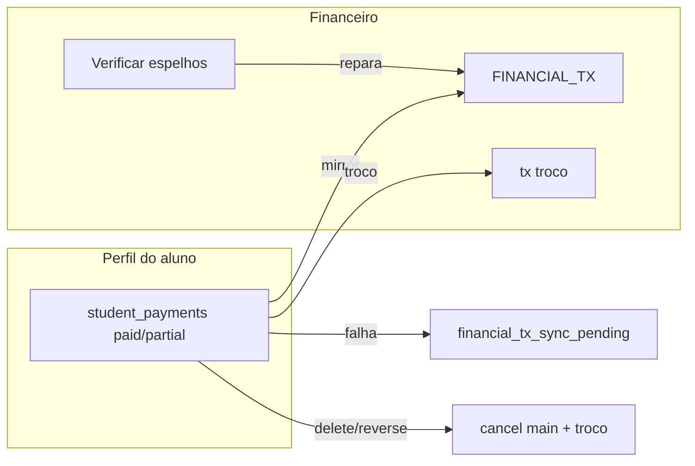

# Pagamentos do aluno ↔ Lançamentos (Caixa) — correção de espelhamento — PRODUCT Spec

**Data:** 2026-06-25  
**Status:** Spec para aprovação → **implementado (2026-06-25)**  
**TECH:** [2026-06-25-student-payment-caixa-mirror-correction-TECH.md](./2026-06-25-student-payment-caixa-mirror-correction-TECH.md)  
**Origem:** auditoria de espelhamento `student_payments` → `FINANCIAL_TX` (perfil do aluno vs Financeiro → Lançamentos)  
**Relacionado:** [aluno-perfil-presenca.md](../../flows/crm/aluno-perfil-presenca.md), [a-receber-mensalidades.md](../../flows/financeiro/a-receber-mensalidades.md), `StudentProfile.jsx`, `studentPaymentFinancialTxMirror.js`, `ReconciliationTab.jsx`

---

## 1. Problem Statement

O Nave registra pagamentos no perfil do aluno em `student_payments` e **espelha automaticamente** no Caixa (`FINANCIAL_TX`) quando o status é **pago** ou **parcial**. Na prática, operadores confiam que “tudo que registrei no aluno está no financeiro”, mas a auditoria identificou **lacunas de consistência**:

- **Taxa/avulso/outro** (`fee`, `other`) espelham, mas **não entram** na reconciliação automática (“Verificar espelhos” / cron).
- **Exclusão ou estorno** cancela só o `financial_tx_id` gravado no pagamento — o lançamento de **troco** (`student_payment_troco`) pode permanecer ativo.
- Se o espelho principal falhar e o writeback de `financial_tx_id` não ocorrer, o lançamento órfão **não é cancelado** na exclusão do pagamento.
- Falhas de espelho no **servidor** não marcam `financial_tx_sync_pending` (só o caminho client-side legado).
- **Taxas** aparecem em Lançamentos classificadas como **Mensalidades**, distorcendo DRE e filtros.
- Fallback local de edição (`updatePayment` sem API) **não reespelha** o Caixa.

**Quem sofre:** owner, admin e recepcionista que registram mensalidades, taxas e pacotes no perfil e fecham o mês pelo Caixa / conciliação.

**Custo de não resolver:** saldo e DRE divergentes do extrato real; conciliação bancária sem match; retrabalho manual; perda de confiança no espelhamento automático.

**Comportamento correto que permanece (não é bug):**

- Pagamentos **pendentes**, **aguardando**, **cobertos** (filhos de pacote), **trancados** e **cancelados** **não** geram lançamento no Caixa — por design.
- **Pacote com cobertura:** um lançamento na âncora (valor total); meses `covered` são só controle interno.
- **Venda de produto** no perfil usa fluxo de **vendas** (`origin_type: sale`), não `student_payment`.

---

## 2. Goals

| # | Objetivo | Como medir |
|---|----------|------------|
| G1 | Todo pagamento **paid/partial** do perfil tem espelho válido ou flag explícita de falha | 100% dos novos registros com `financial_tx_id` **ou** `financial_tx_sync_pending=true` |
| G2 | Reconciliação cobre **todas** as categorias que espelham (plan, bundle, fee, other) | Cron + “Verificar espelhos” reparam fee/other órfãos |
| G3 | Exclusão/estorno de pagamento **cancela** lançamento principal **e** troco vinculado | Zero txs `settled` com `origin_id` de pagamento excluído |
| G4 | Classificação correta no Caixa por tipo de pagamento | Taxa/outro não aparecem como Mensalidade no DRE |
| G5 | Falha de espelho visível e recuperável | Toast + banner + reconciliação; operador não fica com “salvo silenciosamente sem caixa” |
| G6 | Sem regressão nos fluxos intencionais | Pendentes/cobertos/pacote-âncora/venda-produto inalterados |

---

## 3. Non-Goals (v1)

| Item | Motivo |
|------|--------|
| Espelhar pagamentos **pendentes** ou **aguardando** no Caixa | Decisão de produto existente; ver tooltip em `TransacoesTab` |
| Um lançamento por mês **covered** de pacote | Modelo atual (1 tx na âncora) é intencional |
| Unificar venda de produto com `student_payments` | Fluxo `sales` + `origin_type: sale` já correto |
| Editar lançamento liquidado in-place | Manter estorno/cancelamento |
| Novo arquivo em `/api/` | Limite Vercel Hobby 12/12 |
| Backfill obrigatório de histórico antes do release | P1 script opcional |
| Migrar mensagens para coleção `conversation_messages` | Fora de escopo |

---

## 4. Visão da solução

### Fase 1 — Consistência operacional (P0)

1. Ampliar reconciliação (`paymentNeedsMirrorRepair`) para **fee** e **other**.
2. Ao **excluir** ou **estornar** pagamento: cancelar txs encontradas por `financial_tx_id` **e** por `origin_id` (`student_payment`, `student_payment_troco`).
3. Marcar `financial_tx_sync_pending` também no **handler servidor** quando espelho falhar.
4. Corrigir fallback local de **update** para reespelhar (ou forçar API).
5. Centralizar helper `cancelFinancialTxMirrorsForPayment(paymentId)`.

### Fase 2 — Classificação e visibilidade (P1)

1. Mapear categoria do espelho: `fee` / `other` → receita adequada (`OUTROS_RECEITA` ou equivalente), não `MENSALIDADE`.
2. Badge/link no perfil ou timeline quando `financial_tx_sync_pending` ou espelho ausente.
3. Script de backfill para pagamentos paid/partial sem espelho válido (dry-run).

### Fase 3 — Futuro (P2)

| Prioridade | Item |
|------------|------|
| P2 | Métrica/dashboard de órfãos por academia |
| P2 | NL “pagamento X está no caixa?” |

---

## 5. User Stories

### Owner / Admin

- **US1:** Como gestor, quero que toda **taxa avulsa paga** no perfil apareça em Lançamentos, para fechar o Caixa sem lançamento manual.
- **US2:** Como gestor, quero que **“Verificar espelhos”** repare também taxas/outros, não só mensalidades da grade.
- **US3:** Como gestor, ao **excluir** um pagamento em dinheiro com troco, quero que **entrada e saída de troco** sumam do Caixa (canceladas).
- **US4:** Como gestor, quero ver no perfil quando o pagamento **não espelhou**, para corrigir antes do fechamento.
- **US5:** Como gestor, quero taxas classificadas corretamente no DRE (não como Mensalidade).

### Recepcionista (member)

- **US6:** Como recepcionista, ao registrar mensalidade paga, quero aviso claro se o Caixa falhou, com orientação (“peça ao admin usar Verificar espelhos”).
- **US7:** Como recepcionista, entendo que **pendente** no perfil **não** aparece em Lançamentos até ser pago — sem surpresa no fechamento.

### Edge cases

- **US8:** Pagamento pago sem `financial_tx_id` (writeback falhou) → exclusão cancela tx encontrada por `origin_id`.
- **US9:** Pacote anual → um lançamento no Caixa; meses cobertos no perfil **sem** lançamento extra (documentado).
- **US10:** Venda de produto no modal “Produto” → lançamento `origin_type: sale` (fora do escopo desta correção, mas não confundir com bug).

---

## 6. Requirements

### Must-Have (P0)

#### R1 — Reconciliação inclui fee/other

**Dado** pagamento `student_payments` com `status` paid ou partial  
**Quando** `payment_category` for `fee` ou `other` e espelho ausente ou tx cancelada  
**Então**:

- [ ] `reconcileStudentPaymentMirrorsForAcademy` inclui o documento na fila de reparo
- [ ] Cron `student-payment-reconcile` repara fee/other da mesma forma que plan/bundle
- [ ] Testes unitários em `studentPaymentReconcileCore.test.js`

#### R2 — Cancelamento completo no delete/reverse

**Dado** pagamento com espelho(s) no Caixa  
**Quando** titular/admin **excluir** ou **estornar** (`status: cancelled`)  
**Então**:

- [ ] Cancelar tx principal (`origin_type: student_payment`, `origin_id: paymentId`)
- [ ] Cancelar tx de troco (`origin_type: student_payment_troco`, mesmo `origin_id`)
- [ ] Se `financial_tx_id` estiver vazio, buscar por `origin_id` antes de delete do pagamento
- [ ] Não deixar tx `settled` órfã após delete do pagamento

#### R3 — Flag de falha no servidor

**Dado** `maybeMirrorPaymentToCaixa` retorna falha ou `mirrorId` nulo com status espelhável  
**Quando** POST/PATCH concluir  
**Então**:

- [ ] Gravar `financial_tx_sync_pending: true` no pagamento (com fallback strip attrs)
- [ ] Resposta API mantém `mirror_warning` + toast client-side existente
- [ ] Limpar flag após espelho bem-sucedido (reconcile ou retry)

#### R4 — Update local reespelha

**Dado** fallback `updatePayment(..., { forceLocal: true })`  
**Quando** status paid/partial  
**Então**:

- [ ] Reutilizar `persistPaymentDocument` / espelho server-side equivalente — **não** só `updateDocument` sem mirror

#### R5 — Sem regressão de design intencional

- [ ] `pending`, `awaiting`, `covered`, `frozen`, `cancelled` **não** criam espelho novo
- [ ] Bundle: só âncora espelha; filhos `covered` com `skipMirror`
- [ ] Produto: fluxo `sales` inalterado

#### R6 — Fluxo e docs

- [ ] Atualizar checklist em `docs/flows/crm/aluno-perfil-presenca.md` (espelho, troco, taxa)
- [ ] Registrar validação em `docs/flows/VALIDATION.md` após implementação

### Nice-to-Have (P1)

#### R7 — Categoria correta no espelho

**Dado** `payment_category: fee` ou `other`  
**Quando** espelhar  
**Então**:

- [ ] Usar categoria de receita adequada (proposta: `OUTROS_RECEITA`; ver Q1)
- [ ] Mensalidade (`plan` / âncora `bundle`) permanece `MENSALIDADE`
- [ ] Testes em `studentPaymentFinancialTxMirror.test.js`

#### R8 — Visibilidade no perfil

- [ ] Timeline ou lista de pagamentos: indicador “Pendente sync Caixa” quando `financial_tx_sync_pending`
- [ ] Link para Lançamentos quando `financial_tx_id` presente

#### R9 — Backfill

- [ ] Script `scripts/backfill-student-payment-mirrors.mjs` (`--dry-run`, `--academy-id=`)
- [ ] Log JSON: `repaired`, `failed`, `skipped_by_design`

### Future (P2)

- [ ] **R10:** Painel admin de órfãos por academia
- [ ] **R11:** Alerta proativo e-mail/in-app quando reconcile falhar 3 dias seguidos

---

## 7. UX — comportamento esperado

### 7.1 Mensagens (seguir `docs/ux-feedback.md`)

| Situação | Mensagem |
|----------|----------|
| Espelho OK | “Pagamento registrado.” (atual) |
| Espelho falhou | Toast warning existente + orientação “Verificar espelhos” na conciliação |
| Delete OK | “Lançamento excluído.” (pagamento + caixa cancelados) |
| Pending no perfil | Sem lançamento em Caixa — **não** exibir erro |

### 7.2 O que o operador deve entender

| No perfil | Em Lançamentos |
|-----------|----------------|
| Mensalidade **paga** | 1 entrada (Mensalidades) |
| Mensalidade **pendente** | Nada (até pagar) |
| Pacote 12 meses **pago** | 1 entrada (valor total) |
| Taxa **paga** | 1 entrada (Outras receitas — P1) |
| Dinheiro **com troco** | Entrada + saída troco |
| Produto vendido | Entrada Vendas (`sale`) |

---

## 8. Success Metrics

### Leading (1–2 semanas pós-release)

| Métrica | Meta | Método |
|---------|------|--------|
| Novos paid/partial sem espelho nem flag | 0% | Query Appwrite + logs `mirror_failed` |
| Órfãos após DELETE | 0 em amostra | Script auditoria `origin_id` sem pagamento |
| Reparo fee/other via reconcile | ≥ 95% dos órfãos detectados | Log cron `student_payment_reconcile_cron` |

### Lagging (30–60 dias)

| Métrica | Meta |
|---------|------|
| Tickets “pagamento no aluno não aparece no financeiro” | Redução ≥ 40% |
| Divergência saldo Caixa × soma pagamentos paid | Tendência ↓ em academias piloto |

---

## 9. Open Questions

| # | Pergunta | Responsável | Bloqueante? |
|---|----------|-------------|-------------|
| Q1 | `fee` → `OUTROS_RECEITA` e `other` → `OUTROS_RECEITA`, ou categorias distintas? | Produto + Finance | Sim para P1 |
| Q2 | Cancelar troco no estorno (`PATCH cancelled`) além do DELETE? | Eng | Não — default: sim |
| Q3 | Backfill obrigatório no deploy ou best-effort? | Produto | Não |
| Q4 | Exibir badge “Sem Caixa” no perfil para member ou só admin? | Produto | Não — default: quem vê financeiro |

**Decisão recomendada:** Q1 → ambos `OUTROS_RECEITA` com `note` descritiva; diferenciar fee/other no relatório por `origin_type` + metadata, não por categoria DRE distinta em v1.

---

## 10. Timeline e fases

| Fase | Entrega | Estimativa |
|------|---------|------------|
| **1 (P0)** | Reconcile fee/other + cancel troco + sync flag server + fix update local | 0,5–1 sprint |
| **2 (P1)** | Categoria espelho + UI badge + backfill | 0,5 sprint |
| **3 (P2)** | Observabilidade | Backlog |

**Dependências:** nenhuma nova function Vercel; atributo `financial_tx_sync_pending` já previsto no client.

---

## 11. Critérios de fluxo saudável vs regressão

**Saudável:** Pago no perfil → lançamento(s) no Caixa ou flag de falha; delete limpa caixa; reconcile repara fee/other; pacote = 1 tx.

**Regressão:** Pendente passa a espelhar; pacote gera 12 txs; venda produto quebra; troco permanece após delete; mensalidade deixa de espelhar.

---

## Histórico de revisão

| Data | Autor | Mudança |
|------|-------|---------|
| 2026-06-25 | — | Criação a partir de auditoria perfil aluno ↔ Lançamentos |
