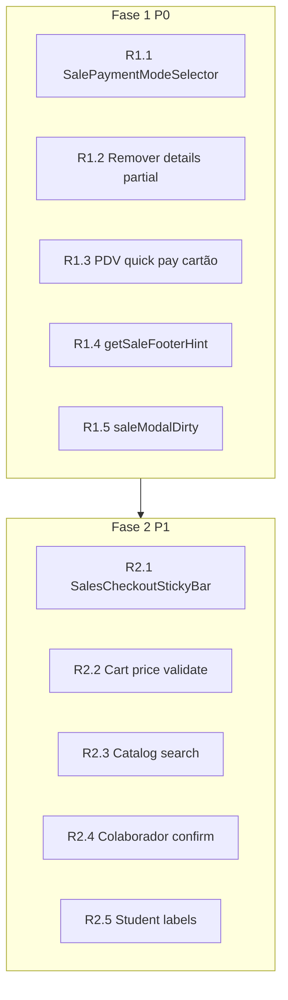

# PDV — Checkout e seleção de produto (TECH)

**Data:** 2026-06-26  
**PRODUCT:** [2026-06-26-pdv-checkout-ux-PRODUCT.md](./2026-06-26-pdv-checkout-ux-PRODUCT.md)  
**Status:** Aprovado para implementação

---

## Visão geral

Refatoração **somente front-end** do checkout de vendas: hierarquia de modos de pagamento, hints, mobile sticky, dirty state. Sem mudança em API, `salePayments.mjs` server rules ou espelho financeiro.



---

## Arquivos alterados

| Arquivo | Fase | Mudança |
|---------|------|---------|
| `src/components/sales/SalesNewSaleTab.jsx` | P0–P1 | Modo recebimento; PDV quick pay; suspend/dirty; sticky bar; colaborador confirm |
| `src/components/sales/SalesPaymentModeSelector.jsx` | P0 | **Novo** — radio/chips integral / partial / deferred |
| `src/lib/saleModalDirty.js` | P0 | `partialSale`, payments; hints partial/preço/diff |
| `src/components/sales/NovaVendaModal.jsx` | P0 | Passa snapshot dirty atualizado |
| `src/components/sales/SalesQuickPayBar.jsx` | P0 | Callback `onApply(forma)` já existe via `applyQuickPay` — estender assinatura se precisar forma |
| `src/components/sales/SalesCart.jsx` | P1 | Validação preço on change; classe `--invalid` |
| `src/components/sales/SalesCatalogPicker.jsx` | P1 | Placeholder; prop `autoFocusSearch` |
| `src/components/sales/SalesCheckoutStickyBar.jsx` | P1 | **Novo** — total + submit + hint mobile |
| `src/components/student/StudentProductSaleStep.jsx` | P1 | Rótulo “Vender a prazo” |
| `src/styles/sales.css` | P0–P1 | Modo recebimento, sticky bar, cart invalid |
| `docs/flows/vendas/pdv-nova-venda.md` | P0 | Link spec + checklist |
| `src/test/saleModalDirty.test.js` | P0 | **Novo** ou expandir se existir |
| `src/test/lojaSalesTabs.test.js` | — | Sem mudança de URL |

### Sem alteração

- `api/*`, `lib/server/salesCreateHandler.js`, `salePayments.mjs` (regras de partial/deferred).
- `SalesVariantPicker.jsx` (P2 inline variants).
- `ModalShell.jsx`.

---

## Decisões técnicas

### D1 — `SalePaymentModeSelector` (R1.1)

Componente controlado:

```tsx
type SalePaymentMode = 'integral' | 'partial' | 'deferred';

<SalePaymentModeSelector
  value={mode} // derivado de partialSale + deferredSale
  onChange={(next) => { ... setPartialSale; setDeferredSale; setManualPaymentOpen; }}
  disabled={creating || cart.length === 0}
/>
```

**Derivação de `value`:**

```javascript
function derivePaymentMode({ partialSale, deferredSale }) {
  if (deferredSale) return 'deferred';
  if (partialSale) return 'partial';
  return 'integral';
}

function applyPaymentMode(mode, setters) {
  if (mode === 'deferred') {
    setters.setDeferredSale(true);
    setters.setPartialSale(false);
    setters.setManualPaymentOpen(false);
    setters.setPayments([]);
  } else if (mode === 'partial') {
    setters.setPartialSale(true);
    setters.setDeferredSale(false);
    setters.setManualPaymentOpen(true);
  } else {
    setters.setPartialSale(false);
    setters.setDeferredSale(false);
  }
}
```

**UI:** usar padrão existente de chips/toggles (`sales-collab-toggle` ou `HubTabBar` variant `segment` se existir). Preferir **radio group** com `role="radiogroup"` e `aria-label="Como receber"` para a11y.

**Posição no JSX:** imediatamente antes de `SalesQuickPayBar` (substituir bloco `details` partial/deferred ~linhas 1326–1364).

### D2 — Remover “Mais opções” vazio (R1.2)

Após mover partial/deferred:

- **Colaborador** permanece como `sales-collab-toggle` **abaixo** do bloco de pagamento (já existe ~1366).
- Remover `<details class="sales-more-options">` inteiro se não sobrar conteúdo.
- Remover state `moreOptionsOpen` se unused.

### D3 — PDV + quick pay cartão (R1.3)

Em `applyQuickPay(forma)` (`SalesNewSaleTab.jsx`):

```javascript
const applyQuickPay = useCallback((forma) => {
  setDeferredSale(false);
  setPartialSale(false);
  setPayments(buildQuickPayment(forma, totalFinalCents));
  setManualPaymentOpen(true);
  if (forma === 'dinheiro') focusCashReceived();
  // pdvMode: manualPaymentOpen true garante capture UI para cartão
}, [...]);
```

Já abre manual em alguns caminhos — garantir **sempre** `setManualPaymentOpen(true)` após quick pay quando `forma` é `cartao_credito` ou `cartao_debito`.

Toggle “Pagamento manual” permanece para quem quer split sem quick pay.

### D4 — `getSaleFooterHint` (R1.4)

Expandir `src/lib/saleModalDirty.js`:

```javascript
export function getSaleFooterHint({
  cartLength = 0,
  paymentValid = { ok: true },
  deferredSale = false,
  partialSale = false,
  receiveLater = false, // fluxo aluno
  busy = false,
  missingPriceLabel = null,
  dueDate = '',
  paymentDiffCents = null, // total - net, se calculado
} = {}) {
  if (busy) return null;
  if (cartLength === 0) return 'Adicione pelo menos um item ao carrinho.';
  if (missingPriceLabel) return `Informe o preço de "${missingPriceLabel}".`;
  if (deferredSale || receiveLater) {
    if (!String(dueDate || '').trim()) return 'Informe a data de vencimento.';
    return null;
  }
  if (!paymentValid.ok) {
    if (partialSale) {
      if (paymentValid.reason === 'sum_partial_exceeds')
        return 'O valor recebido agora deve ser menor que o total da venda.';
      return 'Informe um valor recebido agora menor que o total da venda.';
    }
    if (paymentDiffCents > 0)
      return `Faltam ${formatBRLFromCents(paymentDiffCents)} no pagamento.`;
    if (paymentValid.reason === 'capture_method' && paymentValid.message)
      return paymentValid.message;
    return 'Ajuste os valores de pagamento para cobrir o total.';
  }
  return null;
}
```

`SalesNewSaleTab` calcula `missingPriceLabel` no render (primeira linha com preço inválido) e `paymentDiffCents` de `paymentValid`.

Propagar para `onSubmitStateChange` (modal) e exibir acima do botão na página.

### D5 — Dirty state (R1.5)

```javascript
export function isSaleCheckoutDirty({
  cart = [],
  alunoId = '',
  clienteNome = '',
  clienteTelefone = '',
  descGeralCents = 0,
  descGeralPct = 0,
  deferredSale = false,
  partialSale = false,
  payments = [],
} = {}) {
  // ... existing ...
  if (partialSale) return true;
  if (netPaidCentsFromRows(payments) > 0) return true;
  return false;
}
```

Import `netPaidCentsFromRows` from `salePayments.js` (client).

`handleSuspendCart`: adicionar `setPartialSale(false)` e incluir `partialSale` no snapshot JSON se serializado.

### D6 — `SalesCheckoutStickyBar` (R2.1)

```jsx
// SalesCheckoutStickyBar.jsx
export default function SalesCheckoutStickyBar({
  totalLabel,
  submitDisabled,
  hint,
  creating,
  formId,
  visible, // useMatchMobile() && mobilePanel === 'cart'
}) { ... }
```

CSS (`sales.css`):

```css
.sales-checkout-sticky {
  position: sticky;
  bottom: 0;
  z-index: 2;
  padding: 12px 16px;
  background: var(--color-card-bg);
  border-top: 1px solid var(--color-card-border);
  box-shadow: 0 -4px 12px rgba(0,0,0,.06);
}
.sales-layout__checkout.sales-panel--active .sales-checkout-sticky {
  /* mobile only via media query */
}
```

O `<button type="submit">` principal no form pode ficar **só** na sticky bar em mobile (esconder duplicata no scroll) via class `sales-checkout__submit--desktop-only` / `--mobile-sticky`.

**Cuidado:** `form={NOVA_VENDA_FORM_ID}` no modal — sticky button deve ser `type="submit"` **dentro** do `<form>` ou `form=` attribute.

### D7 — Carrinho validação (R2.2)

Em `SalesCart`, ao `onChange` do preço:

```javascript
const [liveInvalid, setLiveInvalid] = useState({});
// debounced check valorCents <= 0
```

Ou elevar `priceTouched` no parent on change com debounce — preferir lógica no parent para não duplicar.

### D8 — Catálogo (R2.3)

`SalesCatalogPicker` recebe `autoFocusSearch?: boolean`.

`SalesNewSaleTab`: `autoFocusSearch={pdvMode && !modalMode}`.

`useEffect` + `searchInputRef.focus()` no mount.

---

## Ordem de implementação

| Ordem | Item | Estimativa |
|-------|------|------------|
| 1 | `SalePaymentModeSelector` + wiring em `SalesNewSaleTab` | M |
| 2 | Remover details; colaborador no lugar final | S |
| 3 | `saleModalDirty` + tests | S |
| 4 | `getSaleFooterHint` + submit state | S |
| 5 | PDV quick pay → manual open | S |
| 6 | `SalesCheckoutStickyBar` + CSS mobile | M |
| 7 | Cart price live validation | S |
| 8 | Catalog placeholder + autofocus | S |
| 9 | Colaborador ConfirmDialog | S |
| 10 | StudentProductSaleStep label | S |
| 11 | Atualizar `docs/flows/vendas/pdv-nova-venda.md` | S |

S ≈ &lt; 1h · M ≈ 2–4h

---

## Testes

### Unit — `src/test/saleModalDirty.test.js`

```javascript
describe('isSaleCheckoutDirty', () => {
  it('true when partialSale', () => {
    expect(isSaleCheckoutDirty({ partialSale: true })).toBe(true);
  });
  it('true when payments have value', () => {
    expect(isSaleCheckoutDirty({
      payments: [{ valorCents: 1000, forma: 'pix' }],
    })).toBe(true);
  });
});

describe('getSaleFooterHint', () => {
  it('partial-specific message', () => {
    expect(getSaleFooterHint({
      cartLength: 1,
      partialSale: true,
      paymentValid: { ok: false },
    })).toContain('menor que o total');
  });
});
```

### Component — opcional P1

`SalesPaymentModeSelector.test.jsx`: troca de modo chama callbacks corretos.

### Manual QA

Ver checklist PRODUCT §10.

---

## Governança de fluxos

Atualizar em `docs/flows/vendas/pdv-nova-venda.md`:

- Metadados: link para esta spec.
- Mapa de telas: linha “Modo de recebimento” no checkout.
- Checklist: itens partial/prazo visíveis; mobile sticky; hint footer.

Registrar em `docs/flows/VALIDATION.md` após merge.

---

## Rollback

Todas as mudanças são UI-only. Rollback = revert do PR sem migração de dados.

Feature flag **não** necessária; se necessário temporário, env `VITE_SALES_LEGACY_PAYMENT_UI=1` pode restaurar details (não implementar salvo pedido).

---

## Histórico de revisão

| Data | Autor | Mudança |
|------|-------|---------|
| 2026-06-26 | — | TECH spec inicial |
