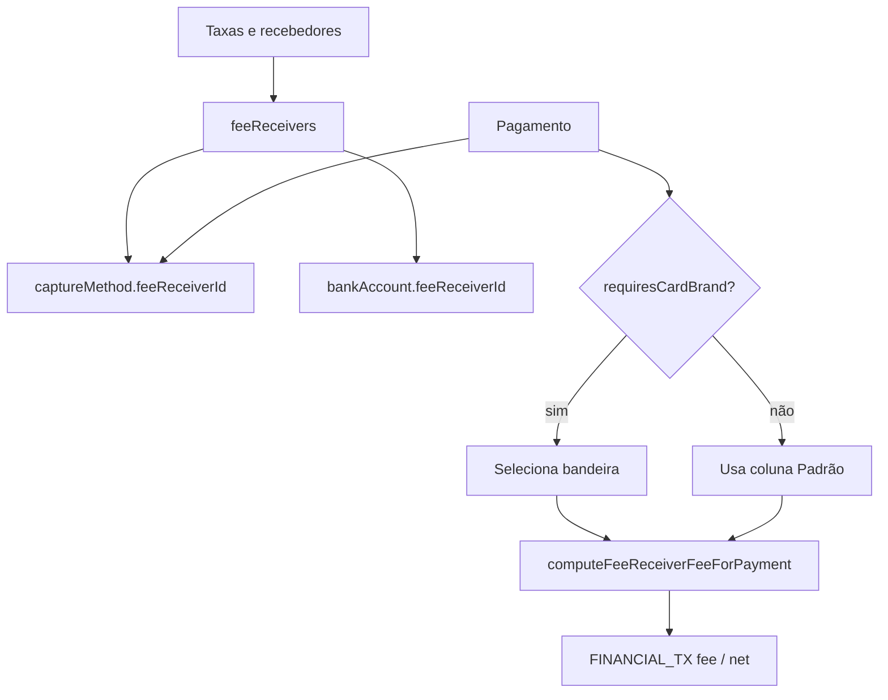

# Taxas por recebedor e bandeira — TECH Spec

**Data:** 2026-06-28  
**PRODUCT:** [2026-06-28-taxas-recebedor-bandeira-PRODUCT.md](./2026-06-28-taxas-recebedor-bandeira-PRODUCT.md)  
**Status:** Aprovado para implementação  

---

## 1. Estado atual

| Peça | Comportamento |
|------|---------------|
| `financeConfig.acquirerFees` | MDR global |
| `bankAccounts[].acquirerFees` | Override por conta |
| `captureMethods[].fees` | Override por meio + parcela |
| `resolveAcquirerFees.js` | Precedência meio → conta → global |
| Pagamentos | Sem `card_brand` |
| UI taxas | `FinanceSettingsFeesSection` + `AcquirerFeesSection` + matrizes em Banks/Capture |

---

## 2. Schema

### 2.1 `feeReceivers[]`

```ts
type FeeRow = { percent: number; fixed: number };

type FeeByBrand = {
  default: FeeRow;
  visa?: FeeRow;
  mastercard?: FeeRow;
  elo?: FeeRow;
  amex?: FeeRow;
  hipercard?: FeeRow;
  other?: FeeRow;
};

type FeeReceiverFeeTable = {
  pix: FeeRow;
  debito: FeeByBrand;
  credito_avista: FeeByBrand;
  credito_parcelado: Record<string, FeeByBrand>; // keys '2'..'12'
  antecipacao: FeeRow;
};

type FeeReceiver = {
  id: string;              // recv_<uuid>
  name: string;
  provider?: string;       // pagbank | asaas | stone | cielo | rede | manual
  bankAccountLabel: string;
  active: boolean;
  useDefaultFees: boolean; // true → herda defaultFeeReceiverId
  fees?: FeeReceiverFeeTable;
};
```

### 2.2 `financeConfig` — campos novos/alterados

```ts
{
  defaultFeeReceiverId?: string;
  feeReceivers?: FeeReceiver[];  // ou offload em settings

  // Legado — read-only após migração; strip on write
  acquirerFees?: ...;
}
```

### 2.3 Ligações

```ts
// bankAccounts[i]
{ feeReceiverId?: string; /* deprecate acquirerFees, useDefaultAcquirerFees */ }

// captureMethods[i]
{ feeReceiverId?: string; /* deprecate fees, useDefaultFees */ }

// paymentMethodSettings[method]
{ defaultFeeReceiverId?: string; ... }

// student_payments / sale payment payload
{ card_brand?: string; fee_receiver_id?: string; }
```

### 2.4 Bandeiras canônicas

Arquivo: `src/lib/cardBrands.js`

```js
export const CARD_BRANDS = [
  'default', 'visa', 'mastercard', 'elo', 'amex', 'hipercard', 'other',
];
export const CARD_BRAND_UI_LABELS = {
  default: 'Padrão',
  visa: 'Visa',
  mastercard: 'Mastercard',
  elo: 'Elo',
  amex: 'Amex',
  hipercard: 'Hipercard',
  other: 'Outras',
};
```

---

## 3. Divergência de bandeira (lógica)

Arquivo: `src/lib/feeReceivers.js`

```js
/**
 * Retorna true se o recebedor tem taxas distintas entre bandeiras
 * para (method, installments).
 */
export function hasBrandFeeDivergence(receiver, method, installments = 1) {
  const rows = collectBrandRows(receiver, method, installments);
  if (rows.length <= 1) return false;
  const sigs = new Set(rows.map(feeRowSignature));
  return sigs.size > 1;
}

export function requiresCardBrandForPayment(financeConfig, {
  feeReceiverId, captureMethodId, bankAccount, method, installments,
}) {
  const receiver = resolveFeeReceiverForPayment(financeConfig, { ... });
  if (!receiver || receiver.useDefaultFees) {
    const def = findFeeReceiverById(financeConfig, financeConfig.defaultFeeReceiverId);
    return hasBrandFeeDivergence(def, method, installments);
  }
  return hasBrandFeeDivergence(receiver, method, installments);
}
```

**Assinatura de linha:** `` `${percent}:${fixed}` `` após `normalizeFeeRow`.

**Bandeiras consideradas:** apenas colunas com `percent > 0` ou `fixed > 0`, mais `default` se for a única preenchida.

---

## 4. Resolver

Novo: `src/lib/resolveFeeReceiver.js`

```js
export function resolveFeeReceiverForPayment(financeConfig, opts) {
  // 1 fee_receiver_id explícito
  // 2 captureMethod.feeReceiverId
  // 3 bankAccount.feeReceiverId
  // 4 paymentMethodSettings[method].defaultFeeReceiverId
  // 5 defaultFeeReceiverId
  // 6 migrateLegacyReceiver(financeConfig, opts) — uma release
}

export function pickFeeRow(fees, method, installments, cardBrand) {
  const brand = normalizeCardBrand(cardBrand) || 'default';
  const byBrand = resolveMethodBrandTable(fees, method, installments);
  return byBrand[brand] ?? byBrand.default ?? ZERO_ROW;
}

export function computeFeeReceiverFeeForPayment({ financeConfig, gross, planBase, policy, method, installments, cardBrand, ...resolverOpts }) {
  const receiver = resolveFeeReceiverForPayment(financeConfig, resolverOpts);
  const fees = receiver.useDefaultFees
    ? findFeeReceiverById(financeConfig, financeConfig.defaultFeeReceiverId)?.fees
    : receiver.fees;
  const row = pickFeeRow(fees, method, installments, cardBrand);
  return computeFeeFromRow({ gross, planBase, policy, row });
}
```

`resolveAcquirerFees.js` — adapter temporário:

```js
export function resolveAcquirerFeesForPayment(cfg, opts) {
  const receiver = resolveFeeReceiverForPayment(cfg, opts);
  return feeReceiverTableToLegacyAcquirerFees(receiver);
}
```

---

## 5. Migração (read path)

`src/lib/migrateFeeReceivers.js` — chamado em `mergeFinanceConfigFromAcademyDoc`:

1. Se `feeReceivers?.length` → normalizar e retornar.
2. Criar `recv_default` de `acquirerFees` global.
3. Para cada `bankAccount` com `useDefaultAcquirerFees === false` → `recv_bank_{idx}`.
4. Para cada `captureMethod` com `useDefaultFees === false` → `recv_cap_{id}` ou deduplicar por hash de fees.
5. Setar `feeReceiverId` nas entidades; `defaultFeeReceiverId = recv_default.id`.
6. Converter fees legadas (sem bandeira) → só coluna `default` em `FeeByBrand`.

**Write path:** persistir só `feeReceivers`; strip `acquirerFees` em contas/meios após cutover flag `feeReceiversMigrated: true`.

---

## 6. Persistência

`financeConfigStorage.js`:

```js
const SETTINGS_FEE_RECEIVERS_KEY = 'financeFeeReceivers';
const SETTINGS_FEE_RECEIVERS_OFFLOAD_FLAG = 'financeFeeReceiversOffloaded';
```

- Inline em `financeConfig` se couber no budget (~2500 legado / 16k alvo).
- Offload para `academy.settings` como `bankAccounts` / `plans`.
- Sparse: omitir bandeiras zeradas; omitir `fees` quando `useDefaultFees === true`.

---

## 7. UI

| Arquivo | Ação |
|---------|------|
| `FinanceSettingsFeesSection.jsx` | Abas Repasse \| Recebedores |
| `FinanceSettingsFeeReceiversSection.jsx` | **Novo** — lista + drawer |
| `FeeReceiverMatrix.jsx` | **Novo** — grade bandeira × método × parcela |
| `FinanceSettingsAcquirerFeesSection.jsx` | Remover ou redirecionar para recebedor padrão |
| `FinanceSettingsBanksSection.jsx` | Remover `FinanceSettingsAcquirerFeesFields`; add select recebedor |
| `FinanceSettingsCaptureMethodPanel.jsx` | Remover `CaptureMethodFeeMatrix`; add select recebedor |
| `CardBrandSelect.jsx` | **Novo** — condicional por `requiresCardBrandForPayment` |
| `StudentPaymentModal.jsx`, `SalesPaymentBlock.jsx`, `BankReconRegisterPaymentModal.jsx` | Integrar bandeira + preview taxa |

`financeSettingsSections.js`:

```js
{ id: TAXAS, label: 'Taxas e recebedores', hint: 'Repasse ao aluno e taxas por maquininha/bandeira' }
```

---

## 8. Call sites (Fase 3)

| Arquivo | Mudança |
|---------|---------|
| `lib/server/studentPaymentFinancialTxMirror.js` | `computeFeeReceiverFeeForPayment` + `card_brand` |
| `lib/server/salesMirror.js` | idem |
| `src/lib/studentPayments.js` | idem client |
| `lib/server/studentPaymentsHandler.js` | validar bandeira se `requiresCardBrandForPayment` |
| `lib/server/salePaymentRules.js` | validação bandeira |
| `src/lib/captureMethodPaymentForm.js` | `validateCardBrandForSubmit` |
| `src/lib/financeForecastInflows.js` | recebedor padrão; bandeira = default |
| `src/lib/installmentSchedule.js` | idem |
| `lib/server/financeAnticipationHandler.js` | recebedor do TX pai |

---

## 9. Testes

**Novos:**

- `src/test/feeReceivers.test.js` — normalize, sparse, `hasBrandFeeDivergence`, `pickFeeRow`
- `src/test/resolveFeeReceiver.test.js` — precedência, migração, PagBank vs Asaas
- `src/test/cardBrandPaymentValidation.test.js` — obrigatório só com divergência

**Casos obrigatórios:**

| Caso | Esperado |
|------|----------|
| Só coluna Padrão preenchida | `requiresCardBrand` = false |
| Visa 2% / Master 3% débito | `requiresCardBrand` = true |
| Visa 2% / Master 2% (iguais) | false |
| Pagamento sem bandeira + divergência | erro validação |
| Migração global 1,5% débito | `default.debito.default.percent === 1.5` |

---

## 10. Ordem de implementação

Ver [plano](../plans/2026-06-28-taxas-recebedor-bandeira.md).

---

## 11. Diagrama



---

## 12. Histórico

| Data | Mudança |
|------|---------|
| 2026-06-28 | Spec técnica inicial |
| 2026-06-28 | `requiresCardBrandForPayment` — divergência confirmada pelo owner |
