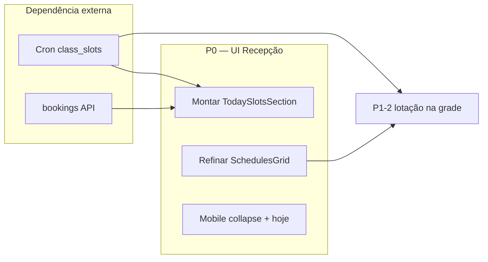

# Recepção — grade de horários e operação do dia — PRODUCT

**Data:** 2026-07-01  
**Status:** rascunho — aguardando aprovação  
**TECH:** [2026-07-01-recepcao-grade-horarios-TECH.md](./2026-07-01-recepcao-grade-horarios-TECH.md)

**Contexto:** A Recepção (`/`, aba Experimentais) exibe `RecepcaoSchedulesGrid` — grade semanal **read-only** baseada em `schedules` (template recorrente). O componente `RecepcaoTodaySlotsSection` (aulas do dia + inscrições) **já existe** mas **não está integrado** ao `Dashboard.jsx`. A spec [2026-06-19-agendamento-reservas-PRODUCT.md](./2026-06-19-agendamento-reservas-PRODUCT.md) cobre slots/bookings de ponta a ponta; **esta spec foca na experiência visual e operacional da Recepção**, reutilizando o que já foi construído.

**Specs relacionadas:**

- [2026-06-19-agendamento-reservas-PRODUCT.md](./2026-06-19-agendamento-reservas-PRODUCT.md) — `class_slots`, `bookings`, cron, APIs (dependência parcial)
- [2026-06-17-recepcao-navegacao-PRODUCT.md](./2026-06-17-recepcao-navegacao-PRODUCT.md) — hub Recepção e abas
- [2026-06-10-dashboard-retornos-row-design.md](./2026-06-10-dashboard-retornos-row-design.md) — follow-ups na mesma aba

**Fluxos afetados** (atualizar no mesmo PR da implementação):

- [hoje-dashboard.md](../../flows/crm/hoje-dashboard.md) — seção horários / aulas do dia
- [empresa-horarios-turmas.md](../../flows/config/empresa-horarios-turmas.md) — preview na recepção
- [VALIDATION.md](../../flows/VALIDATION.md) — checklist grade + slots

**Arquivos-chave (estado atual):**

- `src/components/recepcao/RecepcaoSchedulesGrid.jsx` — grade semanal
- `src/components/recepcao/RecepcaoTodaySlotsSection.jsx` — aulas do dia (não montado)
- `src/pages/Dashboard.jsx` — ordem das seções
- `src/lib/schedules.js` — `buildWeeklyScheduleGrid`
- `src/styles/schedules.css`, `src/styles/slots.css`

**Mock Figma:** não disponível — wireframes ASCII abaixo.

---

## 1. Problem Statement

A recepcionista abre a Recepção para operar o **dia corrente**: saber quais aulas acontecem, quantas vagas restam e inscrever alunos. Hoje a tela prioriza experimentais e follow-ups; a **grade semanal** aparece como tabela estática no meio da página, sem lotação, sem destaque de «agora» e com scroll horizontal no mobile.

**Quem sofre:** recepcionista (operação diária), owner (confere se a grade configurada reflete a realidade).

**Custo de não resolver:**

- Planilha paralela ou memória para lotação e horários do dia
- Grade semanal competindo visualmente com fluxos mais urgentes (experimentais, catraca)
- Componente operacional (`RecepcaoTodaySlotsSection`) pronto mas invisível ao usuário
- Baixa scanabilidade: cards monocromáticos, horário duplicado, domingo oculto via CSS

---

## 2. Goals

| # | Objetivo | Métrica de sucesso |
|---|----------|-------------------|
| G1 | **Operação do dia em primeiro plano** | Seção «Aulas de hoje» visível acima da grade semanal na Recepção |
| G2 | **Grade semanal como referência secundária** | Grade colapsável por padrão em mobile; expandida em desktop |
| G3 | **Scanabilidade** | Recepcionista identifica aula atual/próxima em ≤ 3 s (teste moderado) |
| G4 | **Consistência visual** | Cards usam cor/badge de turma/modalidade alinhados ao design system |
| G5 | **Mobile utilizável** | Sem scroll horizontal obrigatório na vista padrão mobile |

---

## 3. Non-Goals (v1 desta spec)

| Item | Motivo |
|------|--------|
| Cron de geração de slots | Escopo de [agendamento-reservas](./2026-06-19-agendamento-reservas-PRODUCT.md) Fase 7 |
| APIs server de booking | Escopo de agendamento-reservas Fase 8 |
| Auto-reserva pelo aluno / portal | v2 |
| Lista de espera | v2 |
| Impressão A4 da grade | P2 desta spec; não bloqueia v1 |
| Renomear aba `experimentais` → `agenda` | Pode ser feito junto ou em PR separado; não é pré-requisito |
| Novo arquivo em `/api/` | Limite Hobby 12/12 |
| Edição inline de horários na Recepção | Configuração permanece em `/empresa?tab=horarios` |

---

## 4. Princípios de UX

1. **Hoje opera, semana consulta** — ações (inscrever, ver lotação) ficam na seção do dia; a grade semanal é referência.
2. **Mesma linguagem visual** — reutilizar padrões de `reception-section`, badges, `EmptyState`, `useToast` ([docs/ux-feedback.md](../../ux-feedback.md)).
3. **Progressive enhancement** — melhorias visuais da grade funcionam **sem** slots; lotação aparece quando `class_slots` existir.
4. **Mobile-first no balcão** — recepcionista usa celular/tablet; desktop mantém grade completa.
5. **Não duplicar experimentais** — «Aulas de hoje» ≠ agenda de experimentais; ordem na página preserva prioridade do funil.

---

## 5. User Stories

### Recepcionista

- **US1:** Quero ver **as aulas de hoje** com horário, professor e **vagas (N/max)** logo ao abrir a Recepção, para operar o balcão sem consultar planilha.
- **US2:** Quero **inscrever ou cancelar** aluno na aula do dia em poucos cliques (expandir card → buscar aluno).
- **US3:** Quero saber **qual aula está acontecendo agora** ou **começa em breve**, para orientar alunos na porta.
- **US4:** Quero consultar a **grade da semana** quando um aluno pergunta «tem aula na quarta?», sem sair da Recepção.
- **US5:** No celular, quero ver **só o dia de hoje** por padrão, sem arrastar tabela horizontalmente.

### Owner

- **US6:** Quero que a grade na Recepção **reflita** o que configurei em Minha academia → Horários (cores, modalidade, capacidade).
- **US7:** Quero um atalho **Editar horários** visível só para mim, quando a grade estiver vazia ou incompleta.

### Edge cases

- **US8:** Academia sem schema de schedules → seção oculta (comportamento atual de `isSchedulesConfigured()`).
- **US9:** Academia com schedules mas **sem slots gerados** → «Aulas de hoje» mostra empty state orientando owner; grade semanal continua visível.
- **US10:** Duas aulas no mesmo `time_start` → ambas aparecem empilhadas na célula (comportamento atual preservado).
- **US11:** Domingo sem aulas → coluna domingo **não renderizada** (não apenas `display: none`).

---

## 6. UX — layout alvo na Recepção

Ordem das seções na aba Experimentais (`/`):

```
Recepção (/)
│
├── Hero + KPIs                    ← mantém
├── Agenda da semana (experimentais) ← mantém
│
├── [NOVO/ATIVO] Aulas de hoje       ← RecepcaoTodaySlotsSection
│     └── Card por slot (ou empty state)
│
├── [REFINADO] Grade de horários     ← RecepcaoSchedulesGrid
│     ├── Toggle Hoje | Semana (mobile)
│     ├── Filtro modalidade (mantém)
│     └── Colapsável (mobile: fechada por default)
│
├── Follow-ups                       ← mantém
└── Aniversários / saúde follow-up   ← mantém
```

### Wireframe — Aulas de hoje (desktop)

```
┌─ Aulas de hoje ─────────────────────────────── [3 aulas] ─┐
│ ┌─ 07:00–08:30 · Kimono Adulto ──────────────────────────┐ │
│ │ Prof. Silva · BJJ · Iniciante          👥 12 / 20     │ │
│ │ [▸ Ver inscrições]  [+ Inscrever aluno]               │ │
│ └────────────────────────────────────────────────────────┘ │
│ ┌─ 19:00–20:30 · No-Gi ─────────── 🟢 Em andamento ─────┐ │
│ │ ...                                                    │ │
│ └────────────────────────────────────────────────────────┘ │
└────────────────────────────────────────────────────────────┘
```

### Wireframe — Grade semanal (desktop, expandida)

```
┌─ Grade de horários ────── [Hoje] [Semana]  [Editar ↗ owner] ─┐
│ [ Todas ] [ BJJ ] [ Kids ]                                     │
│                                                                │
│        │ Seg │ Ter │ Qua │ QUI │ Sex │ Sáb │                   │
│ ───────┼─────┼─────┼─────┼─────┼─────┼─────┤                   │
│  07:00 │  —  │  —  │  —  │  —  │  —  │  ▓  │                   │
│  19:00 │  ▓  │     │  ▓  │     │  ▓  │     │  ← coluna HOJE   │
│        │Adulto   │Adulto   │Adulto   │                         │
│        │8/20     │         │         │  ← lotação se slot     │
└────────────────────────────────────────────────────────────────┘
                              ↑ linha «agora» (opcional P1)
```

### Wireframe — mobile (vista padrão)

```
┌─ Aulas de hoje ─────────────────┐
│ (lista vertical de cards)       │
└─────────────────────────────────┘

┌─ Grade de horários ── [Semana ▾]┐  ← colapsada
│ Ver grade completa da semana    │
└─────────────────────────────────┘

(expandida = lista de cards só do dia selecionado OU tabela com scroll)
```

---

## 7. Requisitos por prioridade

### P0 — Must have (esta entrega)

| ID | Requisito | Aceite |
|----|-----------|--------|
| P0-1 | Montar `RecepcaoTodaySlotsSection` no `Dashboard.jsx` | Seção aparece acima de `RecepcaoSchedulesGrid` quando `academyId` + schema configurados |
| P0-2 | Ordem de seções conforme §6 | Aulas de hoje → grade → follow-ups |
| P0-3 | Cards da grade — hierarquia visual | Nome em destaque; modalidade como badge; instrutor + capacidade com ícone; **remover horário duplicado** dentro do card quando a linha da tabela já mostra `time_start` |
| P0-4 | Cor por turma | Borda esquerda ou fundo do card usa `classes.color` quando `class_id` resolve; fallback `--color-primary-surface` |
| P0-5 | Domingo | Coluna domingo omitida da grade (prop `weekdays` ou filtro em `buildWeeklyScheduleGrid` / componente) — não usar só CSS |
| P0-6 | Empty states | Grade vazia: `EmptyState` ou card com link owner → `/empresa?tab=horarios`; slots vazios: mensagem + link (comportamento já em `RecepcaoTodaySlotsSection`) |
| P0-7 | Mobile — grade colapsável | `<details>` ou toggle «Ver grade da semana»; **fechada por default** em viewport ≤ 720px |
| P0-8 | Mobile — vista «Só hoje» na grade | Com grade expandida no mobile, mostrar **lista de cards do dia atual** em vez de tabela 6 colunas |
| P0-9 | Testes | Teste de `buildWeeklyScheduleGrid` com opção `excludeSunday`; smoke de render dos dois componentes (vitest + RTL se já houver padrão no repo) |
| P0-10 | Fluxo | Atualizar `hoje-dashboard.md` e item 11+ em `VALIDATION.md` |

### P1 — Should have

| ID | Requisito | Aceite |
|----|-----------|--------|
| P1-1 | Destaque temporal | Coluna «Hoje» com label textual «Hoje» no `<th>`; card com badge **Em andamento** se `now ∈ [time_start, time_end]`; **Em breve** se início em ≤ 60 min |
| P1-2 | Lotação na grade semanal | Quando existir `class_slot` para `(schedule_id, today)` na coluna de hoje, card exibe `booked_count/max_capacity` com cor semântica (verde/âmbar/vermelho) |
| P1-3 | Sticky time column | Coluna «Horário» fixa no scroll horizontal da tabela (desktop) |
| P1-4 | Auto-scroll para hoje | Ao expandir grade no mobile, scroll horizontal leva à coluna do dia atual |
| P1-5 | Link owner «Editar horários» | No header da seção grade, visível se `isOwner`; navega para `/empresa?tab=horarios` |
| P1-6 | Exibir `level` | Chip secundário quando `schedule.level` preenchido |
| P1-7 | Skeleton loading | Substituir texto «Carregando grade…» por skeleton de 3–4 linhas |
| P1-8 | Persistir filtro modalidade | `sessionStorage` key versionada `recepcao:schedule-modality:v1` |

### P2 — Future

| ID | Requisito |
|----|-----------|
| P2-1 | Impressão / PDF da grade semanal (layout landscape) |
| P2-2 | Filtro por instrutor e nível |
| P2-3 | Cards com altura proporcional à duração (`time_end - time_start`) |
| P2-4 | Integração catraca: «presentes / inscritos» no card do slot |
| P2-5 | Clique no card da grade → scroll/focus no card equivalente em «Aulas de hoje» |
| P2-6 | Renomear aba Experimentais → Agenda (`tab=agenda`) alinhado a agendamento-reservas |

---

## 8. Comportamento detalhado

### 8.1 Seção «Aulas de hoje»

Reutilizar `RecepcaoTodaySlotsSection` **sem reimplementar** booking UI.

| Estado | Comportamento |
|--------|---------------|
| Loading | Spinner + «Carregando aulas…» |
| Sem slots | Empty state + link `/empresa?tab=horarios` |
| Com slots | Lista ordenada por `time_start`; badge contagem no header |
| Slot lotado | Card com classe `slot-card--full` (já existe) |
| Expandir | Lista inscritos + inscrever/cancelar (já existe) |

**Dependência:** slots populados no Appwrite. Se Fase 7 de agendamento-reservas não estiver deployada, P0-1 ainda entrega valor (empty state + grade melhorada). Documentar na TECH a flag ou detecção «sem collection / sem slots».

### 8.2 Grade semanal — cards

| Campo | Exibir | Notas |
|-------|--------|-------|
| `name` | Sim | `schedules-week-card__name` |
| `time_start–time_end` | Só se vista «Só hoje» (lista) | Omitir na tabela semanal |
| `modality` | Badge | Cor derivada de turma ou token neutro |
| `instructor` | Sim | Truncar com ellipsis |
| `level` | P1 | Chip |
| `max_capacity` | Sim | `formatCapacityLabel` ou `N/max` com slots |
| `class_id` → `color` | P0 | Lookup via store `classes` ou mapa enriquecido no fetch |

### 8.3 Filtro modalidade

Manter chips atuais. Com P1-8, restaurar último filtro na sessão.

### 8.4 Colapsável mobile

- Breakpoint: `max-width: 720px` (alinhado a `schedules.css`).
- Default: colapsado.
- Toggle acessível: `aria-expanded`, foco visível.
- Preferência «sempre expandido»: fora de escopo v1.

### 8.5 Acessibilidade

- Tabela: manter `scope="col|row"`, `aria-labelledby`.
- Badge «Em andamento»: texto visível, não só cor.
- Scroll horizontal: `schedules-week-grid-wrap` com `tabindex="0"` e hint «Deslize para ver os dias» (sr-only ou microcopy P1).

---

## 9. Dependências e fases de implementação



| Fase | Escopo | Depende de |
|------|--------|------------|
| **A** | P0 visual + integração Dashboard + mobile | `schedules` configurado |
| **B** | P1 temporal + lotação na grade | `class_slots` + bookings (agendamento-reservas Fase 7–8) |
| **C** | P2 impressão, filtros avançados | — |

**Recomendação:** implementar **Fase A** mesmo sem slots; Fase B quando agendamento-reservas estiver em produção.

---

## 10. Success Metrics

### Leading (1–2 semanas pós-deploy)

| Métrica | Alvo | Método |
|---------|------|--------|
| Seção «Aulas de hoje» renderiza | 100% academias com schema | Log/feature flag ou checklist staging |
| Tempo para encontrar próxima aula (moderado, 5 recepcionistas) | ≤ 3 s mediana | Teste moderado pré/pós |
| Scroll horizontal na grade (mobile) | 0 na vista padrão | Teste manual + Playwright viewport 375px |
| Cliques «Inscrever aluno» (quando slots existem) | Baseline + uso | Evento analytics futuro; opcional v1 |

### Lagging (30 dias)

| Métrica | Hipótese |
|---------|----------|
| Redução de dúvidas ao owner sobre horários | Menos «qual horário na quarta?» |
| Adoção de inscrição via Recepção vs planilha | Crescimento quando slots ativos |

---

## 11. Open Questions

| # | Pergunta | Owner | Bloqueante? |
|---|----------|-------|-------------|
| Q1 | Renomear aba «Experimentais» → «Agenda» neste PR ou separado? | Produto | Não |
| Q2 | Default da grade colapsada também no **desktop**? | Produto | Não — proposta: expandida desktop, colapsada mobile |
| Q3 | Mostrar domingo se academy tiver schedule em `sun`? | Produto | Não — proposta: mostrar coluna só se houver ≥1 aula ativa no domingo |
| Q4 | `RecepcaoTodaySlotsSection` depende de qual store/API hoje — slots já funcionam em staging? | Engenharia | Sim para P0-1 com empty state; sim para booking se Fase 8 incompleta |
| Q5 | Enriquecer schedules com `class.color` no client (fetch classes) ou no server? | Engenharia | Não — preferir fetch paralelo `classes` no grid (padrão `SchedulesSection`) |

---

## 12. Critérios de aceite (checklist release)

- [ ] `/` aba Experimentais: «Aulas de hoje» acima da «Grade de horários»
- [ ] Mobile: grade fechada por default; abrir mostra lista do dia ou tabela utilizável
- [ ] Cards com badge modalidade e cor de turma quando configurada
- [ ] Domingo não aparece quando não há aulas; não depende de `display: none` sozinho
- [ ] Owner vê link editar horários no empty state e no header (P1)
- [ ] `docs/flows/crm/hoje-dashboard.md` descreve as duas seções
- [ ] Testes unitários passam (`npm test -- schedules recepcao`)

---

## 13. Fora de escopo explícito (parking lot)

- TV mode / fullscreen para monitor na recepção
- Sincronização Google Calendar
- Notificação push «aula começando em 15 min»
- Grade por unidade/filial (multi-unidade)
