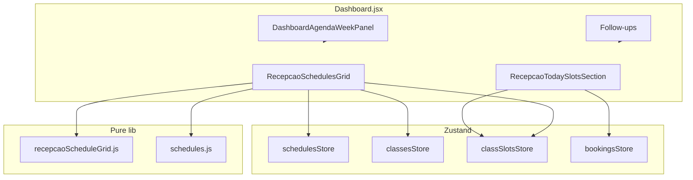

# Recepção — grade de horários e operação do dia — TECH

**Data:** 2026-07-01  
**Status:** rascunho — aguardando aprovação  
**PRODUCT:** [2026-07-01-recepcao-grade-horarios-PRODUCT.md](./2026-07-01-recepcao-grade-horarios-PRODUCT.md)

---

## 1. Escopo

Implementar **Fase A (P0)** e **Fase B (P1)** da spec de produto sobre componentes e libs **já existentes**. Sem novas Serverless Functions (limite Hobby 12/12). Sem alteração de schema Appwrite.

**Fora deste PR:** cron `generate-class-slots`, handlers de booking (já especificados em [2026-06-19-agendamento-reservas-TECH.md](./2026-06-19-agendamento-reservas-TECH.md)); renomear aba Experimentais → Agenda (P2-6).

**Dependências runtime:**

| Capacidade | Estado | Impacto se ausente |
|------------|--------|-------------------|
| Collection `schedules` | Configurável via env | `RecepcaoSchedulesGrid` oculto (atual) |
| Collection `class_slots` | Configurável via env | `RecepcaoTodaySlotsSection` → empty state ou erro amigável |
| API `list-slots` / bookings | `bookingsHandler.js` | Inscrições desabilitadas; lista vazia |

---

## 2. Decisões técnicas

| # | Decisão | Escolha | Motivo |
|---|---------|---------|--------|
| D1 | Onde vive lógica pura nova | `src/lib/recepcaoScheduleGrid.js` | Mantém `schedules.js` genérico; funções testáveis sem React |
| D2 | Cor da turma | Fetch client `classes` em paralelo (`useClassesStore`) | Mesmo padrão de `SchedulesSection`; sem endpoint novo |
| D3 | Domingo na grade | `resolveScheduleGridColumns()` omite `sun` se nenhum schedule ativo inclui `sun` | Remove hack CSS `display: none`; Q3 da PRODUCT respondida |
| D4 | Breakpoint mobile da grade | CSS + estado interno em **720px** (`max-width: 720px`) | Alinhado a `schedules.css`; independente do `767px` do Dashboard |
| D5 | Colapsável mobile | `<details>` nativo ou botão toggle com `useState` + `aria-expanded` | Preferir **botão + região colapsável** (mesmo padrão follow-ups no Dashboard) para controle de default fechado |
| D6 | Compartilhar fetch de slots | `RecepcaoTodaySlotsSection` e grade P1 leem **mesmo** `useClassSlotsStore` | Evita double fetch no mount; grade usa `slots` já carregados |
| D7 | Card reutilizável | Extrair `ScheduleGridCard.jsx` | Tabela semanal + lista «Só hoje» + mobile |
| D8 | Empty state grade | `EmptyState` shared quando `!grid.hasAny` | Paridade com `SchedulesSection` (P0-6) |
| D9 | Filtro modalidade P1 | `sessionStorage` key `recepcao:schedule-modality:v1` | Sem query URL — seção secundária |
| D10 | Status temporal P1 | Pure fn `classifyScheduleTimeStatus(start, end, now, { soonMinutes: 60 })` | Timezone `America/Sao_Paulo` via composição HH:MM local (mesmo padrão `RecepcaoTodaySlotsSection.todayYmd`) |

---

## 3. Arquitetura



**Ordem de mount no `Dashboard.jsx` (aba Experimentais):**

1. Hero / KPIs / agenda experimentais (inalterado)
2. `RecepcaoTodaySlotsSection` — se `isClassSlotsConfigured()`
3. `RecepcaoSchedulesGrid` — se `isSchedulesConfigured()`
4. Follow-ups (inalterado)

As duas seções são **independentes**: academia pode ter schedules sem slots (grade ok, hoje vazio) ou slots sem mudança na grade.

---

## 4. Módulos — lib pura

### 4.1 `src/lib/recepcaoScheduleGrid.js` (novo)

| Export | Assinatura | Descrição |
|--------|------------|-----------|
| `MODALITY_FILTER_STORAGE_KEY` | `string` | `'recepcao:schedule-modality:v1'` |
| `readModalityFilter()` | `→ string` | Lê sessionStorage; try/catch → `''` |
| `writeModalityFilter(value)` | `void` | Persiste ou remove se vazio |
| `resolveScheduleGridColumns(schedules)` | `→ { id, label }[]` | Subconjunto de `SCHEDULE_WEEKDAYS`; inclui `sun` só se houver aula ativa nesse dia |
| `buildWeeklyScheduleGrid` | *(alterar em schedules.js)* | Aceita `options.columns` opcional; default = todas weekdays |
| `flattenTodaySchedules(grid, todayId)` | `→ schedule[]` | Itens do dia, ordenados por `time_start`, dedupe por `id` |
| `classifyScheduleTimeStatus(start, end, nowDate)` | `→ 'ongoing' \| 'soon' \| 'past' \| 'upcoming' \| null` | Compara HH:MM no dia local; `soon` se início em ≤ 60 min e ainda não começou |
| `slotByScheduleIdForDate(slots, dateYmd)` | `→ Map<scheduleId, slot>` | Para P1-2 lotação na coluna hoje |
| `capacityTone(booked, max)` | `→ 'ok' \| 'warn' \| 'full' \| null` | `full` se booked ≥ max; `warn` se ≥ 80%; null se max null |
| `resolveScheduleCardStyle(classDoc)` | `→ { borderColor, surfaceColor }` | Usa `classDoc.color` se hex válido; senão tokens `--color-primary-surface` |

**Alteração em `src/lib/schedules.js`:**

```js
/**
 * @param {object[]} schedules
 * @param {{ columns?: { id: string, label: string }[] }} [options]
 */
export function buildWeeklyScheduleGrid(schedules, options = {}) {
  const columns =
    options.columns?.length
      ? options.columns
      : SCHEDULE_WEEKDAYS.map((id) => ({ id, label: SCHEDULE_WEEKDAY_LABELS[id] }));
  // ... restante igual, iterando `columns` em vez de SCHEDULE_WEEKDAYS fixo
}
```

**Timezone / «hoje»:**

- Reutilizar mapa `JS_DAY_TO_ID` já em `RecepcaoSchedulesGrid.jsx` (mover para lib ou exportar de `recepcaoScheduleGrid.js`).
- `todayYmd()` de `RecepcaoTodaySlotsSection` → extrair para `src/lib/recepcaoScheduleGrid.js` ou `src/lib/bookingDateTime.js` (preferir **mover para `recepcaoScheduleGrid.js`** para não acoplar ao agendamento server-side).

---

## 5. Módulos — stores e config

### 5.1 `isClassSlotsConfigured()` (novo)

Em `src/store/classSlotsStore.js` ou `src/lib/appwrite.js`:

```js
import { CLASS_SLOTS_COL } from '../lib/appwrite.js';

export function isClassSlotsConfigured() {
  return Boolean(String(CLASS_SLOTS_COL || '').trim());
}
```

`RecepcaoTodaySlotsSection`: retornar `null` se `!isClassSlotsConfigured()` (espelha `isSchedulesConfigured()` na grade).

### 5.2 Fetch no mount

**`RecepcaoSchedulesGrid`:**

```js
useEffect(() => {
  if (!academyId || !configured) return;
  void fetchSchedules(academyId, { activeOnly: true, silent: true });
  if (isClassesConfigured()) {
    void fetchClasses(academyId, { activeOnly: true, silent: true });
  }
}, [academyId, configured, fetchSchedules, fetchClasses]);
```

**`RecepcaoTodaySlotsSection`:** sem mudança de fetch (já chama `fetchSlotsForDate`).

**P1-2:** no grid, `useEffect` adicional **não** necessário se `RecepcaoTodaySlotsSection` montar acima e popular `classSlotsStore` primeiro. Se grade montar sozinha (testes), chamar `fetchSlotsForDate(academyId, todayYmd(), { silent: true })` quando `isClassSlotsConfigured()`.

---

## 6. Componentes

### 6.1 `src/components/recepcao/ScheduleGridCard.jsx` (novo)

Props:

```ts
{
  item: Schedule;           // schedule mapeado
  classDoc?: Class | null;
  variant: 'table' | 'list'; // table = sem horário inline; list = com time range
  timeStatus?: 'ongoing' | 'soon' | 'past' | 'upcoming' | null;
  occupancy?: { booked: number; max: number | null } | null; // P1
  showLevel?: boolean;      // P1
}
```

Markup:

- `schedules-week-card` + modificadores `--ongoing`, `--soon`, `--past`
- Badge modalidade: `badge badge-secondary` ou chip custom `schedules-week-card__modality`
- Capacidade: ícone `Users` (lucide) + texto
- Borda esquerda 3px `--schedule-card-accent` inline style quando cor válida

### 6.2 `RecepcaoSchedulesGrid.jsx` (refatorar)

**Novas props:**

| Prop | Tipo | Default |
|------|------|---------|
| `isOwner` | boolean | false (existente) |
| `academyId` | string | required |

**Estado interno:**

| State | P0/P1 | Uso |
|-------|-------|-----|
| `modalityFilter` | P0 (+ P1 persist) | Chips |
| `mobileExpanded` | P0 | Grade colapsável ≤720px |
| `gridView` | P0 mobile | `'today-list' \| 'week-table'` — default `'today-list'` em mobile expandido |

**Subcomponentes internos (opcional, mesmo arquivo se < ~80 linhas):**

- `SchedulesGridTable` — `<table>` desktop
- `SchedulesTodayList` — lista vertical mobile / vista hoje
- `SchedulesGridCollapse` — wrapper com toggle

**Header (P1-5):**

```jsx
{isOwner ? (
  <Link to="/empresa?tab=horarios" className="btn-ghost btn-sm">
    Editar horários
  </Link>
) : null}
```

**Coluna hoje (P1-1):**

```jsx
{col.label}{isToday ? ' · Hoje' : null}
```

Remover `.schedules-week-grid__today-badge` ou manter como reforço visual — preferir **texto «Hoje»** acessível.

**Domingo:** remover regra CSS `.schedules-week-grid__col--sun { display: none }`.

### 6.3 `RecepcaoTodaySlotsSection.jsx` (ajustes mínimos)

| Mudança | Fase | Detalhe |
|---------|------|---------|
| Guard `isClassSlotsConfigured()` | P0 | Early return `null` |
| Import `todayYmd` de lib | P0 | DRY com grade |
| Badges temporal P1 | P1 | Reutilizar `classifyScheduleTimeStatus` nos `SlotCard` |
| `reception-section` class | P0 | Garantir mesma classe que grade para spacing consistente |

Booking UI **não reimplementar**.

### 6.4 `Dashboard.jsx`

```jsx
import RecepcaoTodaySlotsSection from '../components/recepcao/RecepcaoTodaySlotsSection.jsx';
import { isClassSlotsConfigured } from '../store/classSlotsStore.js'; // ou appwrite helper

// dentro de agenda-page-stack, antes de RecepcaoSchedulesGrid:
{isClassSlotsConfigured() ? (
  <RecepcaoTodaySlotsSection academyId={academyId} />
) : null}

<RecepcaoSchedulesGrid academyId={academyId} isOwner={isOwner} />
```

Não passar `isDashboardMobile` — grade usa breakpoint próprio (D4).

---

## 7. CSS

Arquivo: `src/styles/schedules.css` (grade) + ajustes pontuais em `slots.css` (badges temporal compartilhados).

### 7.1 Remover

```css
.schedules-week-grid__col--sun { display: none; }
```

### 7.2 Adicionar (P0)

| Classe | Uso |
|--------|-----|
| `.schedules-grid-section--collapsed` | Padding reduzido quando fechado |
| `.schedules-grid-collapse__toggle` | Botão «Ver grade da semana» |
| `.schedules-grid-collapse__panel` | Região expansível |
| `.schedules-week-card--accent` | Borda esquerda cor turma |
| `.schedules-week-card__modality` | Badge modalidade |
| `.schedules-today-list` | Lista mobile (flex column) |
| `.schedules-week-grid__cell--empty` | Célula vazia com `—` muted |

### 7.3 Adicionar (P1)

| Classe | Uso |
|--------|-----|
| `.schedules-week-grid__time-col--sticky` | `position: sticky; left: 0; z-index: 1` |
| `.schedules-week-card--ongoing` | Borda/surface accent |
| `.schedules-week-card--soon` | Variante âmbar |
| `.schedules-week-card__status` | Badge Em andamento / Em breve |
| `.schedules-week-card__occupancy--ok/warn/full` | Cores semânticas |
| `.schedules-grid-skeleton` | 3–4 barras pulse |

### 7.4 Media queries

```css
@media (max-width: 720px) {
  .schedules-week-grid-wrap { /* oculto quando vista today-list ativa */ }
  .schedules-grid-collapse__panel[hidden] { display: none; }
}

@media (min-width: 721px) {
  .schedules-grid-collapse__toggle { display: none; }
  .schedules-today-list--mobile-only { display: none; }
}
```

---

## 8. Fases de implementação

### Fase A — P0 (PR único recomendado)

| # | Tarefa | Arquivos |
|---|--------|----------|
| A1 | Criar `recepcaoScheduleGrid.js` + testes | `src/lib/`, `src/test/recepcaoScheduleGrid.test.js` |
| A2 | Estender `buildWeeklyScheduleGrid(options)` | `src/lib/schedules.js`, `src/test/schedules.test.js` |
| A3 | `isClassSlotsConfigured()` | `classSlotsStore.js` |
| A4 | Extrair `ScheduleGridCard.jsx` | novo componente |
| A5 | Refatorar `RecepcaoSchedulesGrid` (cards, domingo, collapse, mobile list) | componente + CSS |
| A6 | Montar `RecepcaoTodaySlotsSection` no Dashboard | `Dashboard.jsx` |
| A7 | EmptyState na grade | `RecepcaoSchedulesGrid.jsx` |
| A8 | Docs fluxo | `hoje-dashboard.md`, `VALIDATION.md` |

**DoD Fase A:** checklist §12 da PRODUCT verde; `npm test -- schedules recepcaoScheduleGrid`.

### Fase B — P1 (PR follow-up ou mesmo PR se baixo risco)

| # | Tarefa | Arquivos |
|---|--------|----------|
| B1 | `classifyScheduleTimeStatus` + badges em grid e slots | lib + componentes |
| B2 | Lotação na coluna hoje via `slotByScheduleIdForDate` | `RecepcaoSchedulesGrid` |
| B3 | Sticky time column + auto-scroll | CSS + `useEffect` ref na coluna `today` |
| B4 | Link owner + level chip | header + card |
| B5 | Skeleton loading | grid + optional slots |
| B6 | sessionStorage filtro modalidade | grid mount + chip onClick |

**DoD Fase B:** P1-1 a P1-8 da PRODUCT; testes pure fn temporal.

---

## 9. Testes

### 9.1 Unitários (vitest)

**`src/test/recepcaoScheduleGrid.test.js`**

| Caso | Assert |
|------|--------|
| `resolveScheduleGridColumns` sem domingo | Não inclui `sun` |
| `resolveScheduleGridColumns` com schedule sun | Inclui `sun` |
| `flattenTodaySchedules` | Ordem por `time_start` |
| `classifyScheduleTimeStatus` ongoing | now entre start e end |
| `classifyScheduleTimeStatus` soon | 45 min antes do start |
| `classifyScheduleTimeStatus` past | after end |
| `slotByScheduleIdForDate` | Map correto |
| `capacityTone` | full / warn / ok |

**`src/test/schedules.test.js`** (estender)

| Caso | Assert |
|------|--------|
| `buildWeeklyScheduleGrid` com columns custom | Só colunas passadas |

**`src/test/recepcaoSchedulesGrid.test.jsx`** (opcional P0, RTL)

| Caso | Assert |
|------|--------|
| Render com schedules mock | Nome da aula visível |
| Mobile collapse default | Tabela não visível / toggle presente |
| Empty state | Texto + link owner quando `isOwner` |

### 9.2 Comando

```bash
npm test -- recepcaoScheduleGrid schedules
```

### 9.3 Manual (staging)

1. `/` com schedules preenchidos — grade desktop expandida, cards com modalidade
2. Viewport 375px — «Aulas de hoje» visível; grade colapsada; expandir → lista do dia
3. Academia sem slots — empty state em «Aulas de hoje»; grade ainda renderiza
4. Owner — link «Editar horários» (P1)
5. Horário atual dentro de uma aula — badge «Em andamento» (P1)

---

## 10. Documentação

| Arquivo | Mudança |
|---------|---------|
| `docs/flows/crm/hoje-dashboard.md` | Seções «Aulas de hoje» e «Grade de horários» no mapa de telas |
| `docs/flows/config/empresa-horarios-turmas.md` | Nota preview cores/badges na recepção |
| `docs/flows/VALIDATION.md` | Itens: TodaySlots montado, grade mobile, domingo condicional |

---

## 11. Riscos e mitigações

| Risco | Mitigação |
|-------|-----------|
| Double fetch schedules + classes + slots | `silent: true`; stores com cache por key/date |
| `class.color` inválido quebra contraste | Validar hex `#RRGGBB` antes de aplicar; fallback token |
| Grade e TodaySlots desincronizados | Mesma timezone helper; slots store compartilhado |
| Tabela grande degrada perf mobile | Collapse default + today-list (P0-7/P0-8) |
| Bookings API indisponível | TodaySlots já trata `error` state; não bloquear grade |

---

## 12. Open questions (resolvidas na TECH)

| PRODUCT Q | Resolução TECH |
|-----------|----------------|
| Q2 Desktop collapse | **Não** colapsar no desktop (CSS `@min-width: 721px` força expandido) |
| Q3 Domingo | `resolveScheduleGridColumns` — coluna condicional |
| Q4 Slots em staging | Guard por `isClassSlotsConfigured()`; empty state se API falhar |
| Q5 Cor turma | Fetch client `classes` (D2) |

---

## 13. Checklist pré-merge

- [ ] Nenhum arquivo novo em `/api/`
- [ ] `npm test` verde nos testes novos/alterados
- [ ] Sem hex hardcoded fora de fallback documentado
- [ ] A11y: `aria-expanded`, badges com texto, tabela com `scope`
- [ ] Fluxos `docs/flows/` atualizados no mesmo PR
