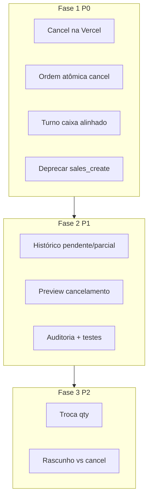

# Vendas — correções de fluxo e evolução do produto — PRODUCT Spec

**Data:** 2026-07-10  
**Status:** Fase 1 (P0) implementada — 2026-07-10 · Fase 2 (P1) implementada — 2026-07-10 · Fase 3 (P2) implementada — 2026-07-10  
**TECH:** [2026-07-10-vendas-fluxo-correcoes-evolucao-TECH.md](./2026-07-10-vendas-fluxo-correcoes-evolucao-TECH.md)  
**Origem:** revisão técnica do fluxo ponta a ponta (criar, liquidar, cancelar, trocar, histórico, estoque, Caixa)  
**Relacionado:** [pdv-nova-venda.md](../../flows/vendas/pdv-nova-venda.md), [estoque-movimentacoes.md](../../flows/vendas/estoque-movimentacoes.md), `salesMirror.js`, `useSalesStore.js`, `functions/sales_cancel`

---

## 1. Problem Statement

O módulo de **Vendas** cobre PDV, modal global, perfil do aluno, histórico, liquidação parcial, cancelamento e troca de produto. A revisão de 2026-07-10 identificou **falhas de consistência** entre UI e servidor, **runtime dividido** (cancelamento na Appwrite; demais operações na Vercel) e **lacunas de produto** no histórico e na auditoria.

**Quem sofre:** owner e admin que cancelam ou trocam vendas; recepcionista que registra vendas pelo modal ou perfil do aluno; gestor que fecha o dia pelo histórico e Caixa.

**Impacto atual:**

| Sintoma | Causa raiz |
|---------|------------|
| Modal “Nova venda” falha com `shift_required` | UI ignora turno de caixa (`modalMode`); servidor sempre valida em `salesCreateHandler` |
| Cancelamento não reflete correções após deploy Vercel | `sales_cancel` é Appwrite Function — deploy separado |
| Estoque devolvido mas venda não cancelada | `sales_cancel` reverte estoque **antes** do financeiro; falha em refund retorna 500 com venda ainda ativa |
| Botão Cancelar ausente ou confuso | Permissões + status + layout do modal (parcialmente mitigado em 2026-07-09) |
| Histórico não mostra vendas em aberto | Filtros só Concluídas / Canceladas; totais ignoram pendente/parcial |
| Drift de código legado | `functions/sales_create` não usado; `SALES_CREATE_FN_ID` ainda alertado no app |

**Custo de não resolver:** estoque e Caixa divergentes; operação bloqueada no modal; retrabalho manual; perda de confiança no PDV; incidentes silenciosos em produção.

**Comportamento correto que permanece (não é bug):**

- Recepcionista (**member**) pode **registrar** e **liquidar** vendas; **não** pode cancelar nem trocar produto — por design.
- Venda **a prazo** (`deferred`) nasce `pendente`; parcial no checkout nasce `parcial`.
- Espelho financeiro em vendas concluídas/parciais via `salesMirror.js` na Vercel.
- Idempotência de criação via `idempotency_key`.

---

## 2. Goals

| # | Objetivo | Como medir |
|---|----------|------------|
| G1 | **Um único runtime** para criar, liquidar, trocar e **cancelar** venda | Cancelamento via `PATCH /api/sales?action=cancelar` (Vercel); Appwrite `sales_cancel` deprecated |
| G2 | **Consistência atômica** em cancelamento e troca | Zero vendas ativas com estoque já revertido após falha; script de auditoria não encontra novos casos |
| G3 | **Política de turno de caixa alinhada** UI ↔ API | Modal/perfil/aluno e PDV seguem regra documentada; zero `shift_required` surpresa no modal quando doc promete bypass |
| G4 | **Histórico operacional completo** | Filtros e totais incluem pendente/parcial; gestor vê “a receber” no período |
| G5 | **Auditoria e recuperação** | Evento `sales.cancelled`; idempotência forte; reconcile visível na UI |
| G6 | **Cobertura de testes** nos handlers críticos | Testes de integração para create, liquidate, cancel, alterar_item |

---

## 3. Non-Goals (v1 desta iniciativa)

| Item | Motivo |
|------|--------|
| Transações atômicas Appwrite (multi-doc ACID) | Plataforma não oferece; compensação + idempotência é o caminho |
| Novo arquivo em `/api/` | Limite Vercel Hobby 12/12 — usar `api/leads.js?hub=sales` |
| Reescrever catálogo / PDV fullscreen | Fora do escopo; só correções e evolução do pós-venda |
| Conciliação PagBank de vendas | Iniciativa separada (`pagbank-conciliacao`) |
| Migrar histórico de mensagens WhatsApp | Ver `AGENTS.md` § Conversas |
| Backfill obrigatório de vendas legadas sem `academyId` | P1 script opcional; P0 só bloqueia novos acessos indevidos |
| E2E Playwright completo do PDV | P2; v1 foca testes de handler + smoke manual |

---

## 4. Visão da solução (fases)

### Fase 1 — Confiabilidade (P0)

1. **Migrar cancelamento para Vercel** (`salesCancelHandler.js` + rota no hub sales).
2. **Ordem segura no cancelamento:** status gate → financeiro → estoque → confirmação (ou compensação documentada).
3. **Alinhar turno de caixa:** campo `sale_source` (`pdv` \| `modal` \| `student` \| `nl`) + política em `assertCashShiftForSale`.
4. **Deprecar** `functions/sales_create` e alerta `SALES_CREATE_FN_ID` no frontend.
5. **Fechar** `saleBelongsToAcademy` para docs sem `academyId` (403 + log).

### Fase 2 — UX e operação (P1)

1. Filtros **Pendente / Parcial / Em aberto** no histórico + totais separados (recebido vs a receber).
2. **Preview de cancelamento** (itens, estorno, TX afetadas) antes de confirmar.
3. **Auditoria** `sales.cancelled` + `sale.item_updated` já existente mantido.
4. **Idempotência** `cancel_idempotency_key` verificada antes de reverter estoque.
5. **Testes** de integração nos handlers; atualizar `pdv-nova-venda.md` e `VALIDATION.md`.
6. **UI reconcile:** link “Verificar espelhos de vendas” em Config vendas (cron já existe).

### Fase 3 — Evolução (P2)

| Item | Descrição |
|------|-----------|
| Troca com **quantidade** editável | `SalesEditItemModal` + validação de estoque |
| **Anular rascunho** vs cancelamento | Fluxo distinto para `status: rascunho` |
| Link **Caixa** no detalhe da venda (todas as TX) | Paridade com timeline de pagamentos |
| Guard `creating` / `cancelling` / optimistic lock na liquidação | Menos corrida em abas paralelas |
| CI: diff `saleLineKind` entre bundle Appwrite legado e Vercel | Até remoção total da function |
| Busca no histórico por item / pagamento | UX recepção |

---

## 5. User Stories

### Owner / Admin

- **US1:** Como titular, quero **cancelar** uma venda pendente/parcial/concluída no histórico com um clique previsível, para corrigir erros sem chamar suporte.
- **US2:** Como titular, quero ver **antes de confirmar** o que será devolvido ao estoque e quanto será estornado no Caixa.
- **US3:** Como titular, quero **trocar produto** em venda em aberto sabendo que estoque e Caixa ficam alinhados.
- **US4:** Como titular, quero filtrar o histórico por **vendas em aberto** (pendente/parcial) para cobrar clientes.
- **US5:** Como titular, quero um registro de **auditoria** quando uma venda for cancelada.

### Recepcionista (member)

- **US6:** Como recepcionista, quero registrar venda pelo **modal da sidebar** sem erro de turno quando a academia não exige caixa no atalho.
- **US7:** Como recepcionista, quero **liquidar** pagamento parcial de venda a prazo sem precisar de admin.
- **US8:** Como recepcionista, entendo que **não posso cancelar** — vejo mensagem clara, não ausência silenciosa do botão.

### Gestor / Operação

- **US9:** Como gestor, quero totais no histórico: **recebido no período** e **saldo em aberto**, para fechar o dia.
- **US10:** Como gestor, quero **reconciliar espelhos** de vendas quando o cron ou espelho falhar.

### Edge cases

- **US11:** Cancelamento com **pagamento parcial** estorna só o recebido; pendente é cancelado sem refund.
- **US12:** **Double-click** em cancelar não duplica movimento de estoque.
- **US13:** Venda **aluguel** (`line_kind: rental`) cancela com pools corretos (dual stock).
- **US14:** Falha no Caixa no cancelamento **não** deixa estoque revertido com venda ativa.

---

## 6. Requirements

### Must-Have (P0)

#### R1 — Cancelamento na Vercel

**Dado** usuário owner/admin autenticado  
**Quando** `PATCH /api/sales` com `action: cancelar`, `id`, `motivo`, `academy_id`  
**Então**:

- [ ] Handler `salesCancelHandler.js` registrado em `api/leads.js` hub sales (sem novo arquivo `/api/`)
- [ ] Lógica portada de `functions/sales_cancel/index.js` reutilizando `saleLineKind.js`, `salesMirror` (refund)
- [ ] `useSalesStore.cancelSale` chama API Vercel (não `functions.createExecution`)
- [ ] Feature flag `VITE_SALES_CANCEL_VIA_API=true` (default on após cutover) + fallback function até remoção
- [ ] `npm run deploy:function:sales-cancel` marcado deprecated no README interno

#### R2 — Cancelamento ordenado e recuperável

**Dado** venda `concluida`, `pendente` ou `parcial`  
**Quando** cancelamento é solicitado  
**Então**:

- [ ] Se já `cancelada` → 200 idempotente (sem efeitos colaterais)
- [ ] Gravar `status: cancelling` ou checar `cancel_idempotency_key` **antes** de reverter estoque
- [ ] Financeiro: cancelar TX pendentes; estorno só `settled`; falha **antes** de estoque → venda inalterada
- [ ] Estoque: revert por `buildCancelStockPatch` + movimento enriquecido
- [ ] Finalizar: `status: cancelada`, `cancelada_em`, `cancel_motivo`
- [ ] Em falha parcial: log estruturado + resposta com `partial_failure` e instrução de reconcile

#### R3 — Turno de caixa alinhado

**Dado** `salesSettings.requireCashShift === true`  
**Quando** criar venda  
**Então**:

- [ ] API recebe `sale_source`: `pdv` \| `modal` \| `student` \| `nl`
- [ ] Política documentada em `readSalesSettings`: ex. `cashShiftRequiredFor: ['pdv']` ou bypass explícito para `modal`/`student`
- [ ] UI e servidor usam a **mesma** matriz (sem `shift_required` surpresa no modal)
- [ ] Atualizar checklist em `pdv-nova-venda.md` § pré-condições

#### R4 — Deprecar legado Appwrite create

- [ ] Remover alerta `VITE_APPWRITE_SALES_CREATE_FN_ID` de `App.jsx` (ou downgrade para dev-only)
- [ ] README em `functions/sales_create/README.md`: **não usar em produção**
- [ ] Nenhum código de produção chama `SALES_CREATE_FN_ID`

#### R5 — Escopo multi-tenant

**Dado** venda sem `academyId`  
**Quando** qualquer handler acessa por id  
**Então**:

- [ ] `saleBelongsToAcademy` retorna false (403)
- [ ] Log `sale_missing_academy_scope` para backfill

#### R6 — Documentação e validação

- [ ] Atualizar `docs/flows/vendas/pdv-nova-venda.md` (mapa, permissões, runtime, liquidar)
- [ ] Entrada em `docs/flows/VALIDATION.md` com checklist desta spec
- [ ] Link desta spec no fluxo PDV

### Nice-to-Have (P1)

#### R7 — Histórico: filtros e totais

- [x] Filtro status: Pendente, Parcial, Em aberto (agrupa pendente+parcial), Concluídas, Canceladas
- [x] Cards: vendas concluídas + valor recebido; **em aberto** + saldo a receber; cancelamentos
- [x] `computeHistoryTotals` inclui contagem/valor pendente e parcial

#### R8 — Preview de cancelamento

- [x] `SalesCancelModal` mostra lista de itens, valor estornado estimado, aviso se parcial
- [x] Dados de `GET /api/sales?id=` (detalhe já carregado no histórico)

#### R9 — Auditoria

- [x] `AUDIT_EVENTS.SALES_CANCELLED` em `auditEventTypes.js`
- [x] `recordAuditEvent` no handler com `venda_id`, `motivo`, `refund_total`

#### R10 — Testes de integração

- [x] `lib/server/__tests__/saleCancelFinancials.test.js` (financeiro cancel)
- [x] `salesLiquidateHandler.test.js`, `salesUpdateItemHandler.test.js` (casos felizes + forbidden)
- [x] Ampliar `src/test/salesHistory.test.js` para filtros novos

#### R11 — Erros amigáveis

- [x] `friendlySaleError` para liquidar, trocar, cancelar (códigos liquidar/trocar ampliados)

#### R12 — Reconcile na UI

- [x] Botão em `SalesSettingsSection`: “Verificar espelhos de vendas” → `POST /api/sales?action=reconcile` (owner/admin)

### Future (P2)

- [x] **R13:** Troca com alteração de quantidade
- [x] **R14:** Fluxo “Descartar rascunho” separado de cancelamento
- [x] **R15:** `CaixaLinkBadge` no detalhe da venda para todas as TX
- [x] **R16:** Optimistic lock (`pagamentos_snapshot`) na liquidação
- [x] **R17:** Busca no histórico por nome de produto / forma de pagamento
- [x] **R18:** Deprecar function `sales_cancel` Appwrite (remoção física após 30d estável)

---

## 7. UX — comportamento esperado

Seguir [docs/ux-feedback.md](../../ux-feedback.md).

| Situação | Componente | Mensagem / comportamento |
|----------|------------|---------------------------|
| Cancelar OK | `useToast` | “Venda cancelada” |
| Cancelar sem permissão | `SaleDetailModal` footer | Texto: titular ou administrador |
| `shift_required` no modal | `ErrorBanner` / toast | “Abra o turno de caixa em Vendas ou registre pelo PDV.” |
| Falha espelho ao cancelar | `ErrorBanner` | `friendlySaleError`; orientar reconcile |
| Liquidar acima do saldo | painel liquidar | “O valor excede o saldo em aberto.” |
| Preview cancelamento | `SalesCancelModal` | Lista itens + “Estorno estimado: R$ …” |

### Layout — detalhe da venda (`SaleDetailModal`)

- Ações destrutivas (**Cancelar venda**) no **footer fixo** do modal (já iniciado em 2026-07-09).
- Painel de liquidar expansível no corpo; não empurra cancelar para fora da viewport.

---

## 8. Success Metrics

### Leading (1–2 semanas pós-release)

| Métrica | Meta | Medição |
|---------|------|---------|
| Taxa de `financial_refund_failed` / cancelamentos | 0% | Logs Vercel `sales_cancel` |
| Tickets “não consigo cancelar” | −80% vs baseline 30d | Suporte / feedback |
| `shift_required` em create com `sale_source=modal` (quando bypass configurado) | 0 | Log agregado |
| Cobertura testes handlers vendas | ≥ 4 arquivos com casos críticos | CI |

### Lagging (30–60 dias)

| Métrica | Meta |
|---------|------|
| Divergência estoque × vendas ativas canceladas (auditoria) | 0 casos novos |
| Uso de filtro “Em aberto” no histórico | ≥ 20% das sessões owner em Vendas |
| Deploy manual `sales_cancel` | 0 (function retired) |

---

## 9. Open Questions

| # | Pergunta | Responsável | Bloqueante? |
|---|----------|-------------|-------------|
| Q1 | Turno de caixa: bypass só **modal** ou também **perfil do aluno**? | Produto | Sim — define R3 |
| Q2 | Cutover cancel API: flag por academia ou global day-1? | Engenharia | Sim — rollout |
| Q3 | Manter Appwrite function como fallback por quanto tempo? | Engenharia | Não |
| Q4 | Preview cancelamento: só client-side ou endpoint dedicado? | Engenharia | Não |
| Q5 | Backfill vendas sem `academyId` — quantas em produção? | Dados | Não (P1) |

**Proposta default (se sem resposta):** Q1 = bypass `modal` + `student`; Q2 = flag global default on; Q4 = client-side com dados do detail já carregado.

---

## 10. Timeline sugerida

| Fase | Escopo | Duração estimada |
|------|--------|------------------|
| **Fase 1** | R1–R6 (P0) | 1 sprint |
| **Fase 2** | R7–R12 (P1) | 1 sprint |
| **Fase 3** | R13–R18 (P2) | backlog |

**Dependências:** nenhum novo arquivo `/api/`; revisar `vercel.json` apenas se novos rewrites de cron forem necessários (não previsto).

**Ordem de implementação recomendada:** R3 (turno) → R1+R2 (cancel Vercel) → R4+R5 → R6 → R7–R12.

---

## 11. Histórico de revisão

| Data | Autor | Mudança |
|------|-------|---------|
| 2026-07-10 | — | Criação a partir da revisão de fluxo de vendas |
