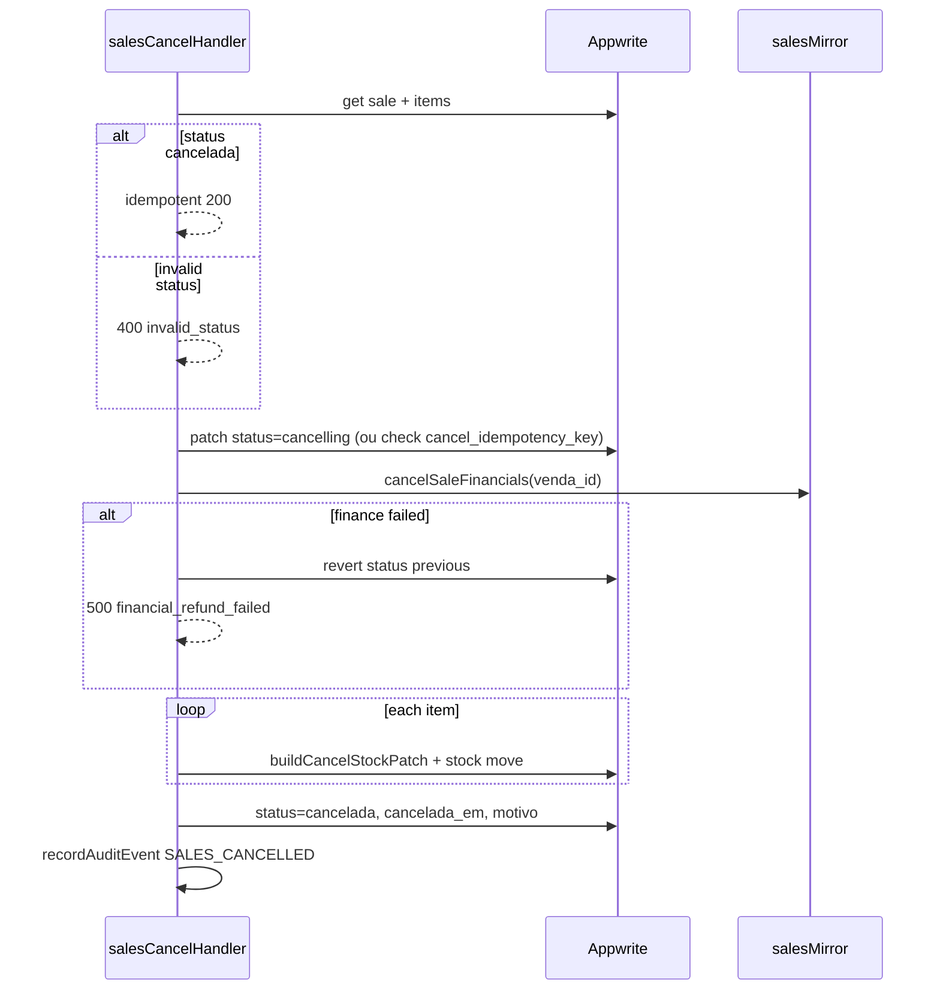

# Vendas — correções de fluxo e evolução do produto — TECH Spec

**Data:** 2026-07-10  
**PRODUCT:** [2026-07-10-vendas-fluxo-correcoes-evolucao-PRODUCT.md](./2026-07-10-vendas-fluxo-correcoes-evolucao-PRODUCT.md)  
**Status:** Fase 1 (P0) implementada — 2026-07-10

---

## 1. Diagnóstico técnico

### 1.1 Arquitetura atual

```
Frontend
  SalesNewSaleTab / NovaVendaModal / StudentProductSaleStep
    → useSalesStore.createSale → POST /api/sales
  SalesHistoryTab / SaleDetailModal
    → liquidateSale → PATCH /api/sales (action: liquidar)
    → updateSaleItem → PATCH /api/sales (action: alterar_item)
    → cancelSale → functions.createExecution(SALES_CANCEL_FN_ID)  ← split

api/leads.js?hub=sales
  POST  → salesCreateHandler.js
  PATCH → salesLiquidateHandler.js | salesUpdateItemHandler.js (action branch)
  GET   → salesHistoryHandler.js | salesDailyReportHandler | salesReconcileHandler

Appwrite Functions
  sales_cancel/index.js  ← produção hoje
  sales_create/index.js  ← legado, não referenciado pelo store
```

### 1.2 Lacunas confirmadas

| # | Lacuna | Arquivo(s) | Severidade |
|---|--------|------------|------------|
| L1 | Cancel só Appwrite | `useSalesStore.js`, `functions/sales_cancel` | P0 |
| L2 | Estoque antes financeiro no cancel | `functions/sales_cancel/index.js` L141–285 | P0 |
| L3 | Turno caixa UI ≠ API | `SalesNewSaleTab.jsx` L310, `salesCreateHandler.js` L189 | P0 |
| L4 | `sales_create` legado | `functions/sales_create`, `App.jsx` env banner | P1 |
| L5 | Histórico sem pendente/parcial | `SalesHistoryTab.jsx`, `salesHistory.js` totals | P1 |
| L6 | Troca não atômica | `salesUpdateItemHandler.js` | P1 |
| L7 | `saleBelongsToAcademy` permissivo | `saleAcademyScope.js` | P1 |
| L8 | Sem testes handlers vendas | `lib/server/__tests__/` | P1 |
| L9 | Sem audit cancel | `auditEventTypes.js` | P1 |

### 1.3 Ordem atual no cancel (problema)

```141:294:functions/sales_cancel/index.js
// 1) loop itens → updateDocument estoque + createStockMove
// 2) FINANCIAL_TX cancel + refund
// 3) se finance falha → return 500 (estoque já revertido)
// 4) updateDocument sale status cancelada
```

---

## 2. Design da correção

### 2.1 Novo handler: `salesCancelHandler.js`

**Local:** `lib/server/salesCancelHandler.js`  
**Rota:** `PATCH /api/sales` quando `body.action === 'cancelar'` (mesmo padrão de `alterar_item`).

**Assinatura:**

```js
export default async function salesCancelHandler(req, res) {
  // ensureAuth → ensureAcademyAccess → isAcademyOwnerOrAdminUser
  // body: { id, motivo, academy_id, idempotency_key?, action: 'cancelar' }
}
```

**Registro em `api/leads.js`:**

```js
if (action === 'alterar_item') return salesUpdateItemHandler(req, res);
if (action === 'cancelar') return salesCancelHandler(req, res);
return salesLiquidateHandler(req, res);
```

### 2.2 Algoritmo de cancelamento (target)



**Módulo financeiro sugerido:** extrair de `sales_cancel` + alinhar com `lib/server/salesMirror.js` (`mirrorSaleRefund` ou equivalente) para uma única implementação.

**Compensação:** se movimento de estoque falhar após finance OK, tentar re-aplicar saída (revert do revert) ou marcar `sale.cancel_stock_pending=true` + cron repair — documentar em P1 se complexo; mínimo P0: finance antes de estoque elimina o caso “venda ativa, estoque revertido”.

### 2.3 Idempotência

| Chave | Uso |
|-------|-----|
| `status === 'cancelada'` | Short-circuit total |
| `cancel_idempotency_key` no body | Se igual ao gravado → 200 sem reprocessar |
| `status === 'cancelling'` | Segundo request aguarda ou retorna 409 `cancel_in_progress` |

Gravar `cancel_idempotency_key` no passo final (já existe atributo em `sales_cancel`).

### 2.4 Client: `useSalesStore.cancelSale`

```js
// Target
const body = await salesFetch('/api/sales', {
  method: 'PATCH',
  body: JSON.stringify({
    id: venda_id,
    action: 'cancelar',
    motivo,
    academy_id: academyId,
    idempotency_key: crypto.randomUUID(),
  }),
});
```

**Cutover:**

```js
const USE_API_CANCEL = import.meta.env.VITE_SALES_CANCEL_VIA_API !== 'false';
if (USE_API_CANCEL) { /* salesFetch */ }
else { /* legacy functions.createExecution */ }
```

Remover branch legado na Fase 3 (P2).

### 2.5 Turno de caixa (R3)

**Settings** (`readSalesSettings` / `salesSettings.js`):

```js
// Proposta
cashShiftRequiredFor: ['pdv'], // default quando requireCashShift true
// Alternativa legacy: requireCashShift afeta todos → breaking; migrar com default ['pdv']
```

**Create payload** (`useSalesStore.createSale`):

```js
sale_source: modalMode ? 'modal' : studentFlow ? 'student' : pdvMode ? 'pdv' : 'pdv',
```

**Server** (`assertCashShiftForSale`):

```js
export async function assertCashShiftForSale(academyDoc, academyId, { saleSource = 'pdv' } = {}) {
  const settings = readSalesSettings(academyDoc?.settings);
  if (!settings.requireCashShift) return { ok: true };
  const requiredFor = settings.cashShiftRequiredFor ?? ['pdv'];
  if (!requiredFor.includes(saleSource)) return { ok: true, shiftId: null };
  // ... findOpenCashShift
}
```

Atualizar `salesCreateHandler` para passar `sale_source` do body.

### 2.6 Deprecar `sales_create`

- Adicionar `functions/sales_create/DEPRECATED.md`
- Remover de `App.jsx` lista de env obrigatórios (manter só `SALES_CANCEL_FN_ID` até cutover cancel)
- Não deletar function no Appwrite até confirmar zero invocações (métricas)

### 2.7 `saleBelongsToAcademy`

```js
// saleAcademyScope.js — change
export function saleBelongsToAcademy(doc, academyId) {
  const saleAcademy = String(doc?.academyId || doc?.academy_id || '').trim();
  if (!saleAcademy) return false; // was: return true
  return saleAcademy === String(academyId || '').trim();
}
```

Script opcional P1: `scripts/audit-sales-missing-academy.mjs`.

---

## 3. Fase 2 — Implementação técnica

### 3.1 Histórico (`SalesHistoryTab` + `salesHistory.js`)

**Filtros:**

```js
// statusFilter values
'all' | 'concluida' | 'cancelada' | 'pendente' | 'parcial' | 'em_aberto'
```

`em_aberto` → `filterSalesList` trata `pendente || parcial`.

**Totais:**

```js
export function computeHistoryTotals(sales) {
  // existing concluded + cancel
  // + openCount, openTotal (sum total of pendente/parcial)
  // + openRemaining (sum remaining_amount when available)
}
```

API list pode incluir `remaining_amount` por venda (já em detail mapper; estender list mapper em `salesHistoryHandler.js`).

### 3.2 Preview cancelamento (P1)

Sem endpoint novo na v1: `SalesCancelModal` recebe `sale` do detail com `items`, `paid_amount`, `remaining_amount`, `status` e calcula:

- itens → lista
- `refundEstimate = paid_amount` (net)
- aviso se `remaining_amount > 0`

### 3.3 Auditoria

```js
// auditEventTypes.js
SALES_CANCELLED: 'sales.cancelled',

// salesCancelHandler.js
await recordAuditEvent({
  academyId,
  event_type: AUDIT_EVENTS.SALES_CANCELLED,
  entity_type: 'sale',
  entity_id: venda_id,
  metadata: { motivo, refund_total, status_before },
});
```

### 3.4 `friendlySaleError`

Estender `src/lib/errorMessages.js`:

| code | Mensagem PT |
|------|-------------|
| `shift_required` | Abra o turno de caixa em Vendas para registrar esta venda. |
| `invalid_status` | Esta venda não pode ser cancelada no status atual. |
| `financial_refund_failed` | Não foi possível estornar no Caixa. A venda não foi cancelada. |
| `cancel_in_progress` | Cancelamento em andamento. Aguarde e atualize a página. |
| `forbidden_role` | Apenas titular ou administrador pode cancelar vendas. |

---

## 4. Arquivos alterados (por fase)

### Fase 1 (P0)

| Arquivo | Mudança |
|---------|---------|
| `lib/server/salesCancelHandler.js` | **Novo** — cancel na Vercel |
| `lib/server/salesMirror.js` | Extrair/usar `cancelSaleFinancials` compartilhado |
| `api/leads.js` | Branch `action === 'cancelar'` |
| `src/store/useSalesStore.js` | `cancelSale` via API + flag |
| `lib/server/salesCreateHandler.js` | `sale_source` + pass to shift assert |
| `lib/server/cashShiftHandler.js` | `assertCashShiftForSale` com source |
| `src/components/sales/SalesNewSaleTab.jsx` | Enviar `sale_source` |
| `src/components/student/StudentProductSaleStep.jsx` | `sale_source: 'student'` |
| `src/lib/salesSettings.js` | `cashShiftRequiredFor` |
| `lib/server/saleAcademyScope.js` | Rejeitar sem academyId |
| `src/App.jsx` | Remover alerta `SALES_CREATE_FN_ID` |
| `functions/sales_create/DEPRECATED.md` | **Novo** |
| `lib/server/__tests__/salesCancelHandler.test.js` | **Novo** |

### Fase 2 (P1)

| Arquivo | Mudança |
|---------|---------|
| `src/components/sales/SalesHistoryTab.jsx` | Filtros + totais |
| `src/lib/salesHistory.js` | `filterSalesList`, `computeHistoryTotals` |
| `lib/server/salesHistoryHandler.js` | `remaining_amount` na listagem |
| `src/components/sales/SalesCancelModal.jsx` | Preview estorno |
| `lib/server/auditEventTypes.js` | `SALES_CANCELLED` |
| `src/lib/errorMessages.js` | Códigos vendas |
| `src/components/sales/SalesSettingsSection.jsx` | Botão reconcile |
| `lib/server/__tests__/salesLiquidateHandler.test.js` | **Novo** |
| `lib/server/__tests__/salesUpdateItemHandler.test.js` | **Novo** |
| `docs/flows/vendas/pdv-nova-venda.md` | Atualizar |
| `docs/flows/VALIDATION.md` | Checklist |

### Fase 3 (P2) — backlog

| Arquivo | Mudança |
|---------|---------|
| `src/components/sales/SalesEditItemModal.jsx` | Qty editável |
| `src/components/sales/SaleDetailModal.jsx` | CaixaLinkBadge |
| `lib/server/salesLiquidateHandler.js` | Version check |

---

## 5. Decisões técnicas

### D1 — Por que não manter Appwrite para cancel?

- Deploy drift (bug corrigido na Vercel não sobe no cancel)
- Hobby 12 functions — consolidar **reduz** superfície
- JWT + `academyAuth.mjs` duplicado vs `academyAccess.js`
- Auditoria e testes Vitest só rodam no hub Vercel hoje

Function permanece como fallback até `VITE_SALES_CANCEL_VIA_API` estável.

### D2 — Por que finance antes de estoque?

Elimina estado `{ sale: ativa, stock: já devolvido }` que é o pior para operação (vende de novo item já “devolvido”). Estado `{ sale: cancelling, stock: intacto }` é recuperável.

### D3 — Transações

Appwrite não tem multi-doc transaction. Padrão do projeto: idempotency + status intermediário + cron reconcile (`salesReconcileHandler` já existe).

### D4 — Limite Vercel Functions

**Não** criar `api/sales.js`. Hub existente:

```json
{ "source": "/api/sales", "destination": "/api/leads.js?hub=sales" }
```

(verificar `vercel.json` — já deve existir rewrite equivalente)

### D5 — Bundle `saleLineKind.js`

Handlers Vercel importam `src/lib/saleLineKind.js` diretamente. Appwrite function empacota cópia no tar.gz (`scripts/deploy-appwrite-function.mjs`). Após migrar cancel, **única** fonte de verdade na Vercel; function deprecated.

---

## 6. Testes

### 6.1 `salesCancelHandler.test.js` (P0)

| Caso | Assert |
|------|--------|
| unauthorized | 401 |
| member role | 403 forbidden_role |
| admin cancel concluida | stock reverted, status cancelada, refund tx |
| cancel pendente | pending txs cancelled, refund 0 |
| cancel parcial | refund = paid only |
| idempotent second call | 200, no duplicate moves |
| invalid_status rascunho | 400 |
| finance failure | sale status restored, stock unchanged |

Mock: `Databases` + inject `salesMirror.cancelSaleFinancials`.

### 6.2 `salesCreateHandler` — shift (P0)

| sale_source | requireCashShift | open shift | Result |
|-------------|------------------|------------|--------|
| modal | true, for=['pdv'] | false | 200 |
| pdv | true, for=['pdv'] | false | 400 shift_required |

### 6.3 Histórico (P1)

`src/test/salesHistory.test.js`:

- `filterSalesList` com `em_aberto`
- `computeHistoryTotals` com pendente/parcial

### 6.4 Harness manual (VALIDATION.md)

1. Criar venda parcial → liquidar → cancelar → conferir estoque + Caixa  
2. Modal com bypass turno → create OK  
3. PDV sem turno → `shift_required`  
4. Member não vê cancelar; admin vê footer  

---

## 7. Rollout

1. Deploy Vercel com handler + flag `VITE_SALES_CANCEL_VIA_API=false` default (shadow: log only) — opcional  
2. Enable flag `true` em staging  
3. Produção: flag true; manter Appwrite function 30d  
4. Monitor logs `sales_cancel` invocations → zero  
5. Remover function + env `SALES_CANCEL_FN_ID` + deploy script  

---

## 8. Riscos

| Risco | Mitigação |
|-------|-----------|
| Regressão cancel parcial/aluguel | Port 1:1 tests from function behavior |
| Academias dependem de function URL direta | Nenhum — só client SDK |
| `cancelling` stuck | Cron: reset sales `cancelling` > 15min + alert |
| Backfill academyId | Script dry-run antes de L7 strict mode |

---

## 9. Histórico de revisão

| Data | Mudança |
|------|---------|
| 2026-07-10 | Criação |
