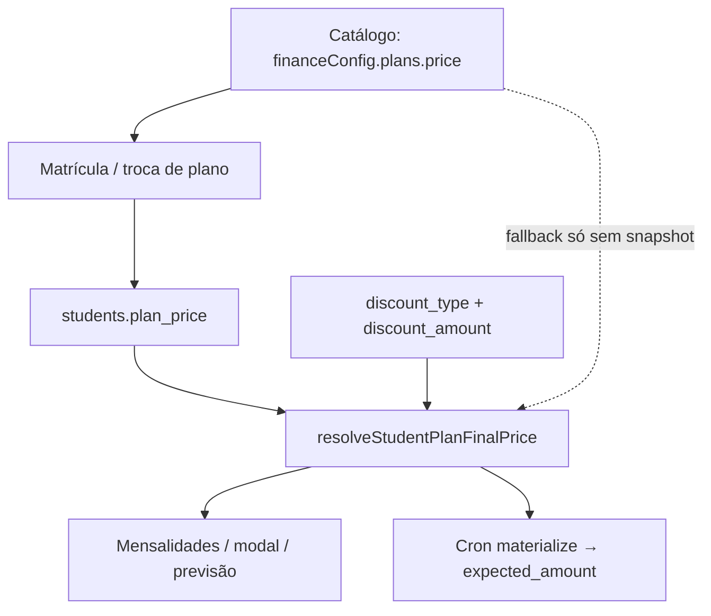

# Snapshot de preço do plano na matrícula — design

**Data:** 2026-07-23  
**Status:** aprovado — plano em `docs/superpowers/plans/2026-07-23-plan-price-snapshot.md`

**Contexto:** o owner precisa cadastrar/reajustar preços dos planos de mensalidade sem alterar o valor cobrado de alunos já matriculados (nem “contratos antigos” no sentido de acordo comercial vigente). Hoje o sistema resolve o valor pela **lista viva** `financeConfig.plans` (lookup pelo nome do plano do aluno), então editar o preço do plano reajusta a base de cobrança de quem já está nele.

**Decisão de produto:** preço de catálogo ≠ preço do aluno. Congelar o valor acordado no aluno (`plan_price`) na matrícula / troca de plano; o catálogo só alimenta novas adesões e o default na UI.

**Fluxos relacionados:**

- [config-inicial-financeiro.md](../../flows/financeiro/config-inicial-financeiro.md)
- [a-receber-mensalidades.md](../../flows/financeiro/a-receber-mensalidades.md)
- [funil-lead-matricula.md](../../flows/crm/funil-lead-matricula.md)
- [aluno-perfil-presenca.md](../../flows/crm/aluno-perfil-presenca.md)
- [planos-bolsista-isencao-design.md](./2026-06-19-planos-bolsista-isencao-design.md)

**Procedimento operacional até a entrega:** não editar o preço de planos em uso; criar plano novo (ex. `Mensal 2026`) para matrículas novas.

---

## 1. Resumo da decisão

| Camada | Papel |
|---|---|
| `financeConfig.plans[].price` | Preço de **lista** — default para novas matrículas e exibição no cadastro de planos |
| `students.plan_price` | **Snapshot** do valor mensal acordado com aquele aluno |
| `students.discount_*` | Desconto individual sobre o snapshot (inalterado em espírito) |
| `student_payments.amount` / `expected_amount` | Valor da cobrança do mês (já materializado ou lançado) — continua com precedência |

Editar o preço no catálogo **não** propaga para alunos existentes. Reajuste de aluno antigo só via ação explícita no perfil (ou troca de plano com confirmação).

---

## 2. Problema

1. Owner aumenta o preço do plano “Mensal” de R$ 200 → R$ 250.
2. Alunos antigos no plano “Mensal” passam a aparecer / materializar com R$ 250 (menos desconto), sem aceite.
3. Contratos Autentique já assinados **não** são reescritos pelo catálogo, mas o sistema de cobrança diverge do acordo antigo.
4. Campo `plan_price` já aparece em alguns caminhos (`leadCloseSale`, modal de pagamento como fallback, `studentsHandler`), mas **não governa** `resolveStudentPlanFinalPrice` / materialização / grade.

---

## 3. Goals

| ID | Meta |
|---|---|
| G1 | Editar preço no catálogo afeta só **novas** matrículas (e alunos sem snapshot, via fallback documentado) |
| G2 | Cobrança (Mensalidades, modal, cron de materialização, previsão) usa snapshot do aluno quando presente |
| G3 | Toda via de matrícula grava `plan_price` a partir do plano escolhido |
| G4 | Troca de plano no perfil atualiza o snapshot (com confirmação se o valor mudar) |
| G5 | Owner/admin pode editar o valor acordado no perfil sem mudar o catálogo |
| G6 | Backfill one-shot congela o preço atual do catálogo nos alunos ativos sem snapshot |
| G7 | Copy clara em Planos: reajuste de lista ≠ reajuste da base matriculada |
| G8 | Sem nova Serverless Function (`/api/` 12/12 Hobby) |

---

## 4. Non-goals

| Item | Motivo |
|---|---|
| Histórico versionado de preços por aluno | v1 basta o valor vigente + audit trail de edição se já existir no perfil |
| Reajuste em massa com aceite digital / Autentique | escopo futuro |
| Regenerar ou alterar PDFs Autentique já assinados | contratos digitais são histórico; billing é a fonte operacional |
| Versionamento de SKU de plano (`Mensal@v2`) | desnecessário se o snapshot existir |
| Snapshot em `leads` como fonte da verdade pós-matrícula | lead pode carregar preço na conversão; aluno é canônico depois |
| Mudar semântica de planos isentos | continua `isExempt` no catálogo; snapshot 0 / sem cobrança |

---

## 5. Modelo de produto

### 5.1 Diagrama



### 5.2 Ordem de resolução (canônica)

Para valor aberto / esperado **antes** de preferir campos do pagamento:

1. Se o pagamento tem `amount` > 0 explícito → usa `amount` (comportamento atual em `openAmountForStudent`).
2. Senão, se o pagamento tem `expected_amount` > 0 → usa esse valor (comportamento atual).
3. Senão, se o aluno tem `plan_price` numérico finito **e** o plano **não** é isento → `calcFinalPrice(plan_price, student)`.
4. Senão → `calcFinalPrice(catalogPlan.price, student)` (fallback legado / pré-backfill).
5. Plano isento → `0` (via `isExempt` no plano resolvido por nome, como hoje).

**Nota:** `plan_price === 0` em plano **não** isento é valor válido (cortesia pontual no aluno); isenção estrutural continua no plano.

### 5.3 Quando grava / atualiza o snapshot

| Evento | Comportamento |
|---|---|
| Nova matrícula (funil / cadastro aluno / inscrição pública) | `plan_price = Number(plano.price)` do catálogo no momento |
| Conversão lead→aluno com `plan_price` já no lead | Preferir o do lead se finito; senão catálogo |
| Troca de `plan` no perfil | Recalcular `plan_price` a partir do novo plano; se o valor final mudar, pedir confirmação (ConfirmDialog) |
| Edição explícita “Valor acordado” no perfil | Atualiza só `plan_price` (e audit se o fluxo de perfil já audita campos) |
| Editar preço / nome no catálogo | **Não** altera `students.plan_price` |
| Plano marcado isento | Snapshot pode ir a `0`; cobrança segue regra isento |

### 5.4 Desconto

Sem mudança de modelo: `discount_type` + `discount_amount` aplicam-se sobre a base do passo 3/4 (`calcFinalPrice`). UI de presets de desconto continua referenciando “preço do plano” no sentido de **base do aluno** (snapshot ou fallback).

### 5.5 Materialização mensal

`computeExpectedAmountForMaterialization` continua chamando `resolveStudentPlanFinalPrice` — após a mudança do resolver, novos pendings nascem com o snapshot. Backfill de pending **não** sobrescreve `expected_amount` já presente (já é o comportamento atual).

### 5.6 Contratos Autentique

Fora do escopo de cobrança. Templates vinculados ao plano (`contractTemplateId`) não precisam mudar nesta entrega. Variáveis de valor no template, se existirem, devem preferir o snapshot do aluno no momento da **criação** do documento (verificar no handler de contrato na implementação; se hoje leem só o catálogo, alinhar).

---

## 6. Schema e persistência

### 6.1 Appwrite `students`

- Garantir atributo numérico `plan_price` (float) na coleção `students`, se ainda não existir em produção.
- Documentar em `docs/appwrite-setup.md` junto de `plan` / `discount_amount`.
- Mapear em `mapAppwriteStudentDoc.js` (hoje o desconto é mapeado; `plan_price` precisa entrar de forma explícita).

### 6.2 Onde escrever na matrícula

Pontos mínimos a cobrir na implementação (lista viva no plano técnico):

- Cadastro / formulário de aluno (`useStudentsCreateForm` e equivalentes)
- `performEnrollment` / conversão no funil
- `lib/server/publicEnrollmentEnroll.js`
- Salvamento de `plan` em `profileStudentFieldSave.js` (atualizar snapshot)
- Qualquer path server que cria aluno com `plan`

Helper sugerido (puro, testável):

```js
// ex.: src/lib/planBilling.js
export function snapshotPlanPriceFromCatalog(financeConfig, planName) {
  const plan = findPlanByName(financeConfig, planName);
  if (!plan) return null;
  if (plan.isExempt === true) return 0;
  const n = Number(plan.price);
  return Number.isFinite(n) ? Math.round(n * 100) / 100 : null;
}
```

### 6.3 Migração / backfill

Script em `scripts/` (padrão do repo: dry-run + `--fix`), **não** nova function:

1. Listar alunos (`contact_type` student / ativos conforme convenção do script) com `plan` preenchido.
2. Se `plan_price` já finito → skip.
3. Senão, resolver preço no `financeConfig` da academia → gravar.
4. Plano isento → `0`.
5. Plano órfão (nome sumiu do catálogo) → logar; não inventar preço (ou política: skip + relatório).

Rodar **antes** de o owner reajustar preços no catálogo em academias já em produção.

---

## 7. UI / UX

### 7.1 Minha academia → Financeiro → Planos

- Texto de ajuda perto do campo Preço: alteração vale para **novas matrículas**; alunos atuais mantêm o valor acordado.
- Sem mudança de layout estrutural além do copy (e link opcional para Mensalidades / perfil).

### 7.2 Perfil do aluno

- Exibir **Valor acordado (mensalidade)** com base em `plan_price` (formatado BRL).
- Editável por quem já pode editar plano/financeiro no perfil (owner/admin — seguir permissões existentes do campo plano).
- Na troca de plano: se o snapshot novo ≠ antigo, `ConfirmDialog` explicando o novo valor (e desconto se houver preview).

### 7.3 Mensalidades

- Sem coluna obrigatória nova na v1; valor da linha já sai do resolver.
- Opcional depois: hint se `plan_price` diverge do catálogo atual (fora do MVP se aumentar escopo).

### 7.4 Feedback

Seguir [docs/ux-feedback.md](../../ux-feedback.md): toasts em save de perfil; `ConfirmDialog` na troca de plano com mudança de valor; sem `window.confirm`.

---

## 8. Abordagens consideradas

| | A — Snapshot no aluno | B — Só plano novo | C — Versionar planos |
|---|---|---|---|
| Decisão | **Escolhida** | Workaround até ship | Descartada na v1 |
| Motivo | Best practice; catálogo seguro de editar; campo parcialmente existente | Zero código, mas lista de planos explode | Complexidade sem ganho se A existir |

---

## 9. Riscos e mitigações

| Risco | Mitigação |
|---|---|
| `plan_price` ausente no schema Appwrite | Provisionar atributo antes do deploy que grava o campo |
| Alunos sem snapshot após ship | Fallback ao catálogo + backfill obrigatório no runbook |
| Troca de plano sem atualizar snapshot | Patch acoplado em `profileStudentFieldSave` case `plan` |
| Owner espera que editar o plano reajuste todos | Copy em Planos + doc de fluxo |
| Desconto % sobre base errada | Mesmo `calcFinalPrice`; testes unitários com snapshot ≠ catálogo |
| Pending antigo com `expected_amount` do preço velho | Correto: não sobrescrever; mês seguinte materializa com snapshot |

---

## 10. Critérios de aceite

- [ ] Aluno com `plan_price: 200` e catálogo “Mensal” = 250 → Mensalidades / `expectedAmountForStudent` / materialização usam base 200 (menos desconto).
- [ ] Nova matrícula no “Mensal” a 250 grava `plan_price: 250`.
- [ ] Editar só o catálogo 250 → 300 **não** altera `plan_price` dos existentes.
- [ ] Troca de plano no perfil atualiza `plan_price` e pede confirmação se o valor mudar.
- [ ] Edição manual do valor acordado no perfil persiste e reflete na próxima cobrança aberta (sem `expected_amount` prévio).
- [ ] Plano isento continua sem cobrança.
- [ ] Backfill dry-run + apply documentados; alunos com snapshot prévio intocados.
- [ ] Fluxos `config-inicial-financeiro` e `a-receber-mensalidades` atualizados no mesmo PR.
- [ ] Nenhuma function nova em `/api/`.

---

## 11. Arquivos mais impactados (orientação)

| Área | Arquivos |
|---|---|
| Resolução | `src/lib/planBilling.js`, `src/lib/collectionOverdue.js` (já delega), testes `src/test/paymentStatus.test.js` |
| Materialização | `lib/studentPaymentMaterialization.js` (+ testes) |
| Matrícula | `src/hooks/useStudentsCreateForm.js`, `src/lib/performEnrollment.js` (e paths relacionados), `lib/server/publicEnrollmentEnroll.js` |
| Perfil | `src/lib/profileStudentFieldSave.js`, UI do perfil / campos financeiros |
| Mapeamento | `src/lib/mapAppwriteStudentDoc.js`, `docs/appwrite-setup.md` |
| Config UI | `src/components/finance/settings/FinanceSettingsPlansSection.jsx` |
| Backfill | `scripts/backfill-student-plan-price.mjs` (nome final no plano de implementação) |
| Docs | fluxos financeiro + CRM citados acima |

---

## 12. Ordem sugerida de entrega

1. Testes do resolver (snapshot vs catálogo vs pagamento vs isento).
2. Implementar resolver + mapeamento `plan_price`.
3. Gravação na matrícula / troca de plano / edição no perfil + ConfirmDialog.
4. Copy em Planos.
5. Script de backfill + runbook curto na spec ou no header do script.
6. Atualizar docs de fluxo / VALIDATION se checklist divergir.
7. (Opcional) Alinhar criação de contrato Autentique ao snapshot, se hoje ler só catálogo.

---

## 13. Open questions (resolvidas nesta conversa)

| # | Questão | Resolução |
|---|---|---|
| Q1 | O que congelar? | Valor cobrado dos alunos antigos (acordo comercial); PDFs Autentique não são reescritos |
| Q2 | Abordagem? | Snapshot no aluno (`plan_price`) |
| Q3 | Reajuste em massa na v1? | Não |
| Q4 | Edição no perfil? | Sim — valor acordado editável + update na troca de plano |

---

## 14. Self-review

- Sem placeholders TBD de comportamento crítico.
- Non-goals explícitos (massa, histórico, Autentique rewrite).
- Consistente com limite Hobby 12/12 e com isenção por plano.
- Escopo único: billing por snapshot; não mistura versionamento de SKU.
