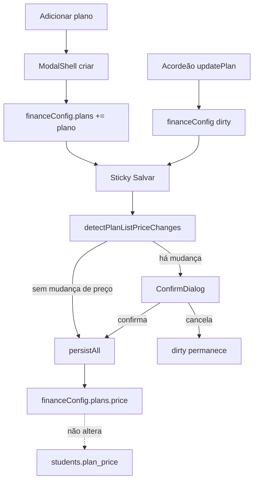

# UX Planos de mensalidade + confirmação de reajuste — design

**Data:** 2026-08-12  
**Status:** aprovado em conversa — aguardando review do arquivo antes do plano de implementação

**Contexto:** o owner cria e edita planos de mensalidade em Minha academia → Financeiro → Planos. O fluxo atual é acordeão inline + barra sticky Salvar; criar plano injeta linha vazia. O copy de introdução ainda sugere que a cobrança mensal usa o preço do plano, embora o snapshot `students.plan_price` (spec [2026-07-23-plan-price-snapshot-design.md](./2026-07-23-plan-price-snapshot-design.md)) já isole alunos matriculados do reajuste de lista. Na prática, o owner ainda cria plano novo para “reajustar” com segurança.

**Decisão de produto:** manter o modelo snapshot (sem reajuste em massa). Revisar UX: **criar em modal**, **editar no acordeão**, e **ConfirmDialog no Salvar** quando o preço de lista mudar, deixando explícito que alunos existentes mantêm o valor acordado.

**Fluxos relacionados:**

- [config-inicial-financeiro.md](../../flows/financeiro/config-inicial-financeiro.md)
- [a-receber-mensalidades.md](../../flows/financeiro/a-receber-mensalidades.md)
- [2026-07-23-plan-price-snapshot-design.md](./2026-07-23-plan-price-snapshot-design.md)

---

## 1. Resumo da decisão

| Tema | Decisão |
|---|---|
| Foco | Reajuste seguro (ênfase) + UX de cadastro |
| Preço de lista vs aluno | Inalterado: catálogo ≠ `plan_price`; editar lista não altera alunos |
| Confirmação | `ConfirmDialog` no **Salvar** sticky quando preço de lista (ou isenção efetiva) mudou |
| Criar plano | `ModalShell` com campos essenciais; entra no estado local (dirty); persiste no Salvar |
| Editar plano | Acordeão polido; essenciais primeiro; máscara BRL via `moneyBr` |
| Reajuste em massa | Fora de escopo |

---

## 2. Goals / Non-goals

### Goals

| ID | Meta |
|---|---|
| G1 | Owner entende que alterar preço de lista **não** reajusta matriculados |
| G2 | Ao salvar mudança de preço de lista, confirmação explícita (com contagem quando confiável) |
| G3 | Criar plano em modal focado (nome, preço, isento; opcionais mínimos) |
| G4 | Editar no acordeão sem linha vazia “fantasma”; novo plano abre expandido após criar |
| G5 | Lead/copy da seção alinhados ao snapshot (sem contradizer cobrança) |
| G6 | Sem nova Serverless Function; sem mudar resolver de `plan_price` |

### Non-goals

| Item | Motivo |
|---|---|
| Aplicar novo preço a todos / grupo de alunos | Usuário escolheu só confirmação (opção B) |
| Versionar SKU / plano “Mensal 2026” | Desnecessário com snapshot |
| Reescrever contratos Autentique | Billing operacional ≠ PDF histórico |
| Backfill de `plan_price` | Já coberto pela spec de snapshot |
| Página dedicada só de planos | Híbrido modal + acordeão basta |

---

## 3. UX — reajuste (confirmação no Salvar)

### Quando dispara

Antes de `persistAll`, se existir pelo menos um plano **já presente no último salvo** cujo:

- `price` numérico mudou, ou
- `isExempt` mudou de forma que o preço efetivo de lista mude (ex.: isento ↔ cobrado),

então abrir `ConfirmDialog` e só chamar `persistAll` no confirm.

**Não dispara** só por: nome, descrição, meta de check-ins, taxas, templates de contrato, ou plano **novo** adicionado nesta sessão (ainda sem alunos no catálogo antigo).

### Copy (padrão)

Um plano:

> O preço de lista de «Mensal» passa de R$ 200 para R$ 250. **N alunos** neste plano mantêm o valor acordado no perfil. O novo preço vale só para matrículas novas.

Vários planos: listar cada mudança (nome + de→para) e, se houver, total de alunos que mantêm valor; ou resumo «K planos com preço de lista alterado» + mesma garantia.

Sem contagem confiável (store vazio / alunos não carregados):

> … Alunos já matriculados neste plano mantêm o valor acordado no perfil. O novo preço vale só para matrículas novas.

### Contagem

Helper puro: alunos cujo `plan` (nome) coincide com o plano alterado, preferindo status ativos / cobráveis (mesma noção usada em Mensalidades para “matriculado”, sem inventar status novo). Fonte: `useStudentStore` já em memória — **sem** fetch obrigatório no save. Se a lista não estiver carregada, omitir o número.

### Cancelar

Fecha o dialog; estado dirty permanece; usuário pode editar de novo ou Descartar.

---

## 4. UX — criar (modal) e editar (acordeão)

### Criar — `ModalShell`

- CTA **Adicionar plano** abre modal (não chama mais `addPlan` vazio na lista).
- Campos: **Nome** (obrigatório), **Preço (R$)** com máscara (`maskFromNumber` / `parseMaskToCents` + `centsToNumber` de `src/lib/moneyBr.js`), checkbox **Este plano não gera cobrança mensal**.
- Descrição: opcional no modal se couber sem poluir; senão só no acordeão após criar.
- Meta de check-ins, repasse de taxas, vínculos de contrato: **só no acordeão** após o plano existir na lista (evita modal longo).
- Footer: Cancelar | **Adicionar**.
- **Adicionar**: valida nome; `FieldError` se vazio; inclui plano no `financeConfig` local; fecha modal; marca dirty; expande o novo índice na lista.
- Persistência: continua no **Salvar** sticky (igual ao resto da config).

### Editar — acordeão

- Cabeçalho: nome + preço formatado ou «Isento».
- Corpo: ordem — Nome → Preço (+ hint lista vs acordado) → Isento → Meta check-ins → Descrição → Repasse taxas → Contratos → Remover.
- Hint do preço (manter espírito atual, alinhar lead): preço de lista para novas matrículas; matriculados usam valor acordado no perfil.
- Remover: `ConfirmDialog` existente inalterado.

### Lead da seção

Substituir a frase que implica cobrança pelo preço do plano. Deve deixar claro:

- Planos alimentam matrícula e Mensalidades.
- Preço no catálogo = lista (novas matrículas).
- Dia de vencimento continua no aluno.
- Link Contratos permanece.

---

## 5. Arquitetura / dados

### API de estado

- `addPlan(payload)` — aceita objeto `{ name, price, description?, applyCardFee?, isExempt? }` com defaults (`applyCardFee: true`, `isExempt: false`, `description: ''`).
- Remover overload vazio que só cria linha sem nome (ou manter só se testes exigirem, mas UI não usa).
- `updatePlan` / `removePlan` / digests / `persistAll` inalterados em espírito.

### Helpers (puro, testável)

Sugestão: `src/lib/planListPriceChange.js`

- `detectPlanListPriceChanges(savedPlans, nextPlans)` → lista `{ name, fromPrice, toPrice, fromExempt, toExempt }`
- `countStudentsOnPlan(students, planName, { activeOnly? })` → number
- `buildPlanPriceChangeConfirmCopy(changes, countsByPlanName)` → `{ title, description }` para o dialog

Match de plano entre saved/next: por **índice** estável na edição + nome no copy; planos novos (só em `next`) ignorados para o gate de preço. Renomear + mudar preço no mesmo save: tratar como mudança no índice correspondente (copy usa nome **novo**).

### Componentes

| Peça | Onde |
|---|---|
| Modal criar | `FinanceSettingsPlansSection.jsx` (ou subcomponente no mesmo diretório se o arquivo crescer demais) |
| Gate + ConfirmDialog preço | `FinanceiroConfigTab.jsx` (junto aos dialogs de remover) ou wrapper do `onSave` da sticky bar |
| Sticky save | Continua `FinanceSettingsStickySave`; `onSave` vira função que pode abrir confirm |

### Feedback

Seguir [docs/ux-feedback.md](../../ux-feedback.md): `ConfirmDialog` (não `window.confirm`); `FieldError` no modal; toasts existentes no `persistAll`.

---

## 6. Erros e edge cases

| Situação | Comportamento |
|---|---|
| Nome vazio no modal | `FieldError`; não adiciona |
| Preço inválido / vazio (não isento) | Tratar como 0 ou bloquear no modal com erro — **bloquear** com `FieldError` se não isento e preço ≤ 0 não fizer sentido de produto; isento pode preço 0 |
| Validação global sticky (plano sem nome) | Inalterada (`validateFinanceConfigBeforeSave`) |
| Cancelar confirm de preço | Não persiste; dirty ok |
| Store de alunos vazio | Copy sem «N alunos» |
| Só mudou isento (cobrado → isento) | Entra no gate (mudança efetiva de lista) |
| `FinanceConfigTooLargeError` | Toast atual; sem mudança |

---

## 7. Testes

| Camada | Cobertura |
|---|---|
| Unit helper | detect changes; ignora plano novo; isento; contagem por nome |
| UI seção | Abrir modal; adicionar; plano aparece expandido; não cria linha vazia no Add |
| Gate save | Mock persist; mudança de preço abre dialog; confirm chama persist; cancel não chama |
| Regressão | Plano isento ainda mostra «Isento» no resumo (`financeSettingsPlansSection.test.jsx`) |

Harness: estender testes existentes da seção / validation; sem nova function API.

---

## 8. Docs de fluxo

Atualizar no mesmo PR de implementação:

- [config-inicial-financeiro.md](../../flows/financeiro/config-inicial-financeiro.md) — mapa: criar via modal; checklist confirm no reajuste de lista; lead/snapshot
- [VALIDATION.md](../../flows/VALIDATION.md) se checklist divergir

---

## 9. Critérios de aceite

- [ ] **Adicionar plano** abre modal; Cancelar não altera lista.
- [ ] Adicionar com nome + preço marca dirty e lista o plano expandido; Salvar persiste.
- [ ] Editar preço de lista de plano existente → Salvar → ConfirmDialog com de→para e garantia de valor acordado; Confirm → persiste; Cancel → não persiste.
- [ ] Após persistir novo preço, aluno com `plan_price` antigo continua cobrado pelo snapshot (regressão do resolver; sem mudança esperada no backend).
- [ ] Lead da seção não afirma que a cobrança mensal usa o preço do catálogo como base dos matriculados.
- [ ] Remover plano / validation / isento continuam ok.
- [ ] Nenhuma function nova em `/api/`.

---

## 10. Arquivos impactados (orientação)

| Área | Arquivos |
|---|---|
| UI planos | `src/components/finance/settings/FinanceSettingsPlansSection.jsx`, CSS em `finance.css` se necessário |
| Gate save | `src/components/finance/FinanceiroConfigTab.jsx` |
| Estado | `src/hooks/useFinanceConfigState.js` |
| Helpers | `src/lib/planListPriceChange.js` (+ testes) |
| Money | `src/lib/moneyBr.js` (reuso) |
| Docs | `docs/flows/financeiro/config-inicial-financeiro.md`, esta spec |

---

## 11. Abordagens consideradas

| | 1 — Confirm no Salvar + modal criar | 2 — CTA «Alterar preço» | 3 — Confirm no blur do preço |
|---|---|---|---|
| Decisão | **Escolhida** | Descartada | Descartada |
| Motivo | Híbrido pedido; confirma no momento da persistência; menos fricção | Mais cliques | Interrompe digitação |

---

## 12. Open questions (resolvidas na conversa)

| # | Questão | Resolução |
|---|---|---|
| Q1 | Foco | D — ambos, ênfase reajuste |
| Q2 | Reajuste vs matriculados | B — só lista + confirmação; sem massa |
| Q3 | Formato UI | C — criar modal; editar acordeão |
| Q4 | Abordagem técnica | ConfirmDialog no Salvar + helpers puros |

---

## 13. Self-review

- Sem TBD de comportamento crítico; contagem sem store confia em copy sem número (explícito).
- Consistente com snapshot 2026-07-23 e limite Hobby 12/12.
- Escopo único: UX planos + gate de confirmação; não reabre reajuste em massa nem Autentique.
- Preço ≤ 0 não isento: bloqueio no modal documentado na §6.
